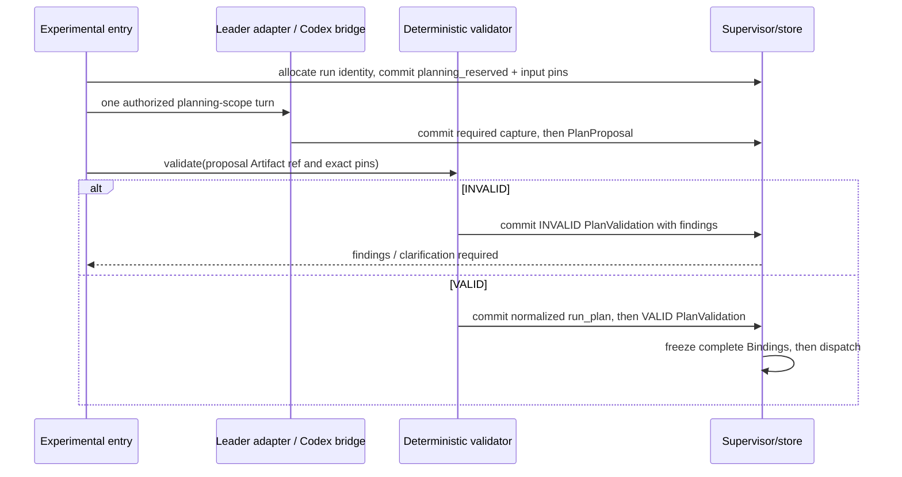
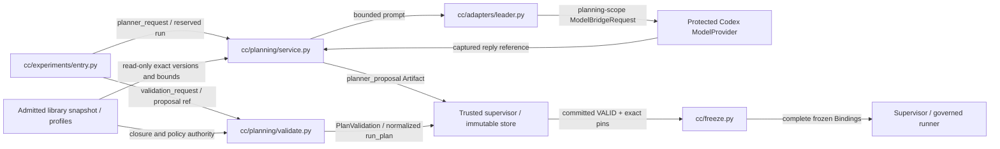

# Isolated capability planner and deterministic plan validation

PRD 6.12 permits the native Cluster Mode Leader and dynamic capability discovery in an isolated experiment; 4.1.2 supplies its admitted catalogue and pinning rules. PRD 3.2.4 supplies extracted constraints, not permission for dynamic production planning. The planner is an orchestration service, not a capsule. Phase 1 supplies its fixed plan to the same validator and never invokes this model planner.

## Placement and interface

The sole public wire-shape owner is [services-v1 JSON Schema](../contracts/services-v1.schema.json): planner_request, planner_proposal, validation_request, plan_validation and error. API positional arguments below are shorthand for these closed request objects. Proposal/result references use the common id/hash encoding; their artifacts validate against the matching schema before publication.

`cc/planning/service.py` owns planning; `cc/planning/validate.py` owns pure validation; `cc/adapters/leader.py` alone imports the native team types. Reuse `LeaderSpec` and `TeamAgentSpec.build` from agent-core `9e339019`, `openjiuwen/agent_teams/schema/blueprint.py`, and `is_team_plan_enabled` from `runtime/team_plan.py`. This reuses Leader identity/configuration, not unrestricted native delegation or native plan approval as CC authorization. The default planner model is `gpt-6.1-sol` through the protected model bridge. Model support is checked before enabling that experiment; an unavailable configured model gives `MODEL_UNAVAILABLE`, with no silent substitution. A disabled planner's model check does not block fixed production readiness, whose own configured route has separate mandatory checks.

The authoritative planning API is `propose(task_ref, library_snapshot_ref, experiment_config_ref, request_id) -> PlanProposalRef`. `task_ref` is an immutable validated `research_brief`; snapshot entries expose capability names, exact versions/hashes, ports, effects, limits and admitted status, without hidden fixtures or credentials. The proposal contains the canonical `run_plan`, pinned capability selections, an objective-to-output mapping, budget estimates, and references to the three inputs. These metadata accompany the plan in an immutable proposal artifact; they do not extend `run_plan` invisibly. [Environment](environment.md) owns `cc.planner` keys: model_id defaults gpt-6.1-sol, proposal_timeout_s 120, max_nodes 32, max_proposals_per_submission 1, and required prompt_sha256 when enabled. Policy bounds remain authoritative. A request is one model proposal; no automatic model retry or autonomous repair loop occurs.

`validate(plan_ref, task_ref, library_snapshot_ref, policy_ref, request_id) -> PlanValidationRef` is independently callable and makes no model call. Its schema records exact input references, VALID/INVALID and structured findings. Only VALID includes a normalized immutable plan reference and has zero findings; INVALID requires findings and cannot carry a validated plan. Normalization canonicalizes bytes without rearranging nodes, adding capabilities or inventing bindings. Invalid references produce `INVALID_REFERENCE`; wrong type/version gives `TYPE_MISMATCH`; changed request bytes give `REQUEST_CONFLICT`. Proposal timeout/cancellation is terminal for that request. An identical duplicate returns existing proposal/current state; explicit resubmission uses a fresh request identity and preserved prior evidence.

`validate.py` performs pure computation over resolved immutable values. Its trusted service host resolves authorized references and asks the supervisor to publish the normalized plan before a VALID result that references it. INVALID publishes only its findings/result. The API returns the committed result reference, never an in-memory authorization; the diagrams' validator-to-store edges mean this host operation, not filesystem permission for model output or pure validation code.

## Validation and dispatch authority

Validate unique nodes, topological order/acyclicity, reachable terminal outputs, exact typed ports or an explicitly pinned adapter, availability of every launcher input, dependency closure, admitted versions, effect/permission bounds, maximum nodes, cumulative declared resource/time limits, and required Gate profiles. In the isolated Brief-based planner contract, every mandatory requirement must map to a declared final output and criterion reference; the production intake-based bootstrap below verifies its exact fixed template instead. This checks structural coverage; it does not claim to prove scientific success. Mechanical helpers are launcher preparation or fixed work-capsule internals, not arbitrary planner nodes. The model cannot supply source code as a plan node.

The supervisor accepts only a committed VALID result matching the exact proposal/input hashes, then freeze resolves and pins dependencies from that same snapshot, checking current revocation without substituting an alias. Neither model prose, native task approval, nor a stored proposal can release a node. After dispatch begins, the graph is immutable. A failed node follows normal halt/review; the planner receives no permission to rewrite a live plan.

### Proposal envelope and reference semantics

`validation_request.plan_ref` identifies the immutable `planner_proposal` Artifact, including its embedded `run_plan`, selections, objective bindings and budget. A bare `run_plan` is insufficient because it omits those validation inputs. `plan_validation.plan_ref` echoes that proposal reference; `validated_plan_ref` identifies the separately published, normalized `run_plan` Artifact. This distinction also applies to the fixed production plan: the trusted launcher creates its proposal envelope from the published fixed plan and catalogue without a model call. `proposal_source_ref` resolves either the captured experimental model response or the launcher's deterministic fixed-plan provenance Artifact. The latter records the published template hash and input pins and never pretends to be model evidence.

There are two task entry contracts, selected by the immutable plan track. Experimental `propose` requires a validated Brief and nonempty mandatory-objective bindings. Production validates before the Requirement capsule exists, so its launcher-created envelope uses the committed `intake` as `task_ref`, contains empty `objective_bindings`, and must exactly match the published fixed-plan template apart from authorized pins. It validates structural wiring, profiles, dependencies and budgets before freeze; Requirement and later stage Gates establish source-grounded requirements and scientific acceptance during execution. The validator does not invent a pre-run Brief or claim early semantic coverage. An experimental envelope cannot use the production empty-binding rule, and production cannot replace its fixed template with a model proposal. `offline_rsi` is not a planner-entry track; its controller follows its independently bounded lifecycle.

Validation cross-checks envelope task/library/config references with launcher-committed production inputs/provenance or the experimental planning_reserved record, and with caller references. Its policy pin must be the authorized effective policy for that exact configuration. Proposal selections must cover every retained work step exactly once, have no extra step IDs, match capability names in the embedded plan, and resolve the named declaration hashes in the pinned snapshot. Verifier and external dependency closure come from that snapshot and applicable profile, not model-invented selection rows. The plan's snapshot hash must agree with the catalogue reference. Missing, duplicate or inconsistent rows produce INVALID before freeze.

For the experimental Brief contract, `objective_bindings[].objective_id` names `research_brief.mandatory_requirements[].requirement_id`; it is not a new free-text objective namespace. Each mandatory requirement has at least one binding to an existing final output port and an independently authored applicable criterion reference. Every criterion must belong to the frozen policy/profile closure for that task and output. A model-supplied criterion cannot weaken the requirement or create a new acceptance rule. Optional preferences may inform proposal reasoning but cannot replace mandatory coverage. An ablated output remains an explicitly omitted study output; it cannot satisfy a mandatory requirement. Coverage is structural, while scientific truth is evaluated later by the governed workflow.

### Who decides what

| Decision | Authority | Permitted input from planner | Durable evidence / owning contract |
|---|---|---|---|
| M1 scope and track | frozen PRD plus recorded deployment agreement | none | [source freeze](../../product/SOURCE_FREEZE.md), [track boundaries](experiments.md) |
| Task requirements | production intake then governed Brief; experimental validated Brief and explicit clarification before freeze | explain missing/contradictory information | intake/Brief Artifacts and source references |
| Available versions and active defaults | library admission and authenticated human activation | select only catalogue members | [library](../capsule/library.md), snapshot and admission records |
| Candidate capability arrangement | experimental planner, once per authorized request | exact step selections and typed bindings | immutable proposal with source capture |
| Executable structural validity | deterministic validator under pinned policy | proposed arrangement only | PlanValidation and normalized plan |
| Execution permissions, budgets and checks | developer-authored frozen profiles; trusted broker enforces | estimates and admissible references | profile pins, frozen Bindings, broker reservations |
| Dispatch/release | supervisor from committed evidence | none | [lifecycle](lifecycle.md), Verification and release/experimental advance |
| Scientific acceptance | frozen protocol, measurement authority and independent criteria | none after freeze | [evaluation](../m1/evaluation.md) and report evidence |
| Retry, replacement or another proposal | authenticated human using explicit fresh request/attempt | structured failure findings | prior evidence preserved; no automatic repair or live rewiring |

### Codex provider and pre-freeze authority

The planner uses the same replaceable `ModelProvider` boundary as capsules; the configured production-era transport is Codex app-server, not direct provider routing. [Environment](environment.md) owns the exact bridge frames, authorization scopes and capture rules; [model authentication](model-auth.md) owns credential custody. The Leader adapter supplies bounded prompt/context and native identity only. It never creates a second model client, imports auth files, spawns tools or gains native delegation authority.

The experimental entry allocates its real run identity at intake, before freeze; `run_started` is still committed only after complete freeze. Before a planning turn, the supervisor commits `planning_reserved` in that run's SystemRecord namespace, pinning the exact task, library, configuration, policy, request bytes, model, deadline and call limit. Prompt bytes are captured through an authorized public Artifact in that same run. The authenticated planning scope is `{kind: planning, run_id, planning_request_id}`; it grants one bounded model turn and public capture to this reservation without a Binding. The bridge checks the registered reservation, principal and configured model rather than trusting the supplied scope. Fixed production envelopes use no planning scope and make zero planner turns. The planner receives the bounded reply, not credential bytes or executable broker descriptors. A failed reservation/capture write prevents proposal publication and dispatch. A duplicate turn attaches to the same reserved result; an uncertain interrupted turn requires explicit review, never automatic resubmission.

### Resource accounting

Proposal budget numbers are estimates to validate, not authority to expand policy. The validator derives step/Gate/dependency limits from the pinned declarations and profiles and rejects unbounded required call closures or a total above the applicable run policy. Sequential M1 execution includes verifier calls and admitted external dependencies in those bounds. Unknown token/money telemetry remains unavailable and cannot prove a budget pass.

Before every actual public model call, the trusted broker commits `model_call_reserved` against the authorized scope's remaining call limit. The supervisor accounts the planning turn plus all work, nested and Gate model calls against the same run ceiling; `budget.maximum_model_calls` means that total, not a fresh counter after freeze. Planning additionally has its own pre-freeze one-proposal limit under the same real run identity. Validation includes already consumed reservations and rejects an allowance too small for their count plus the required remaining call closure. Private RSI/oracle calls retain their private owning reservations and never leak their counters or captures into public evidence. A declaration with a bounded skill-turn loop does not establish a bound for arbitrary tool-side model calls, so both use broker enforcement. Exhaustion refuses the call and halts the dependent step; no partial output is treated as success. Deadline expiry/cancellation use the model bridge's existing capture/reap rules. Runtime accounting and negative fixtures are required downstream evidence; model estimates or schema validation alone do not demonstrate enforcement.

Rejection returns findings to the experimental entry. A human may supply a new Brief or authorize another proposal. Dynamic Intention Compiler clarification occurs only in its separately enabled experiment before freeze. The planner has catalogue-read and model-call access only; it cannot activate aliases, inspect private RSI fixtures, write policies, or execute proposed workload code.

The validator is a pure ordinary module in the monolith; the Leader is an orchestration adapter; the bridge is a protected internal process boundary. None becomes an admitted capability capsule. The diagram denotes API direction, not permission to let an untrusted model connect directly to store, freeze or runtime.

## Evidence, precedent and replacement

Freeze resolves the exact reviewed library snapshot, not current active aliases. Test activation between validation and freeze: the old validated version remains pinned, unless current revocation denies it; no substitute is selected. Any snapshot mismatch produces zero dispatches. An isolated ablation disabling a capability is valid only if it has no required downstream output; otherwise reject it. Replacements must preserve exact output ports/schema versions. M1 does not synthesize missing data or install input substitutes to make a skipped required producer appear successful.

Store writes proposals, raw turns, validation results and effective configuration through the trusted supervisor. Pre-freeze evidence carries the allocated run/request identity; that identity does not imply `run_started`, a successful plan or any dispatch. Failed planning leaves its preserved refusal/capture evidence under the same identity. This borrows typed component binding from [Kubeflow](https://www.kubeflow.org/docs/components/pipelines/reference/component-spec/) and explicit dependency closure from [Bazel's dependency graph](https://bazel.build/concepts/dependencies). Policy-selected decisions separated from enforcement follow [Open Policy Agent's philosophy](https://www.openpolicyagent.org/docs/philosophy). These are borrowed patterns, not claims that those systems prove our validator correct. A model proposes; the deterministic validator authorizes structure; the supervisor enforces persisted execution. The Leader adapter can be replaced behind `propose`; validator changes require replaying the plan fixtures and updating its policy pin.

Fixtures independently exercise a valid fixed plan, missing producer, wrong type/version, cycle, unreachable objective, unavailable alias, forbidden effect, budget overrun, missing Gate and model timeout. Also verify an INVALID result and a failed validation write cause zero dispatches. SkillFuzz analysis of interactions between capsule sets is deferred. These structural and failure fixtures remain required, but they do not establish semantic compatibility of capsule combinations. No probabilistic interaction-screening campaign is a current admission, planning or coding-handoff prerequisite.

The [adversarial design review](../reviews/2026-10-05-adversarial-design.md) maps malicious proposals, forged refs, budget understatements and interruption windows to refusal evidence. Optimization first measures proposal latency, rejection rate, committed call count and objective coverage on that fixture set. Cache only immutable catalogue/schema/prompt formatting by their full pins; never reuse a model proposal for a different request, weaken checks for speed, or select a live alias to avoid a cache miss. A prompt/provider revision creates new evidence under the same interfaces and is compared offline against the frozen fixtures. No performance target or improvement is claimed before measurement.
