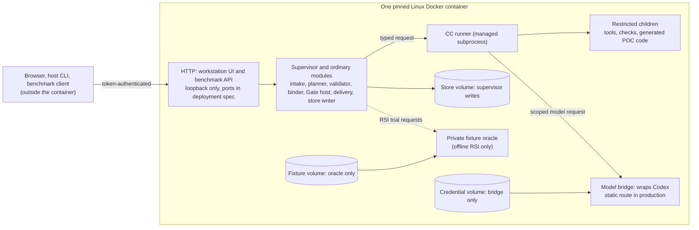

# Placement: where everything runs

PRD: 2.3, 2.9, 5.2, 5.4.3, 4.3.2

> Answers: Where does each part of the system run?

## Decisions

- **One Docker container, one image: a modular monolith.** Control plane and restricted execution processes live in the same Linux image. Modules call each other as ordinary in-process calls. Separate OS processes exist only where trust must be separated.
- **Docker is packaging and the outer boundary.** It does not replace the inner confinement for generated code or hidden [fixtures](system/test-surfaces.md#term-fixture). Capsule execution never starts another container. No Docker socket inside.
- **[Model routing](model-routing/README.md#term-model-routing) sits inside a model call, never above the plan.** The plan picks CCs (in M1 the planner emits a fixed template and makes no model call). A **[Model bridge](system/model-bridge.md#term-model-bridge)** wraps Codex behind a provider interface and records which endpoint served each call. In M1 production the route is static: Codex. An isolated experiment may pick among approved endpoints; it cannot change which [capsule](capsule/capsule.md#term-capability-capsule) [runs](system/lifecycle.md#term-run) or what a [Gate](verification.md#term-gate) decides.
- **Credentials stay with the bridge.** A dedicated persistent volume holds the Codex login, used only by the bridge process. Capsules, prompts, exports and child processes never see it.
- **The image holds the [jiuwenbox](isolation.md#term-jiuwenbox) HTTP server, its token and policy.** The doctor [probes](system/environment.md#term-probe) it. `op.scholarly_search` declares egress, but its child has no network: the egress is brokered.
- **Every local socket and child channel uses length-prefixed frames** (4-byte big-endian length, then UTF-8 JSON, at most `cc.ipc.max_frame_bytes`, default 1 MiB). Large values go by reference.
- **Only the supervisor writes the store.** The runner returns its [Artifacts](schemas/artifact.md#term-artifact), [Observation](schemas/observation.md#term-observation) and capture, and the supervisor commits them on its behalf.

## Placement graph

## Where each piece lives and why

| Piece | Where it runs | Reads | Writes | Why here |
|---|---|---|---|---|
| intake, planner, [validator](system/planner.md#term-plan-validator), binder, [Gate host](capsule/gate-host.md#term-gate-host), delivery | trusted supervisor process | store, config | store (the only writer) | one writer makes records consistent. These pieces decide, so they must not run untrusted code |
| [CC runner](capsule/runner.md#term-runner) | managed subprocess of the supervisor | admitted capsule bytes, input snapshots | returns evidence to the supervisor | a crash or hang in a capsule must not take the supervisor down |
| Restricted children (tools, [operators](capabilities/README.md#term-operator), generated POC code) | no network, no secrets, one attempt directory | their inputs | their attempt directory only | generated code is untrusted, so it gets the least it needs |
| Model bridge | its own identity | credential volume | nothing durable except capture through the supervisor | the login must be unreachable from capsule code |
| Fixture oracle | its own identity | fixture volume | private records | hidden answers must be unreachable from the improver and its candidates |
| Store | supervisor only | n/a | n/a | see [storage](system/storage.md) |

Details: [modules](system/modules.md), [lifecycle](system/lifecycle.md), [runner](capsule/runner.md), [process boundary](capsule/process-boundary.md), [model auth](system/model-auth.md), [oracle](capsule/fixture-oracle.md).

## Model routing in one view

| Question | Answer |
|---|---|
| Who chooses the capsule? | The plan. Never the router. |
| Who chooses the model? | Production: fixed Codex route. Experiment: router inside one call, from an approved list. |
| What does the bridge record? | requested and served model, `route_id`, joined to the call by `obs_id`. Unknown tokens/cost are null, not zero. |
| What does the model receive? | The prompt only. Stage, role and capsule labels stay on the trusted side. |
| What if the router is off or fails? | Use the pinned default if compatible; otherwise typed failure. No silent failover after an effectful call began. |
| Can routing change a Gate? | No. |

The router source design is kept verbatim in [model_router_design_en.md](model_router_design_en.md). Our adaptation is [model-routing](model-routing/README.md).

## Limits to remember

- M1 is single-user, local, loopback. No multi-tenant, cluster or cloud.
- Nested user namespaces and [Landlock](isolation.md#term-landlock) for generated code must pass real probes on each platform. A failed probe returns `UNSUPPORTED_SECURITY_PROFILE` and [halts](system/lifecycle.md#term-halt) that workload. Not yet run: see [decisions](decisions.md#open).
- Startup order and doctor probes: [deployment](system/deployment.md#behavior-startup-and-shutdown).
