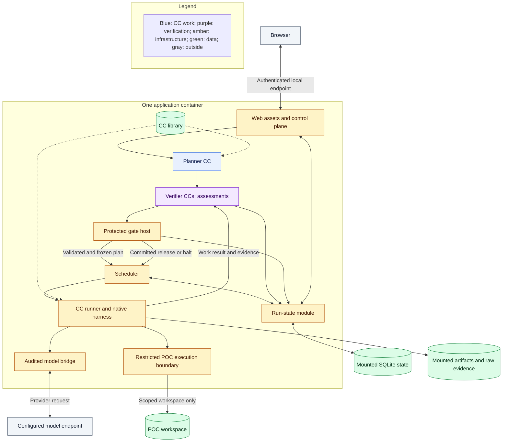
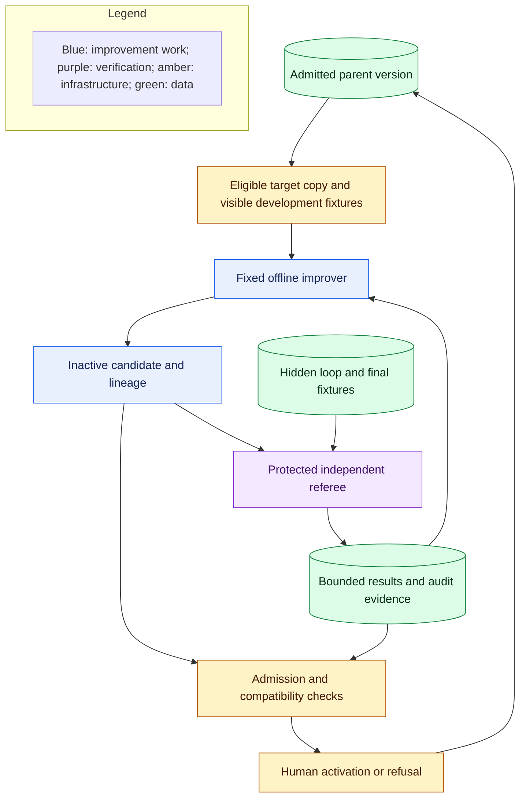

# Placement, evidence, and reuse

## Deployment and boundaries

**Required now.** Use one local, single-user application deployment: Python services, the existing TypeScript web UI, SQLite authoritative run state, and filesystem artifacts. Keep internal modules distinct without making them separate services. One container may contain several native processes.

The planner is invoked through the same runner; its separate box shows responsibility. The model bridge and restricted execution boundary are infrastructure, not CCs.

Build and serve the UI in the application image, starting from the existing [Dockerfile](../../Dockerfile.claw) and [startup](../../pyproject.toml). Publish one host endpoint on loopback, retaining local session authentication. Listening on a container interface does not authorize LAN exposure. Persist data separately from the replaceable image; supply credentials through protected configuration, not declarations or output artifacts.

Use the existing Codex integration as the baseline model route. Preserve protected local IPC and owned execution context. Keep alternate routing isolated until separately enabled. Every supported model call crosses the audited bridge; local run/capsule correlation stays in local telemetry rather than being added to provider prompts solely for attribution. Record time and calls; absent reliable token/cost telemetry remains unavailable.

Generated POC code is untrusted. Docker packaging and a Python virtual environment do not prove confinement. Enforce scoped filesystem access, restricted identity, denied undeclared network/tools, resource limits, and separation from credentials, control state, library activation, and hidden fixtures. Do not expose the Docker socket. The owning task selects and verifies the available mechanism; if a mandatory boundary cannot be enforced, block execution. Prompt blacklists or import scanning complement confinement but cannot replace it.

## Data foundation

**Required now.** The run-state module owns durable lifecycle, frozen graph, attempts, decisions, and accepted artifact references. The scheduler and control plane use that authority. Native queues, journals, caches, and UI traces are projections or dispatch aids.

Store exact inputs, implementation/configuration identities, produced artifacts, runtime evidence, raw verifier assessments, and gate decisions with run/node/attempt correlation. Keep declared behavior distinct from observed behavior. Tool-call logs alone do not prove absence of hidden filesystem or network effects; an unobserved mandatory condition cannot be treated as passed.

Release-essential artifacts and decisions must commit before advancing. Storage failure blocks release. Optional diagnostics may fail without changing execution, but their absence is explicit. This reconciles the supplementary data-source's best-effort capture hooks with the master PRD's durable gate boundary.

Preserve raw evidence before workspace cleanup or native retention deletes it. Derived run records, conformance views, scorecards, and exports can be rebuilt from that evidence. Separate agent working context from authoritative records. Keep credentials out of capture; raw prompts and supplied data remain locally protected. Any export must respect its permitted audience and hidden-fixture boundary.

Scientific benchmarking executes the user's baseline/treatment protocol. Platform benchmarking compares system variants on matched inputs and frozen effective configurations. Both use the same attribution foundation, but their measurements and conclusions are distinct. Exports record what actually ran, seeds where supported, component versions, gate evidence, and unavailable measurements. Gate-disabled ablations are evaluation runs, not valid product runs or admission evidence.

## Offline RSI

**Required now for full M1; outside the first build.** Prepare the independent interface early so offline work need not wait for planner implementation. The initial required target is the pure `rank_opportunities` helper inside the Screening CC. Keep its input/output meaning, required dimensions, Top-1 behavior, and effect boundary fixed. Candidate mutations operate on a sandbox copy; production remains unchanged.

The feedback arrow returns only the approved bounded loop information. Hidden fixture content, expected outputs, per-case hidden results, and final-evaluation feedback remain outside the proposer and candidate. Separate development, hidden-loop, hidden-final, and milestone data. Reserve final evaluation for terminal assessment; freeze scoring and evaluation identities before the session. Compare parent and child under the same relevant configuration and enforce the declared query/resource limits.

RSI may change only explicitly eligible implementation parts. It cannot change contracts, gate/verifier/check assets, security or mutation permissions, evidence stores, fixture custody, model weights, or activation controls. Enforce restrictions outside the mutable target. Preserve attempts, lineage, scoring, and violation evidence. Admission and human activation are separate from a better score; retain rollback. Target 2 mutates explicitly permitted Screening implementation text only when bounded headless model execution is available (PRD 4.4.1); otherwise defer it to M2 without blocking required Target 1 or M1 completion.

## Native reuse

**Required now.** Start from native UI/transport, SwarmFlow scheduling, Symphony agent/harness components, existing model integration, storage, and diagnostics. The [pinned integration audit](../archive/architecture-2026-10-05/system/reuse-audit.md) supplies symbol-level leads, not proven integrations or current policy.

At the installed dependency version, verify adapter behavior for swallowed exceptions, hidden retries, journal/cache replay, duplicate effects, cancellation, and background lifecycle. In particular, a native cached result cannot establish a committed CC gate pass. Keep model-process ownership separate from unrelated interactive chats. Add only missing adapters and capsule/runtime behavior; Spec Kit chooses files and APIs.
