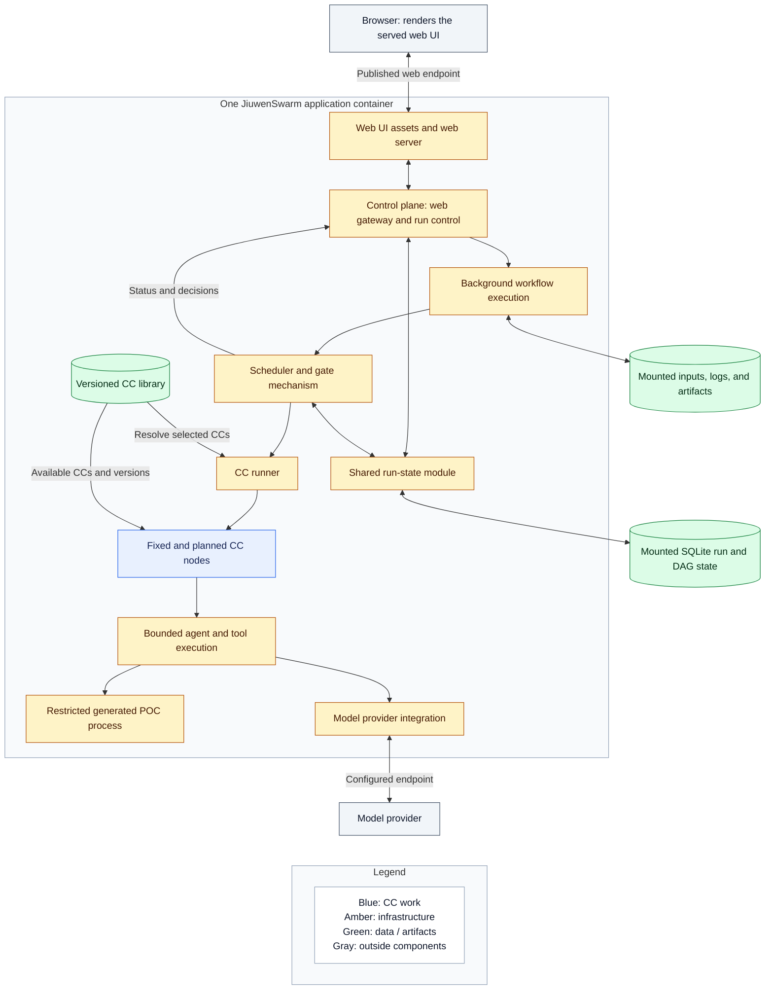

# Placement, stack, and reuse

## Intent

Use one reproducible application deployment. Preserve clear internal responsibilities without adding a network service for each responsibility. The server is a research workstation that runs long jobs, not initially a distributed cloud platform. Terms are defined in the [overview vocabulary](README.md#vocabulary-and-naming).

## One container

These are logical modules. Preserve useful native process boundaries; one container does not mean one process.

| Location | Responsibility |
|---|---|
| Browser | Render the container-served UI; display runs; submit objectives and files; answer clarification; retrieve outputs |
| Container web server | Serve the built TypeScript UI and proxy the existing application connections through the published endpoint |
| Container control plane | Accept requests; manage run identity and user decisions; communicate with UI and expose artifacts |
| Container execution | Compile intent and requirements; plan; run CCs and checks; build and measure POCs; prepare delivery |
| Shared run-state module | Store the authoritative run/DAG progress, attempts, decisions, and accepted artifact references used by both control plane and execution |
| CC library | Hold versioned declarations and implementation references used by planning and the CC runner |
| Persistent mounts | Keep run state, imported resources, logs, and accepted artifacts across container replacement |
| External model endpoint | Serve configured model requests; routing algorithms are deferred |

Docker is packaging and an outer boundary. Generated code still needs a restricted process/workspace inside it. It must not inherit model credentials, unrestricted network access, or the application's control privileges. Reuse a suitable native isolation mechanism; never expose the Docker socket to generated code.

If the required isolation is unavailable, pause the affected execution with a clear reason rather than running generated code unrestricted. The coding task selects and verifies the native mechanism; a Docker image alone does not establish that boundary.

The run-state module coordinates durable storage updates. The control plane supplies requests and user decisions; execution supplies attempts, check results, and release decisions. The UI and scheduler read the same authoritative facts. This is an internal module backed by SQLite, not another deployed service or a second queue database.

The CC library is packaged or configured versioned declarations plus their code/skills. Both planner and runner resolve from it. Freeze pins the selected capabilities and declared internal dependencies. Later library changes affect future plans, not the meaning of an already frozen run. Authoring and publishing this library do not require RSI.

## Stack and operational defaults

Keep the existing Python server and TypeScript web stack. Build and serve the UI inside the application image, as JiuwenSwarm already does; users only need a browser. Publish the existing web endpoint, initially bound to localhost (for example `http://localhost:5173`). Backend connections use the native web proxy rather than requiring users to configure another endpoint. Use SQLite for workflow state and references, and filesystem storage for large inputs, evidence, and deliverables. Do not replace unrelated native stores merely to make all persistence uniform.

Use one Compose application service, based on the existing [Dockerfile](../../Dockerfile.claw), with persistent data and separately supplied configuration/credentials. Retain [JiuwenSwarm startup](../../pyproject.toml) where suitable. Pin the application and dependency versions needed to reproduce a run. Image availability and actual startup still require implementation validation.

Local access comes first. Remote deployment retains this structure but needs suitable access control, durable storage, and hardware.

## Reuse map

| Area | Starting point | Adaptation intent |
|---|---|---|
| Client and server connection | [Existing web frontend and proxy](../../jiuwenswarm/channels/web/app_web.py) | Add workflow submission, status, clarification, and delivery using existing transport |
| Application startup and Docker | Existing JiuwenSwarm image and entry point | Add the pipeline and its dependencies without another server framework |
| Background execution and recovery | [Native worker](../../jiuwenswarm/agents/harness/common/rsi/worker.py) and [recovery pattern](../../jiuwenswarm/agents/harness/common/rsi/recovery.py) | Reuse compatible machinery or its small pattern; do not enable RSI or import its product semantics into research runs |
| Scheduling and progress | OpenJiuwen SwarmFlow workflow engine | Wrap suitable scheduling, concurrency, and progress features; preserve gate-controlled readiness |
| Planner and agent internals | OpenJiuwen Symphony team/agent and harness components | Reuse model/tool execution and configuration; restrict planner output to supported CC graphs |
| Human interaction | Native run controls and human-session support | Carry questions, pause, resume, and cancellation through the UI |
| Storage and diagnostics | Native state/artifact and logging facilities where suitable | Add only the durable workflow records and views that are missing |

Symphony and SwarmFlow are distinct building blocks. Their dependency is pinned in [pyproject.toml](../../pyproject.toml). The [archived source audit](../archive/architecture-2026-10-05/system/reuse-audit.md) is optional background; its old policies are superseded.

Verify native behavior at the installed version. These are reuse candidates, not proven integrations. Adapters must prevent retries, caches, or exception handling from releasing unchecked results or repeating effects silently.

Add missing CC declarations, node bindings, freeze, and verification integration as application modules. Spec Kit defines their APIs and files.
