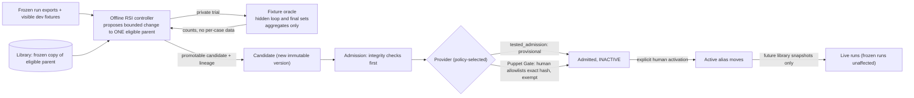

# RSI: the separate improvement area

PRD: 2.11, 4.4, 4.4.1, 4.4.9, 4.4.10, 4.1.5

> Answers: How does the separate offline improvement area work, and where does it stop?

## Position

- RSI is **offline**. It is a separate area with its own flow. It never [runs](system/lifecycle.md#term-run) inside a user run and never edits a live DAG, a [frozen](system/lifecycle.md#term-freeze) run, or an [active alias](capsule/library.md#term-alias).
- It **brings candidate [capsule](capsule/capsule.md#term-capability-capsule) versions in** through the same admission path as a hand-written capsule. A human controls what enters (the **policy**) and what becomes active.
- The referee does not change. Verifier CCs ([Gate profile](schemas/profiles.md#term-gateprofile)), [fixture oracle](capsule/fixture-oracle.md#term-fixture-oracle), hidden [fixtures](system/test-surfaces.md#term-fixture), scoring and activation tools are not RSI targets.

## Key terms

| Term | Meaning |
|---|---|
| **RSI** | Recursive self-improvement: the offline, separate area that proposes bounded changes to one eligible work capsule. It never touches a live run, a frozen plan or an active capsule. |

## Flow

## What may change

| Rule | Value in M1 |
|---|---|
| Eligible target | A capsule with `evolution.rsi: propose` and a non-empty `may_change` list. Gate-role CCs: `none`, empty list. |
| M1 targets | **Target 1 (required):** the pure `rank_opportunities` helper in a sandbox copy of Screening. **Target 2 (conditional):** Screening's own prompt and rubric text, only if a bounded headless model path exists. **Target 3:** `research.compile_intent` (code and its two prompts, model-backed, paired repeated calls). The AI4Research prompts are visible development fixtures. |
| Always frozen | Ports, interfaces, effects, permissions, dependencies, model selection, budgets, [checks](capsule/fields.md#term-check), GateProfile files, schemas, fixtures, split manifests, oracle code, scoring and acceptance rubric, activation tools |
| Never | model weights, new capability types, self-permissions, live-run mutation, auto promotion |
| Output | a Candidate with parent hash. The parent is never edited. |

Violations (out-of-scope mutation, hidden-fixture access, referee tampering, permission widening) halt the RSI session, keep evidence and need human clearance. Full rules: [RSI engine](capsule/rsi-engine.md), [boundaries](capsule/rsi.md).

## Benchmarks per capsule

Benchmarks are defined per capability before RSI begins. Mechanical, semantic and boundary fixture [families](contracts/principles.md#term-message-family) are authored by someone other than the capsule author. Public datasets give visible development checks; the **hidden** sets are held by the oracle custodian.

| Capsule | M1 RSI | Benchmark family to start from | Measured separately |
|---|---|---|---|
| `research.select_opportunity` (rank helper, text) | **yes (Targets 1, 2)** | ties, boundary scores, ineligible-but-high-score, empty eligible set; semantic score labels by a human reviewer | correctness first; then elapsed time; model calls |
| `research.compile_intent` | **yes: code and prompts** (recorded [PRD deviation](decisions.md#term-deviation)) | 25 live prompts as visible fixtures; hidden set: span fidelity, kept contradictions, vague text, injection text. Paired repeated model calls | model calls vs deterministic work; repair-loop use |
| `research.compile_brief` | none | target/comparator/quote fidelity, missing and contradictory limits | same |
| `research.search_ideas`, `op.*` | none | grounded-idea and citation cases; retrieval replay | retrieval vs synthesis |
| `research.form_hypothesis`, `build_poc`, `run_benchmark`, `evaluate_results`, `write_report` | none | see [improvement guide](capabilities/improvement.md) | per stage |
| `research.verifier` and every [Gate](verification.md#term-gate) | **never** | planted-defect fixtures per check | n/a |

Even where RSI is `none`, the benchmark families exist so a human can compare manual revisions on the same fixtures. Fixture sources and custody: [benchmark material](capabilities/benchmarking-material.md).

## How an improvement is judged

Order of evidence: visible tests and parent suites first (a failure spends no hidden query); then bounded hidden loop queries; then one custodian-only final holdout after the loop closes. Parent and child run under the same model route and settings, otherwise the trial is not comparable. All set sizes, query caps, win/loss rules and thresholds are defined in [fixture oracle](capsule/fixture-oracle.md). A result is a label on evidence. It never grants admission or activation.

## Admission and the Puppet Gate

- **Admission always runs integrity first:** [Declaration](capsule/fields.md#term-declaration) hashes, types, dependency closure, permissions. Fail here and no provider is asked.
- **The provider is chosen by policy.** `tested_admission` (provisional) is the default; Puppet is available by developer allowlist (exempt). Either way the child is `admitted_inactive`.
- **[tested_admission](capsule/admission.md#term-tested-admission)** runs visible suites and records only checks actually executed. Grants `provisional`.
- **[Puppet Gate](capsule/admission.md#term-puppet-admission)** (`puppet_admission`): a developer lists exact `decl_hash` values with actor and reason. Grants `exempt`. Runs no tests and claims none. It cannot write a Verdict, release a node, change permissions, grant `certified` or activate an alias.
- **Version, assurance and activation are separate.** An [RSI child](capsule/rsi.md#term-parent-and-child) is always `admitted_inactive`. Activation is a separate human command that writes a record and moves the alias for future snapshots. Rollback is an `activation_request` pointing at a historical admitted hash.

Detail: [admission](capsule/admission.md), [library](capsule/library.md).

## Security checks required before RSI is accepted

An adversarial suite (hidden-fixture reads, credential reads, check tampering, log deletion, broker abuse, off-scope edits, forbidden imports and network, false-parent admission, model mismatch, and more) must be blocked and logged on repeated runs. The cases are RSI-S01 to RSI-S24 in [RSI attacks](capsule/rsi-attacks.md). Expected results are defined; **none has been run**. See [decisions](decisions.md#open).
