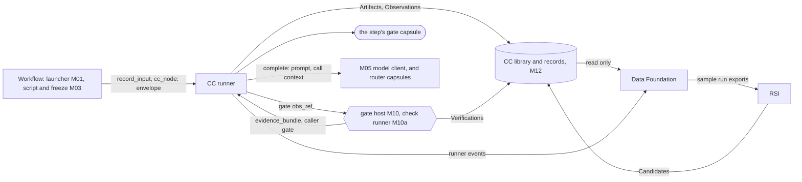

> **Checked, not yet approved.** Written 2026-10-01 from the workstream PRDs in [docs/product](../product/README.md) and Suraj's [capsule run records design](data-foundation/capsule-run-records.md).

# Seams: where each workstream meets Capability Capsule

A **seam** is an API between two modules that different people build. Each seam below says who calls whom, with what datatype, and where that datatype is defined. Both sides build to the seam and to nothing else. So two people, or two coding agents, can build connected modules apart and still get code that works together.

Every datatype named here has exactly one definition, listed in [where every shared datatype is defined](types/types.md#where-every-shared-datatype-is-defined). A seam never redefines one.

## The seams at a glance

| Seam | Caller | Callee | API | Datatypes | Status |
|---|---|---|---|---|---|
| Workflow to runner | M01, the Swarmflow script | runner | `record_input`, `cc_node`, `CcBackend.run` | `intake`; call descriptor; envelope | defined in [runner](capsule/runner.md#swarmflow-backend-talking-to-the-engine) |
| Runner to gate | runner (R1) | M10 | `gate(obs_ref) -> GateResult` | Observation, Verification, the five verdicts | [below](#evaluator-gate-and-verifier) |
| Gate to judge | the gate host (M10) | the step's gate capsule, through the runner | a `gate` call | `evidence_bundle`, `verifier_assessment` | [below](#evaluator-gate-and-verifier) |
| Check code to check runner | M10a | any check's runner | the check calling convention | `CheckResult` | defined in [checks](schemas/checks.md#calling-convention) |
| Runner to model | runner (R7, R6b) | M05 | `complete(prompt, ...)` | `ModelReply`, call context; a capsule's router is a pinned capsule, not here | [below](#model-routing) |
| Records to Data Foundation | Data Foundation's assembler | M12, runner events | read only | every CC record | [below](#data-foundation) |
| RSI to the library | RSI | admission (M14) | submit a Candidate | Candidate, Verdict, test suites | [below](#rsi) |

## Evaluator Gate and Verifier

Owner: Ramika (Verifier track, PRD 4.2 and [3.V](../product/prd-m1-verifier.txt)). CC supplies the inputs, the check runner and the records. The Verifier owns the judge's rubric and the fold's thresholds.

**Runner to gate.** The gate host's API, `gate(obs_ref) -> GateResult`, its full algorithm (Tier 1, Tier 2, the fold, the Verification it writes) and the five verdicts are defined once, on [the gate host](capsule/gate-host.md). The step-specific judgement lives in each step's [gate capsule](capsule/gate-capsules.md), which takes an [`evidence_bundle`](types/evidence-bundle.md) on input port `evidence_bundle` and answers a [`verifier_assessment`](types/verifier-assessment.md) on output port `verifier_assessment`.

**What the Verifier owns.** The rubrics of the judged checks and the gate capsules' judging instructions (`prompt.gate_judging`), as their author; the fold's thresholds in policy `gates`; and, later, judge calibration (`verifier_audit` Findings). CC owns the gate host, the check runner and the records.

**Full PRD 4.2 (2026-10-01)** now specifies the gate: the Stage Evidence Bundle (4.2.1), seven evaluator areas (4.2.2 to 4.2.7), the five verdicts with routing (4.2.8) and ten acceptance tests (4.2.9). It fits this seam. **Open for the Verifier:** the gate result record ([open issues](open-issues.md) 46), how `FAIL` and `ENVIRONMENT_BLOCKED` are told apart (by reason owner, [review](prd/prd-m1-full-review.md) C1), and the halt prompt (item 47).

## Model Routing

Owner: the Model Routing workstream ([3.X](../product/prd-m1-model-routing.txt); their [design](model_router_design_en.md), and CC's [reply](model-routing/README.md)).

**Who picks what.** The picker picks capsules at dispatch. A capsule that uses a model picks it inside the capsule; routing is the preferred way, per run, and fully dynamic: a capsule may switch models on any turn. A routed capsule pins a router capsule in `needs.external`, so the router's version is its `decl_hash` ([fields](capsule/fields.md#needs-what-must-hold-and-what-it-uses), [reply](model-routing/README.md)).

**How the records join.** A router call is a nested call, so its Observation's `causation_id` is the capsule call's `obs_id`. The router returns a `route_id` and records its own decision under it. The capsule passes `route_id` to `cc.model`, and the runner stores it on that turn as `route_record_id` ([model client contract](capsule/runner.md#the-model-client-contract-m05)). At M1, Codex is the only endpoint and no router runs, so `route_record_id` and `model_id` are null.

## Data Foundation

Owner: Suraj ([PRD](../product/prd-m1-data-foundation.md), [technical design](data-foundation/capsule-run-records.md)). Data Foundation observes; it never changes a run.

**The seam in one line:** CC's records are the source of truth for every capsule call; Data Foundation's Capsule Run Record is a **view** its assembler builds from them, plus the raw material only Data Foundation captures.

### Settled here, against the run records design

| Design question (its section 10) | Answer | Why |
|---|---|---|
| Q1: which files make up a capsule, and what identifies a version | **`decl_hash`.** The Declaration names every file by hash: code (`carrier` or `body`), each check's `runner`, and each `Port.value_schema`. So `decl_hash` changes whenever any of them changes. `code_sha256` identifies the code alone | one identity for a capsule version across every record (INV-6). A second "hash over all files" would be a copy that could disagree |
| Q3: do capsules run through one shared wrapper | **Yes: the CC runner.** Its events (R8) are the live hooks; Data Foundation subscribes to them | every capsule call has an Observation, including calls that never reach the gate |
| Q4: does the gate give per-check results | **Yes:** Verification `results[]`, one per check, with `runner_sha256` and evidence | |
| Q5: native `verify()` or a verifier capsule | **A verifier capsule**, called through the runner | `verify()` returns votes, not per-check results ([B1](b1-design.md#file-level-hooks)) |
| Q10: can a capsule call another, and who owns the record | **Yes, through the broker.** Each call has its own Observation; a nested one names its caller in `causation_id`. The node's record is its `dispatch` Observation | |
| record key | **`obs_id`**, not a Swarmflow `agent_id` | under `CcBackend` an `agent()` call starts no team worker, so no `agent_id` or `member_name` exists. The engine's `call_key` is kept in `ext.runner.engine_call_key` |
| `label` rule | **`label` is the `step_id`.** The call descriptor carries `decl_hash` and input hashes, so the journal re-runs a step when its capsule changes | same effect as `<capsule>@<hash>`, with the version in one place |
| storage | CC records in M12 are the source. `records/records.jsonl`, bundles, scorecard and exports are Data Foundation's derived outputs, rebuildable from M12 plus its raw captures | one writer per record kind (INV-3) |
| prompt as sent | the runner stores every model turn's prompt and reply as content, listed in the Observation's `ext.runner.turns` ([runner](capsule/runner.md#records-the-runner-writes)) | the bundle can be rebuilt byte for byte |
| sample run export, and M1 architecture's M17 fixture export | **one export, owned by Data Foundation.** M17 is retired in its favour | two exports of the same runs would drift |

### Where each run record group comes from

| Run record group | Source of truth | Captured by |
|---|---|---|
| Identity: run, step, attempt, times | Observation `scope.run_id`, Binding `step_id`, `attempt`, `started_at`, `at` | runner |
| Capsule: name, kind, version | Binding `decl_hash`; the Declaration's `identity` | admission, freeze |
| Given and produced | Observation `inputs`, `outputs`; Artifacts by `content_sha256` | runner |
| Lineage | Artifact `produced_by`; Observation `inputs`; nested `causation_id` | runner |
| Model and route | Observation `models`; `ext.runner.turns[].model_hint`, `.model_id`, `.route_record_id`; the router's own records | runner, router |
| Cost | Observation `cost`; the router's token counts | runner, router |
| Gate | Verification results, decision and durable gate_result; judge Observation and required capture | gate host, runner |
| How it stopped, what went wrong | Observation `outcome`, `reason`, `ext.runner.failure_code`, `error_detail` | runner |
| Failure class | **derived, never stored.** `runtime`-owned reason: `infrastructure`. `PORT_MISMATCH`, `PRECONDITION_FAILED`, `PRECONDITION_DEFERRED` or an `input`-owned code: `input`. Other refusals: `infrastructure`. `capsule`-owned reason, or a failing `capsule` check: `capsule`. A `fail` classification in `evaluation_verdict`: `scientific` | Data Foundation's assembler |
| Environment, host, workspaces, traces, tool calls, human answers | acknowledged immutable execution manifests; required capture loss blocks the run | Data Foundation collector; supervisor for human review |
| Declared against observed | the Declaration beside Data Foundation's observations; may later fill the Observation's `effects_observed` through the runner | Data Foundation |

**Open with Suraj:** the run records design assumed a Swarmflow team worker per `agent()` call, and joins spans through `member_name`. Under `CcBackend` there is no worker. The tool host is a child process of the agent server, and a skill is a series of model turns. So tool-call spans come from the tool host, not a worker. Which spans exist on this path needs checking on the first real run.

## RSI

Owner: Saurav ([3.Y](../product/prd-m1-rsi.txt), [full](../product/prd-m1-rsi-full.md)). M1 RSI runs in an offline copy of the library. Its hidden-fixture evaluation is handled by a separate oracle; that trust boundary is not the Stage 3.7 POC process boundary or general jiuwenbox sandbox (PRD 4.4.9, 5.4.3; [issue 40](open-issues.md)).

| RSI needs | The seam | Defined in |
|---|---|---|
| a parent to improve, and what it may change | the parent's Declaration (`evolution.rsi`, `evolution.may_change`), Verdict and test suites | [fields](capsule/fields.md#evolution-what-rsi-may-change), [checks](schemas/checks.md) |
| real runs to learn from | Data Foundation's sample run exports | [Data Foundation PRD](../product/prd-m1-data-foundation.md) |
| to try a child | its own M12 store and policy epoch in the sandbox, running the child through admission there (`caller: admission`) | [runner callers](capsule/runner.md#the-four-callers) |
| hidden regression fixtures | submit a candidate reference under an oracle-issued session; the oracle chooses its hidden split and returns aggregate counts only | [fixture oracle](capsule/fixture-oracle.md) |
| to propose a child to mainline | a Candidate with `submitted_by.kind: rsi` and `lineage.parent_hash`, through mainline admission | [Candidate](schemas/candidate.md), [library](capsule/library.md#admission-the-only-way-in) |

RSI uses the offline [engine API](capsule/rsi-engine.md), not a live DAG mutation. It consumes frozen exports, visible dev fixtures and oracle aggregates; submits through admission; and awaits attributable human activation. Private final-set/session policy and security bootstrap remain owner decisions 40/55. No fixture contents or oracle-private comparison data reaches the child/proposer.

## Ingestion

Owner: CC (M01). PRD 3.1.

The launcher reads the input folder and the prompt, builds one [`intake`](types/intake.md) value, and stores it with `record_input(run_id, "intake", vocabulary_ref=..., value=..., origin="human")`. PRD 3.1.4 sends file paths, sizes and times to "the Swarmflow telemetry log": the `intake` value holds paths and sizes, and the Artifact's `at` holds the time.
