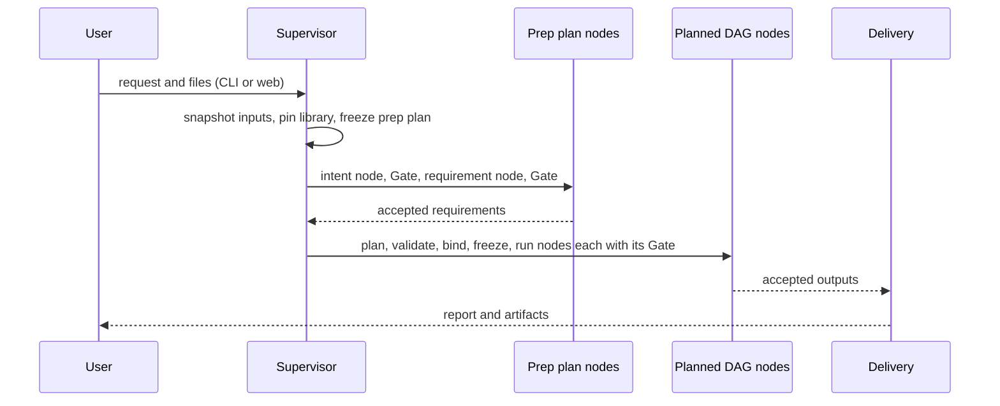
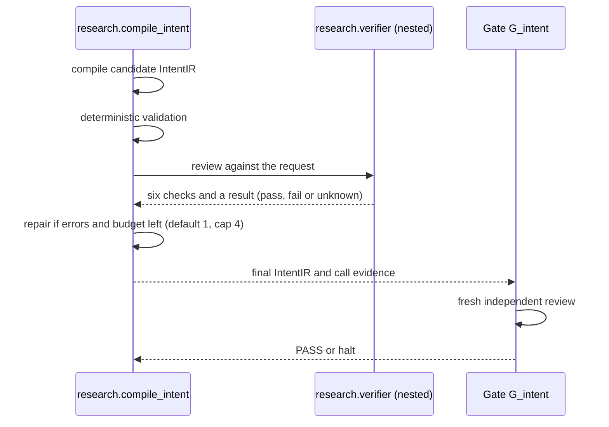
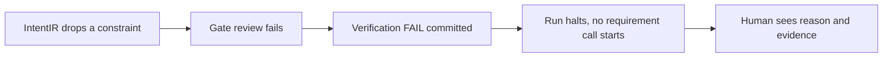
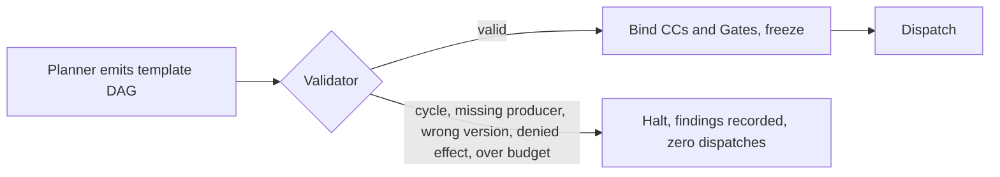
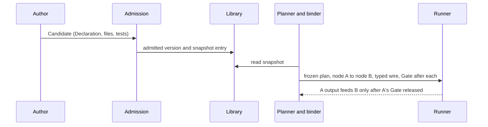
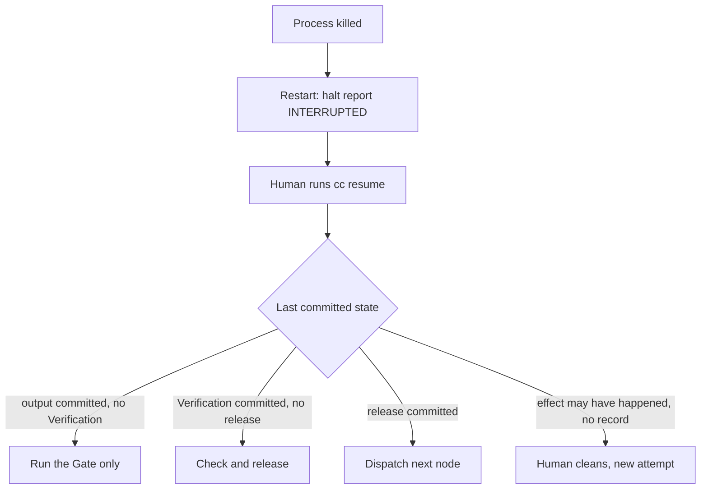
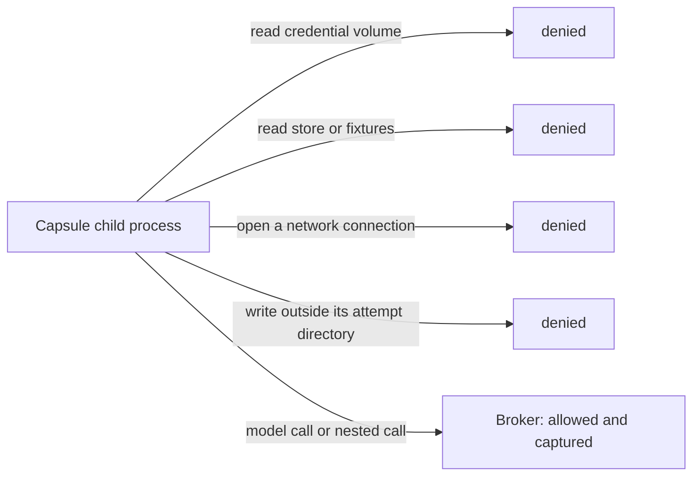
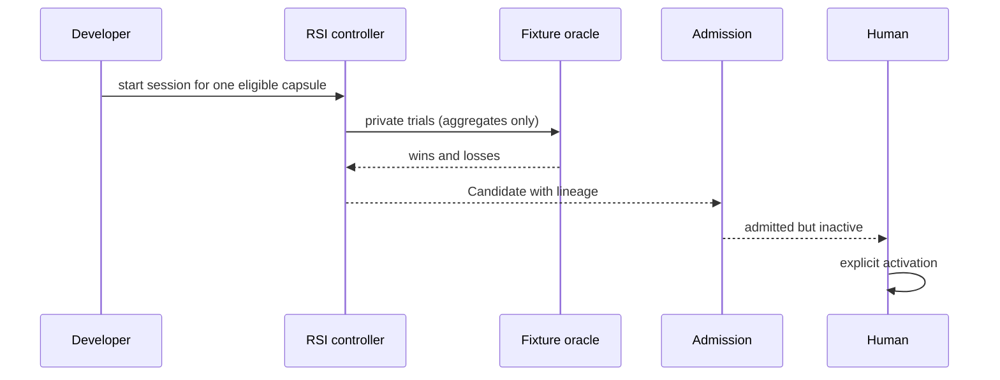
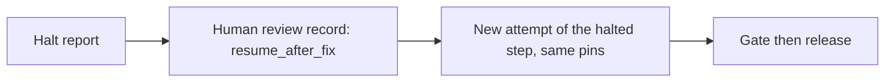
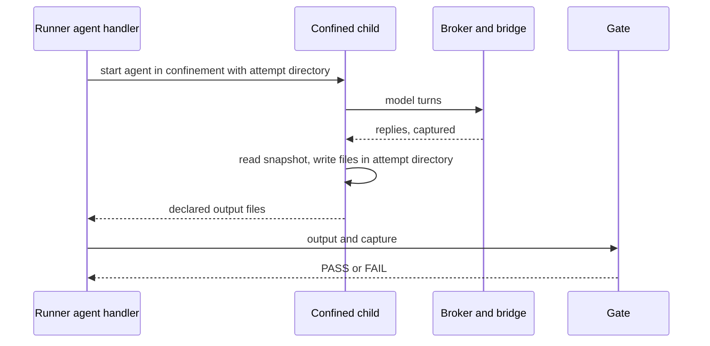

# User stories: what must be possible and must happen

PRD: 1.5, 3.8.5, 4.1.5, 4.2.8, 4.6.4, 5.4.3

> Answers: What must a user be able to do and observe?

Each story is something the system must do. Reviewers use them to ask "does the design make this happen, and can we see it happen?" A story passes only when the **must observe** line is seen in a real run record. Until then it is specified, not working.

Node IDs (`N_*`, `G_*`) are from [flow](flow.md). Demos (D0 to D6) are from [build order](build-order.md).

| ID | Story | Step or demo |
|---|---|---|
| US-01 | Submit a request, get a report | D4, D6 |
| US-02 | Intent is checked before anything builds on it | step 5 |
| US-03 | A bad intent stops the run and says why | step 6 |
| US-04 | Requirements are accepted before planning | step 6 |
| US-05 | A [run plan](types/run-plan.md#term-run-plan) [freezes](system/lifecycle.md#term-freeze) only if it validates | D4 |
| US-06 | A new [capsule](capsule/capsule.md#term-capability-capsule) becomes a node and connects | D3 |
| US-07 | A failed [Gate](verification.md#term-gate) stops everything | D2, D3 |
| US-08 | Crash, then a human resumes without rerunning | D3 |
| US-09 | A rejected hypothesis still gets a report | D6 |
| US-10 | No eligible idea [halts](system/lifecycle.md#term-halt) for a human | step 8 |
| US-11 | A capsule cannot reach what it must not reach | step 2 |
| US-12 | Model or login failure halts, never resubmits silently | [steps](system/nodes.md#term-step) 0 to 4 |
| US-13 | A developer improves a capsule offline and a human lets it in | step 11 |
| US-14 | A developer admits a known capsule without fake test claims | step 1 |
| US-15 | A developer rolls an active capsule back | step 1 |
| US-16 | A benchmark client [runs](system/lifecycle.md#term-run) headless and gets sealed evidence (partial by design) | step 10 |
| US-17 | A reviewer reads what happened without changing it | step 10 |
| US-19 | A human resumes a halted run | step 4 |
| US-20 | A human aborts a run | step 4 |
| US-21 | A user reads the report | steps 7, 10 |
| US-22 | A user inspects an artifact or a capture | step 10 |
| US-23 | A CI job runs the CLI headless | step 4 |
| US-24 | An [operator](capabilities/README.md#term-operator) installs and runs the doctor | steps 0, 2 |
| US-25 | A developer sees why a capsule was rejected | step 3 |

US-18 (a Codex agent with tools) is not M1 acceptance. See [Future](#future-not-m1-acceptance).

## US-01 Submit a request, get a report

**As a researcher**, I give a research request and my local files, and I get back a report with its evidence.

**Must observe:** run record with one [Binding](schemas/binding.md#term-binding) and one [Verification](schemas/verification-record.md#term-verification) per dispatch call (1 intent, 1 requirement, one per planned node), two freeze records (prep, planned), release records for every node, an output directory with a manifest. Flow: all [nodes](system/nodes.md#term-node). Specs: [flow](flow.md), [lifecycle](system/lifecycle.md).

## US-02 Intent is checked before anything builds on it

**As a researcher**, I want my request understood correctly before anything is planned.

**Must observe:** compile, review and repair turns captured in one call record, repair within the budget (default 1); a separate Gate Verification; requirements start only after the Gate release. Specs: [intent compile](capabilities/intent-compile.md), [intent gate](capabilities/intent-gate.md).

## US-03 A bad intent stops the run and says why

**As a researcher**, if my request was misread, I want the run to stop and tell me, not build on the error.

**Must observe:** zero requirement dispatches after the failed Gate and zero planner work before the requirement Gate [releases](system/lifecycle.md#term-release) (V34); Verification with the failed criterion and the quote from the request. Specs: [verification](verification.md).

## US-04 Requirements are accepted before planning

**As a researcher**, I want a clear contract (objective, metrics, limits) before any plan exists.

**Must observe:** `research_brief` committed and Gate-released before the planner is called; an invented requirement fails the quote-grounding check; vague text produces recorded issues, not guesses. Specs: [requirement](capabilities/requirement-capsule.md), [brief gate](capabilities/brief-gate.md).

## US-05 A planned DAG runs only if it validates

**As a developer**, I want a bad plan never to run.

**Must observe:** zero dispatch records for an invalid plan; a freeze record for a valid one that pins every capsule and Gate version. Specs: [planner](system/planner.md), [run plan](types/run-plan.md).

## US-06 A new capsule becomes a node and connects

**As a capsule author**, I write a [Declaration](capsule/fields.md#term-declaration) and code, get it admitted, and it becomes a node next to others. In M1 the planner emits the fixed template. A new capsule becomes a node through a hand-authored run plan (demo D3) or a new template. Planner selection from the catalogue is Phase 2.

**Must observe:** a toy two-node plan runs; wrong [port types](schemas/port-types.md#term-port-type) refused at freeze; B never starts if A's Gate fails. Specs: [capabilities](capabilities/README.md), [fields](capsule/fields.md), [admission](capsule/admission.md).

## US-07 A failed Gate stops everything

**As a researcher**, I want no work to continue after a failed check, including parallel branches.

**Must observe:** after a failed Verification, no further capsule dispatch for the run, including ready sibling nodes; committed outputs kept; in-flight work cancelled or captured. Specs: [runtime](runtime.md).

## US-08 Crash, then a human resumes without rerunning

**As a developer**, if the process dies, I want to continue without losing or repeating work. A crash never resumes by itself: on restart the supervisor writes a halt report with reason INTERRUPTED and waits.

**Must observe:** no capsule reruns on resume except an explicit new attempt under unchanged pins; no committed result lost (V11, V41). Specs: [lifecycle](system/lifecycle.md).

## US-09 A rejected hypothesis still gets a report

**As a researcher**, if the experiment shows my idea did not work, I still want the full report.

**Must observe:** Valid scientific FAIL; infrastructure Gate PASS; report produced with the negative result unchanged. Specs: [evaluation](capabilities/evaluation.md).

## US-10 No eligible idea halts for a human

**As a researcher**, if screening finds nothing usable, I want a stop for review, not an empty success.

**Must observe:** Screening ends with outcome error and failure code `NO_ELIGIBLE_OPPORTUNITY` and creates no empty card; the Gate maps it to INCONCLUSIVE with HALT and ESCALATE_TO_HUMAN (V40); the run halts before the hypothesis step. Specs: [screening](capabilities/screening.md).

## US-11 A capsule cannot reach what it must not reach

**As a security reviewer**, I want proof that a capsule cannot read credentials, the store, hidden [fixtures](system/test-surfaces.md#term-fixture) or another attempt, and has no network.

**Must observe:** each denied action fails and is recorded; the doctor [probes](system/environment.md#term-probe) pass before any workload runs. An unrun probe [blocks](system/modules.md#term-block) that workload. Specs: [isolation](isolation.md), [process boundary](capsule/process-boundary.md).

## US-12 Model or login failure halts, never resubmits silently

**As a researcher**, if the model login fails, I want a stop, not a silent second paid model [turn](system/model-bridge.md#term-model-turn).

**Must observe:** call ends with a typed error; the run halts as ENVIRONMENT_BLOCKED; capture kept; no second paid turn at the supervisor (V37); after login a human `resume` starts a new attempt of that step under the same pins. Specs: [model auth](system/model-auth.md), [runtime](runtime.md).

## US-13 A developer improves a capsule offline and a human lets it in

**Must observe:** parent never edited; hidden fixtures never in prompts or logs; child inactive until a human activates; live runs unaffected. Specs: [rsi](rsi.md).

## US-14 A developer admits a known capsule without fake test claims

**As a developer**, I want to admit a known capsule by hash without inventing test results.

**Must observe:** Puppet decision names actor, reason and exact hash; the Standing says `exempt` with no [checks](capsule/fields.md#term-check) claimed; it cannot release a node or activate anything. Specs: [admission](capsule/admission.md). The provider is chosen by policy: `tested_admission` is the default and Puppet is by developer allowlist.

## US-15 A developer rolls an active capsule back

**As a developer**, I want to roll an active capsule back.

**Must observe:** one `activation_request` pointing the alias at a historical admitted hash (V38); running runs keep their pinned [library snapshot](capsule/library.md#term-library-snapshot); the next launch uses the older version. Specs: [library](capsule/library.md).

## US-16 A benchmark client runs headless and gets sealed evidence

**As a benchmark client**, I call the HTTP API and get sealed evidence. This story is partial by design: the export schema is `PENDING_SOURCE` until the harness side supplies it.

**Must observe:** authenticated loopback HTTP call (`benchmark_request`, `export_request`) with task, config and seed; HTTP status codes, separate from CLI exit codes; sealed export with run ids, hashes, timings, and explicit "unavailable" where telemetry is missing. Specs: [benchmark export](system/benchmark-export.md).

## US-17 A reviewer reads what happened without changing it

**As a reviewer**, I want to read the run without changing it.

**Must observe:** run view and records show every call, Gate, release and halt reason; hiding a view does not stop capture; reading cannot release or alter anything; a write attempt through the view API is refused and a reconnect shows the same records (V39). Specs: [runtime](runtime.md#observability).

## US-19 A human resumes a halted run

**As a developer**, after a halt I fix the cause and continue the run.

**Must observe:** `human_review_record` with action `resume_after_fix`; a new attempt of the step under unchanged pins; no rerun of committed steps. Test-only seam: config key `cc.test.review_injection` (a pre-recorded review file), refused by the production profile. Specs: [lifecycle](system/lifecycle.md), [runtime](runtime.md).

## US-20 A human aborts a run

**As a user**, I stop a run I no longer want.

**Must observe:** abort during a call kills the child tree and commits the [Observation](schemas/observation.md#term-observation) (V42); the run ends as aborted with its records kept. Specs: [runtime](runtime.md), [workstation](system/workstation.md).

## US-21 A user reads the report

**As a researcher**, I open the final report and its artifact package.

**Must observe:** report and manifest in the user workspace; the manifest check passes; a scientific negative result appears unchanged. Specs: [delivery](capabilities/delivery.md), [write report](capabilities/write-report.md).

## US-22 A user inspects an artifact or a capture

**As a reviewer**, I look at one step's artifact or captured model turns.

**Must observe:** `cc inspect` and `cc artifacts` (proposed) return committed content by hash; a missing capture is shown as unavailable, never as empty. Specs: [workstation](system/workstation.md), [observability](system/observability.md).

## US-23 A CI job runs the CLI headless

**As a CI author**, I run a task without a human session and read the exit code.

**Must observe:** exit 0 success, 2 launch or configuration rejected, 3 halted, 4 environment unavailable (V43); `--json` output matches `cli_json_output`. Specs: [workstation](system/workstation.md).

## US-24 An operator installs and runs the doctor

**As an operator**, I install the image and learn whether this machine can run M1.

**Must observe:** `cc bootstrap` creates identities, volumes and the seed capsules; the doctor core passes at step 0 and the restricted-child probes at step 2; an unrun probe blocks only the profile that needs it (V30). Specs: [environment](system/environment.md).

## US-25 A developer sees why a capsule was rejected

**As a developer**, I submit a capsule and read why admission refused it.

**Must observe:** the Verdict lists each failed integrity check or test call with its reason (V44); nothing enters the library. Specs: [admission](capsule/admission.md).

## Support

How each story is carried by the design. Flow nodes are from [flow](flow.md). Boundaries are from [boundaries](contracts/boundaries.md). Blocks are from [modules](system/modules.md). Tests are from [test surfaces](system/test-surfaces.md).

| Story | Flow nodes | Boundaries | Blocks | Tools |
|---|---|---|---|---|
| US-01 | all | BD01, BD11 | B03 to B09, B13, B19 | `cc run` |
| US-02 | N_intent, G_intent | BD06, BD08, BD09 | B09, B10, B13, B16 | none |
| US-03 | G_intent, HALT | BD09 | B13, B04 | `cc status` |
| US-04 | N_req, G_req | BD06, BD09 | B16, B13 | none |
| US-05 | N_plan, N_validate, N_bind | BD03, BD04, BD05 | B05, B06, B07 | none |
| US-06 | N_bind, N_dispatch | BD03, BD06 | B07, B15, B16 | `cc library list` |
| US-07 | G_node, HALT | BD09, BD10 | B04, B13 | `cc status` |
| US-08 | HALT, REC | BD01, BD10 | B04, B14 | `cc resume`, `cc attempts clean` |
| US-09 | N_deliver | BD11 | B16, B19 | none |
| US-10 | G_node, HALT | BD09 | B16, B13 | `cc verdict show` |
| US-11 | N_run | BD07, BD15, BD20 | B20, B09, B10, B02 | `cc doctor` |
| US-12 | N_run, HALT | BD08 | B11, B04 | `cc resume` |
| US-13 | [RSI](rsi.md#term-rsi) area | BD12, BD13, BD14 | B25, B26, B15 | RSI commands |
| US-14 | ADMIT | BD13 | B15 | `cc library standing` |
| US-15 | ACT | BD14 | B15, B14 | `cc library list` |
| US-16 | VIEW | BD02 | B28, B23 | HTTP API |
| US-17 | VIEW, VIEWS | BD17 | B23, B24 | `cc status`, `cc inspect` |
| US-19 | HALT, REC | BD01 | B04 | `cc resume` |
| US-20 | HALT | BD01 | B04, B09 | `cc abort` |
| US-21 | N_deliver, VIEW | BD11 | B19, B16 | `cc artifacts` |
| US-22 | VIEW | BD17 | B24, B23 | `cc inspect`, `cc artifacts` |
| US-23 | USER | BD01 | B03, B04 | `cc run --json` |
| US-24 | none (startup) | BD20 | B01, B02 | `cc bootstrap`, `cc doctor` |
| US-25 | ADMIT | BD13 | B15 | `cc library standing` |

| Story | Message defs | [V rows](system/test-surfaces.md#term-v-row) | Step and demo | Status |
|---|---|---|---|---|
| US-01 | `launch_request`, `deliver_request` | V18, V24 | D4, D6 | specified |
| US-02 | `intent_fidelity_review`, `intent_repair_record` | V13, V14 | step 5 | specified |
| US-03 | `gate_result` | V14, V34 | step 6 | specified |
| US-04 | `runner_request` | V15, V34 | step 6 | specified |
| US-05 | `planner_request`, `plan_validation`, `freeze_request` | V16, V17, V18, V45 | D4 | specified |
| US-06 | `freeze_request`, `admission_request` | V04, V11 | D3 | specified |
| US-07 | `gate_request`, `release_record` | V09, V10, V11, V33 | D2, D3 | specified |
| US-08 | `halt_report`, `human_review_record`, `resume_request` | V11, V41 | D3 | specified |
| US-09 | `deliver_request` | V23, V24 | D6 | specified |
| US-10 | `gate_result` | V20, V40 | step 8 | specified |
| US-11 | `tool_host_frame`, `poc_execute_request`, `config_snapshot` | V07, V22, V30 | step 2 | specified |
| US-12 | `model_bridge_request`, `halt_report` | V01, V37 | steps 0 to 4 | specified |
| US-13 | `oracle_evaluate_request`, `admission_request`, `activation_request` | V26, V27, V28 | step 11 | specified |
| US-14 | `admission_request`, `admission_decision` | V04, V27 | step 1 | specified |
| US-15 | `activation_request`, `activation_record` | V28, V38 | step 1 | specified |
| US-16 | `benchmark_request`, `export_request` | V29 | step 10 | partial by design |
| US-17 | `event_envelope`, `run_status_view` | V31, V39 | step 10 | specified |
| US-19 | `resume_request`, `human_review_record` | V35, V41 | step 4 | specified |
| US-20 | `abort_request_run` | V35, V42 | step 4 | specified |
| US-21 | `publication_manifest`, `deliver_result` | V19, V24 | steps 7, 10 | specified |
| US-22 | `run_status_view` | V39 | step 10 | specified |
| US-23 | `launch_request`, `cli_json_output` | V35, V43 | step 4 | specified |
| US-24 | `doctor_report`, `config_snapshot` | V30 | steps 0, 2 | specified |
| US-25 | `admission_decision` | V44 | step 3 | specified |

## Future (not M1 acceptance)

These are not supported in M1. They have no V rows and no step.

- Compare two capsule versions on fixtures (side by side runs on one fixture set).
- Reproduce an old run from its records (re-run under the same pins and compare).

### US-18 A Codex agent with tools works inside a capsule and stays confined

**As a capsule author**, I want a Codex agent to do tool-using work inside a capsule, so that builders and code tasks are possible without trusting the agent.

**Must observe:** no network and no read of credentials, store, fixtures or other [attempts](system/lifecycle.md#term-attempt); writes only in the attempt directory; the first exceeded limit kills the child tree; produced code is scanned by the Gate before use; observed tool use matches the declared list. Specs: [isolation](isolation.md#codex-agents-inside-a-capsule). Status: proposed.
