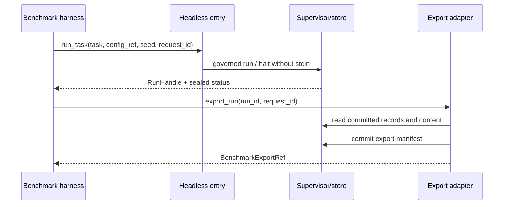

# External benchmark invocation and evidence export

PRD: 5.6.5, 3.7.4

> Answers: How does an external benchmark harness invoke a run and export its evidence?

## Purpose

The external benchmark harness defines the evaluation harness and its final schema. This provisional v1 boundary exports data; it does not design its scoring, task splits, statistics or orchestration. The product's scientific benchmark stage is defined in [measurement protocol](../capabilities/measurement-protocol.md). Preregistered component/Gate ablations permitted by PRD 5.6.5 run only in the isolated evaluation track, carry their baseline and deviation records, and never change production [Gate](../verification.md#term-gate) policy.

Benchmark clients use this HTTP API (`benchmark_request`, `export_request` and the other defs below), not `launch_request`. The HTTP status codes in the route table are separate from the CLI exit codes (0, 2, 3, 4) of [workstation](workstation.md#interface-cli-and-public-run-api). The export schema is `PENDING_SOURCE` until the harness side supplies it, so US-16 is partial by design.

## Interface: public contract

Messages of this module.

- **Run one task headless** (call, benchmark client -> supervisor). Schema: [`services-v1.schema.json#benchmark_request`](../contracts/services-v1.schema.json).
- **Handle for a started run** (call, supervisor -> client). Schema: [`services-v1.schema.json#run_handle`](../contracts/services-v1.schema.json).
- **Ask for a sealed export** (call, client -> supervisor). Schema: [`services-v1.schema.json#export_request`](../contracts/services-v1.schema.json).
- **The sealed run export** (report, supervisor -> client). Schema: [`services-v1.schema.json#benchmark_export`](../contracts/services-v1.schema.json).
- **Requested and effective seed** (profile, export). Schema: [`services-v1.schema.json#seed`](../contracts/services-v1.schema.json).
- **Profiles a run used** (profile, export). Schema: [`services-v1.schema.json#benchmark_profiles`](../contracts/services-v1.schema.json).
- **Ready or not-ready answer** (report, service -> client). Schema: [`services-v1.schema.json#readiness`](../contracts/services-v1.schema.json).
- **Handle to a sealed export** (call, supervisor -> client). Schema: [`services-v1.schema.json#export_handle`](../contracts/services-v1.schema.json).
- **Abort a run** (call, client -> supervisor). Schema: [`services-v1.schema.json#abort_request`](../contracts/services-v1.schema.json).

[Services-v1 JSON Schema](../contracts/services-v1.schema.json) is the sole home of benchmark_request, run_handle, export_request, benchmark_export and error shapes, including nested [steps](nodes.md#term-step)/calls/measurements/artifacts/deviations. The table below explains meanings rather than overriding field definitions. API arguments are shorthand for versioned JSON request objects.

`cc/benchmark_api.py` exposes `run_task(task, config_ref, seed, request_id) -> RunHandle` and `export_run(run_id, request_id) -> BenchmarkExportRef`. `task` uses the canonical intake contract; `config_ref` names a validated immutable effective configuration, not arbitrary module injection. RunHandle contains `run_id`, `run_dir`, `state`, and manifest/status references when available. Headless is pinned in configuration; a human-review requirement returns [halted](lifecycle.md#term-halt) state immediately rather than waiting on stdin. Run/start duplicate and conflict rules match [workstation](workstation.md); export is read-only and deterministic for one sealed [evidence bundle](../types/evidence-bundle.md#term-evidence-bundle). Active [runs](lifecycle.md#term-run) return `RUN_NOT_SEALED`, never a purported final bundle.

The authoritative provisional export is a closed JSON object:

| Required field | Meaning |
|---|---|
| version | integer 1; immutable [released](lifecycle.md#term-release) wire revision |
| export_id, [run_id](records.md#term-run-id), track | stable export/run identity; this run API exports production or isolated_experiment; offline [RSI](../rsi.md#term-rsi) session exports use its separate evidence API |
| source_manifest_ref, config_ref, library_snapshot_ref, plan_ref | immutable provenance pins; reference includes content hash |
| run_state, failure_records | completed/halted/aborted; structured reason and evidence references |
| steps | ordered step/attempt/request IDs, declaration hashes, [Binding](../schemas/binding.md#term-binding)/Observation/Artifact/Verification/release refs; missing records explicit |
| model_calls | request/parent identities, role, requested/served model, route reference, start/end/elapsed, raw prompt/reply references, tokens/cost with availability metadata |
| artifacts | hash/type/name/size and retrieval references into this run's accessible manifest |
| scientific_outcome | canonical [evaluation verdict](../types/evaluation-verdict.md#term-evaluation-verdict) reference or explicit unavailable reason |
| timing, usage | measured units and source; absent values are null with reason, not fabricated zero |
| [deviations](../decisions.md#term-deviation) | enabled experimental features and differences from fixed baseline; empty for ordinary production |
| [ext](../schemas/common.md#term-ext) | optional non-authoritative extension object |

Measurements use value/unit/evidence_ref/unavailable_reason as defined in the schema. Null values require an explicit unavailable reason; reported values require source evidence and null unavailable_reason. Required capture missing remains an evidence failure even when export explains it. Null record refs are paired with missing_records; null served-model/reply values mean no served response was captured. Boundary validation [checks](../capsule/fields.md#term-check) these relationships in addition to schema checks. Errors are `RUN_NOT_FOUND`, `RUN_NOT_SEALED`, `INVALID_REFERENCE`, `CONTENT_CORRUPT`, `CAPTURE_MISSING`, `REQUEST_CONFLICT`, and storage errors; export never repairs or recomputes scientific results.

## Behavior: Docker HTTP transport

`benchmark_request.task` is a qualified intake proposal. The entry adapter requalifies its declared document/resource locators against already provisioned bytes under the `config_ref` workspace/import roots before durable run acceptance, using the same launcher ingestion and [snapshot](../capsule/library.md#term-library-snapshot) APIs as CLI. Only safe workspace-relative paths are accepted: no absolute host paths, parent traversal or symlink escape. Document text/format/size/skipped fields must match the launcher's extraction result; mismatches return INTAKE_CONTENT_MISMATCH instead of trusting harness-supplied text. Empty documents/resources permit a text-only task. There is no upload or clone/download endpoint; the human installation provisions resource bytes and approved profiles first. The accepted intake and immutable snapshot references become run evidence. Later steps cannot read changing host resources.

The single [application container](deployment.md) serves this API at container port 8787, published only on host `127.0.0.1:8787`. `cc/benchmark_api.py` wraps the ordinary workstation/supervisor APIs; it is not a separate deployment. Requests and responses are UTF-8 JSON, version 1, validated against [services-v1](../contracts/services-v1.schema.json). An immutable release OpenAPI description is generated from these schemas and this route table; no independent hand-written payload definitions are allowed. `run_dir` is an informational container path, not a host retrieval contract.

| Method and path | Request / response | Observable behavior |
|---|---|---|
| GET `/healthz` | no body / `{status:"alive"}` | liveness only, no configuration or secrets |
| GET `/ready` | no body / readiness | authenticated, 200 only after deployment doctor/recovery, otherwise 503 with diagnostic reason |
| GET `/api/v1/benchmark/profiles` | no body / benchmark_profiles | authenticated catalog of permitted immutable config references, track and description; no raw credentials |
| POST `/api/v1/benchmark/runs` | benchmark_request / run_handle | 202 after durable acceptance; identical [request_id](../contracts/principles.md#term-request-id)/body returns the same handle; changed body returns 409 REQUEST_CONFLICT |
| GET `/api/v1/benchmark/runs/{run_id}` | no body / run_handle | 200 committed status snapshot; missing run 404 |
| POST `/api/v1/benchmark/runs/{run_id}/exports` | export_request / export_handle | path/body run_id must agree; 201 committed export and download URL, repeat returns same export; active run 409 RUN_NOT_SEALED |
| GET `/api/v1/benchmark/runs/{run_id}/exports/{export_id}` | no body / benchmark_export | 200 verified committed JSON; export must belong to run |
| GET `/api/v1/benchmark/runs/{run_id}/artifacts/{artifact_id}` | no body / artifact bytes | manifest-membership and content-hash checked; no caller paths; includes Content-Length and X-Content-SHA256 |
| POST `/api/v1/benchmark/runs/{run_id}/abort` | abort_request / run_handle | durable explicit cancellation request, 202 while cancellation drains, 200 if already terminal; never resumes or repeats work |

All routes except liveness require `Authorization: Bearer <local token>`. Installer provisions a random 256-bit token into an HTTP-adapter-owned 0600 file. The harness receives it through the human-controlled local setup; it is absent from config snapshots, prompts, logs, exports and workload mounts. Compare tokens in constant time. Missing/invalid token returns 401; wrong permitted scope returns 403. Request IDs are required on mutating routes; the adapter persists canonical request hashes before invoking the supervisor. Polls and downloads have no research effects. An HTTP disconnect cannot restart or cancel an accepted run; callers retrieve its handle using the same request ID. Explicit abort goes through supervisor cancellation and preserves partial evidence.

M1 serializes research execution: admission of another independent run while one is active returns 409 WORKSTATION_BUSY before creating a run. A duplicate of the active request still returns its handle. No hidden queue or concurrent-run scheduling is introduced. The API rejects caller-supplied paths, arbitrary models/modules, unknown fields and unapproved profiles. Typed errors use the canonical error envelope: 404 RUN_NOT_FOUND/ARTIFACT_NOT_FOUND, 409 conflict/busy/not-sealed, 422 invalid schema/reference/track, and 503 not-ready or store unavailable. Generated server request IDs correlate errors on body-less routes. Artifact download uses a sanitized manifest name; hash or missing mandatory evidence returns CONTENT_CORRUPT/CAPTURE_MISSING, never repaired output. Hidden [fixtures](test-surfaces.md#term-fixture), local tokens and credentials cannot be exported. File retrieval rechecks authorization and committed membership each time.

The harness polls status, seals/retrieves the export, then downloads only its manifest-listed evidence. Explicit restart remains the authenticated workstation human-review operation, with a new attempt under the same run identity; the benchmark API does not invent an unattended restart policy. Transport retries reuse the existing request ID and cannot create a second model/experiment call. Apply bounded request-body size and HTTP deadlines from pinned configuration; accepted research deadlines are supervised independently of the HTTP connection.

This follows the resource-oriented HTTP convention in [HTTP Semantics, RFC 9110](https://www.rfc-editor.org/rfc/rfc9110.html) and schema-referenced interface descriptions in [OpenAPI](https://spec.openapis.org/oas/v3.1.1.html). These references justify the transport style, not executed compatibility evidence. The final harness schema replaces only this adapter/export mapping.

## Failure and sequence

| Situation | Outcome | Recovery |
|---|---|---|
| Same request id, changed body | 409 `REQUEST_CONFLICT` | submit with a new request id |
| Export requested while the run is active | 409 `RUN_NOT_SEALED` | poll status, then export after the run is sealed |
| Another independent run is active | 409 `WORKSTATION_BUSY`; no run created | wait; no hidden queue exists |
| Missing run | 404 | check the run id |
| `/ready` before doctor and recovery pass | 503 with diagnostic reason | wait for readiness |
| Required capture missing | evidence failure, not a scientific result | explicit human review |

The supervisor/store writes underlying evidence; `cc/data/export.py` requests immutable export publication through that writer after validation. Harness retrieves it through the authenticated HTTP API; direct container paths are informational. Neither export nor harness writes Gate/release records or reads credentials/hidden RSI fixtures. Ordinary retention applies to exports; the harness records the export hash it consumed.

The correlated call/step evidence follows [OpenTelemetry spans and links](https://opentelemetry.io/docs/specs/otel/trace/api/); raw records remain authority. This limits later schema changes to an adapter. When the harness side supplies the schema, compare fields, publish an explicit v1-to-harness mapping, and test retrieval/correlation rather than revising the workflow. Fixtures cover halted runs, scientific-negative completed runs, unavailable token telemetry, wrong-run refs, corrupt bytes, export write interruption and duplicate export requests.

## Tests

Fixtures and fakes: headless `run_task` and `export_run` on halted and sealed runs, with missing telemetry. Row in [test surfaces](test-surfaces.md#verification-table): [V29](test-surfaces.md#verification-table). The export schema is `PENDING_SOURCE` for final fields.
