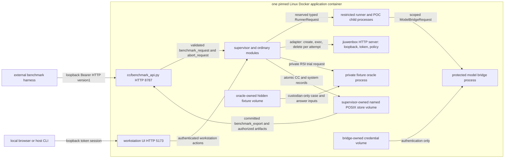

# Dockerized modular monolith

PRD: 2.9, 5.2.1, 5.4.3

> Answers: How is the modular monolith packaged, launched and released in Docker?

## Purpose

One Linux application image and one application container ([decisions](../decisions.md), A12 and Step 4). This differs from the PRD's native-installation preference and deferred-container wording; the PRD source is not edited. Docker is packaging and the outer process boundary; it does not replace the internal generated-code or hidden-fixture [boundaries](modules.md#term-boundary). Capsule execution never starts another container. Benchmark runners call the versioned HTTP boundary described by [benchmark export](benchmark-export.md).

## Key terms

| Term | Meaning |
|---|---|
| **UNSUPPORTED_SECURITY_PROFILE** | The reason code returned when the restricted-child engine cannot start with the required settings, for example without Landlock. No fallback runs a child on the host. |

## Interface: release and host contract

Interface: the host contract below is the launch manifest and the two published [ports](../capsule/fields.md#term-port) (loopback 5173 and 8787). Message shapes live in [benchmark export](benchmark-export.md) and [workstation](workstation.md); this page defines no message of its own.

One deployable; [placement](../placement.md) gives the summary view. The graph below expands the application container; external browsers, benchmark harness and scholarly endpoints remain outside it. Internal process boundaries enforce permissions without adding deployable services.

Publish one image pinned by digest, built from a pinned Linux base, Python 3.12 patch release, dependency lock/wheel hashes, Codex app-server binary, Bubblewrap binary and security profiles. The repository permits Python >=3.11,<3.14; this is a constraint, not three validated release variants. Initially ship one Python 3.12 Linux release matrix. Linux Docker Engine and macOS Docker Desktop execute that same Linux image. macOS supplies Docker's Linux VM rather than a native Seatbelt backend. Windows deployment is outside declared M1 acceptance. GPU/device support is enabled only for explicitly recorded hardware/runtime combinations; missing devices fail doctor before experiments start.

**Image contents.** The image contains the [jiuwenbox](../isolation.md#term-jiuwenbox) HTTP server, its token and its policy, and the doctor [probes](environment.md#term-probe) it: the server answers on loopback only, a request without the token is refused, the policy hash equals the pinned one, and [Landlock](../isolation.md#term-landlock) `hard_requirement` with an isolated network is accepted before any [restricted child](../capsule/process-boundary.md#term-restricted-child) starts (a failed probe makes the profile unsupported).

Host installer duties are image verification, named-volume creation, private configuration/input provisioning, local credential provisioning and startup. Native Python installation is unnecessary for the product runtime. A host CLI may call the public API; terminal attachment uses the fixed container's CLI/TUI. Docker is controlled by the human installer only. No daemon socket, runtime container creation API, Kubernetes or remote host orchestration is available to application code.

## Container launch and custody

The release launch manifest requires a read-only image root, private tmpfs `/tmp` and `/run` with nosuid/nodev, an init/reaper, a finite PID limit, [bridge](model-bridge.md#term-model-bridge) networking and loopback-only published ports: host `127.0.0.1:5173` for workstation UI and `127.0.0.1:8787` for versioned benchmark API. The server binds its container interface; host loopback restriction is enforced by Docker publishing. Port fallback and host network/PID modes are forbidden. Resource limits are recorded in doctor and every run, with hardware-specific limits supplied by installation policy.

Use `--cap-drop=ALL`, adding only `CHOWN`, `SETUID`, and `SETGID` to the short fixed bootstrap/identity-launch process. Bootstrap initializes POSIX ownership on fresh named volumes, then permanently drops CHOWN. Supervisor, runner, bridge, oracle, HTTP and workload processes run as distinct non-root identities without capabilities. The small fixed identity helper retains only SETUID/SETGID, accepts authenticated approved-root descriptors and profile identifiers, drops groups/UID/GID/capabilities before exec, and accepts no caller-selected executable, path mount or identity. Apply `no-new-privileges` throughout. No privileged container, SYS_ADMIN, privileged Bubblewrap/setuid binary or unconfined [seccomp](../isolation.md#term-seccomp) fallback is allowed.

Docker's default seccomp profile [blocks](modules.md#term-block) namespace and mount operations required by Bubblewrap. Ship a pinned outer profile derived from it permitting the validated launcher's bounded clone/unshare flags and required mount/umount2/pivot_root operations; retain unrelated denials and deny joining external namespaces. This outer syscall permission applies to the container, not to a named application executable; do not claim seccomp recognizes the launcher. Kernel capability [checks](../capsule/fields.md#term-check) still prohibit host/outer-namespace mounts. The launcher creates a new user namespace before mount/PID/network namespaces after dropping to the child identity. After setup, before any untrusted entrypoint, stack an inner seccomp profile denying further namespace, mount, privilege and process-control operations. The child cannot remove the inherited filter. This requires a host kernel and Docker/LSM policy permitting nested unprivileged user namespaces and their mounts; doctor must actually launch the profile. EPERM or an unsupported kernel returns `UNSUPPORTED_SECURITY_PROFILE` and blocks workloads. Do not remove seccomp or grant SYS_ADMIN to make a failing machine pass.

Named POSIX volumes, not macOS bind mounts, own `/var/lib/jiuwenswarm/store` (supervisor only), `/var/lib/jiuwenswarm/workspaces` (allocated per run/attempt), and `/var/lib/jiuwenswarm/fixtures` (oracle only, 0700/0600). Read-only imported project inputs are separate from these stores. The dedicated bridge-owned credential volume uses separate container login under model-auth; no runtime copy of a personal desktop profile is performed. Credentials never enter the image, configuration, export or research prompt. Runtime snapshots cannot change custody. Workload Bubblewrap mounts omit credential, fixture and store paths entirely, expose only fixed interpreter/admitted code and current authorized input snapshots read-only, and the assigned attempt root writable. Their private network namespace has no external interface. Access to scholarly retrieval and [model turns](model-bridge.md#term-model-turn) uses authenticated broker descriptors. No workload inherits a Docker socket or supervisor/oracle/bridge control descriptor.

## Behavior: startup and shutdown

[Model authentication](model-auth.md) is the home of the dedicated persistent Codex home, separate container login, exclusive profile lock and normalized AuthProvider. Provision that volume once and retain Codex's updates. Do not copy desktop auth into each run, mount a host's whole home, or synchronize credential files with a watcher. Login challenges are shown through trusted local setup; actual token bytes never leave the private bridge home.

Image/digest and launch-profile check → fixed volume/identity bootstrap → store crash recovery → model bridge/app-server → security and fixture doctor → runner → authenticated HTTP/UI readiness. `/ready` remains unavailable until required checks pass; read-only diagnostics may remain available. Container restart reconciles committed state and marks interrupted work; it never silently repeats paid/model/effectful calls or [releases](lifecycle.md#term-release) work from an uncommitted [Gate](../verification.md#term-gate). Shutdown rejects new submissions, records cancellation/interruption, kills/reaps owned child trees, seals evidence and then closes store/bridge. A crash or kill never resumes by itself: on restart the supervisor writes a `halt_report` with reason `INTERRUPTED` and waits. A human `cc resume <run_id>` retains run/step identities and creates the recorded next attempt.

The monolith is one deployable with internal security processes. Module APIs are ordinary in-process calls except runner, restricted execution, oracle and model bridge channels where trust separation requires authenticated UDS/framing. All child processes share the release digest; they are not independently deployed services. Each workload receives its own PID namespace and a launcher-owned namespace-init handle. Cancellation/deadline terminates that namespace init, causing the kernel to kill processes in the namespace; reap the launcher and namespace-init before sealing capture. Use Bubblewrap die-with-parent/new-session behavior so supervisor death cannot leave a detached workload. Process-group signalling alone does not prove complete subtree termination.

## Failure

| Situation | Outcome | Recovery |
|---|---|---|
| A required startup check fails | `/ready` stays unavailable; no run is accepted | fix the image, profile or volume, then restart |
| The restricted-child engine cannot start with the required settings (for example no Landlock) | `unavailable` with `UNSUPPORTED_SECURITY_PROFILE`; no fallback [runs](lifecycle.md#term-run) a child on the host ([process boundary](../capsule/process-boundary.md)) | use a supported platform image |
| A negative probe shows a child can read credentials, store or [fixtures](test-surfaces.md#term-fixture) | the profile is unsupported | do not release that image |

## Tests: required negative probes and release evidence

Rows in [test surfaces](test-surfaces.md#verification-table): [V07](test-surfaces.md#verification-table), [V30](test-surfaces.md#verification-table).

Doctor must exercise the exact image/launch profile, not only inspect flags, including the jiuwenbox server (loopback only, token required, policy hash): inspect each process's effective capabilities and NoNewPrivs state; create nested user/mount/PID/network namespaces as child; deny reads of model credentials, oracle fixtures, store, another attempt and host files; deny external/loopback network from workload; deny inherited privileged descriptors, ptrace and namespace mutation; reject helper-selected UID/executable/mount overrides; reap grandchildren on timeout; verify volume ownership, read-only image and secret omission from output. Test loopback HTTP token rejection, corrupted artifact rejection and failed Gate save preventing successor dispatch. Probe failure blocks the affected [execution profile](../schemas/profiles.md#term-executionprofile); report unrun cases explicitly. Docker Desktop/Linux kernels, seccomp and GPU combinations remain implementation-validation obligations, with no executed results claimed here.

## Precedent and replacement

Existing precedent for a separate subscription profile: `jiuwenswarm/codex_start.py` already starts the application with its own data root `~/.jiuwenswarm-ai4r` and `JIUWENSWARM_AGENT_SDK=codex_subscription`, without importing the earlier installation's profile ([Codex demo](../../code/CODEX_DEMO.md)). The dedicated named credential volume here follows the same pattern.

Borrow image digest, restricted capabilities, read-only mounts and port publication from [Docker run](https://docs.docker.com/engine/containers/run/), versioned syscall policy from [Docker seccomp](https://docs.docker.com/engine/security/seccomp/), and constructed inner filesystem/namespace isolation from [Bubblewrap](https://github.com/containers/bubblewrap/blob/main/README.md). These patterns do not prove this profile safe. Replace the launcher behind ExecutionProfile if nested user namespaces cannot meet required platform acceptance; replace HTTP transport behind the benchmark API without changing payloads. Neither replacement may weaken custody or produce a passing unrun check.
