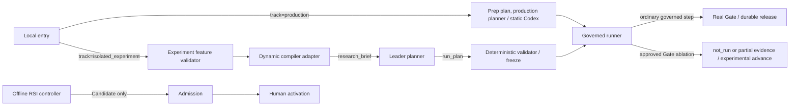

# M1 track boundaries

PRD: 1.3, 6.12, 5.6.5

> Answers: How is the isolated experimental track kept apart from production?

The [frozen](lifecycle.md#term-freeze) PRD sections 1.3 and 6.12 define three tracks. Phase 1 fixed research and required offline [RSI](../rsi.md#term-rsi) are release obligations; permitted Phase 2 experiments begin after their comparison baseline operates and do not alter production acceptance.

| Track | Entry and authority | Allowed work | Terminal evidence |
|---|---|---|---|
| production | ordinary run API; [prep plan](../types/run-plan.md#term-prep-plan) frozen at launch, [planned plan](../types/run-plan.md#term-planned-plan) frozen after requirements | bounded-loop intent (`intent.max_repairs`), one-pass requirement call, the fixed-template production planner with no model call ([planner](planner.md)), static Codex route, real runtime [Gates](../verification.md#term-gate) | report manifest or durable halt |
| offline_rsi | offline RSI session API, frozen target/referee profiles | permitted implementation mutation, protected evaluation, Candidate submission | attributable [attempts](lifecycle.md#term-attempt) and Candidate/admission; explicit activation separate |
| isolated_experiment | separate experimental entry, allowlisted feature profile | dynamic compiler, experimental Leader-agent planner ([planner](planner.md#experimental-leader-agent-planner-separate-track)), mocked/approved routing and alternate verifier, native Code Mode, preregistered component ablation | experimental manifest plus [deviations](../decisions.md#term-deviation) from production |

Only the isolated_experiment track has a planner-to-bridge edge, a planning scope, a planning reservation and model-proposed DAGs. Only there is `planner_request.planning_reservation_ref` a ref (and `experiment_config_ref` a ref); in M1 both are null and the no-reservation, no-planner-call rule applies in the experiment track alone. Every run freezes its track and enabled features in effective configuration; manifests expose both. Production rejects experimental flags with `TRACK_FEATURE_FORBIDDEN`. Separate run directories, plan/config pins and admission permissions prevent an experimental result becoming production state. An experimental request cannot mutate a production plan, the plan template or aliases. External model access starts mocked; a named endpoint access approval must be pinned before a real experimental call. Successful testing never promotes that route automatically.

## Key terms

| Term | Meaning |
|---|---|
| **Track** (also: tracks) | The label of an execution context: `production`, `offline_rsi` or `isolated_experiment`. It is pinned in the run configuration and labels every manifest and export. |

## Experimental interfaces

The [validator](planner.md#term-plan-validator) rejects disabling a capability with any required successor input or objective output. A permitted leaf disable records omission and cannot satisfy that output's objective. A replacement must preserve the original typed [ports](../capsule/fields.md#term-port) and be admitted/pinned in the study [snapshot](../capsule/library.md#term-library-snapshot). No inferred input substitution, synthetic output or mid-run replanning is permitted. Gate/semantic-control ablations may release real work output only through the explicit experimental evidence/advance path below.

The schema's conditional `ablation_study_ref` resolves a committed `ablation_study` object. Required fields are version1, study_id, production_baseline_ref, approved_by, reason, actions and evidence_requirements. Each action pins [step_id](records.md#term-step-id), component role, original hash, action disable/replace, replacement hash (required for replace, null for disable), and acceptance evidence references. Only capability, semantic_verifier and deterministic_gate roles are ablatable. Authentication, confinement, input/output schema validation, raw capture and storage integrity cannot be disabled. The validator [checks](../capsule/fields.md#term-check) every target belongs to the baseline and replacements preserve typed ports and custody. Empty/unknown/stale targets refuse before effects. Configuration pins the entire feature-profile hash, so the study ref is not duplicated as another mutable config key.

For an approved disabled Gate, the experimental entry commits an `experimental_gate_evidence` Artifact with state `not_run`, no Verdict, and the exact skipped check IDs. A partial ablation records state `partial` and the real [Verification](../schemas/verification-record.md#term-verification) reference for checks actually run; it never invents check results or runner hashes. The Gate remains the sole Verification writer. The entry then commits an `experimental_advance` Artifact containing version1, [run_id](records.md#term-run-id), step_id, attempt, observation_ref, nullable verification_ref, gate_evidence_ref, feature_profile_ref, study_ref and action_index. These closed schemas are owned by services-v1. This artifact is the isolated experiment's authorization to dispatch only its declared successor. It never satisfies `authorize_advance` or creates a production release [SystemRecord](records.md#term-systemrecord). `cc/experiments/entry.py` is the home of the track-specific advance operation; atomic publication and duplicate identities follow the same store/reservation rules. A failed evidence or advance write prevents dispatch. Exports carry experimental_advance_ref, represent release_ref as null with missing_records containing release, and include the actual evidence [Artifacts](../schemas/artifact.md#term-artifact) and configured deviation. Real-Gate [steps](nodes.md#term-step) retain normal release ordering. The deterministic validator rejects experimental advancement in any production plan. This gives permitted ablations executable control flow without fabricating Gate assurance.

[Services-v1 JSON Schema](../contracts/services-v1.schema.json) is the home of experiment_request and experiment_profile wire shapes. This page is the home of their behavior. Required version/request/reference fields, the exact allowed-feature enum and closed profile properties are validated before any model call.

`cc/experiments/entry.py` validates a closed experiment request `{version, task_ref, feature_profile_ref, request_id}` and uses the normal store/lifecycle. Feature profiles are developer-authored and limited to the whitelist. A profile enabling `component_ablation` must pin a preregistered study artifact with exact component hashes, approved disable/replace actions and expected evidence before execution. PRD 5.6.5 permits mandatory-control ablations, including Gate-off, only in this development/evaluation track. Record actual component states and every deviation; retain capture, identity, confinement and store-integrity controls. Such a run cannot satisfy production acceptance, issue production release authority or change capsule standing/activation. A disabled Gate produces an explicit `not_run` experimental record rather than a passing Verification. Unknown/unapproved ablations refuse before dispatch. Dynamic compiler outputs the canonical requirement output before plan proposal (exact type follows the accepted intent/requirement ports, `PENDING_SOURCE`, [decisions](../decisions.md#open)); its internal clarification returns `NEEDS_INPUT` to the entry and cannot dispatch partial work. Routing implements the existing [Model Routing seam](seams.md) within one capsule model call; it never selects [capsules](../capsule/capsule.md#term-capability-capsule). Alternate semantic verifiers preserve `verifier_assessment` and the Gate fold, changing only the explicitly experimental route. Code Mode [runs](lifecycle.md#term-run) under its native permission rails in a separate experimental worker; its generated program is not executable CC dispatch authority. Export raw native result/capture to the standard evidence store, validate output types, and apply ordinary Gates before subsequent governed [nodes](nodes.md#term-node). If native confinement/required capture cannot be supplied, return `EXPERIMENT_UNAVAILABLE`.

Isolation follows explicit environment/configuration separation used by [MLflow registered versions and aliases](https://mlflow.org/docs/latest/ml/model-registry/workflow/): availability and activation are different actions. Replace individual experiment [adapters](integration.md#term-adapter) without changing production interfaces. A production scope change requires a new frozen source/architecture release. Tests toggle every forbidden production flag, missing real-endpoint approval and wrong-track resume; each fails before a model/effectful call.
