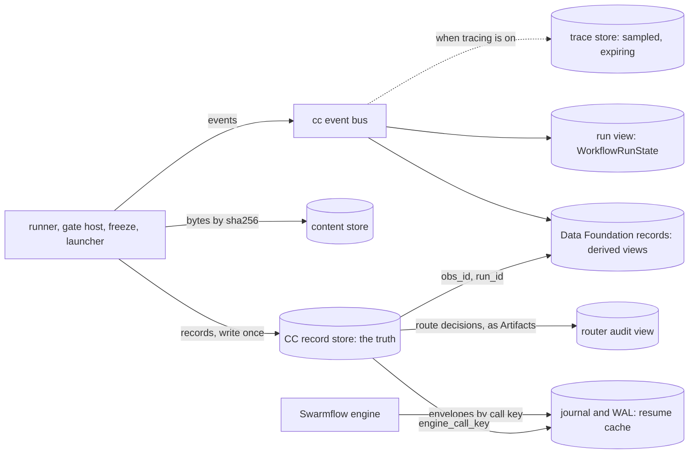

Every place a run leaves a lasting trace: who writes it, what it is for, and which one wins when they disagree.

# Ledgers

PRD: 2.10, 4.5.2, 4.5.3

> Answers: Which ledgers hold which facts, and who writes them?

A run writes canonical CC records and mandatory raw execution capture. The record store authorizes control; raw capture supplies the exact prompts/logs/process evidence those records reference. Derived views and caches are rebuildable from both retained sources. [Storage](storage.md) is the home of layout, durability, crash recovery and freeze semantics.

## The ledgers

| Ledger | Writer | Holds | Authoritative for | Kept | Joins to the records by |
|---|---|---|---|---|---|
| **CC record store** (M12) | one writer per record kind ([records table](../schemas/schemas.md#the-records)): the supervisor writes Artifacts and Observations (the runner returns them and the supervisor commits on its behalf), the gate host writes Verifications, freeze writes Bindings (twice per run: prep plan, planned plan), admission writes Verdicts, Standing, test cases and suites | every capsule call, value, pin, gate decision and admission | **what ran, on which exact code, with what inputs, outputs, cost and decision** | forever; write once (INV-2) | it is the records |
| **Content store** (`cc/content/<sha256>`) | admission (code, schemas), the runner (Artifact bytes, [model turns](model-bridge.md#term-model-turn)) | bytes, keyed by their hash | the bytes behind every hash | forever | `content_sha256`, file `sha256`, `ext.runner.turns[]` |
| **Swarmflow journal and WAL** | the engine | each `agent()` call's envelope, by call key | nothing: a resume cache | the run's journal file | Observation `ext.runner.engine_call_key` |
| **Run view** (`WorkflowRunState`, `workflow.updated`) | the progress sink | node states for the browser | nothing: what the user sees now | the session | `step_id`, `obs_id` in each event |
| **Data Foundation views** | assembler | records.jsonl, scorecards, exports | derived views rebuilt from records plus retained raw capture | local manual retention | obs_id, run_id |
| **Required execution bundles** | collector through acknowledged capture API | full model/tool/process/security evidence, immutable manifest | raw evidence behind committed refs; not reconstructable if lost | retained with run; manual deletion invalidates dependent refs | Observation.ext.runner.execution_evidence |
| **Router audit view** | Model Routing's builder, from the route Artifacts the runner stores | each routing decision, by `route_id`: candidates, choice, reasons, catalog version | nothing in CC: a view, rebuildable from the records | the router's rule | `ext.runner.turns[].route_record_id` |
| **Trace store** | agent-core observability, when on | spans | nothing: debugging only | sampled; 7 days by default | `openjiuwen.run.id` = `run_id`, span attribute `cc.obs_id` |

## Rules

1. **For node release, the committed CC [Gate](../verification.md#term-gate) record wins.** A corrupt/missing referenced raw bundle [blocks](modules.md#term-block) authorization rather than being replaced with a cache.
2. **Each fact has one writer.** No ledger copies a fact another one holds. [Data Foundation](storage.md#term-data-foundation)'s records, for example, point at [Observations](../schemas/observation.md#term-observation); they do not restate them (INV-3, INV-5).
3. **Nothing required lives only in a cache.** Journal/index/optional spans may expire; canonical records and acknowledged raw capture remain available. Mandatory raw capture cannot be silently dropped.
4. **Every ledger joins to the records by an id the records already carry.** No ledger needs a new id to be understood.
