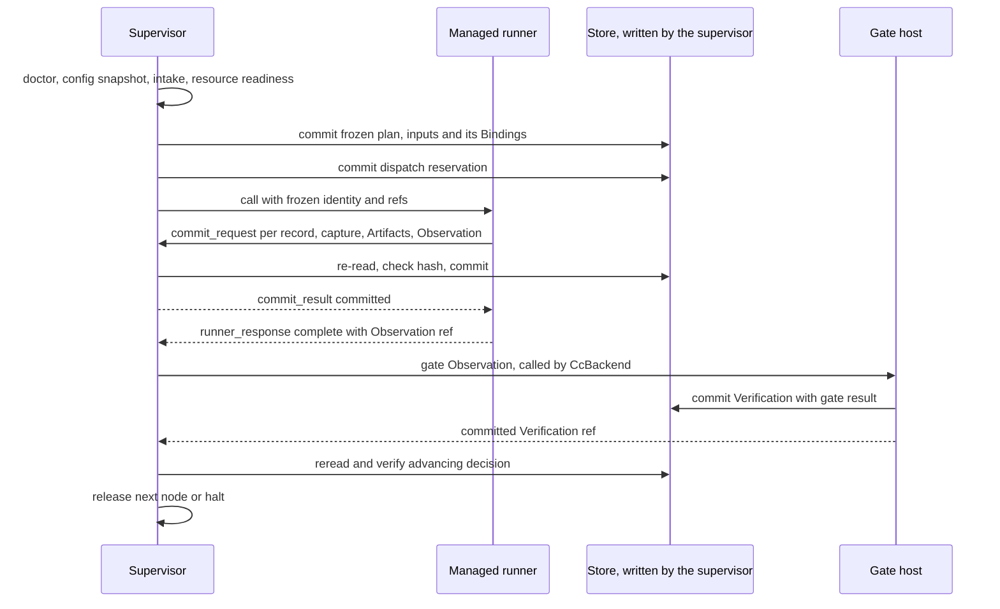

# Run lifecycle, Gate locking and explicit recovery

PRD: 4.6.1, 4.6.4, 4.2.8

> Answers: How does a run start, freeze, recover and halt?

## Purpose

*Kubernetes parallel ([k8s-lens](../k8s-lens.md)): the supervisor is a controller. On start or resume it reads committed state and takes the next step. [Declaration](../capsule/fields.md#term-declaration) and [Binding](../schemas/binding.md#term-binding) are spec. [Observation](../schemas/observation.md#term-observation), [Verification](../schemas/verification-record.md#term-verification) and release are status.*

The trusted supervisor decides node release. A model, tool, UI, event subscriber or cached journal result cannot release a node. This page is the home of execution/recovery sequencing; [runner](../capsule/runner.md) is the home of the call pipeline and [runner handlers](../capsule/runner-handlers.md) and [runner broker](../capsule/runner-broker.md) of the handler and broker semantics, and [gate host](../capsule/gate-host.md) is the home of evaluation. The flow itself is defined in [flow](../flow.md); failure outcomes in [runtime](../runtime.md).

## Key terms

| Term | Meaning |
|---|---|
| **Run** (also: runs) | One execution of a research request from launch to delivery or halt, named by its `run_id`. A changed plan, input, config, capsule version or rubric needs a new run. |
| **Phase** (also: phases) | One of the two plan stages of a run: `prep` (intent and requirement steps) or `planned` (the planner's task nodes). Each phase is frozen before it starts and recorded by one `run_phase_started` record. |
| **Prep plan** (also: fixed prep plan) | The fixed list of preparation steps (intent, then requirement) with their Bindings and Gate profiles. It is published at freeze 1, at launch. |
| **Planned plan** | The validated and bound DAG of task nodes the planner emitted. It is published at freeze 2, after the last requirement release and before any task node is dispatched. |
| **Freeze** (also: freezes, frozen) | Publishing one phase's plan and Bindings as one atomic batch so nothing changes afterwards. A run has two freeze points: the prep plan at launch and the planned plan after requirements. |
| **Release** (also: released, releases) | The committed record that lets a node's successors run. It exists only after a committed advancing Verification, and only the supervisor writes it. |
| **Halt** (also: halted, halts) | A failed Gate, failed commit, timeout or denied effect stops all further dispatch for the run, siblings included. The evidence is kept and nothing retries on its own. |
| **Resume** (also: cc resume) | A human command that continues the same frozen run after review. It writes a `human_review` record and starts a new attempt of the interrupted step under unchanged pins. |
| **Attempt** (also: attempts) | One try at executing a step, numbered from 1. A new attempt exists only after explicit human review, never from an automatic retry. |
| **Supervisor** | The trusted process that freezes plans, reserves dispatches, calls the runner and the Gate host, commits records and releases nodes. It is the only writer of the store and runs no capsule code. |
| **human_session** | The native agent-core session that the halt host opens (through `cc.adapters.local_session`) so a person can review a halt and reply. The reply is stored as `human_review` evidence. |
| **Headless** | Configuration `cc.execution.headless`, default false. When true a halt sets `abort_event` at once, opens no `human_session`, reads no stdin and the command exits with code 3. |
| **CcHalt** | The exception the generic plan script raises when a step halts. It derives from `BaseException` so the native `parallel()` and `pipeline()` cannot swallow it. |
| **abort_event** | The SwarmFlow engine flag that stops all further turns once set. A halt sets it after the triage session closes, or immediately when headless. |
| **halt_report** | The record the supervisor writes when a run halts, giving the failing step, the exact evidence, the reason and the permitted human action. After a crash it carries reason `INTERRUPTED`. |

## Phases and the two freeze points (decision A26)

One [library snapshot](../capsule/library.md#term-library-snapshot) is pinned per run at launch. Every dispatch uses it.

| Phase | What runs | Frozen before it starts | Same path for every call |
|---|---|---|---|
| 0. Launch | doctor, config snapshot, intake, [resource snapshot](../types/resource-snapshot.md#term-resource-snapshot), library snapshot pin | n/a | n/a |
| 1. Preparation | intent call (`research.compile_intent`, a bounded loop) then the one requirement call (`research.compile_brief`, one model pass), each followed immediately by its [Gate](../verification.md#term-gate) | **freeze 1: [prep plan](../types/run-plan.md#term-prep-plan)** (the preparation [nodes](nodes.md#term-node), their Bindings and Gate profiles), published at launch | reserve, runner call, commit Observation, Gate, commit Verification, commit release |
| 2. Planning | planner service emits the fixed template DAG from accepted requirements and the pinned snapshot; the supervisor calls the [validator](planner.md#term-plan-validator), then the binder, which pins CC versions and Gates | **freeze 2: [planned plan](../types/run-plan.md#term-planned-plan)**, published after the last requirement release and before any task node is [dispatched](records.md#term-dispatch) | the M1 planner makes no model call and writes no planning reservation; not a CC call, no Gate. The planning reservation and the model-proposed DAG exist only in the isolated experiment track |
| 3. Execution | task nodes, each followed immediately by its Gate | both plans | same path as phase 1 |
| 4. Delivery | ordinary code on accepted terminal outputs | n/a | n/a |

- Freeze 1 uses the same Binding and batch-publication rules as freeze 2. Neither is ever partially visible.
- Each freeze is recorded by one `run_phase_started` [SystemRecord](records.md#term-systemrecord): phase `prep` at launch (intent step, then requirement step; library snapshot pinned) and phase `planned` after the last requirement release (planner DAG validated, bound, frozen). The planned record carries `prep_release_refs` and the same `library_snapshot_sha256` and `effective_config_ref`. Schema: `execution-v1.schema.json#run_phase_started`.
- The supervisor starts the generic [SwarmFlow](integration.md#term-swarmflow) script once per phase. The second start, for the planned phase, passes `plan_ref` and `pins_ref` of the planned plan plus the prep release refs, so `prep.<step_id>.<port>` sources resolve only to released prep outputs. Schema: `execution-v1.schema.json#workflow_start_args`.
- Freeze 2 may not change the library snapshot, config, policy or the prep plan. It adds Bindings only for task nodes.
- The intent step is a bounded loop: compile, validate, nested review, repair. Policy key `intent.max_repairs` has default 1 and hard cap 4 ([policy](../schemas/policy.md)). The requirement call is one model pass. The nested verifier review inside `research.compile_intent` is validated by the calling [capsule](../capsule/capsule.md#term-capability-capsule) and is not itself Gated.
- Prep nodes are ordinary [steps](nodes.md#term-step) of the run. They appear in the run manifest like task nodes, marked by phase.
- An invalid planned plan (validation failure) means zero planned-node dispatch. The run halts after phase 1 evidence is kept.
- Any failed Gate in any phase halts the whole run, including sibling branches. Zero autonomous retries.
- The planner's own input is only released requirement outputs. It cannot read an unreleased or failed preparation result.
- The Gate profiles of the intent and requirement call sites are on [intent Gate](../capabilities/intent-gate.md) and [requirement Gate](../capabilities/brief-gate.md); the planner request is `services-v1.schema.json#planner_request` ([planner](planner.md)).

## Interface: public commands and identities

Advancement uses the authority selected by the frozen track/profile: production and ordinary governed steps require a committed release following real Verification; preregistered isolated ablations require the committed experimental_advance and gate-evidence [Artifacts](../schemas/artifact.md#term-artifact) defined in [experiments](experiments.md). The dispatcher cannot select authority from a model response. Replay [checks](../capsule/fields.md#term-check) the same exact Observation/attempt/profile/study evidence. Missing or failed publication prevents a successor in either track.

`launch(prompt, channel, workspace) -> run_id` creates a new run; two independent submissions create two runs. `resume(run_id, human_review_ref) -> run_id` continues the same frozen run after an attributable terminal review; on the command line it is `cc resume <run_id>`, run by a human, and it writes the `human_review_record` (action `resume_after_fix`) and starts a new attempt of the interrupted step under unchanged pins. `freeze(run_id, validation_ref, policy_ref, vocabulary_ref, request_id)` (`execution-v1.schema.json#freeze_request`) publishes one phase and takes the caller's `request_id`; the policy and vocabulary refs are `{id, sha256}` with the epoch or version name as id. `record_input` is a supervisor-side control function that writes the launcher inputs and intake; it is not a runner operation. `abort(run_id, human_review_ref) -> None` leaves its evidence intact; `human_review_ref` is required for a halted run and may be omitted for a running run.

Schema: `execution-v1.schema.json#launch_request`, `execution-v1.schema.json#launch_result`, `execution-v1.schema.json#resume_request`, `execution-v1.schema.json#abort_request_run`. The benchmark-side `abort_request` stays `services-v1.schema.json#abort_request`. A changed plan, input, config, capsule version or policy requires a new run. Automatic retries, rewinds and mid-run reconfiguration are excluded.

The supervisor acquires one local run lock before startup/resume. `dispatch_id` is an `id` (not a sha256) derived deterministically from the canonical tuple `(run_id, step_id, binding_sha256, input_content_hashes, attempt)`; the same tuple always gives the same id. It chooses the attempt and `obs_id` before sending any request and durably logs the start. Duplicate transport frames with this same identity attach to the in-flight call or return its committed terminal result. A changed request under the same identity is `REQUEST_CONFLICT`. A second engine call is not permission to perform effects again.

`RunnerRequest` is `{request_id: id, protocol_version: 1, operation: call|cancel|status, dispatch_id, obs_id, attempt, reservation_ref: SystemRef, call_descriptor}`; only `call` includes the descriptor, whose schema is `execution-v1.schema.json#call_descriptor`. `RunnerResponse` is `{request_id, protocol_version: 1, state: running|complete|cancelled|denied|unavailable, observation_ref: Ref(Observation)?, reason: Reason?}`. A complete response requires a durable Observation; denied and unavailable require a reason. A gate, nested or admission call carries no `caller` in `runner_request`: the caller [kind](../capsule/capsule.md#term-capsule-kind), parent observation and ordinal come from the [dispatch reservation](records.md#term-reservation) that `reservation_ref` names. Frames are length-prefixed: a 4-byte big-endian length, then UTF-8 JSON, at most `cc.ipc.max_frame_bytes` (default 1 MiB), with large values by reference; a larger frame closes the channel. The supervisor establishes the authenticated local channel ([same rules as the model bridge channel](model-bridge.md#behavior-one-turn)), authorizes a run at connection setup, and rejects another run's descriptor. Cancellation addresses the existing request and kills/reaps its entire process tree; it cannot start work.

Schema: `execution-v1.schema.json#runner_request`, `execution-v1.schema.json#runner_response`. The runner process stages its Observation, Artifacts and capture and asks the supervisor to commit each record (`execution-v1.schema.json#commit_request`, answered by `execution-v1.schema.json#commit_result`); the supervisor is the only store writer, and `runner_response` complete means the supervisor committed the Observation. The Gate step that follows is called by the supervisor-side `CcBackend` (`gate(obs_ref) -> GateResult`), not by the runner: runner commit, then Gate, then release. Schema: `execution-v1.schema.json#gate_request` and `execution-v1.schema.json#gate_result`.

## Behavior: startup and one step

The sequence below shows one governed step. Preparation steps and task nodes use it identically; before the first task node, the planner, validator and freeze 2 run as described in [planner](planner.md).

The supervisor alone writes the store: the runner returns what it built and the supervisor commits it on its behalf. Startup requires readable inputs, admitted capsule/gate/dependency closure, available model endpoint, correct configuration/policy/vocabulary, supported confinement profile and passed negative security [probes](environment.md#term-probe). Each freeze publishes its Bindings in one [batch](storage.md#term-commit-batch). The engine never sees a partially frozen plan. Progress uses Pending, Running, Evaluating, Completed or Failed/Halted; lifecycle transitions are durable append-only supervisor records, keyed by run/step/attempt.

Before advancing, `authorize_advance(run_id, step_id, observation_ref, verification_ref) -> None` verifies committed bytes and hashes; Observation caller/scope, Binding, output provenance and required evidence; Verification invocation; and `routing_action: ADVANCE` with `gate_verdict` PASS or PASS_WITH_KNOWN_LIMITATIONS. It also checks the frozen plan's predecessor and records the release. Cached engine envelopes must pass the same check. Missing, stale or corrupt authorization [blocks](modules.md#term-block); PASS in memory or a UI event never suffices. The helper is in the supervisor adapter and performs no domain grading.

If a Gate save fails, the Gate returns no success. R1 returns a non-success/skipped result, the generic script halts, and the supervisor records an infrastructure incident if storage permits. An older Verification from a previous attempt cannot authorize the new one. Repeated `gate(obs_ref)` uses a deterministic Verification identity and returns the existing committed decision after checking it; differing results at the same identity are a conflict, not another mutable decision.

## Failure: human review and recovery

Every halt keeps its evidence. The table gives, per interrupted position, the outcome and the explicit recovery action; no failure is retried automatically.

The halt host reports the failing step, exact Observation/Verification, `reason_owner`, known durable evidence and permitted action. It invokes native `human_session` through `cc.adapters.local_session`; the adapter holds whatever native terminal/team context is required. Its reply is stored as append-only human review evidence `{run_id, step_id, attempt, action: abort|resume_after_fix|new_run, reviewed_refs, response_text, at}`. Only an explicit authenticated terminal action can request recovery. A crash or kill never resumes by itself: on restart the supervisor writes a `halt_report` with reason `INTERRUPTED` and waits. `cc resume <run_id>`, run by a human, creates the `human_review_record` (action `resume_after_fix`) and a new attempt of the interrupted step under unchanged pins. Test-only seam: the config key `cc.test.review_injection` names a pre-recorded review file that stands in for the human reply; the production profile refuses it. A disconnected/noninteractive terminal leaves the run halted and exposes the review requirement through CLI/Web/TUI. Reading a report is not recorded approval.

The pinned native API was verified at agent-core `9e339019`, `openjiuwen/agent_teams/workflow/engine/primitives.py` (`AgentSession._drive`, `_turn`, `_ensure_open`, `human_session`) and `engine/backends/base.py` (`open_session`, `send_turn`, `close_session`, `aclose`). The generic plan script catches the halt inside the workflow context and opens `human_session(label=step_id, phase="triage")` before unwinding. `CcHalt` derives from `BaseException` and sets the engine's `abort_event` (native `parallel()` and `pipeline()` [turn](model-bridge.md#term-model-turn) `Exception` into `None`, `primitives.py:1463`, `:1514`); because the engine refuses new turns once abort is set (`primitives.py:1153`), the script sets `abort_event` after the triage session closes, or at once when headless. The web and TUI controls reuse the native names pause, resume and stop (`swarmflow.pause`, `swarmflow.resume`, `swarmflow.stop` in the jiuwenswarm ws server) for a CC run; stop and abort keep committed evidence, and the engine journal is not durable authority (flush without fsync; an aborted in-flight call is unjournaled), so resume goes through the supervisor's reservation reuse. Resume supports kind=human with the local-session adapter: open binds an authenticated controlling terminal; send_turn reads one explicit reply and returns BackendResult.structured in the requested review schema, with zero model tokens; missing terminal/no reply yields skipped. close/aclose releases handles. Agent-kind sessions remain unsupported because CC skills use the runner. Store the review before permitting a later resume command. Schema of the stored review: `execution-v1.schema.json#human_review_record`; schema of the halt report shown to the reviewer: `execution-v1.schema.json#halt_report`. Native terminal integration still requires runtime validation; a handwritten replacement prompt is not substituted.

| Interrupted position | Explicit resume action |
|---|---|
| before freeze 1 published | nothing committed; start again with `launch` (new run) |
| after freeze 1, during preparation | resume under the frozen prep plan, using the rows below per step |
| requirement released, planner not yet run or interrupted | the M1 planner makes no model call and has no reservation: `cc resume` runs it again from the same snapshot. Experiment track only: reuse the planning reservation, never issue a second paid call silently; explicit human review allows a new planning attempt under the same pins |
| proposal committed, freeze 2 absent | revalidate the committed proposal against the same pinned snapshot and publish freeze 2; never re-plan |
| freeze 2 published, no task node dispatched | dispatch from the frozen planned plan |
| before dispatch committed | validate frozen inputs and dispatch the pending step |
| work complete and Observation committed; decision absent | run Gate on that Observation only |
| advancing Verification committed; journal reply absent | validate authorization and continue without executing work or judge again |
| environment failure with non-success Observation | human-approved new attempt of that step using unchanged pins |
| model auth lost (`AUTH_RELOGIN_REQUIRED`) or model unavailable | the run halts as `ENVIRONMENT_BLOCKED`; after login, a human `cc resume` (`resume_after_fix`) starts a new attempt of that step under the same pins; the possibly paid turn is never resubmitted without that command |
| runner or supervisor crashed or was killed | `halt_report` reason `INTERRUPTED`; `cc resume <run_id>` by a human starts a new attempt of the interrupted step under unchanged pins |
| process died with potentially partial effects | inspect/clean disposable attempt workspace and record human review before a new attempt |
| artifact/gate correctness failure | preserve failed run; use new run for changed implementation/input |

Timeouts are enforced by the runner for capsule calls, the [bridge](model-bridge.md#term-model-bridge) for each turn, and the process service for POC requests; the supervisor also kills an unresponsive runner at its outer deadline. The first deadline wins, cancellation propagates to children, and evidence identifies which clock expired. No automatic rerun follows a timeout. Global budget and nested-turn time are included in the caller's remaining deadline.

## Operation classes, duplicates and retries

Each Binding pins the canonical services-v1 [RetryProfile](../schemas/profiles.md#term-retryprofile). Its M1 max_execution_retries is zero for every Declaration [effect class](../capsule/fields.md#term-effect-class), including pure/read_only operations. Effect-class names remain the Declaration vocabulary ([idempotent](../contracts/principles.md#term-idempotency) is not renamed idempotent_effect). A duplicate transport request attaches to the reserved operation or returns committed evidence; it is not an execution retry. A missing response never authorizes another model, helper or effectful execution. Only explicit attributable recovery can reserve a new execution attempt. A later policy supporting bounded autonomous retries requires a new profile revision and affected boundary rechecks.

The canonical request hash covers run, step, attempt, declaration, profiles and input refs. A duplicate request id with the same hash returns the current state or committed result; different bytes return `REQUEST_CONFLICT`. Human-approved restart retains run and step identity and reserves a new attempt. These rules borrow Temporal's separation of durable workflow state and fallible activities without adopting its default unlimited activity retry behavior ([workflow execution](https://docs.temporal.io/workflow-execution), [retry policies](https://docs.temporal.io/encyclopedia/retry-policies)).

## Tests: verification surface

Rows in [test surfaces](test-surfaces.md#verification-table): [V11](test-surfaces.md#verification-table), [V17](test-surfaces.md#verification-table), [V18](test-surfaces.md#verification-table), [V33](test-surfaces.md#verification-table), [V35](test-surfaces.md#verification-table) (launcher: rejection, headless halt exit 3, resume with review, abort), [V36](test-surfaces.md#verification-table) (interrupted planner call, freeze rows), [V37](test-surfaces.md#verification-table) (auth loss), [V41](test-surfaces.md#verification-table) (crash then resume with the test review injection), [V42](test-surfaces.md#verification-table) (abort mid-call).

Invoke launch, call, gate, authorize_advance, resume and abort separately with fake dependencies. Required injection points are after output publication, before/after Observation commit, before/after Verification commit, before engine journal update, cancellation and child termination. [Verification](test-surfaces.md) defines observable outcomes; transport timeouts and process death cannot bypass durable authorization.

Durable transition, review, dispatch, release and the two plan-freeze records (`run_phase_started`, phases prep and planned) are defined in [system records](records.md), using put_system rather than an unregistered CC record kind. Schema: `execution-v1.schema.json#system_record`, `execution-v1.schema.json#system_record_lifecycle`, `execution-v1.schema.json#dispatch_reservation`, `execution-v1.schema.json#release_record`. A returned Gate decision is followed by a committed release record; engine journal/cache recovery always rereads and validates that release and its exact CC refs.

## Headless halt

`cc.execution.headless` is a boolean, default false, pinned in effective run configuration. When true, a halt sets `abort_event` at once, publishes the same verdict/evidence and human-review requirement (a `halt_report`), opens no human_session, reads no stdin, and exits with code 3. The CLI exit codes are only 0 success, 2 launch or configuration rejected, 3 halted, 4 environment unavailable; no other code exists. A user cancellation of a waiting `decide` prompt (Ctrl-C) is a halt, not a new outcome: the run stays halted with its evidence and the CLI exits 3 ([workstation](workstation.md#interface-cli-and-public-run-api)); HTTP status codes of the run API are separate from these exit codes. Headless never changes Gate policy, timeout, release authority or acceptance. Explicit resume remains a separate authenticated [operator](../capabilities/README.md#term-operator) command. This supports PRD 5.3.1 headless invocation and 5.6.5 frozen development/evaluation configuration and the benchmark client boundary. It is a public execution mode.
