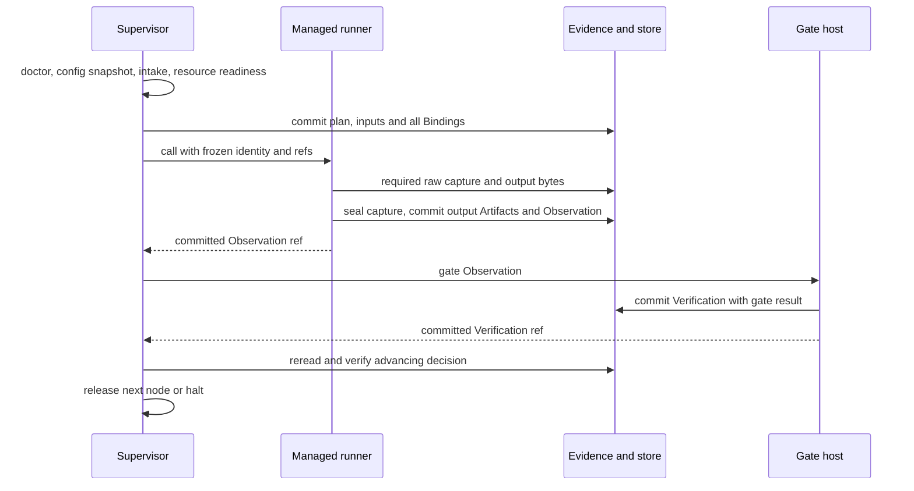

# Run lifecycle, Gate locking and explicit recovery

The trusted supervisor owns node release. A model, tool, UI, event subscriber or cached journal result cannot release a node. This page owns execution/recovery sequencing; [runner](../capsule/runner.md) owns the call and handler semantics, and [gate host](../capsule/gate-host.md) owns evaluation.

## Public commands and identities

`launch(prompt, channel, workspace) -> run_id` creates a new run; two independent submissions create two runs. `resume(run_id, human_review_ref) -> run_id` continues the same frozen run after an attributable terminal review. `abort(run_id, human_review_ref) -> None` leaves its evidence intact. A changed plan, input, config, capsule version or rubric requires a new run. Automatic retries, rewinds and mid-run reconfiguration are excluded.

The supervisor acquires one local run lock before startup/resume. `dispatch_id` is the canonical tuple `(run_id, step_id, binding_sha256, input_content_hashes, attempt)`. It chooses the attempt and `obs_id` before sending any request and durably logs the start. Duplicate transport frames with this same identity attach to the in-flight call or return its committed terminal result. A changed request under the same identity is `REQUEST_CONFLICT`. A second engine call is not permission to perform effects again.

`RunnerRequest` is `{request_id: id, protocol_version: 1, operation: call|cancel|status, dispatch_id, obs_id, attempt, reservation_ref: SystemRef, call_descriptor}`; only `call` includes the descriptor, whose schema is owned by the runner. `RunnerResponse` is `{request_id, state: running|complete|cancelled|denied|unavailable, observation_ref: Ref(Observation)?, reason: Reason?}`. A complete response requires a durable Observation. Frames use bounded UTF-8 JSON with a 4-byte big-endian length prefix and reject frames above configured `ipc.max_frame_bytes`. The supervisor establishes the [authenticated local channel](environment.md#model-bridge), authorizes a run at connection setup, and rejects another run's descriptor. Cancellation addresses the existing request and kills/reaps its entire process tree; it cannot start work.

## Startup and one step

Startup requires readable inputs, admitted capsule/gate/dependency closure, available model endpoint, correct configuration/policy/vocabulary, supported confinement profile and passed negative security probes. Freeze publishes all Bindings in one batch. The engine never sees a partially frozen run. Progress uses Pending, Running, Evaluating, Completed or Failed/Halted; lifecycle transitions are durable append-only supervisor records, keyed by run/step/attempt.

Before advancing, `authorize_advance(run_id, step_id, observation_ref, verification_ref) -> None` verifies committed bytes and hashes; Observation caller/scope, Binding, output provenance and required evidence; Verification invocation; and `routing_action: ADVANCE` with `gate_verdict` PASS or PASS_WITH_KNOWN_LIMITATIONS. It also checks the frozen plan's predecessor and records the release. Cached engine envelopes must pass the same check. Missing, stale or corrupt authorization blocks; PASS in memory or a UI event never suffices. The helper is in the supervisor adapter and performs no domain grading.

If a Gate save fails, the Gate returns no success. R1 returns a non-success/skipped result, the generic script halts, and the supervisor records an infrastructure incident if storage permits. An older Verification from a previous attempt cannot authorize the new one. Repeated `gate(obs_ref)` uses a deterministic Verification identity and returns the existing committed decision after checking it; differing results at the same identity are a conflict, not another mutable decision.

## Human review and recovery

The halt host reports the failing step, exact Observation/Verification, reason owner, known durable evidence and permitted action. It invokes native `human_session` through `cc.adapters.local_session`; the adapter owns whatever native terminal/team context is required. Its reply is stored as append-only human review evidence `{run_id, step_id, attempt, action: abort|resume_after_fix|new_run, reviewed_refs, response_text, at}`. Only an explicit authenticated terminal action can request recovery. A disconnected/noninteractive terminal leaves the run halted and exposes the review requirement through CLI/Web/TUI. Reading a report is not recorded approval.

The pinned native API was verified at agent-core `9e339019`, `openjiuwen/agent_teams/workflow/engine/primitives.py` (`AgentSession._drive`, `_turn`, `_ensure_open`, `human_session`) and `engine/backends/base.py` (`open_session`, `send_turn`, `close_session`, `aclose`). The generic plan script catches the halt inside the workflow context and opens `human_session(label=step_id, phase="triage")` before unwinding. CcBackend supports kind=human with the local-session adapter: open binds an authenticated controlling terminal; send_turn reads one explicit reply and returns BackendResult.structured in the requested review schema, with zero model tokens; missing terminal/no reply yields skipped. close/aclose releases handles. Agent-kind sessions remain unsupported because CC skills use the runner. Store the review before permitting a later resume command. Native terminal integration still requires runtime validation; a handwritten replacement prompt is not substituted.

| Interrupted position | Explicit resume action |
|---|---|
| before dispatch committed | validate frozen inputs and dispatch the pending step |
| work complete and Observation committed; decision absent | run Gate on that Observation only |
| advancing Verification committed; journal reply absent | validate authorization and continue without executing work or judge again |
| environment failure with non-success Observation | human-approved new attempt of that step using unchanged pins |
| process died with potentially partial effects | inspect/clean disposable attempt workspace and record human review before a new attempt |
| artifact/gate correctness failure | preserve failed run; use new run for changed implementation/input |

Timeout is owned by the runner for capsule calls, model bridge for each turn, and process service for POC requests; the supervisor also kills an unresponsive runner at its outer deadline. The first deadline wins, cancellation propagates to children, and evidence identifies which clock expired. No automatic rerun follows a timeout. Global budget and nested-turn time are included in the caller's remaining deadline.

## Operation classes, duplicates and retries

Each Binding pins a RetryProfile and the operation class derived from the Declaration: `pure`, `read_only`, `idempotent_effect`, or `nonrepeatable_effect`. Pure/read-only operations may use only the profile's finite retry count. An idempotent effect additionally reuses the stored result for the same request id. Model calls and nonrepeatable effects have one attempt in M1. A timeout never silently creates another attempt.

The canonical request hash covers run, step, attempt, declaration, profiles and input refs. A duplicate request id with the same hash returns the current state or committed result; different bytes return `REQUEST_CONFLICT`. Human-approved restart retains run and step identity and reserves a new attempt. These rules borrow Temporal's separation of durable workflow state and fallible activities without adopting its default unlimited activity retry behavior ([workflow execution](https://docs.temporal.io/workflow-execution), [retry policies](https://docs.temporal.io/encyclopedia/retry-policies)).

## Verification surface

Invoke launch, call, gate, authorize_advance, resume and abort separately with fake dependencies. Required injection points are after output publication, before/after Observation commit, before/after Verification commit, before engine journal update, cancellation and child termination. [Verification](verification.md) defines observable outcomes; transport timeouts and process death cannot bypass durable authorization.

Durable transition, review, dispatch and release shapes are owned by [system records](records.md), using put_system rather than an unregistered CC record kind. A returned Gate decision is followed by a committed release record; engine journal/cache recovery always rereads and validates that release and its exact CC refs.

## Proposed: headless halt (development only, 2026-10-02)

A benchmark harness runs hundreds of tasks unattended. A `headless` flag makes the halt host write the same halt record and review requirement it writes today, then skip opening `human_session` and exit with code 3. The gate still decides, resume stays terminal-only, and the flag is pinned in the run's configuration snapshot so a product run can never silently become headless. Not in the product roadmap; not adopted. Detail and the open points: [proposal](../m1/capsule-inventory-proposal.md#benchmark-harness-requests-headless-entry-and-config-assembled-components).
