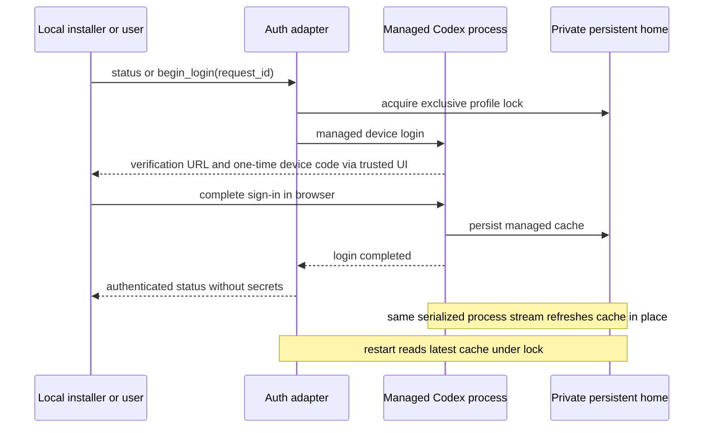

# Model authentication and replaceable endpoint adapters

PRD: 3.0.1, 3.0.2, 5.6.1

> Answers: How are model credentials held and the endpoint adapter replaced?

## Purpose

## Decision and source evidence

Use a dedicated persistent named POSIX volume for the application's `CODEX_HOME`, used only by the protected [model bridge](model-bridge.md#term-model-bridge). Perform a separate container login. Desktop Codex keeps its own profile. One serialized app-server stream holds this volume; application restart reuses it. No watcher or per-run credential copying is needed.

Official [authentication guidance](https://learn.chatgpt.com/docs/auth) documents file-backed `CODEX_HOME/auth.json`, automatic refresh and headless device login. The [account-auth automation guide](https://learn.chatgpt.com/docs/auth/ci-cd-auth) recommends persistent `CODEX_HOME`, keeping refreshed credentials, and one serialized stream per auth cache. It identifies concurrent rotation and stale restoration as failure causes. We do not assume every refresh token has a universal single-use rule. This design avoids copying a live session between writers regardless of that detail. These pages were checked October 3; runtime behavior must be verified against the image's pinned Codex binary, not inferred from current docs.

| Option | Choice and reason |
|---|---|
| Dedicated writable volume with separate login | Adopt: Codex updates its own cache and later starts read the latest bytes; no synchronization protocol |
| Copy desktop auth into each run then copy back | Reject: two writers can rotate or overwrite one session, desktop profile becomes coupled to app crashes |
| Watch auth.json and propagate replacements | Reject: misses or partial/racing writes require a second protocol and expose credential bytes to more code |
| Direct account client `OpenAIAccountModelClient` (agent-core `openjiuwen/core/foundation/llm/model_clients/openai_account_model_client.py:49` at the pin): a ChatGPT-account client with no app-server child | Contingency only, not chosen in M1: use it if the Codex app-server path [blocks](modules.md#term-block) us. It must run with zero retries and still pass the capture, cancellation and identity rules of the bridge; the dedicated-profile custody above is unchanged ([reuse](../reuse.md)) |

An initial import is permitted only from a dedicated temporary login profile that has been stopped and handed over exclusively. Import seeds an empty destination once using a trusted installer; it never reads the personal desktop profile or overwrites an existing refreshed cache. This is the same custody rule as direct login, not a different runtime authentication mode.

## Placement and custody

`cc/adapters/model_bridge.py` is the home of model calls (see [model bridge](model-bridge.md)). New `cc/adapters/codex_auth.py` implements the `AuthProvider` below; `cc/model_auth.py` exposes normalized management operations to the authenticated local installer/terminal only. Existing source at `jiuwenswarm/server/runtime/codex_subscription/transport.py` has a dedicated home, file-based credentials and `_claim_profile` locking; `service.py` has account read/start/cancel/completed/logout [adapters](integration.md#term-adapter). Reuse these mechanisms through an adapter; device-flow support and cross-container locking require additions. Exact release source pins remain in [integration](integration.md).

Mount the whole home directory at `/var/lib/jiuwenswarm/model/codex-home`, not a single auth.json file, so Codex may replace files atomically. Directory mode 0700 and auth files 0600; exclude credential home, login diagnostics and sessions from Git, backups/exports accessible to research, and all workload mounts. Supervisor passes authorized [turn](model-bridge.md#term-model-turn) descriptors to the bridge; neither supervisor payloads nor [capsules](../capsule/capsule.md#term-capability-capsule) receive credential values. The bridge may write its home, use approved model/auth networking and read the fixed transport workspace; it gets no oracle answers, unrestricted project write access, Docker socket or host home.

A nonblocking POSIX advisory lock on the persistent volume is held for the entire managed app-server or login process lifetime. A second app instance/maintenance login returns AUTH_PROFILE_IN_USE before using the cache. OS [releases](lifecycle.md#term-release) the lock on death; a PID file alone is insufficient. Bootstrap metadata records the profile instance and intended local account/workspace only, never tokens. A stopped volume may be moved to a replacement application instance with exclusive custody. Multi-container scaling and credential replication remain out of M1.

## Interface: canonical management interface

Messages of this module.

- **Manage the Codex login** (call, installer -> auth provider). Schema: [`services-v1.schema.json#auth_request`](../contracts/services-v1.schema.json).
- **Login status answer** (call, auth provider -> installer). Schema: [`services-v1.schema.json#auth_result`](../contracts/services-v1.schema.json).

The effective configuration pins cc.model.auth_provider and auth_profile_id. Requests must match that approved profile; arbitrary profile IDs or filesystem paths return INVALID_REFERENCE before provider access. A provider/config change takes effect only after explicit idle service restart; a [frozen](lifecycle.md#term-freeze) active run cannot switch account/endpoint automatically.

[Services-v1](../contracts/services-v1.schema.json) is the home of `auth_request` and `auth_result`. These are trusted local-management objects, not benchmark endpoints. `AuthProvider.manage(request) -> result` supports status, begin_login, cancel_login and logout. A selected provider implements this interface; opaque profile/login identifiers belong to that provider. No generic API exposes refresh tokens or the provider's credential file shape.

Status returns authenticated, login_required, pending, unavailable or profile_in_use, with a safe diagnostic reason and optional login_id/verification_url/user_code/expiry. Required fields use explicit null for absent challenge values. Begin/cancel/logout require no active research/model turn and use the same exclusive profile lock. Begin is [idempotent](../contracts/principles.md#term-idempotency) by [request_id](../contracts/principles.md#term-request-id): duplicate attaches to the existing pending challenge, conflicting bytes refuse; a lost response never starts a second login. Challenge is delivered only to the authenticated local terminal/setup UI, expires or is cancelled, and is omitted from research logs, traces and benchmark exports. This is a device sign-in code, not an OAuth token or auth.json contents.

The adapter prefers Codex-managed device login, using the pinned app-server's account login/read/completion/cancel APIs when supported. A pinned CLI device-login adapter is acceptable if it stops the app-server and obtains the same exclusive lock first. [Codex App Server](https://learn.chatgpt.com/docs/app-server) documents `chatgptDeviceCode` and a safe URL/code response; current method availability is a doctor check for the pinned 0.144.4 transport, not an asserted result. If device login is unavailable to the account/version, return LOGIN_METHOD_UNAVAILABLE with the explicit dedicated-profile import instruction above. Do not create a custom OAuth refresh client or pass externally managed tokens just to bypass missing version support.

Codex performs normal cache refresh. The adapter observes success or AUTH_RELOGIN_REQUIRED and exposes no refresh operation to capsules. Authentication failure (`AUTH_RELOGIN_REQUIRED`) blocks the model call, preserves capture and [halts](lifecycle.md#term-halt) the run as `ENVIRONMENT_BLOCKED`. After login, a human `cc resume <run_id>` (action `resume_after_fix`) starts a new attempt of that step under the same pins; reconnect never silently resubmits a possibly paid turn, and the turn is never resubmitted without that command. The same rule applies when the model is unavailable for another reason. A crash, revoked token, unreadable/corrupt file, insufficient account model access or refresh failure prevents readiness. Do not restore an old seed after a crash. Logout is explicit local management and affects only the dedicated application profile. Volume deletion is explicit local account reset; it cannot occur during an active run.

## Behavior: model-as-provider boundary and unrestricted tools

The common `ModelBridgeRequest/Result` ([model bridge](model-bridge.md)) remains independent of Codex auth and transport. `ModelProvider.turn/cancel/status` binds to Codex app-server now; mocked or approved alternate providers implement the same public result and raw-capture semantics behind another adapter. Configuration pins provider, served model, auth profile and behavior. A provider that cannot preserve required capture/cancellation/identity is unavailable. Selection cannot change capsule [ports](../capsule/fields.md#term-port) or [Gate](../verification.md#term-gate) authority.

Production uses Codex as a model endpoint with tools disabled, as the existing transport does. `--yolo` is a Codex execution-policy choice, not Docker isolation or a required model-call setting. For the PRD-permitted isolated Code Mode path, an unrestricted-tool worker may run only inside its independently validated inner [execution profile](../schemas/profiles.md#term-executionprofile), without host-write mounts, Docker socket, hidden [fixtures](test-surfaces.md#term-fixture) or the bridge's credential home. Tool requests requiring model inference go through the protected bridge. If the pinned native Code Mode integration cannot keep this custody and capture boundary, it is unavailable. Enabling a flag cannot replace a security check. These rules preserve one container deployment while separating trusted credentials from generated code.

## Failure: ordering, failures and acceptance obligations

| Situation | Outcome | Recovery |
|---|---|---|
| A second instance or maintenance login wants the volume | `AUTH_PROFILE_IN_USE` before the cache is used | stop the other holder, then retry |
| A request names an arbitrary profile id or filesystem path | `INVALID_REFERENCE` before provider access | use the approved profile |
| Begin, cancel or logout while a research or model turn is active | refused | retry when idle |
| Authentication fails during a model call (`AUTH_RELOGIN_REQUIRED`) | the call halts; capture is kept; the run halts as `ENVIRONMENT_BLOCKED`; no silent resubmission of a possibly paid turn | login, then a human `cc resume` (`resume_after_fix`) starts a new attempt of that step under the same pins |

Verify fresh login, repeated pending request, cancel/expiry, account policy denial, refresh persistence, crash during refresh, corrupt cache, no-active-run management, second-container lock denial, recreation reusing the named volume, stale-seed refusal, desktop profile unchanged, and no credentials in prompts/export/child mounts. Mock adapters verify normalized auth/provider failures independently; real account/browser/version [checks](../capsule/fields.md#term-check) are downstream implementation evidence. Replace authentication behind AuthProvider or inference behind ModelProvider without changing research contracts; any capability loss fails doctor rather than changing workflow behavior.

## Tests

Fixtures and fakes: a fake app-server replaying recorded replies; one bounded real call through the bridge. The acceptance list in the last section above (fresh login, cancel/expiry, crash during refresh, second-container lock denial and the rest) is the case list. Rows in [test surfaces](test-surfaces.md#verification-table): [V01](test-surfaces.md#verification-table), [V02](test-surfaces.md#verification-table), [V37](test-surfaces.md#verification-table) (auth loss halts the run with no second paid turn).
