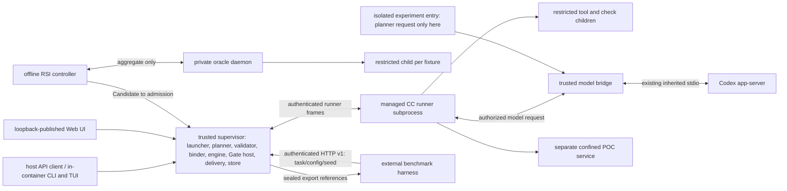

# M1 modules, code placement and processes

PRD: 4.6.3, 4.6.2

> Answers: Which modules and processes make up M1, and which calls are allowed?

This page is the home of proposed M1 code locations and process placement. Paths are design destinations, not claims that code exists. A module is ordinary code unless the [capability inventory](../capabilities/README.md) lists it as a CC. Process boundaries follow [placement](../placement.md). Each module's detail page states its interface, control, persistence, security, environment and verification facts.

## Module map

Paths are relative to the jiuwenswarm repository. Block IDs (B01, B02, ...) are stable; later pages, the coding plan and the task register cite them. A retired block keeps its ID. Cross-module calls use the linked public API. Store and events are shared state interfaces; they do not prohibit direct calls to another module's public API.

**Status** is `Proposed` (design only) or `Verified` (code exists at the path and a recorded [test case](../schemas/checks.md#term-test-case) passes). Checked against the repository: no `cc/`, `cc_sdk/` or `capsules/` directory exists yet, so every block is `Proposed`. Upstream code that a block may reuse is named in [integration](integration.md); its existence does not make the block `Verified`. **Tools** names entries of the [tools inventory](../capsule/tools.md). **Depends on** lists blocks this block calls; the allowed directions are below. **Implementer entry** is the reading list: the capability or module page, schema defs in [contracts](../contracts/README.md), the failure rules in [runtime](../runtime.md#exception-handling), and the demo from [build order](../build-order.md#demonstration-milestones) that proves it.

| Block | Module | Proposed code location | Process | Reuse or new boundary | Tools | Outside scope | Status | Depends on | Implementer entry |
|---|---|---|---|---|---|---|---|---|---|
| B01 | Configuration and startup | `cc/config.py`, `cc/bootstrap.py` | trusted supervisor | new CC profile wrapper; reuse upstream startup through adapter | none | no [capsule](../capsule/capsule.md#term-capability-capsule) logic; no model calls; no persistent user profile | Proposed | none | [environment](environment.md); D0 |
| B02 | Doctor | `cc/doctor.py` | trusted supervisor; [probes](environment.md#term-probe) run under the real child identities | new; wraps native `startup_diagnostics.run_doctor` as check zero, then our probes ([reuse](../reuse.md)); `doctor(config_snapshot) -> DoctorReport` (`tools-v1.schema.json#doctor_report`) | none ([checks](../capsule/fields.md#term-check) the prerequisites of the tools) | does not repair or install; no run starts if a mandatory check fails. Core (config check, native `run_doctor`) is built at step 0; the restricted-child probes at step 2 (D1) | Proposed | B01, B11, B14, B20 (probes) | [environment](environment.md#behavior-startup-and-doctor), [workstation](workstation.md), `execution-v1#cli_json_output`; US-11 probes; D0 |
| B03 | Entry, intake and local session | `cc/adapters/entry.py`, `cc/adapters/local_session.py`, `cc/intake.py` | trusted supervisor | wrap native CLI, `chat.send`, local Web/TUI; intake validates the request and snapshots resources | none | no chat channels; no cloning or downloading; no semantic reading of the request | Proposed | B01, B14, B18 | [workstation](workstation.md), [integration](integration.md#entry-how-a-run-starts), [extract-text](../capabilities/extract-text.md), `library-rsi-v1#intake_request`; `N_intake`; step 5 (a toy intake exists at step 4) |
| B04 | Supervisor, launcher, halt host | `cc/launcher/`, `cc/launcher/plans/prep.json` | trusted supervisor | new lifecycle API around [runs](lifecycle.md#term-run); the [prep plan](../types/run-plan.md#term-prep-plan) holds the fixed intent and requirement [steps](nodes.md#term-step); human halt wraps native `human_session` and the pause/resume/stop control names ([reuse](../reuse.md)) | Launcher (M01), Halt host (M03h) | does not choose capsules after the prep plan; no automatic retry or resume: a crash [halts](lifecycle.md#term-halt) with `halt_report` reason `INTERRUPTED` and only `cc resume` continues | Proposed | B03, B07, B08, B14; a toy plan at step 4, B06 only from step 7 | [lifecycle](lifecycle.md), [toolchain M01](../capsule/toolchain.md#m01-launcher), [prep.plan.json](../capabilities/prep.plan.json), `execution-v1#launch_request`, `#resume_request`, `#halt_report`; D3, D4; V35 |
| B05 | Planner service | `cc/planning/service.py` | trusted supervisor | ordinary service, not a CC; M1 emits the fixed template DAG with zero model calls and no planning reservation | none | no model [turn](model-bridge.md#term-model-turn), no [freezes](lifecycle.md#term-freeze), no replanning, no live DAG change, no capsule outside the [library snapshot](../capsule/library.md#term-library-snapshot), no call to the [validator](planner.md#term-plan-validator) (the supervisor calls it) | Proposed | B14 | [planner](planner.md), [run plan](../types/run-plan.md), `services-v1#planner_request`, `#planner_proposal`; `N_plan`; step 7; V34, V36 |
| B06 | Plan validator | `cc/planning/validate.py` | trusted supervisor, called by the supervisor | new typed whole-graph check; invalid plan means zero dispatch | none | does not repair or edit a plan; does not bind versions | Proposed | B14 | [planner](planner.md#behavior-validation-binding-and-freeze-2), [lifecycle](lifecycle.md), `services-v1#validation_request`, `#plan_validation`, `#finding`, `#plan_finding_code`; `N_validate`; D4 |
| B07 | [Binder](planner.md#term-binder) and freeze | `cc/freeze.py`, `cc/planning/bind.py` | trusted supervisor, called by the supervisor | new; resolves admitted library versions from the run's library snapshot, attaches each node's [Gate](../verification.md#term-gate), freezes | Freeze (M03) | no partial freeze; no change after freeze; rejects an RSI-capable verifier | Proposed | B06, B14, B15 | [toolchain M03](../capsule/toolchain.md#m03-freeze-the-binding-writer), [storage](storage.md), `execution-v1#freeze_request`, `#freeze_result`, `#run_phase_started`; `N_bind`; D3, D4 |
| B08 | [SwarmFlow](integration.md#term-swarmflow) adapter and generic script | `cc/adapters/swarmflow.py`, `cc/adapters/plan_script.py` | trusted supervisor | `run_workflow`, `AgentBackend`, journal adapter; runs the fixed outer flow; engine reused, journal wrapped as cache only ([reuse](../reuse.md)) | none | knows nothing about any research stage; makes no Gate decision | Proposed | B07, B09, B13, B14 | [integration](integration.md#swarmflow-run-a-plan-be-the-backend), [lifecycle](lifecycle.md), `execution-v1#workflow_start_args`, `#call_descriptor`, `#step_envelope`; `N_dispatch`; D3 |
| B09 | Runner service and client | `cc/runner/service.py`, `cc/runner/client.py`, `cc/runner/pipeline.py` | managed runner subprocess; client in supervisor | pipeline is new; core engine backend reused | Runner (M04) | never writes the store: it asks the supervisor to commit (`commit_request`) and the supervisor commits on its behalf; never chooses a successor; never calls the [Gate host](../capsule/gate-host.md#term-gate-host) | Proposed | B10, B11, B14 | [runner](../capsule/runner.md), [lifecycle](lifecycle.md), `execution-v1#runner_request`, `#runner_response`, `#commit_request`, `#commit_result` (boundary BD21); `N_run`; D1 |
| B10 | Kind handlers, broker, SDK | `cc/runner/handlers/`, `cc/runner/broker.py`, `cc_sdk/` | runner; untrusted code in [restricted child](../capsule/process-boundary.md#term-restricted-child) | new protocol with length-prefixed tool-host frames; text-only model turns through broker | Runner (M04), Permission controls | no direct network or filesystem access for capsule code; broker decides nested calls from the [Declaration](../capsule/fields.md#term-declaration) only | Proposed | B09, B11, B20 | [runner handlers](../capsule/runner-handlers.md#kind-handlers), [runner broker](../capsule/runner-broker.md), [permissions](../capsule/permissions.md), `execution-v1#tool_host_frame`, `#skill_turn_frame`; D1 (tool), D1s (skill, a separate demo row) |
| B11 | [Model bridge](model-bridge.md#term-model-bridge) | `cc/adapters/codex.py`, `cc/model.py`, `cc/adapters/model_bridge.py`, `cc/adapters/codex_auth.py` (auth provider, step 0) | trusted model bridge | wrap existing subscription service; protected local IPC is new | none | never picks capsules; no tools, shell or web in the model; no silent resubmit | Proposed | none | [model bridge](model-bridge.md), [environment](environment.md), [runner M05](../capsule/runner-broker.md#the-model-client-contract-m05), [model routing](../model-routing/README.md), [model auth](model-auth.md), `services-v1#model_bridge_request`, `#model_bridge_result`; US-12; D0 |
| B12 | Check runner | `cc/checks/runner.py`, `cc/checks/registry/` | trusted Gate host; restricted check subprocess | fixed registry and check ABI | Check runner and gate (M10a) | no model calls; no check outside the registry | Proposed | B14, B20 | [toolchain M10a](../capsule/toolchain.md#m10a-check-runner-and-the-check-library), [checks](../schemas/checks.md); D2 |
| B13 | Gate host | `cc/gate.py` | trusted supervisor, called by `CcBackend` (B08) after the runner commit | new fold and durable decision writer; calls the `research.verifier` CC after deterministic checks pass | Check runner and gate (M10) | decides nothing the verifier or checks did not produce; invents no criteria | Proposed | B09, B12, B14 | [gate host](../capsule/gate-host.md), [verification](../verification.md), [Verification record](../schemas/verification-record.md), `execution-v1#gate_request`, `#gate_result`; `G_node`; D2 |
| B14 | Store, hashes, vocabulary, policy | `cc/store.py`, `cc/hashing.py`, `cc/vocab.py`, `cc/policy/` | trusted supervisor, sole writer of the public store | new durable file publication; native KV may index committed records | Library store (M12), Hashing (M00d), Vocabulary builder (M00a), Policy publisher (M00c) | no second writer of the public store (the oracle writes only its private namespace through its own writer); no calls into other blocks | Proposed | none | [storage](storage.md), [toolchain](../capsule/toolchain.md), `execution-v1#commit_batch_manifest`, `#system_record`; step 1 |
| B15 | Author kit and admission | `cc/kit.py`, `cc/admission.py` | trusted CLI; test calls through runner | admission behind one provider chosen by policy: `tested_admission` (provisional default) or Puppet by developer allowlist (exempt); an [RSI child](../capsule/rsi.md#term-parent-and-child) is `admitted_inactive` either way; mandatory integrity first. Validation at step 1, test calls wired at steps 2 and 3 | Author kit (M13), Admission (M14) | admission alone writes library records (through B14); Puppet cannot release a node or activate | Proposed | B09, B14 | [admission](../capsule/admission.md), [toolchain M13/M14](../capsule/toolchain.md#m13-author-kit), [library](../capsule/library.md), `library-rsi-v1#admission_request`, `#admission_decision`; US-06, US-14 |
| B16 | CC implementations | `capsules/<identity>/` | runner skill handler or restricted tool child | one directory per CC in the [inventory](../capabilities/README.md), including the single `research.verifier` | every identity in the inventory | none run outside the runner; the verifier has zero RSI-mutable parts | Proposed | B10, B14 | the capability page for that identity and its Acceptance seeds, plus its [Gate profile](../schemas/profiles.md#term-gateprofile) page; D5 |
| B17 | Search [operators](../capabilities/README.md#term-operator) | `capsules/op.<search>/`, `cc/adapters/deepsearch.py`, `cc/adapters/codesearch.py` | nested restricted tool child | local, scholarly and code search; bounded retrieval permissions | none (they are CC identities in the inventory) | no model keys; no download, clone or install during a run | Proposed | B10, B16 | [op-local-search](../capabilities/op-local-search.md), [op-scholarly-search](../capabilities/op-scholarly-search.md), [op-codesearch](../capabilities/op-codesearch.md); D5 |
| B18 | Mechanical research helpers | `cc/research/` | supervisor, restricted child only where a permission boundary requires | ordinary functions for source extraction, rank and arithmetic, snapshot, compiler and publication helpers; no capsule identity | none | no model calls; no Declaration, Gate or [RSI](../rsi.md#term-rsi) of their own | Proposed | B14 | [extract-text](../capabilities/extract-text.md), [op-rank-opportunities](../capabilities/op-rank-opportunities.md), [op-assess-dependency](../capabilities/op-assess-dependency.md), [op-workspace-io](../capabilities/op-workspace-io.md), [measurement protocol](../capabilities/measurement-protocol.md) |
| B19 | Delivery | `cc/delivery.py` | trusted supervisor | ordinary code that assembles accepted terminal results and publishes them; not a capsule | none | does not interpret, select or rename outputs by meaning; no Gate of its own | Proposed | B14 | [delivery](../capabilities/delivery.md) (a module, not a capsule, no Gate; the report text comes from the capability [write report](../capabilities/write-report.md)), `library-rsi-v1#deliver_request`, `#deliver_result`, `#publication_manifest`; `N_deliver`; D6 |
| B20 | Isolation and confinement engine (adapter at step 2) | `cc/security/linux_launcher.py` and the versioned policy | trusted launcher; confined children | reuses the [jiuwenbox](../isolation.md#term-jiuwenbox) HTTP API per attempt through our adapter (`cc/adapters/sandbox.py`); no global runner singleton ([reuse](../reuse.md)); installer support is new | Permission controls, M1 generated-code process boundary (profile part) | not a general sandbox; a probe not run means the profile is unsupported | Proposed | none | [isolation](../isolation.md), [process boundary](../capsule/process-boundary.md), [environment](environment.md); US-11; D1 |
| B21 | Generated POC service | `cc/security/poc_service.py` | separate restricted process tree | new execution boundary with offline installer; `execute_poc` | M1 generated-code process boundary | no network; no host paths beyond the POC workspace; no repair loop | Proposed | B20, B14, B22 | [process boundary](../capsule/process-boundary.md), [benchmark](../capabilities/benchmark.md), `library-rsi-v1#poc_execute_request`, `#poc_execute_result`; D5 |
| B22 | Measurement service and registry | `cc/measurements/registry.py`, `cc/measurements/protocol.py`, `cc/security/measurement_service.py` | trusted process; isolated workload children | new; [trusted per-arm evidence](../capabilities/measurement-protocol.md#trusted-measurement-authority) | none | no model or oracle credentials; generated code supplies no measured values | Proposed | B14, B20 | [measurement protocol](../capabilities/measurement-protocol.md), `library-rsi-v1#measurement_request`, `#measurement_result`, `#benchmark_sample`; D5 |
| B23 | [Observation](../schemas/observation.md#term-observation) capture and export (collector at step 2, assembler and export at step 10) | `cc/evidence.py`, `cc/data/collector.py`, `cc/data/assembler.py`, `cc/data/export.py` | mandatory capture in trusted supervisor; assembler offline | native memory/trace [adapters](integration.md#term-adapter) plus new lossless capture | none | views are rebuildable; no invented counts; hiding a view does not stop capture | Proposed | B14 | [storage](storage.md#behavior-required-evidence-and-derived-views), [seams](seams.md), [observability](observability.md); US-17 |
| B24 | Progress and UI (event bus at step 2, views at step 10) | `cc/events.py`, `cc/adapters/runview.py` | supervisor; native browser/TUI clients | wraps native run view and progress events; new CC state mapping ([reuse](../reuse.md)) | none | read-only; a write attempt is refused; cannot release or alter a run | Proposed | B08, B14 | [workstation](workstation.md), `execution-v1#run_status_view`, `#event_envelope`; US-17 |
| B25 | Offline RSI controller | `cc/rsi/session.py`, `cc/rsi/attempts.py`, `cc/rsi/submit.py` | isolated offline controller; no live DAG mutation | existing RSI sources are reuse candidates, not yet verified | Offline RSI engine and candidate submitter | no live [planned DAG](../types/run-plan.md#term-planned-plan) change; no hidden fixture content; no Gate-role target; target modes are the helper, the Screening prompt and rubric text, and `research.compile_intent` (code and its two prompts, model-backed, paired repeated calls) | Proposed | B11, B14, B15, B26; B23 and B28 exports | [RSI](../rsi.md), [RSI engine](../capsule/rsi-engine.md), `library-rsi-v1#rsi_start_request`, `#rsi_submit_request`; US-13; step 11 |
| B26 | Fixture oracle | `cc/security/oracle.py` | independent private daemon; isolated child per case | new aggregate-only authenticated API | RSI trial | never returns expected outputs or per-case answers | Proposed | B14, B20 | [oracle](../capsule/fixture-oracle.md), `library-rsi-v1#oracle_begin_request`, `#oracle_evaluate_request`, `#oracle_aggregate_result`; US-13 |
| B27 | Experimental router and Code Mode adapters | `cc/experiments/entry.py`, `cc/adapters/` | separate experimental worker/profile | whitelist-only adapters; native permissions for Code Mode | none | never on the production path; real endpoints only after access approval | Proposed | B05, B11 | [experiments](experiments.md), `services-v1#experiment_request`, `#routing_request`; step 12 |
| B28 | External benchmark entry and export | `cc/benchmark_api.py`, `cc/data/export.py` | trusted headless entry/export | new versioned evidence boundary; clients use the HTTP API (`benchmark_request`, `export_request`), not `launch_request`; harness internals external | none | export schema is `PENDING_SOURCE` (US-16 is partial by design until the harness side supplies it); only the export adapter changes with it | Proposed | B04, B23 | [benchmark export](benchmark-export.md), `services-v1#benchmark_request`, `#run_handle`, `#benchmark_export`; US-16 |
| B29 | System records | `cc/records.py` | supervisor | [system-record variants](records.md); new module, not a reuse claim | none | defines no [payload type](../types/types.md#term-payload-type); no second writer | Proposed | B14 | [records](records.md), `execution-v1#system_record`, `#dispatch_reservation`, `#release_record`; step 1 |
| B30 | Librarian: library snapshot, catalogue and activation | `cc/library.py` | trusted supervisor | new; publishes the frozen library snapshot a run pins, serves the read-only catalogue, and records activation by a person (`cc bootstrap` for the first activation) | Librarian rows of the [tools inventory](../capsule/tools.md) | no automatic Standing change; a run keeps its snapshot after a later activation | Proposed | B14, B15 | [library](../capsule/library.md#frozen-library-snapshot-and-activation), `library-rsi-v1#library_snapshot_request`, `#library_snapshot`, `#catalogue_request`, `#activation_request`; step 1; V38 |

## Key terms

| Term | Meaning |
|---|---|
| **Block** (also: blocks, Block ID) | A bounded behavior with inputs, outputs, failure semantics and an executable check; the unit coders build. Each block in the module map has a stable ID (B01, B02, ...) that is never reused. |
| **Boundary** (also: boundaries) | The place where two blocks or processes talk, through a request def and a result def. Each boundary has a sheet and fixtures, and is tested with BOUNDARY rows. |

## Allowed and prohibited dependency directions

Allowed:

- Control flows downward: entry (B03) to launcher (B04); the supervisor (B04) calls the planner (B05), the validator (B06) and the binder (B07) in turn; then the SwarmFlow adapter (B08), runner client (B09), runner handlers and broker (B10), restricted children.
- The Gate host (B13) is called by `CcBackend` (B08, supervisor side), not by the runner, after the supervisor committed the Observation: runner commit, then Gate, then release. It calls the [check runner](../capsule/gate-host.md#term-check-runner) (B12) and, through the runner (B09), the `research.verifier` CC.
- Every durable write to the public store goes through the store (B14), written only by the supervisor. The runner and its children return records through their authenticated channel (`commit_request`) and the supervisor commits on their behalf. The oracle (B26) writes only its private namespace through its own writer.
- The model bridge (B11) is called by the broker (B10) and, in the isolated experiment track only, by the experimental planner (B27), never by capsule code directly.
- Ordinary helpers (B18, B19) are called by supervisor modules and handlers and call only B14.
- The offline RSI controller (B25) calls the oracle (B26) and admission (B15); controller and oracle talk only through the private API.

Prohibited:

- Any upward call: B14, B11, B18 and B20 call no other block. B14 holds no module logic.
- Capsule code or a restricted child calling the store, the supervisor, the model bridge or the network directly. All go through the broker.
- The planner (B05) writing the store or binding versions; the validator (B06) repairing a plan; the binder (B07) changing a plan after freeze.
- The Gate host (B13) calling a research capability, or any capsule judging itself.
- RSI (B25, B26) writing the live alias, calling the SwarmFlow adapter, or reading the production store.
- Delivery (B19) interpreting outputs; UI (B24) writing run state; model routing (B11, B27) selecting a capsule.
- The experimental block (B27) on the production path.

## Dependency matrix

Failure rules for all rows are in [runtime](../runtime.md#exception-handling): zero autonomous retries; a failure halts the run and keeps committed evidence. Schema defs are in the [contracts](../contracts/README.md) (`E` = `execution-v1`, `S` = `services-v1`, `L` = `library-rsi-v1`). Types such as `evidence_bundle` and `verifier_assessment` come from the generated `exports/` schemas.

| Caller to callee | Schema def | Sync or async | Who handles failure |
|---|---|---|---|
| supervisor (B08 via runner client B09) to runner service (B09) | `E#runner_request`, `E#runner_response`, `E#call_descriptor` | async length-prefixed frames over an authenticated local channel; supervisor waits for the committed Observation ref | supervisor: halt, no retry; timeout kills the child tree; `cc resume` by a human |
| runner (B09) to the supervisor store writer (B14) | `E#commit_request`, `E#commit_result` (boundary BD21) | sync frames on the same channel; one request per record | supervisor commits or answers refused or conflict; the runner then returns `unavailable` and the supervisor halts |
| runner (B10) to model bridge (B11) | `E#model_client_call`, `E#model_client_reply`, `S#model_bridge_request`, `S#model_bridge_result` | one blocking exchange per turn over the protected UDS ([model bridge](model-bridge.md)) | runner records a typed error in the Observation; supervisor halts; no silent resubmit |
| runner broker (B10) to restricted tool child or nested capsule | `E#tool_host_frame`, `E#skill_turn_frame` | sync length-prefixed frames on stdin/stdout, at most `cc.ipc.max_frame_bytes`; a nested call is one more runner call | broker refuses calls outside the Declaration; runner reports the nested reason unchanged; supervisor halts |
| `CcBackend` in the supervisor (B08) to Gate host (B13) | `E#gate_request`, `E#gate_result` | sync, in process, after the runner commit | Gate host persists the [Verification](../schemas/verification-record.md#term-verification) first; if the save fails nothing is [released](lifecycle.md#term-release) and the supervisor halts |
| Gate host (B13) to verifier CC (B16, via B09) | `E#runner_request` with `evidence_bundle` in and `verifier_assessment` out | sync call through the runner | Gate host folds a malformed or missing assessment to INCONCLUSIVE or block; the verifier never decides |
| supervisor (B04) to planner (B05) | `S#planner_request`, `S#planner_proposal` | sync, in process; the fixed template, no model call, no planning reservation (isolated experiment track only: through the bridge with `S#planning_reservation`) | supervisor: halt before validation; zero dispatch |
| supervisor (B04) to validator (B06) | `S#validation_request`, `S#plan_validation`, `S#finding` | sync, in process; the planner does not call the validator | supervisor: invalid plan means findings recorded and zero dispatch |
| supervisor (B04) to binder (B07), with the validated plan | `E#freeze_request`, `E#freeze_result`, `E#run_phase_started` | sync, in process; one atomic commit [batch](storage.md#term-commit-batch) | supervisor: no partial frozen run; halt |
| supervisor (B08) to delivery (B19) | `L#deliver_request`, `L#deliver_result`, `L#publication_manifest` | sync, in process | delivery returns typed errors (`REQUEST_CONFLICT`, `DESTINATION_DENIED`); supervisor halts final completion and keeps evidence |
| RSI controller (B25) to oracle (B26) | `L#oracle_begin_request`, `L#oracle_evaluate_request`, `L#oracle_aggregate_result`, `L#oracle_close_request` | sync over a private local API; aggregate only | controller stops the session on denial or a security latch; a human clears the latch |
| RSI controller (B25) to admission (B15) | `L#rsi_submit_request`, `L#admission_request`, `L#admission_decision` | sync, in process or CLI | admission rejects; the controller records the attempt; activation stays human |
| benchmark client to supervisor (B28, B04) | `S#benchmark_request`, `S#run_handle`, `S#export_request`, `S#benchmark_export`, `S#readiness` | async: start returns a handle, then status and sealed export over authenticated loopback HTTP | supervisor returns a typed failure response with an HTTP status; the CLI maps the same outcomes to its own exit codes (0, 2, 3, 4), which are separate from HTTP statuses; the client retries only with its own request id |

## Block verification

Each block's invocation point, fakes and the test cases that exercise it are keyed by Block ID in [test surfaces](test-surfaces.md). B04 is exercised by V35, B05 and B06 by V16, V34 and V36, B30 by V38.

## Where the fixed flow lives

| Flow step ([flow](../flow.md)) | Module |
|---|---|
| intake | Entry, intake and local session |
| intent call (bounded loop), the requirement call (one model pass), each followed by its Gate | prep plan in the launcher; runner; Gate host |
| planner | Planner service |
| validate, bind, freeze | Plan validator; Binder and freeze |
| dispatch | SwarmFlow adapter |
| node execution, then its Gate | runner client and service; Gate host |
| delivery | Delivery |

## Deployment placement

[Deployment](deployment.md) is the home of one Docker image and container. The process labels are internal monolith trust boundaries, not independent services or deployment units. The host CLI, browser and external benchmark harness use loopback-published APIs; all runtime Python, TUI/tmux, Codex app-server and restricted children run inside the same Linux image. Benchmark traffic enters the authenticated versioned endpoint on host 127.0.0.1:8787. No per-task container creation and no runtime Docker socket.

## Process topology

The runner is a managed subprocess (PRD 4.6.3). `CcBackend` remains the engine's client in the supervisor; the pipeline and [kind](../capsule/capsule.md#term-capsule-kind) handlers execute in the runner process. Only the trusted supervisor writes the store. Runner record requests and required evidence return through its authenticated channel as `commit_request`; the supervisor validates writer and identity before committing. The Gate host is called by `CcBackend` on the supervisor side. The model bridge holds login credentials and supplies text results only. No untrusted child inherits the supervisor environment, home directory, store directory or model login files.

## Reuse evidence

Upstream adapters are described in [integration](integration.md); cite the existing symbol there rather than copy it. The inspected integration source pin is `6cc05c36b`, with agent-core pin `9e339019`; it is distinct from the current architecture revision. Verified destinations include `pyproject.toml:9` (Python), `:134` (CLI scripts), `:141` (startup), `jiuwenswarm/start_services.py:525` (process commands), `:687` (readiness), and `server/runtime/codex_subscription/transport.py:97` under `jiuwenswarm/` (inherited stdio). These establish reuse entrypoints, not that upstream already satisfies the security or persistence contracts.

## Status

Draft. Capsule identities come from the [inventory](../capabilities/README.md), not from this page. Platform validation obligations block execution on affected platforms ([decisions](../decisions.md#open)). Failure hooks: [test surfaces](test-surfaces.md).
