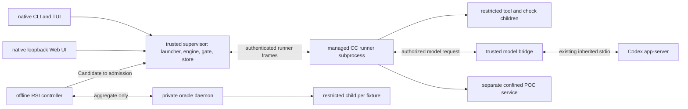

# M1 modules, code placement and processes

This is the current owning map for proposed M1 code locations and process placement. These paths are design destinations, not claims that code already exists. The old 27-module design is historical. Product semantics stay with the named workstream; Muk owns shared CC interfaces. Each module publishes the seven contracts in [PROCESS](../PROCESS.md): placement, interface, control, persistence, security, environment and verification.

## Module map

All paths below are relative to the jiuwenswarm repository. Cross-module calls use the linked public API. Store and events are shared state interfaces; they do not prohibit direct calls to another module's public API.

| Module / design owner | Proposed code location | Process | Reuse or new boundary | Public authority / dependencies |
|---|---|---|---|---|
| Configuration, startup, doctor / Muk with Xiaoyang | `cc/config.py`, `cc/bootstrap.py`, `cc/doctor.py` | trusted supervisor | new CC profile wrapper; reuse upstream startup through adapter | [environment](environment.md); runs before launch |
| Entry and local session / workstation owner, Muk for API | `cc/adapters/entry.py`, `cc/adapters/local_session.py` | trusted supervisor | wrap native CLI, `chat.send`, local Web/TUI | [workstation](workstation.md), [integration](integration.md#entry-how-a-run-starts) |
| Launcher, restart, halt / Muk | `cc/launcher/`, `cc/launcher/plans/m1.json` | trusted supervisor | new lifecycle API around Swarmflow | [lifecycle](lifecycle.md), [toolchain](../capsule/toolchain.md#m01-launcher) |
| Freeze / Muk | `cc/freeze.py` | trusted supervisor | new; resolves admitted library versions | [toolchain](../capsule/toolchain.md#m03-freeze-the-binding-writer), [storage](storage.md) |
| Swarmflow adapter and generic script / Muk | `cc/adapters/swarmflow.py`, `cc/adapters/plan_script.py` | trusted supervisor | `run_workflow`, `AgentBackend`, journal adapter | [integration](integration.md#swarmflow-run-a-plan-be-the-backend), [lifecycle](lifecycle.md) |
| Runner service and client / Muk | `cc/runner/service.py`, `cc/runner/client.py`, `cc/runner/pipeline.py` | managed runner subprocess; client in supervisor | pipeline is new; core engine backend reused | [runner](../capsule/runner.md), [lifecycle](lifecycle.md) |
| Kind handlers, broker, SDK / Muk | `cc/runner/handlers/`, `cc/runner/broker.py`, `cc_sdk/` | runner; untrusted code in restricted child | new protocol; text-only model turns through broker | [runner](../capsule/runner.md#kind-handlers) |
| Model bridge / Muk; routing behavior: Model Routing | `cc/adapters/codex.py`, `cc/model.py`, `cc/adapters/model_bridge.py` | trusted model bridge | wrap existing subscription service; protected local IPC is new | [environment](environment.md#model-bridge), [runner M05](../capsule/runner.md#the-model-client-contract-m05) |
| Check runner / Muk with Ramika for criteria | `cc/checks/runner.py`, `cc/checks/registry/` | trusted gate host; restricted check subprocess | fixed registry and check ABI | [toolchain M10a](../capsule/toolchain.md#m10a-check-runner-and-the-check-library) |
| Gate host / Muk; acceptance profiles: Ramika | `cc/gate.py` | trusted supervisor | new fold and durable decision writer | [gate host](../capsule/gate-host.md), [Verification](../schemas/verification-record.md) |
| Store, hashes, vocabulary, policy / Muk | `cc/store.py`, `cc/hashing.py`, `cc/vocab.py`, `cc/policy/` | trusted supervisor, sole persistent writer | new durable file publication; native KV may index committed records | [storage](storage.md), [toolchain](../capsule/toolchain.md) |
| Author kit and admission / Muk | `cc/kit.py`, `cc/admission.py` | trusted CLI; test calls through runner | new; no hand-pinned bypass at M1 | [toolchain M13/M14](../capsule/toolchain.md#m13-author-kit) |
| Research work and gate capsules / stage owner, Muk for schema | `capsules/research.<capability>/` | runner skill handler or restricted tool child | stage-specific instructions/code; gate rubric belongs to independent referee | [pipeline](../m1/pipeline.md) |
| Fixed operators / Muk | `capsules/op.<capability>/`, `cc/adapters/deepsearch.py`, `cc/adapters/codesearch.py` | nested restricted tool child | local and scholarly search wrappers; rank fixed; workspace capability API | [M1 operators](../m1/order.md) |
| Generated POC service / Muk, Xiaoyang | `cc/security/poc_service.py`, `cc/security/linux_launcher.py` | separate restricted process tree | new confinement and offline installer | [process boundary](../capsule/process-boundary.md) |
| Data Foundation / Suraj, Muk for shared evidence API | `cc/evidence.py`, `cc/data/collector.py`, `cc/data/assembler.py`, `cc/data/export.py` | mandatory capture in trusted supervisor; assembler offline | native memory/trace adapters plus new lossless capture | [storage](storage.md#required-evidence-and-derived-views), [seam](../seams.md#data-foundation) |
| Progress and UI / workstation owner | `cc/events.py`, `cc/adapters/runview.py` | supervisor; native browser/TUI clients | reuse native views; new CC state mapping | [workstation](workstation.md) |
| Offline RSI / Saurav, Muk for Candidate/evidence interfaces | `cc/rsi/session.py`, `cc/rsi/attempts.py`, `cc/rsi/submit.py` | isolated offline controller; no live DAG mutation | existing RSI sources are reuse candidates, not yet verified | [RSI engine](../capsule/rsi-engine.md) |
| Fixture oracle / Saurav, Muk/Xiaoyang for security | `cc/security/oracle.py` | independent private daemon; isolated child per case | new aggregate-only authenticated API | [oracle](../capsule/fixture-oracle.md) |

## Process topology

Additional canonical components: `cc/records.py` owns [system-record variants and reservations](records.md); `cc/measurements/registry.py` and `protocol.py` own method registration, parsing and arithmetic; `cc/security/measurement_service.py` owns [trusted per-arm evidence](../m1/measurement-protocol.md#trusted-measurement-authority) in a trusted process with isolated workload children. Snapshot and compiler operator folders implement op.freeze_resources/op.syntax_check; the comparison helper lives in capsules/op.compare_to_thresholds. These are new modules, not reuse claims.

The runner is a managed subprocess for PRD 4.6.3. `CcBackend` remains the engine's client in the supervisor; the R2 pipeline and R6/R7 handlers execute in the runner process. Only the trusted supervisor writes the store. Runner record requests and required evidence return through its authenticated channel; the supervisor validates their writer/identity before committing. The model bridge holds login credentials and supplies text results only. No untrusted child inherits the supervisor environment, home directory, store directory or model login files.

## Reuse evidence

Upstream adapters are owned by [integration](integration.md); cite the existing symbol there rather than copy it. The current checkout is `6cc05c36b`, with agent-core pin `9e339019`. Newly verified destinations include `pyproject.toml:9` (Python), `:134` (CLI scripts), `:141` (startup), `jiuwenswarm/start_services.py:525` (process commands), `:687` (readiness), and `server/runtime/codex_subscription/transport.py:97` under `jiuwenswarm/` (inherited stdio). These establish reuse entrypoints, not that upstream already satisfies the security or persistence contracts.

## Design status

This map is draft pending the connected reviews. [Verification](verification.md) supplies invocation and failure-injection contracts. A module whose product or platform decision is open stays blocked locally; all other module interfaces can be completed against the canonical published boundary.
