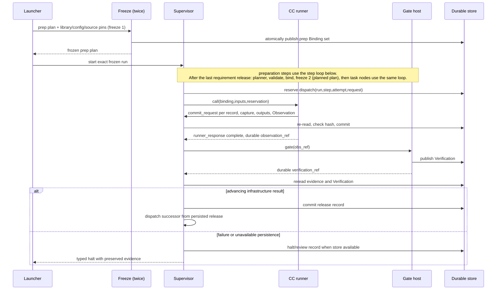

# Nodes and governed execution

PRD: 4.6.2, 4.2.1, 4.2.8

> Answers: What is a governed node and how is it released?

## Purpose

A governed node is a plan position, not a capsule implementation. It becomes a [frozen](lifecycle.md#term-freeze) run-plan step with one work capability, the shared `research.verifier`, and one stage [GateProfile](../schemas/profiles.md#term-gateprofile). Mechanical helpers execute inside their owning stage boundary and have explicit module contracts, not separate admitted [capsules](../capsule/capsule.md#term-capability-capsule). The [Gate host](../capsule/gate-host.md#term-gate-host) validates evidence and persists [Verification](../schemas/verification-record.md#term-verification); the supervisor alone [releases](lifecycle.md#term-release) work.

## Key terms

| Term | Meaning |
|---|---|
| **Node** (also: nodes, governed node) | One use of a Capability Capsule for one task, bound into a frozen run plan with its exact version, actual inputs, limits and Gate. Several nodes can use one capsule, and a node never changes after freeze. |
| **Step** (also: steps) | A position in a frozen plan, named by its `step_id`. Preparation steps and task nodes are all steps and use the same Binding, runner, Gate and release path. |
| **Fixed node** (also: fixed nodes, mandatory node) | A node that is always present in every run and is not chosen by the planner: the prep nodes, the control steps and delivery. |
| **Prep node** (also: prep nodes) | A fixed node that takes the user's data and carries it toward the planner: intake, the intent call and the requirement call, each followed by its Gate. Prep nodes are always on and are frozen at freeze 1, at launch. |
| **Control step** (also: control steps) | A fixed step between the prep nodes and the task nodes that runs in the supervisor and is not a capsule: plan, validate, bind and freeze. |
| **Task node** (also: task nodes) | A node the planner places for this task and assigns one Capability Capsule to, for example search, screening or POC. Task nodes are chosen, not mandatory, and are frozen at freeze 2 together with their Gates. |
| **Task DAG** | The task nodes and the typed edges between them. This is the graph that the earlier AI4Research called "the DAG". It is frozen at freeze 2 and its plan is the planned phase of `run_plan`. |
| **Run graph** | Every node of one run: the prep nodes, the control steps, the task DAG and delivery. Strictly it is one DAG. The architecture says "prep nodes" and "task DAG" for its two named parts. |

## Interface

A node is a frozen run-plan step. The supervisor releases it through these messages.

- **Runner call** (call, supervisor -> [CC runner](../capsule/runner.md#term-runner)). Schema: [`execution-v1.schema.json#runner_request`](../contracts/execution-v1.schema.json) and [`execution-v1.schema.json#runner_response`](../contracts/execution-v1.schema.json).
- **[Gate](../verification.md#term-gate) call** (call, supervisor -> gate host). Schema: [`execution-v1.schema.json#gate_request`](../contracts/execution-v1.schema.json) and [`execution-v1.schema.json#gate_result`](../contracts/execution-v1.schema.json).
- **Dispatch reservation and release** (records, supervisor). Schema: [`execution-v1.schema.json#dispatch_reservation`](../contracts/execution-v1.schema.json) and [`execution-v1.schema.json#release_record`](../contracts/execution-v1.schema.json).
- **Workflow start** (call, supervisor -> workflow script). Schema: [`execution-v1.schema.json#workflow_start_args`](../contracts/execution-v1.schema.json).

## Node classes

Every node of a run belongs to one class. Mandatory classes are always on. Task nodes are chosen by the planner.

| Class | Mandatory? | Examples | Decided by | Frozen at |
|---|---|---|---|---|
| Prep node | yes, always on | intake, intent (`research.compile_intent`), requirement (`research.compile_brief`) | the fixed [prep plan](lifecycle.md#term-prep-plan) | freeze 1, at launch |
| Control step | yes, always on | plan, validate, bind and freeze (not capsules) | supervisor code | not frozen: it produces freeze 2 |
| Task node | no, chosen by the planner | search, screening, hypothesis, POC, benchmark, evaluation, report writing | the planner, from the accepted requirements | freeze 2, after the requirement call is released |
| Delivery | yes, always on | publish accepted results (not a capsule, no Gate) | supervisor code | n/a |

The task nodes and their edges are the **Task DAG**. All of these together are the **Run graph**.

- Prep nodes and task nodes use the same dispatch, runner, Gate and release path. The runner and supervisor know nothing about which [kind](../capsule/capsule.md#term-capsule-kind) a step is.
- The planner, [validator](planner.md#term-plan-validator), binder and Gate host are ordinary services, not nodes with capsules.
- No path installs a capsule, mutates a frozen plan, repairs a failure automatically or promotes a candidate. A failed Gate [halts](lifecycle.md#term-halt) the whole run. See [lifecycle](lifecycle.md#phases-and-the-two-freeze-points-decision-a26) and [flow](../flow.md).

## Capsule versus node

A Capability Capsule is a reusable capability stored in the library for planning and application. Its [Declaration](../capsule/fields.md#term-declaration), body, [ports](../capsule/fields.md#term-port) and version describe what it can do; it is not tied to a particular research task.

A node is the hot-path use of that capability for one specific task, bound into the workflow. Its [Binding](../schemas/binding.md#term-binding) fixes the CC version, actual inputs, run/step/attempt identity, execution limits and declaration-derived Gate test. The same stored CC may serve different nodes or [runs](lifecycle.md#term-run) without changing its reusable identity.

The `research.verifier` CC [checks](../capsule/fields.md#term-check) **the result of the node**: its actual output and captured effects/evidence, against the bound capability's Declaration and task criteria. It does not merely validate a library entry. Admission checks library availability separately; runtime Gate acceptance controls node advancement.

## Behavior: control sequence and authority

A Gate PASS whose save fails never becomes release. The runner response, event stream, UI, model output and native workflow cache cannot grant authority. Recovery reads committed records; a missing [Observation](../schemas/observation.md#term-observation) after reservation means an uncertain effect. Explicit human restart allocates a new attempt under the same run/step, preserving evidence. Changed inputs/configuration require a new run. Recovery across the two freeze points is in [lifecycle](lifecycle.md#failure-human-review-and-recovery).

## Failure

| Situation | Outcome | Recovery |
|---|---|---|
| A Gate PASS whose save fails | never becomes a release | the Gate returns no success; explicit review ([lifecycle](lifecycle.md#failure-human-review-and-recovery)) |
| Observation missing after a reservation | the effect is uncertain | explicit human review before a new attempt |
| Any failed Gate | the whole run halts, including sibling branches; no automatic retry | explicit review, then resume or a new run |
| Persistence unavailable | typed halt with preserved evidence; halt record written when the store is available | restore storage |

## Gates

[Tier 1](../verification.md#term-tier-1) checks schema, references, files, contract checks, provenance, time/invocation budgets and required evidence. Mandatory failure spends no verifier call. [Tier 2](../verification.md#term-tier-2) calls the shared independent verifier with stage criteria and bounded evidence. Malformed/missing judgment [blocks](modules.md#term-block). The host directly validates the [verifier assessment](../types/verifier-assessment.md#term-verifier-assessment) to end recursion; it never recursively gates the referee call. Every governed node, preparation or planned, receives its real Gate. Tests are derived from the producer's Declaration ([verification](../verification.md)). Every dispatch call has a Gate. A nested [operator](../capabilities/README.md#term-operator) call (`op.*`) gets a mechanical Verification persisted before it returns and is covered by the parent node's Gate. The nested verifier review inside `research.compile_intent` is validated by the calling capsule and is not itself Gated. The Gate profiles of the intent and requirement call sites are on [intent Gate](../capabilities/intent-gate.md) and [requirement Gate](../capabilities/brief-gate.md).

## Generic workflow adapter

PRD 5.6.5 isolated ablation runs use [experimental advancement](experiments.md#experimental-interfaces) when the pinned study disables/replaces a control. The same dispatcher reads a committed experimental_advance Artifact only when track=isolated_experiment and validates its evidence/profile/study/attempt pins. Production accepts only the canonical release [SystemRecord](records.md#term-systemrecord). A plan cannot choose its own authorization mode: the experimental entry/validator derives it from the approved study before freeze. Missing advancement evidence stops either track.

One [Swarmflow](integration.md#term-swarmflow) script walks the frozen ordered steps of the current plan: first the prep plan, then the [planned plan](../types/run-plan.md#term-planned-plan). The supervisor starts it once per run; its args are `execution-v1.schema.json#workflow_start_args` (plan_ref, pins_ref, and for the planned phase the prep release refs) and each step is called with `execution-v1.schema.json#call_descriptor`, returning `execution-v1.schema.json#step_envelope`. It resolves references only from launcher inputs and already released predecessor outputs, invokes the CC backend, then waits for the supervisor's committed release. It never embeds stage behavior. Production plans and separately approved experimental plans use the same run-plan/Binding interfaces and carry distinct track tags. Detailed request framing, duplicates, cancellation and recovery are defined in [lifecycle](lifecycle.md); code locations and reuse in the module map.

The durable progression pattern follows [Temporal workflow history](https://docs.temporal.io/workflow-execution), with a local append-only store rather than a Temporal deployment. Replace the scheduling adapter when throughput demands concurrency; preserve reserve/Observation/Verification/release identities and authority.

## Tests

Fixtures and fakes: a toy node A (tool and skill kinds) then the verifier Gate; a frozen two-node plan with a kill between nodes. Rows in [test surfaces](test-surfaces.md#verification-table): [V09](test-surfaces.md#verification-table), [V10](test-surfaces.md#verification-table), [V11](test-surfaces.md#verification-table), [V33](test-surfaces.md#verification-table).
