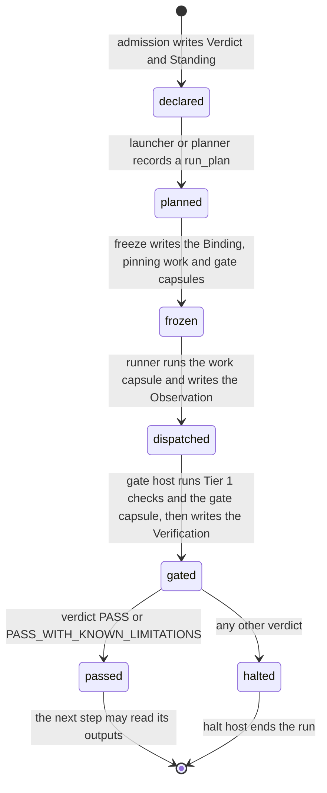

> **Checked, not yet approved.** The node model. It is precise enough that a node page can be turned straight into a capsule Declaration and the code behind it.

# Nodes

A **node** is one step of a run: a `step_id` in the [`run_plan`](../types/run-plan.md), bound to one **work capsule** that does the step's job and one **gate capsule** that checks it. Everything a node does goes through CC: it is declared first, pinned by hash, run by the [runner](../capsule/runner.md), gated, and recorded.

## Node roles

| Role | Is | Example | Required |
|---|---|---|---|
| work | the capsule that does the step's job | `research.compile_intent` | one per step |
| gate | the capsule that checks the work capsule's output and lets the run go on or not | `research.accept_intent` | one per step (policy rule `every_step_gated`) |
| planner (Phase 2) | a work capsule whose output is a `run_plan` | a Symphony-backed planner | not in M1's main path |
| composite control: branch, loop, fallback | later, as `composite` capsules | | not in M1 |

M1 control flow is a straight line that halts on a failed gate. There is no branch, loop or retry at M1. When they come, they come as capsules, never as code in a host.

## A node's life

Each move has one owner, and each leaves a record.



| State | Owner | Record written | Defined in |
|---|---|---|---|
| declared | admission (M14) | [Verdict](../schemas/verdict.md), [Standing](../schemas/standing.md) | [library](../capsule/library.md#admission-the-only-way-in) |
| planned | launcher (M01), or a planner capsule | an Artifact of type [`run_plan`](../types/run-plan.md) | [run plan](../types/run-plan.md) |
| frozen | freeze (M03) | one [Binding](../schemas/binding.md) per step: the work capsule in `decl_hash`, the gate capsule in `verifier` | [toolchain](../capsule/toolchain.md#m03-freeze-the-binding-writer) |
| dispatched | runner | the work call's [Observation](../schemas/observation.md) and output [Artifacts](../schemas/artifact.md) | [runner](../capsule/runner.md#one-call-start-to-finish) |
| gated | gate host (M10), calling the gate capsule | the gate call's Observation (`caller: gate`), then the [Verification](../schemas/verification-record.md) | [gates](#gates), [seams](../seams.md#evaluator-gate-and-verifier) |
| passed or halted | supervisor authorization; generic script and halt host | durable lifecycle transition referencing Verification.gate_result | [lifecycle](lifecycle.md) |

## Gates

Every step's output is gated before any later step may read it. The full algorithm is on [the gate host](../capsule/gate-host.md); the shape every gate capsule shares is on [gate capsules](../capsule/gate-capsules.md).

1. The gate host runs **Tier 1**: the work capsule's own checks, its output types' checks and the step's deterministic and reference `step_checks`, through the check runner, plus the fixed checks `check.call_ok.v1` and `check.within_budget.v1`.
2. If Tier 1 passes, it builds an [`evidence_bundle`](../types/evidence-bundle.md) from the Binding's `judged` checks, the capsule's and the step's (every step has at least one, by rule `every_step_gated`). It calls the step's **gate capsule** through the runner with `caller: gate`, and gets a [`verifier_assessment`](../types/verifier-assessment.md) back ([seams](../seams.md#evaluator-gate-and-verifier)).
3. It folds everything by policy `gates`, and writes the one Verification (INV-3: control code stays the only writer of Verifications).
4. The supervisor rereads the committed Verification.gate_result and authorizes the exact attempt before release ([lifecycle](lifecycle.md)). A computed PASS whose save failed, or a cached PASS with missing/stale evidence, never advances.

**Why the gate's own call has no gate.** A gate call is `caller: gate`, which gets no Verification of its own. That stops the regress. Its output is still checked: the gate host validates the `verifier_assessment` against its type, and an invalid one makes every criterion `unknown`, so the step is `blocked` (INV-8).

**What protects the referee.** A gate capsule must be `pure` or `read_only`, and must allow no RSI (`referee_no_rsi`). It can never be the capsule it gates (`no_self_judging`). The fold and the fixed checks stay in control code, so no capsule can overrule them.

**The schema already holds all of this.** The gate capsule is pinned in the Binding's existing `verifier` slot; the step's criteria are the existing `step_checks`, copied from the run plan. What changes is policy: `every_step_gated` makes the slot required on every `dispatch` Binding (INV-17: policy tightens, schema holds).

## Locked nodes and planned nodes

| | Locked | Planned and dispatched |
|---|---|---|
| Who writes the `run_plan` | an architect, once; the launcher records it at run start | a planner capsule, during the run |
| When freeze runs | once, before the first step, for the whole plan | again for each planned segment, before the segment's first step |
| How steps are chosen | written into the plan | Symphony's `plan()` returns a planned graph whose nodes are capability ids, drawn from admitted capsules only ([integration](integration.md#symphony-planned-nodes-phase-2)); the planner capsule turns that graph into a `run_plan` |
| M1 | the main path | Phase 2 track; unchecked |

Both kinds use **the same `run_plan` type, the same freeze, the same Binding and the same runner**. A planned node is a locked node whose plan arrived later. So the planner never needs a path of its own, and a planned node is exactly as checked as a locked one. Freezing a planned segment mid-run is a host feature still to design ([open issues](../open-issues.md)).

## The one generic script

The Swarmflow workflow is one fixed script that walks whatever `run_plan` it is given. Nobody edits it per stage, so no control flow hides in it.

```python
# cc/adapters/swarmflow/plan_script.py: run by run_workflow with args = {run_id, plan, pins, inputs}
META = {"name": "cc_run_plan", "description": "Walks a run_plan, one CC node per step."}   # the engine's loader requires a literal META

async def run(args):                                 # the engine's entry point is async def run(args)
    done = {}                                       # step_id -> envelope
    for step in args["plan"]["steps"]:
        refs = {port: source_ref(src, args["inputs"], done) for port, src in step["inputs"].items()}
        done[step["step_id"]] = await cc_node(args, step["step_id"], **refs)   # raises CcHalt on a halting verdict
    return done                                     # every step's envelope; the launcher emits cc.run.finished with them
```

- `source_ref("launcher.intake", ...)` returns the launcher's recorded ref. `source_ref("intent.intent_ir", ...)` returns `done["intent"]["outputs"]["intent_ir"]`.
- `cc_node` and the envelope are defined on the [runner](../capsule/runner.md#swarmflow-backend-talking-to-the-engine) page. The gate runs inside the same `agent()` call, so a step's envelope already carries its verdict.
- The engine's resume key covers the call descriptor, which carries `decl_hash` and the input hashes. So resuming a run replays passed steps and re-runs changed ones.
- **Halt.** `CcHalt` ends the script; the engine re-raises it to the launcher, which calls the [halt host](../capsule/toolchain.md#m03h-halt-host). It shows the failing step's Verification to the user. `human_session` replaces this when the runtime has a reply path ([runner permissions](../capsule/runner.md#permissions-and-human-interaction-at-m1)).

## Node spec template

Every node page follows this template, so a coding agent can build the node from the page alone, and two agents building neighbouring nodes produce interfaces that match ([the canary](../open-issues.md)). [The intent capsule](../m1/intent-capsule.md) is the first.

| Section | Holds | Becomes |
|---|---|---|
| What it does | one paragraph, and the PRD sub-features it delivers, by number | the Declaration's `identity.summary` |
| Run-plan entry | its `step_id`, work and gate capsule names, and the source of each input | its entry in [the M1 pipeline](../m1/pipeline.md) |
| Declaration | the full `capsule.json`, with every port typed by a named [payload type](../types/types.md) | the capsule, admitted as is |
| Gate | the gate capsule and the step's criteria (`step_checks`), each a full Check | the gate capsule's page and the Binding's `step_checks` |
| Existing code it touches | links to rows of [integration](integration.md), never new wiring | the adapters it calls |
| Tests | the test cases, one per admission check | `tests/cases.json` |
| Open | what is not settled, linked to [open issues](../open-issues.md) | |

A node page never defines a type, a record or an API. It links to the one definition.
