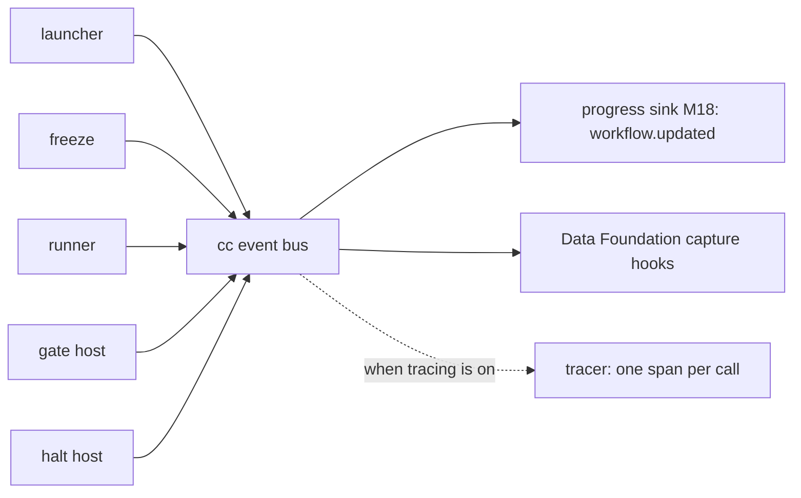

> **Checked, not yet approved.** How M1 is observed, for now. The concept is on [observability and quality](../capsule/observability.md); this page is the M1 wiring.

# Observability at M1

**Records are the truth; events are the live feed.** Every capsule call, value, pin and gate decision is a record in the store ([ledgers](ledgers.md)). While a run is going, the CC hosts also announce what they do on **one event bus**. Every live consumer subscribes to that bus, and none of them reaches into a host.

## The events

The one definition of every CC event. Each carries `run_id` (or `candidate_id` at admission) and `at`. An event that describes a record is emitted **after** that record is written, so a subscriber can always read it. `cc.call.started`, `cc.call.resolved` and `cc.call.nested` describe no record yet; they only announce.

| Event | Emitted by | When | Also carries |
|---|---|---|---|
| `cc.run.started` | launcher | after the `run_plan` and `intake` are recorded | `run_plan` ref |
| `cc.run.frozen` | freeze | after all Bindings are written | `{step_id: binding ref}` |
| `cc.call.started` | runner | pipeline step 0 | `obs_id`, `caller`, `step_id` |
| `cc.call.resolved` | runner | after code is verified | `obs_id`, `decl_hash`, `code_sha256` |
| `cc.call.refused` | runner | a refusal in steps 1 to 6 | `obs_id`, reason |
| `cc.call.nested` | runner (broker) | a nested call starts | parent and child `obs_id` |
| `cc.model.turn` | runner (broker) | each finished model turn | `obs_id`, turn, elapsed, `model_hint`, `model_id`, `route_record_id` |
| `cc.call.finished` | runner | after the Observation is written | Observation ref, outcome, reason |
| `cc.gate.decided` | gate host | after the Verification is written | `step_id`, `obs_id`, Verification ref, decision, verdict |
| `cc.run.halted` | halt host | a halting verdict ended the run | `step_id`, verdict, Verification ref |
| `cc.run.finished` | launcher | the script returned | every step's envelope |

**The bus.** It is in-process: cc.events.subscribe(callback) and cc.events.emit(name, payload). Optional display/debug subscribers may fail without changing a run. Required lossless capture is a synchronous acknowledged [evidence API](storage.md#required-evidence-and-derived-views), not an ignored subscriber; missing capture blocks completion. Managed-runner events are relayed through authenticated supervisor IPC before publication. Cross-module control uses public APIs, never observer events.

## Who reads what

| Consumer | Reads | For |
|---|---|---|
| Progress sink (M18) | events | the browser's run view (`workflow.updated`), with each gate's verdict and the halt reason |
| Data Foundation | events live; records and content after the run | run records, bundles, scorecards, exports ([seams](../seams.md#data-foundation)) |
| Tracer (optional) | events | one span per capsule call, with the `cc.*` attributes on the [Observation](../schemas/observation.md#reuse) page |
| RSI | Data Foundation's exports | learning from real runs |
| Librarian (later) | records | Standing moves and Findings |
| A person debugging | records first, then spans if any | what ran, on which code, and why it stopped |

## M1 limits, stated plainly

- **Required raw capture is enabled for M1**, including Codex model turns and tool/process frames. Optional native sampled spans may be unavailable in Codex mode; that does not excuse absent mandatory execution evidence.
- **No token counts.** The Codex service reports none, so `cost.tokens` stays empty until a router or provider reports them.
- **Broker/process operations are captured and compared to declarations.** Denied undeclared calls fail the capsule. Any operation class without verifiable enforcement/capture remains explicitly unsupported, as the [environment profile](environment.md) and issue 54 state; absence of a span is not evidence of absence of effects.
