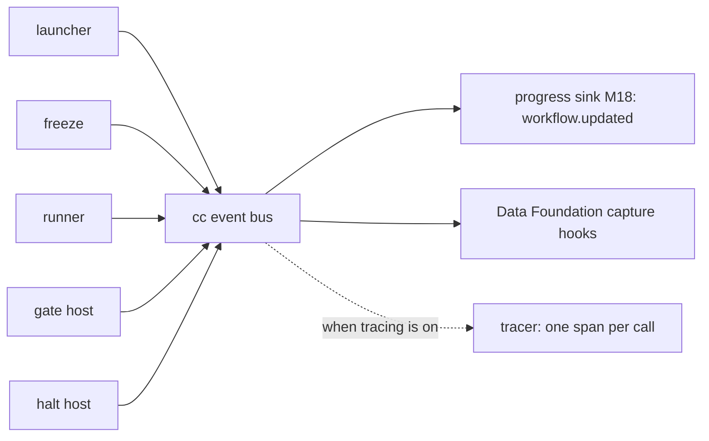

> **Draft: reopened 2026-10-02 for the join key and the build order below.** Previously checked. How M1 is observed, for now. The concept is on [observability and quality](../capsule/observability.md); this page is the M1 wiring.

# Observability at M1

**Records are the truth; events are the live feed.** Every capsule call, value, pin and gate decision is a record in the store ([ledgers](ledgers.md)). While a run is going, the CC hosts also announce what they do on **one event bus**. Every live consumer subscribes to that bus, and none of them reaches into a host.

## The events

The one definition of every CC event. Each carries `run_id` (or `candidate_id` at admission) and `at`. An event that describes a record is emitted **after** that record is written, so a subscriber can always read it. `cc.call.started`, `cc.call.resolved` and `cc.call.nested` describe no record yet; they only announce.

| Event | Emitted by | When | Also carries |
|---|---|---|---|
| `cc.run.started` | launcher | after the `run_plan` and `intake` are recorded | `run_plan` ref |
| `cc.run.frozen` | freeze | after all Bindings are written | `{step_id: binding ref}` |
| `cc.call.started` | runner | pipeline step 0 | `obs_id`, `caller`, `step_id` |
| `cc.call.resolved` | runner | after code is verified | `obs_id`, `decl_hash`, `code_sha256` |
| `cc.call.refused` | runner | a refusal in steps 1 to 6 | `obs_id`, reason |
| `cc.call.nested` | runner (broker) | a nested call starts | parent and child `obs_id` |
| `cc.model.turn` | runner (broker) | each finished model turn | `obs_id`, turn, elapsed, `model_hint`, `model_id`, `route_record_id` |
| `cc.call.finished` | runner | after the Observation is written | Observation ref, outcome, reason |
| `cc.gate.decided` | gate host | after the Verification is written | `step_id`, `obs_id`, Verification ref, decision, verdict |
| `cc.run.halted` | halt host | a halting verdict ended the run | `step_id`, verdict, Verification ref |
| `cc.run.finished` | launcher | the script returned | every step's envelope |

**The bus.** It is in-process: cc.events.subscribe(callback) and cc.events.emit(name, payload). Optional display/debug subscribers may fail without changing a run. Required lossless capture is a synchronous acknowledged [evidence API](storage.md#required-evidence-and-derived-views), not an ignored subscriber; missing capture blocks completion. Managed-runner events are relayed through authenticated supervisor IPC before publication. Cross-module control uses public APIs, never observer events.

## Who reads what

| Consumer | Reads | For |
|---|---|---|
| Progress sink (M18) | events | the browser's run view (`workflow.updated`), with each gate's verdict and the halt reason |
| Data Foundation | events live; records and content after the run | run records, bundles, scorecards, exports ([seams](../seams.md#data-foundation)) |
| Tracer (optional) | events | one span per capsule call, with the `cc.*` attributes on the [Observation](../schemas/observation.md#reuse) page |
| RSI | Data Foundation's exports | learning from real runs |
| Librarian (later) | records | Standing moves and Findings |
| A person debugging | records first, then spans if any | what ran, on which code, and why it stopped |

## One join key, one answer per question

*Reopened 2026-10-02; Muk confirmed the key and the build order. Not yet through the area loop.*

**Records are the only authority.** Events, spans and every export are derived views. A view never holds a fact the records lack, and a reader that disagrees with the records is wrong.

**`obs_id` is the one join key** for everything that happens inside a capsule call. Every other id is stored as a field on that call's [Observation](../schemas/observation.md), so any feed reaches the capsule, step, role and run through the Observation. No other id is a join key.

| Id | Where it lives | How it joins |
|---|---|---|
| `obs_id` | the Observation's own `id` | the key |
| `run_id`, `step_id`, `attempt` | fields of the Observation | read from the Observation |
| `decl_hash`, `capsule_name`, `role` | fields of the Observation (role from the Binding) | read from the Observation |
| model bridge `request_id` | stored on the Observation, in `ext.runner.turns[]` per turn | `request_id` to `obs_id`, then the rest |
| `route_id`, `route_record_id` | stored on the same turn entry | same |
| process or tool frame id | stored on the Observation's effect record | same |
| trace id and span id | stored on the Observation (`trace`); spans carry `cc.obs_id` | span to `obs_id` |

Every CC-owned message that crosses a process boundary (runner to bridge, supervisor to managed runner, runner to a confined process) carries `obs_id`, so a record can always be written under it. A message that cannot name an `obs_id` is refused, not logged anonymously.

**Which source answers which question.**

| Question | Source | Never |
|---|---|---|
| what happened, and was it right | records | an event or a span |
| what is happening now | bus events | |
| why was a call slow or costly | spans derived from records; CC emits its own until [issue 19](../open-issues.md) is settled | |
| attribution of a model call, by stage, role and capsule (the benchmark proxy) | a join on `obs_id` through the Observation, done by the reader | a field on the model request |
| raw evidence for replay and RSI | Data Foundation content, referenced from the Observation by hash | a copy kept anywhere else |

**Nothing about the pipeline goes to the model endpoint.** Stage, role and capsule never travel on the model wire. The [bridge request](environment.md#model-bridge) names only `request_id`, `run_id` and `obs_id`. A proxy sees only that and joins it itself. A dev-only trace event keyed by `request_id`, never forwarded upstream, may feed a benchmark proxy a live view; it is gated by the telemetry flags in [environment](environment.md).

## Build order for observability

Observability is built in the same thin slices as the capsules, because every check in the [build order](build-order.md) reads it. The event bus is not first.

| Build step | Add | Check |
|---|---|---|
| 1 | the Observation and the content store, written only by the runner, keyed by `obs_id` | a second call produces a second Observation; the same input gives the same output hash; a changed body is refused and recorded |
| 2 | the model-turn entries (`request_id`, prompt and reply hashes) on the Observation | the turn replays with no network; `request_id` resolves to its `obs_id` |
| 3 | the Verification record, and the `cc.gate.decided` event | a failing check is readable from the Verification alone |
| 4 | the remaining events and durable halt records | resume after a kill reads records only |
| 5 to 7 | spans derived from records, then the Data Foundation export | a span's `cc.obs_id` resolves to exactly one Observation |

Until step 3 the runner writes records only. Required Data Foundation capture ([storage](storage.md#required-evidence-and-derived-views)) stays a separate acknowledged call, and its failure semantics are decided at step 4, not before.

## M1 limits, stated plainly

- **Required raw capture is enabled for M1**, including Codex model turns and tool/process frames. Optional native sampled spans may be unavailable in Codex mode; that does not excuse absent mandatory execution evidence.
- **No token counts.** The Codex service reports none, so `cost.tokens` stays empty until a router or provider reports them.
- **Broker/process operations are captured and compared to declarations.** Denied undeclared calls fail the capsule. Any operation class without verifiable enforcement/capture remains explicitly unsupported, as the [environment profile](environment.md) and issue 54 state; absence of a span is not evidence of absence of effects.
