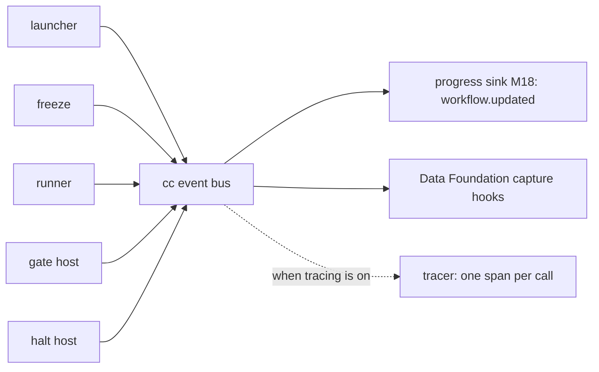
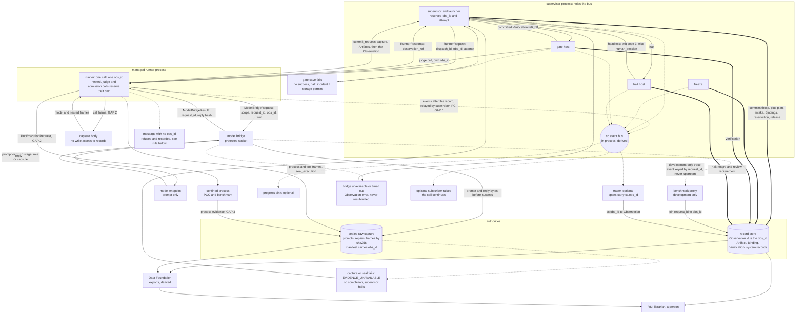

# Observability at M1

PRD: 5.1.1, 5.1.2, 4.5.3

> Answers: Which events does M1 emit and which question does each answer?

## Purpose

The concept is on [observability and quality](../capsule/observability.md); this page is the M1 wiring.

**Records are the truth; events are the live feed.** Every [capsule](../capsule/capsule.md#term-capability-capsule) call, value, pin and gate decision is a record in the store ([ledgers](ledgers.md)). While a run is going, the CC hosts also announce what they do on **one event bus**. Every live consumer subscribes to that bus, and none of them reaches into a host.

## Key terms

| Term | Meaning |
|---|---|
| **obs_id** | The Observation's own id, and the one join key for everything inside a capsule call: Artifacts, captures, nested and judge calls. The supervisor reserves it before the call starts. |
| **Record vs event** | A record is a durable fact in the store and is the authority. An event is a best-effort live notice on the event bus for views only, and nothing may depend on receiving it. |
| **Event bus** | The in-process channel (`cc.events.emit`, `cc.events.subscribe`) on which the CC hosts announce what they do. Display subscribers may fail without changing a run. |

## Interface: the events

This public bus serves research [runs](lifecycle.md#term-run) and published admission candidates. Private [RSI](../rsi.md#term-rsi) controller and oracle model calls use the scoped private audit/capture contracts in [environment](environment.md#model-call-scope-and-private-capture) and [storage](storage.md). They do not invent run or Candidate IDs or emit prompt/reply references on this bus. Only authorized aggregate oracle results cross fixture custody; benchmark export cannot resolve private capture references.

The one definition of every CC event. Each carries `run_id` (or `candidate_id` at admission) and `at`. An event that describes a record is emitted **after** that record is written, so a subscriber can always read it. `cc.call.started`, `cc.call.resolved` and `cc.call.nested` describe no record yet; they only announce.

| Event | Emitted by | When | Also carries |
|---|---|---|---|
| `cc.run.started` | launcher | after the prep `run_phase_started` record and `intake` are recorded | `run_plan` ref |
| `cc.run.frozen` | supervisor ([validator](planner.md#term-plan-validator) and binder) | once per freeze, after that phase's [Bindings](../schemas/binding.md#term-binding) are all written (phase `prep` at launch, phase `planned` after the [planned plan](../types/run-plan.md#term-planned-plan) is validated and bound) | `phase`, `run_plan` ref, `{step_id: binding ref}` |
| `cc.call.started` | runner | pipeline step 0 | `obs_id`, `caller`, `step_id` |
| `cc.call.resolved` | runner | after code is verified | `obs_id`, `decl_hash`, `code_sha256` |
| `cc.call.refused` | runner | a refusal in [steps](nodes.md#term-step) 1 to 6 | `obs_id`, reason |
| `cc.call.nested` | runner (broker) | a nested call starts | [parent and child](../capsule/rsi.md#term-parent-and-child) `obs_id` |
| `cc.model.turn` | runner (broker) | each finished model [turn](model-bridge.md#term-model-turn) (announce only) | `obs_id`, turn, elapsed, `model_hint`, `model_id`, `route_record_id` |
| `cc.call.finished` | runner | after the supervisor committed the [Observation](../schemas/observation.md#term-observation) | Observation ref, outcome, reason |
| `cc.gate.decided` | gate host | after the [Verification](../schemas/verification-record.md#term-verification) is written | `step_id`, `obs_id`, Verification ref, decision, verdict |
| `cc.run.halted` | halt host | any halt ended the run, with or without a [Gate](../verification.md#term-gate) verdict | reason and `reason_owner`; `step_id`, verdict, Verification ref when they exist |
| `cc.run.finished` | launcher | the script returned | every step's envelope |

Schema: `execution-v1.schema.json#event_envelope` (one variant per event name; the runner-to-supervisor relay frame is `execution-v1.schema.json#runner_event`).

**The bus.** It is in-process: cc.events.subscribe(callback) and cc.events.emit(name, payload). Optional display/debug subscribers may fail without changing a run. Required lossless capture is a synchronous acknowledged [evidence API](storage.md#behavior-required-evidence-and-derived-views), not an ignored subscriber; missing capture [blocks](modules.md#term-block) completion. Managed-runner events are relayed through authenticated supervisor IPC before publication. Cross-module control uses public APIs, never observer events.

## Behavior: who reads what

| Consumer | Reads | For |
|---|---|---|
| Progress sink (M18) | events | the browser's run view (`workflow.updated`), with each gate's verdict and the halt reason |
| [Data Foundation](storage.md#term-data-foundation) | events live; records and content after the run | run records, bundles, scorecards, exports ([seams](seams.md)) |
| Tracer (optional) | events | one span per capsule call, with the `cc.*` attributes on the [Observation](../schemas/observation.md#reuse) page |
| RSI | Data Foundation's exports | learning from real runs |
| Librarian (later) | records | Standing moves and [Findings](../schemas/finding.md#term-finding) |
| A person debugging | records first, then spans if any | what ran, on which code, and why it stopped |

## One join key, one answer per question

**Two authorities, one key.** The record store is the authority for decisions and lineage: what was called, with what, what came out, what the gate said. The sealed raw capture is the authority for evidence that cannot be recreated: prompts, replies, process frames ([storage](storage.md#behavior-required-evidence-and-derived-views)). Both carry `obs_id`, and the Observation names its capture manifest, so one key reaches both. Events, spans, Data Foundation exports and every reader's view are derived. A derived view never holds a fact the two authorities lack.

**`obs_id` is the one join key** for everything inside a capsule call. It is the Observation's own `id`. Every other id is stored where the table below says, and joins through `obs_id`.

Solid lines are data flow, double lines are record writes, dotted lines are events or [derived views](storage.md#term-derived-view). `GAP n` points to the table of gaps below.

**Where each id is stored, and what exists today.**

| Id | Stored in | Exists today? | Change required |
|---|---|---|---|
| `obs_id` | the Observation's `id` | yes | none |
| `run_id` | the Observation's `scope` | yes | none |
| `attempt`, `decl_hash`, `caller`, `binding_ref` | Observation fields | yes | none |
| `step_id`, `capsule_name`, `role` | not on the Observation. Reached through `binding_ref`, which for a nested call is the caller's Binding, and is null for an admission call | no | add `step_id`, `capsule_name` and `role` as Observation fields set by the runner for every call [kind](../capsule/capsule.md#term-capsule-kind), null where none applies ([observation](../schemas/observation.md)). Without them, per-capsule attribution is wrong for nested calls |
| [model bridge](model-bridge.md#term-model-bridge) `request_id` | the turn entry in `ext.runner.turns` | no: the entry has `session_id` but no `request_id` | add `request_id` to the turn entry, and promote `turns` from `ext.runner` (declared not part of the record's meaning) to a checked Observation field ([runner](../capsule/runner.md)) |
| `route_id` | the turn entry, as `route_record_id` | partly: one field holds either the capsule's `route_id` or the gateway's id | split it into `route_id` and `gateway_route_id` |
| process or tool frame id | the capture manifest, under `obs_id`. Not on the Observation | the manifest exists, with no frame ids | frames are indexed in the manifest; the Observation does not carry them ([storage](storage.md)) |
| trace and span id | the Observation's `trace`. Spans carry `cc.obs_id` | yes | none |

**Which source answers which question.**

| Question | Source | Never |
|---|---|---|
| what happened, and was it right | records | an event or a span |
| the exact prompts, replies and process output | sealed capture, found through the Observation's manifest | |
| what is happening now | bus events | |
| why was a call slow or costly | spans. CC writes its own from records. The native tool span the runner stamps is a debugging extra, not a source of facts | a span as the only copy of a fact |
| attribution of a model call (the benchmark proxy) | a reader-side join on `obs_id` through the Observation | a field on the model request |
| Data Foundation exports | read from records and capture after the fact. A live bus feed is optional | |

The per-turn record the runner keeps for each bridge request is `execution-v1.schema.json#runner_turn_entry`. The [bridge request](model-bridge.md) carries the canonical ModelCallScope, [request_id](../contracts/principles.md#term-request-id), reserved obs_id/turn and scoped capture reference. The trusted adapter resolves authorized prompt bytes and sends those to the selected model; local pipeline identity remains audit metadata. Native thread identity derives from the scope hash and request_id/obs_id/turn without exposing fixture labels. Provider metadata transmission must be checked against the pinned transport at implementation validation; it is not assumed private. ModelCallContext supplies trusted local attribution, with nullable capsule identity for non-capsule orchestration.

Every model turn and its cancel/status request carries the same authorized scope, obs_id and turn. Management uses a distinct request_id and names the target_request_id. Private RSI/oracle obs_id identifies private call evidence, not a public Observation. Pre-call startup/doctor and AuthProvider account/login status use their separate management APIs and system audit IDs; they are not model_bridge_request operations and do not invent call reservations. Refusals use the scope's authorized audit writer, or an incident when that storage cannot be written.

### Gaps and proposed resolutions

| # | Gap | Proposed resolution | Page to change |
|---|---|---|---|
| 1 | which process hosts the bus. Runner events cross a process boundary, and the runner protocol has no event frame | the supervisor hosts the bus. Add a `RunnerEvent` frame to the runner protocol (`execution-v1.schema.json#runner_event`), sent after its record is committed | [lifecycle](lifecycle.md), [runner](../capsule/runner.md) |
| 2 | `obs_id` on runner-to-tool-host and runner-to-confined-process frames (the tool-host frames carry an integer `id`) | add `obs_id` to both frame [families](../contracts/principles.md#term-message-family) | [runner](../capsule/runner.md), [process boundary](../capsule/process-boundary.md) |
| 3 | who writes the confined process's evidence into capture | the supervisor's process service, under the `obs_id` of the call that launched it | [storage](storage.md), [process boundary](../capsule/process-boundary.md) |
| 4 | [halts](lifecycle.md#term-halt) with no [gate verdict](../capsule/gate-host.md#term-gate-verdict) (gate-save failure, capture failure) emit no event, so the progress sink cannot show a reason | `cc.run.halted` covers every halt, with its `reason_owner` (the schema makes reason and reason_owner required). `cc.run.finished` follows a halt | this page |
| 5 | `cc.model.turn` and `cc.call.refused` fire before the Observation exists | they describe no record yet, so they join the announce-only list with `cc.call.started` | this page |
| 6 | the development trace flag does not exist | add `cc.telemetry.bridge_trace` (default false, development only). The proxy reads the trace sink, never the protected socket | [environment](environment.md) |
| 7 | the freeze step is named as an event emitter, but lifecycle gives validate, bind and freeze to the supervisor | the supervisor emits `cc.run.frozen` | this page |
| 8 | the Observation's own page says the call's details are on agent-core's span, which contradicts "records are authority" | reword it: spans are sampled and may expire, and hold nothing the records and capture lack | [observation](../schemas/observation.md) |

## Failure

| Situation | Outcome | Recovery |
|---|---|---|
| An optional display or debug subscriber fails | no change to the run | none needed |
| Required lossless capture is missing | completion is blocked (`EVIDENCE_UNAVAILABLE`, [storage](storage.md#behavior-required-evidence-and-derived-views)) | restore capture, then explicit review |
| Native sampled spans are unavailable in Codex mode | does not excuse absent mandatory execution evidence | none; records stay the authority |

## Tests: build order for observability

Row in [test surfaces](test-surfaces.md#verification-table): [V31](test-surfaces.md#verification-table). The Check column below gives the observation per slice.

Observability is built in the same thin slices as the capsules, because every check in the [build order](../build-order.md) reads it. Slices 1 to 4 are built inside build-order steps 0 to 4; slices 5 to 7 with step 10. Each row says what it needs from earlier slices.

| Slice | Add | Needs | Check |
|---|---|---|---|
| 1 | the Observation and the content store, committed only by the supervisor on the runner's request, keyed by `obs_id` | a **stub reservation**: a single-process counter hands out `obs_id` and `attempt`. The supervisor's durable reservation replaces it at slice 4 | a second call produces a second Observation. The same input gives the same output hash. A changed body is refused and the refusal recorded |
| 2 | the model bridge with sealed capture, and the turn entries with `request_id` | slice 1, and the Observation changes in the table above | the turn replays with no network. `request_id` resolves to exactly one `obs_id`. The prompt bytes in capture match the bridge request |
| 3 | the Verification record, and an event bus **skeleton** (emit and subscribe only, with no sink) so `cc.gate.decided` can be emitted | slices 1 and 2 | a failing check is readable from the Verification alone. A test subscriber receives `cc.gate.decided` after the Verification is readable |
| 4 | the supervisor's durable reservation, halt records, the `RunnerEvent` frame and the remaining events | slice 3 | kill the process between steps and resume from records alone. Every halt, including a gate-save failure, emits `cc.run.halted` |
| 5 | spans written from records, with `cc.obs_id` | slice 4 | each span's `cc.obs_id` resolves to exactly one Observation |
| 6 | the progress sink and the tracer as subscribers | slice 5 | removing a subscriber changes no record and no run result |
| 7 | the Data Foundation export, read from records and capture | slice 6 | the export's row count equals the records, and a missing capture blocks completion |

Required capture is decided already: a missing capture blocks completion (`EVIDENCE_UNAVAILABLE`, [storage](storage.md#behavior-required-evidence-and-derived-views)). It is built at slice 2 with the bridge, not deferred.

## M1 limits, stated plainly

- **Required raw capture is enabled for M1**, including Codex model turns and tool/process frames. Optional native sampled spans may be unavailable in Codex mode; that does not excuse absent mandatory execution evidence.
- **No token counts.** The Codex service reports none, so `cost.tokens` stays empty until a router or provider reports them.
- **Broker/process operations are captured and compared to declarations.** Denied undeclared calls fail the capsule. Any operation class without verifiable enforcement/capture remains explicitly unsupported, as the [environment profile](environment.md) states; absence of a span is not evidence of absence of effects.
