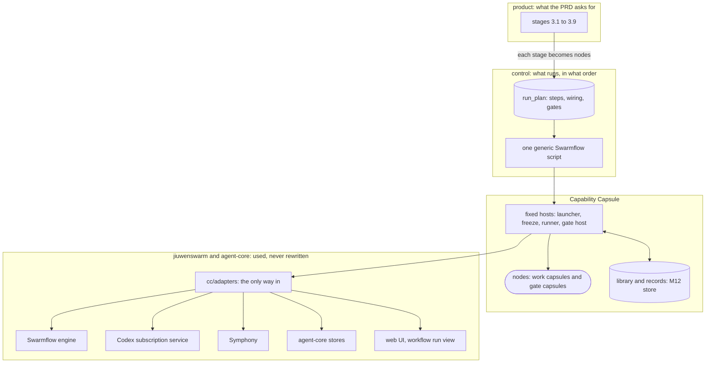

> **Draft: reopened for changed shared contracts.** The system layer: where Capability Capsule sits between the PRD's pipeline and the existing jiuwenswarm and agent-core code. Start here.

# Where CC fits

The M1 system is a pipeline of **nodes**. Every node is one capsule doing one job at one step of a run: compiling the intent, gating it, writing the Research Brief, and so on. **Capability Capsule (CC)** is the layer that makes every node the same kind of thing: declared first, pinned by hash, run by one runner, gated, and recorded. Under CC sit jiuwenswarm and agent-core, which CC uses and never rewrites.

## The four layers

| Layer | Owns | Defined in |
|---|---|---|
| **Product** | what each stage must achieve, and by which milestone | [PRD](../../product/README.md); we never write it |
| **Control** | which node runs at which step, what feeds it, and which gate checks it | the [`run_plan`](../types/run-plan.md) value, and the one generic Swarmflow script that walks it ([nodes](nodes.md)) |
| **Capability Capsule** | every node's contract, its code by hash, how it runs, how it is checked, and every record | [capsule/](../capsule/capsule.md), [schemas/](../schemas/schemas.md), [types/](../types/types.md), [runner](../capsule/runner.md), [toolchain](../capsule/toolchain.md) |
| **Existing platform** | the engine, the model runtime, storage, the planner index, the UI | jiuwenswarm and agent-core, reached only through `cc/adapters/` ([integration](integration.md)) |

## How each layer talks to the next

There is exactly one way across each boundary.

| From | To | The one way | Datatype |
|---|---|---|---|
| Product | Control | an architect turns each PRD stage into nodes on a [node page](nodes.md#node-spec-template), and adds them to the run plan | `run_plan` |
| Control | CC | the launcher records the run plan; freeze turns it into Bindings; the generic script asks the runner to run each step | `run_plan`, Binding, call descriptor, envelope |
| CC | CC | modules talk only through records in the store and the runner's events | the [records](../schemas/schemas.md) |
| CC | Existing platform | only through one adapter per system in `cc/adapters/` | each adapter's API on [integration](integration.md) |

## What is a capsule, and what is not

Every **node** is a capsule. The few pieces that are not nodes stay control code, and each is a fixed host with no stage logic in it:

| Piece | A capsule? | Why |
|---|---|---|
| work node: intent compiler, requirement compiler, search, and the rest | yes | it does the work of one step |
| gate node: the capsule that checks one work node | yes | it decides whether the run may go on ([nodes](nodes.md#gates)) |
| planner (Phase 2) | yes | it produces a `run_plan` value |
| delivery (writing the report file) | yes | it is the last step's work |
| launcher, freeze, runner, gate host | no: fixed hosts | they run nodes; a node cannot run itself, and the referee must stay out of reach of RSI ([trust](../capsule/trust.md)) |
| admission, the librarian, the store | no | they are not steps of a run ([capsule rule 1](../capsule/capsule.md#rules)) |

**The test for a host:** it holds no knowledge of any stage. If a change to one stage would need a change to a host, the design is wrong. That knowledge belongs in a node or in the run plan.

## Where to read next

- [Nodes](nodes.md): what a node is, its life from declared to recorded, locked against planned nodes, the run plan, and the template every node page follows.
- [Integration](integration.md): every place CC code meets existing code, cited to the line.
- [Observability](observability.md) and [ledgers](ledgers.md): what is recorded, where, by whom, and what each consumer reads.
