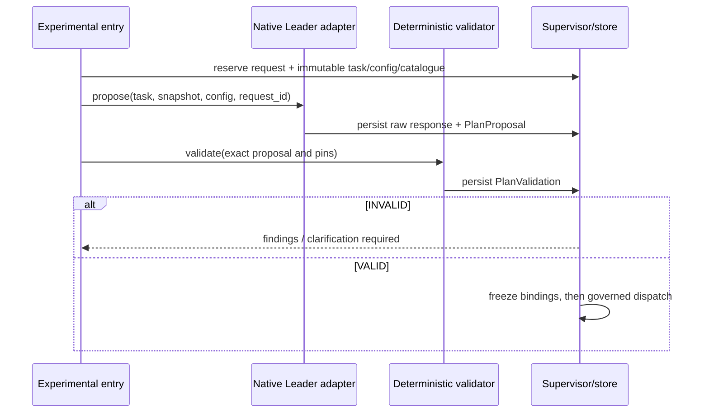

# Isolated capability planner and deterministic plan validation

PRD 3.2.4, 4.1.2 and 6.12 permit the native Cluster Mode Leader to discover admitted capabilities and plan in an isolated experiment. The planner is an orchestration service, not a capsule. Phase 1 supplies its fixed plan to the same validator and never invokes this model planner.

## Placement and interface

The sole public wire-shape owner is [services-v1 JSON Schema](../contracts/services-v1.schema.json): planner_request, planner_proposal, validation_request, plan_validation and error. API positional arguments below are shorthand for these closed request objects. Proposal/result references use the common id/hash encoding; their artifacts validate against the matching schema before publication.

`cc/planning/service.py` owns planning; `cc/planning/validate.py` owns pure validation; `cc/adapters/leader.py` alone imports the native team types. Reuse `LeaderSpec` and `TeamAgentSpec.build` from agent-core `9e339019`, `openjiuwen/agent_teams/schema/blueprint.py`, and `is_team_plan_enabled` from `runtime/team_plan.py`. This reuses Leader identity/configuration, not unrestricted native delegation or native plan approval as CC authorization. The default planner model is `gpt-6.1-sol` through the protected model bridge. Model support is checked at startup; an unavailable configured model gives `MODEL_UNAVAILABLE`, with no silent substitution.

The authoritative planning API is `propose(task_ref, library_snapshot_ref, experiment_config_ref, request_id) -> PlanProposalRef`. `task_ref` is an immutable validated `research_brief`; snapshot entries expose capability names, exact versions/hashes, ports, effects, limits and admitted status, without hidden fixtures or credentials. The proposal contains the canonical `run_plan`, pinned capability selections, an objective-to-output mapping, budget estimates, and references to the three inputs. These metadata accompany the plan in an immutable proposal artifact; they do not extend `run_plan` invisibly. [Environment](environment.md) owns `cc.planner` keys: model_id defaults gpt-6.1-sol, proposal_timeout_s 120, max_nodes 32, max_proposals_per_submission 1, and required prompt_sha256 when enabled. Policy bounds remain authoritative. A request is one model proposal; no automatic model retry or autonomous repair loop occurs.

`validate(plan_ref, task_ref, library_snapshot_ref, policy_ref, request_id) -> PlanValidationRef` is independently callable and makes no model call. Its schema records exact input references, VALID/INVALID and structured findings. Only VALID includes a normalized immutable plan reference and has zero findings; INVALID requires findings and cannot carry a validated plan. Normalization canonicalizes bytes without rearranging nodes, adding capabilities or inventing bindings. Invalid references produce `INVALID_REFERENCE`; wrong type/version gives `TYPE_MISMATCH`; changed request bytes give `REQUEST_CONFLICT`. Proposal timeout/cancellation is terminal for that request. An identical duplicate returns existing proposal/current state; explicit resubmission uses a fresh request identity and preserved prior evidence.

## Validation and dispatch authority

Validate unique nodes, topological order/acyclicity, reachable terminal outputs, exact typed ports or an explicitly pinned adapter, availability of every launcher input, dependency closure, admitted versions, effect/permission bounds, maximum nodes, cumulative declared resource/time limits, and required Gate profiles. Every mandatory Brief objective must map to a declared final output and criterion reference. This checks structural coverage; it does not claim to prove scientific success. Mechanical helpers are launcher preparation or fixed work-capsule internals, not arbitrary planner nodes. The model cannot supply source code as a plan node.

The supervisor accepts only a VALID result matching the exact proposal/input hashes, then freeze re-resolves and pins dependencies. Neither model prose, native task approval, nor a stored proposal can release a node. After dispatch begins, the graph is immutable. A failed node follows normal halt/review; the planner receives no permission to rewrite a live plan.

Rejection returns findings to the experimental entry. A human may supply a new Brief or authorize another proposal. Dynamic Intention Compiler clarification occurs only in its separately enabled experiment before freeze. The planner has catalogue-read and model-call access only; it cannot activate aliases, inspect private RSI fixtures, write policies, or execute proposed workload code.

## Evidence, precedent and replacement

Freeze resolves the exact reviewed library snapshot, not current active aliases. Test activation between validation and freeze: the old validated version remains pinned, unless current revocation denies it; no substitute is selected. Any snapshot mismatch produces zero dispatches. An isolated ablation disabling a capability is valid only if it has no required downstream output; otherwise reject it. Replacements must preserve exact output ports/schema versions. M1 does not synthesize missing data or install input substitutes to make a skipped required producer appear successful.

Store writes proposals, raw turns, validation results and effective configuration through the trusted supervisor; all carry request/run correlation and immutable pins. This borrows typed component binding from [Kubeflow](https://www.kubeflow.org/docs/components/pipelines/reference/component-spec/) and deterministic rejection of invalid build graphs from [Bazel's dependency graph](https://bazel.build/concepts/dependencies). A model proposes, a deterministic authority admits executable structure. The Leader adapter can be replaced behind `propose`; validator changes require replaying the plan fixtures and updating its policy pin.

Fixtures independently exercise a valid fixed plan, missing producer, wrong type/version, cycle, unreachable objective, unavailable alias, forbidden effect, budget overrun, missing Gate and model timeout. Also verify an INVALID result and a failed validation write cause zero dispatches. A SkillFuzz-style fixture campaign varies input shape and planted faults without adding autonomous peer reviewers or runtime fuzzing to M1.
