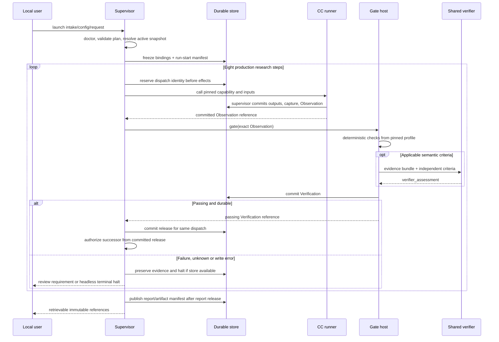
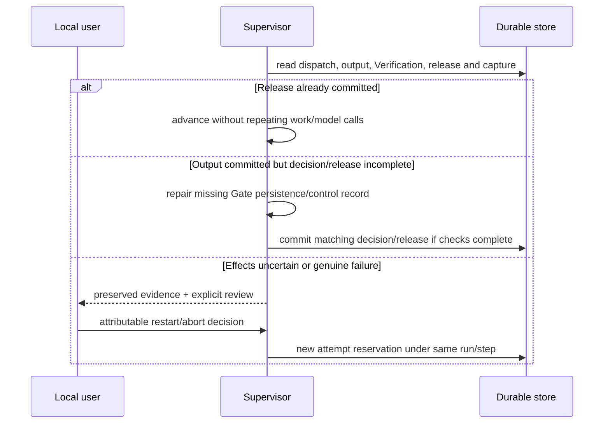
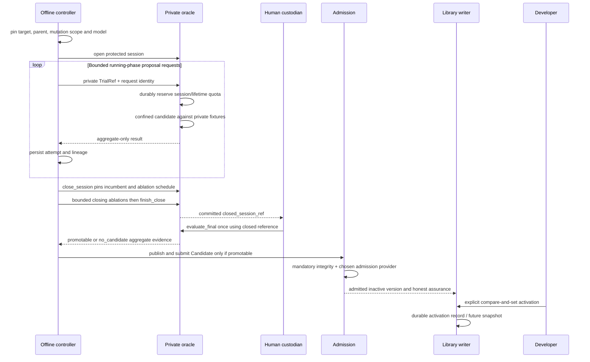

# Temporal flows and durable authority

[Spatial diagram](diagram.md) maps modules and typed connections. These diagrams map order and persistence; arrows do not grant authority. [Lifecycle](lifecycle.md) owns recovery, [pipeline](../m1/pipeline.md) owns stage order, and [records](records.md) owns durable identities.

## One governed step

The deployment order is image/volume validation → identity bootstrap → store recovery → model bridge → security/fixture doctor → runner → HTTP readiness. This is one container's internal startup, owned by [deployment](deployment.md). The benchmark harness obtains an approved profile, submits a request, polls the durable handle, requests an export after completion/halt/abort, and retrieves its manifest-listed artifacts via the [HTTP API](benchmark-export.md#docker-http-transport). A transport disconnect never repeats accepted research work.

The runner's store arrows are requests to the sole trusted writer, not direct child filesystem access. A passing in-memory decision cannot release work. A scientific negative/inconclusive result continues when its infrastructure Gate passes; integrity failure stops advancement.

## Restart after interruption

No crash proves that an effect did not happen. Raw model response and gate-call reservations determine whether missing persistence can be repaired without another call. If evidence is insufficient, recovery requires explicit action and a new attempt. All store failure paths return truthful diagnostics without claiming a durable halt was written.

## Offline RSI and activation

Puppet admission may grant exempt standing after mandatory integrity; it cannot produce a runtime Gate PASS or activate a candidate. Existing run pins survive later activation. Query details and separate final budget live in [oracle](../capsule/fixture-oracle.md).

The isolated planner and benchmark export have their own ordered sequences in [planner](planner.md) and [benchmark export](benchmark-export.md). Their manifests expose track and deviations; they cannot silently become production acceptance.
