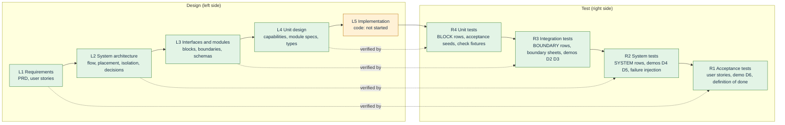

# V model: what each design level is tested by, and where we are

PRD: 1.5, 6.2

> Answers: for each level of design, which tests prove it, where are those tests written, and how far along are we?

Each design level on the left has a test level on the right that proves it. A change on the left makes the paired tests on the right `STALE`.

## Pairs and where to find them

| Design level | Design artifacts | Paired test level | Test artifacts | Test level in rows |
|---|---|---|---|---|
| L1 Requirements | PRD, [user stories](stories.md), [prd map](prd-map.md) | R1 Acceptance | story "must observe" lines, demo D6, PRD 1.5 definition of done | SYSTEM |
| L2 System architecture | [flow](flow.md), [placement](placement.md), [isolation](isolation.md), [decisions](decisions.md), [runtime](runtime.md) | R2 System | Demos D4, D5, D6, failure-injection cases in [verification](verification.md), quality attributes | SYSTEM |
| L3 Interfaces and modules | [modules](system/modules.md) [seams](system/seams.md#term-seam), [boundaries](contracts/boundaries.md), [contract schemas](contracts/README.md) | R3 Integration | boundary [fixtures](system/test-surfaces.md#term-fixture) (valid and rejected), BOUNDARY rows in [test surfaces](system/test-surfaces.md), [demos](build-order.md#term-demo) D2, D3 | BOUNDARY |
| L4 Unit design | [capabilities](capabilities/README.md), module specs, [types](types/types.md), [Declarations](capsule/fields.md#term-declaration) | R4 Unit | Acceptance seeds `cap.<name>.AC-nn`, BLOCK rows, check fixtures and type fixtures | BLOCK |
| L5 Implementation | code under `cc/`, `cc_sdk/`, `capsules/` | ([test suites](schemas/checks.md#term-test-suite) R4 to R1) | not started | |

Level names in test rows come from the coding side's plan template: BLOCK is the unit level (R4), BOUNDARY is the integration level (R3), SYSTEM is the system level (R2). Acceptance (R1) is the SYSTEM rows run against the user stories. [V rows](system/test-surfaces.md#term-v-row) V01 to V45 are in [test surfaces](system/test-surfaces.md).

## Key terms

| Term | Meaning |
|---|---|
| **BLOCK** (also: BLOCK rows) | The verification level for one block, paired with unit design. It is exercised through the block's public API with fake neighbours. |
| **BOUNDARY** (also: BOUNDARY rows) | The verification level for one boundary between blocks, paired with interfaces. It uses valid and rejected fixtures on both sides. |
| **SYSTEM** (also: SYSTEM rows) | The verification level for the whole integrated system, paired with architecture and requirements. It covers demos, failure injection and the user stories. |

## Where we are

| Level | Design | Test specified | Test executed |
|---|---|---|---|
| L1 / R1 | PRD received. 24 M1 stories written (US-18 is future). 9 PRD [deviations](decisions.md#term-deviation) accepted | stories have "must observe". D6 defined | not run |
| L2 / R2 | flow, placement, isolation, decisions written | SYSTEM rows and demos written | not run |
| L3 / R3 | [blocks](system/modules.md#term-block) B01 to B29, 23 [boundary sheets](contracts/principles.md#term-boundary-sheet), 4 contract files (189 defs) | boundary fixtures valid and rejected. BOUNDARY rows written | schema and fixture [checks](capsule/fields.md#term-check) run (documentation only). No product tests |
| L4 / R4 | 13 capabilities, module specs, types | [acceptance seeds](system/test-surfaces.md#term-acceptance-seed) on 21 pages, BLOCK rows | type and example checks run. No product tests |
| L5 | not started | | |

**We are at the bottom-left of the V.** Design and test specifications exist for all four levels. Nothing has been implemented, so no test has been run against product code. Documentation checks (lint, links, schema and fixture validation) show the design is consistent. They do not show it works.

## How the build order uses the V

Each build step is a small V ([build order](build-order.md)):

1. Read the module spec (L4) and its boundary sheet (L3).
2. Write the unit tests from the acceptance seeds and fixtures (R4) before the code.
3. Write the code (L5).
4. Run the unit tests, then the boundary tests with the neighbour's fixtures (R3).
5. Run the step's demo (R2). When a user story's demo passes, mark that story's evidence (R1).

The big V is the same shape at project scale: demos D0 to D3 are the lower right, D4 to D5 the middle, D6 with all stories is the top right.

## Rules

- **Trace both ways.** Every requirement (PRD clause or story) points down to design and across to its test. Every test points back to what it proves. [prd map](prd-map.md) and the story support table are the traces.
- **A left-side change makes the paired tests `STALE`.** A schema change, for example, makes every fixture and boundary test for it stale until rerun.
- **Do not skip a level.** A unit pass is not an integration pass, and a demo is not a story pass.
- **Results use one vocabulary:** `PASS`, `FAIL`, `BLOCKED`, `NOT_RUN`, `STALE`, `N/A` ([terms](decisions.md#key-terms)).
