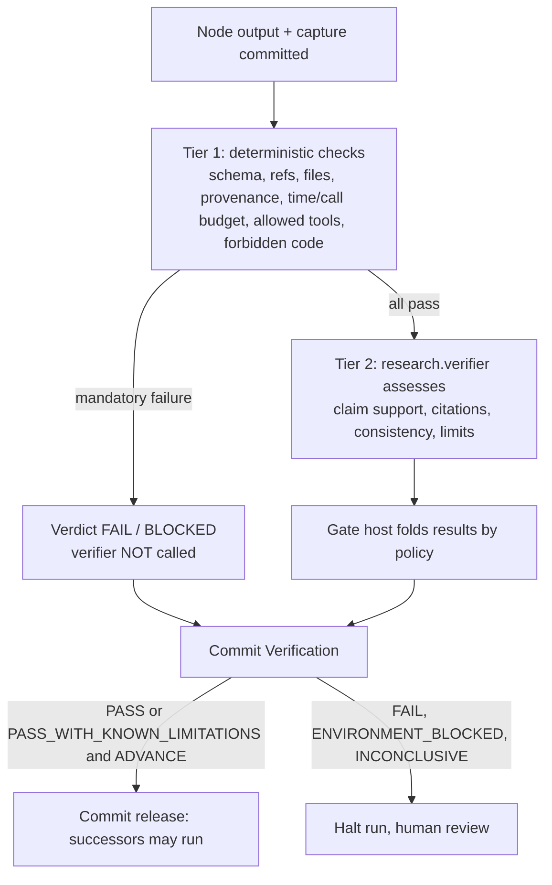

# Verification: how Gates work and how we test

PRD: 2.8, 4.2.1, 4.2.2, 4.2.8, 4.2.9

> Answers: How are Gates, verdicts and tests defined?

## Rules

1. **The verifier is a CC.** `research.verifier` is one admitted capability. It is reused at every Gate. It takes one `evidence_bundle` and returns one `verifier_assessment`. It cannot release anything.
2. **Every dispatch call has a Gate.** The intent call, the one requirement call, each planned node. Nothing consumes an ungated output. A nested [operator](capabilities/README.md#term-operator) call (`op.*`) gets a mechanical [Verification](schemas/verification-record.md#term-verification) persisted before it returns and is covered by its parent node's Gate. The nested verifier review inside `research.compile_intent` is validated by the calling [capsule](capsule/capsule.md#term-capability-capsule) and is not itself Gated.
3. **The verifier [checks](capsule/fields.md#term-check) the result of the node.** Not the library entry. The node is the task-specific use of a CC; the verifier sees its actual output and captured effects.
4. **Tests come from the [Declaration](capsule/fields.md#term-declaration).** A trusted builder compiles a test for each node from the producer's Declaration (output schema, [ports](capsule/fields.md#term-port), checks, effects, permissions, allowed failures) plus mandatory host checks. It places the Gate right after the node. A Declaration obligation the builder cannot test fails freeze. Nothing is silently skipped.
5. **Gates stop or change control flow.** Only a committed advancing Verification plus a committed release lets a successor start.
6. **Gate-role CCs have zero RSI-mutable components.** `evolution.rsi: none`, `evolution.may_change: []`. M1 [RSI](rsi.md#term-rsi) cannot touch the verifier's prompt, body, checks, dependencies or criteria. So "capsule X has success rate Y" compares against a fixed verifier. A human referee revision starts a new comparison cohort.
7. **Nothing judges itself.** The [Gate host](capsule/gate-host.md#term-gate-host) validates the verifier's own answer directly; the verifier's call is not itself Gated.

## Key terms

| Term | Meaning |
|---|---|
| **Gate** (also: Gates) | The check placed right after a work node that stops or releases control flow. Deterministic checks run first, then the verifier, and the host folds them into one durable Verification. |
| **Tier 1** | The deterministic checks of a Gate: schema, references, files, provenance, budgets and required evidence. A mandatory failure spends no verifier call. |
| **Tier 2** | The independent `research.verifier` assessment of claim support, citations, consistency and limits. It runs only when Tier 1 passes and cannot release anything. |
| **Declaration-derived test** | The test a trusted builder compiles for each node from its producer's Declaration plus host policy and places directly after the node. An obligation it cannot test fails freeze. |

## Count and scope

| Question | Answer |
|---|---|
| How many verifier CCs? | **One identity**, `research.verifier`. Many call sites reuse it through pinned criteria profiles. |
| How many Gates per run? | One per dispatch call: 1 intent + 1 for the requirement call (`research.compile_brief`) + one per planned node. Intent is a bounded loop (compile, validate, nested review, repair; `intent.max_repairs` default 1, hard cap 4) but it is one call with one Gate. |
| What does one Gate see? | Its producer's output, captured evidence, declared vs observed effects, pinned criteria. Not later [steps](system/nodes.md#term-step). |
| Who decides? | Gate host code, called by `CcBackend` on the supervisor side, folds checks into one Verification. The verifier only assesses. Order: runner returns, supervisor commits, then Gate, then release. |
| Where do criteria live? | Pinned Gate profiles ([profiles](schemas/profiles.md)); a producer cannot choose its own. |

## Two tiers

## Verdicts

| Verdict | Meaning | Supervisor does |
|---|---|---|
| `PASS` | all mandatory checks passed | continues |
| `PASS_WITH_KNOWN_LIMITATIONS` | passed; limits recorded | continues, carries warnings |
| `FAIL` | mandatory defect | halt |
| `ENVIRONMENT_BLOCKED` | runtime or dependency problem, not an artifact defect | halt |
| `INCONCLUSIVE` | evidence insufficient | halt for review |

A declared failure mode of a capsule (for example `NO_ELIGIBLE_OPPORTUNITY`) ends the call with outcome `error` and its declared failure code. The Gate host maps it to `INCONCLUSIVE` with routing HALT and ESCALATE_TO_HUMAN. It is not `FAIL`, not a capsule fault and not a scientific negative result ([V40](system/test-surfaces.md)).

Infrastructure verdict is not scientific verdict. A correctly produced scientific `FAIL` in an evaluation result gets infrastructure `PASS` and goes on to the report. Exact fold rules: [Gate host](capsule/gate-host.md). Fields: [Verification](schemas/verification-record.md).

## Test policy

Quality comes from independent checks at every size of boundary. Nobody certifies their own work.

| Level | What is tested | How | Evidence that counts |
|---|---|---|---|
| Block | one module or CC through its public API with fake neighbours | fixed [test cases](schemas/checks.md#term-test-case), injected faults, no live model | observed outputs and refusals |
| Boundary | a producer's real output entering its consumer | independently derived producer and consumer [fixtures](system/test-surfaces.md#term-fixture); a wrong output must be refused | both sides agree, wrong input refused |
| System | request to answer through the fixed flow and a small [planned DAG](types/run-plan.md#term-planned-plan) | small local baseline and recorded model replies, then real endpoint | run record shows every Gate and release |

Rules:

- **Expected results come from someone other than the builder.** Fixture authors write check and [reason code](schemas/policy.md#term-reason-code) expectations.
- **Test the refusal, not only the pass.** Assert how many times the next node actually started, not just a verdict string.
- **Inject faults at fixed points:** after output commit, before/after Verification commit, before release, during cancel, killed child.
- **Results use one vocabulary:** `PASS`, `FAIL`, `BLOCKED`, `NOT_RUN`, `STALE`, `N/A` ([terms](decisions.md#key-terms)). Evidence names the architecture bundle revision it was run against ([library manifest](exports/library-manifest.json)); a change to a source page makes earlier evidence `STALE`.
- **Unrun is unrun.** A check not executed, a missing service, a skipped probe or stale evidence is never reported as a pass.
- **Measure model work separately from deterministic work.** Compare correctness before latency or cost.
- **Documentation checks (lint, schema generation, link checks) show the design is consistent. They do not show the software works.**

Required cases (the ten Gate acceptance cases): valid pass; schema failure with Tier 2 not run; swapped or stale artifact; unsupported claim; budget violation; prohibited code or tool; environment block; known limitation; valid scientific negative result; delayed Gate keeps next node locked. Plus: decision computed but save failed; saved but reply lost; engine cache says pass but no committed Verification; kill after effect before record; repeated request id.

Where to find invocation points per component and the expected observations: [test surfaces](system/test-surfaces.md). Per-capability test lists live on each [capability page](capabilities/README.md). Build order ties each step to a check: [build order](build-order.md).

## How this helps coding

- Each block names its inputs, outputs, failure outcomes and a check, so a coder can build it alone against fakes.
- Seams are typed ([types](types/types.md), generated [schemas](exports/manifest.json)), so wiring errors fail fast.
- Gates are generated from Declarations, so writing a good Declaration automatically gives the node a test.
- Fixed referee plus recorded success rates lets us tell whether a change to a capsule helped.
