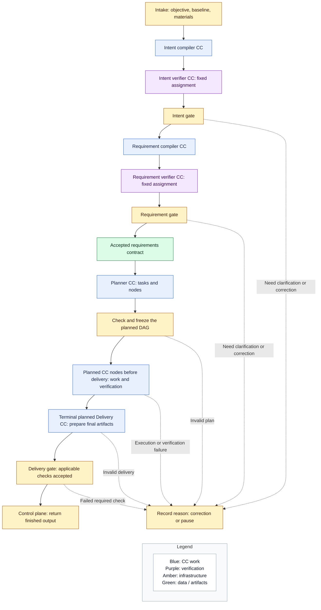
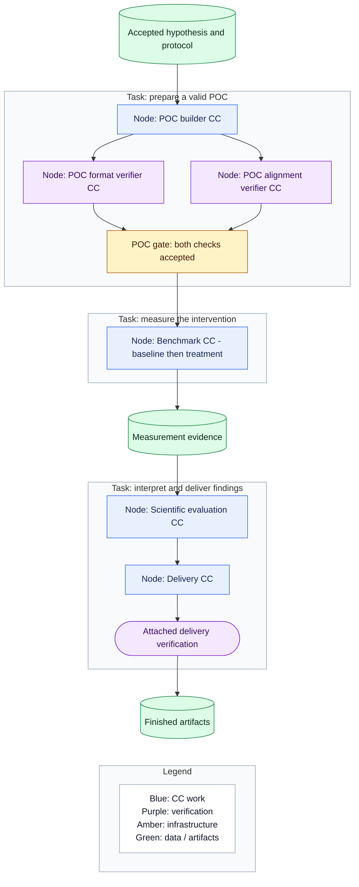
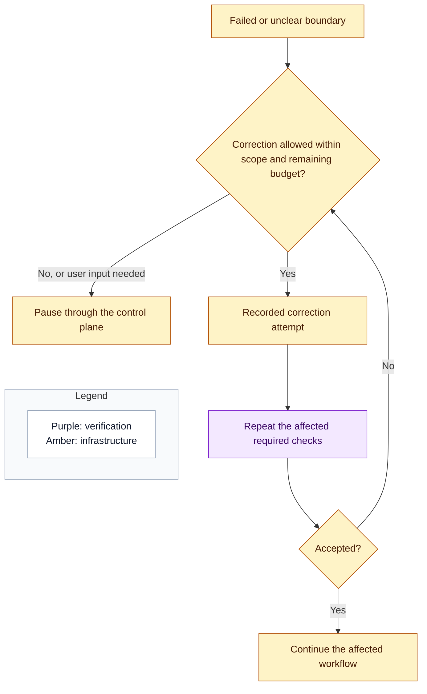

# Workflow: from intake to delivery

## Intent

Make the container understandable as a pipeline. The fixed pipeline establishes what the user wants. A planner then builds the work graph. Execution produces evidence and delivery returns it. Infrastructure supports that pipeline without becoming a second competing workflow. Terms are defined in the [overview vocabulary](README.md#vocabulary-and-naming).

## Fixed pipeline and planned work

The planned work and terminal delivery boxes are two parts of the same planned DAG. Delivery is drawn separately to make the endpoint visible; it is not another CC invocation after the DAG finishes. The planner includes the needed delivery nodes and checks. The final control-plane transfer is infrastructure, not a second delivery task.

Intake captures the request and imported resources. If qualification or transformation is scheduled as a node, it is an intake CC. Simple request transport and upload handling belong to the control plane.

The intent compiler interprets the objective without quietly choosing a different problem. The requirement compiler establishes scope, constraints, expected deliverables, and relevant research requirements. Their verification profiles are fixed because these stages are fixed; the planner cannot remove or replace them.

Clarification goes through the control plane to the UI and back to the waiting stage. No worker needs a terminal attached to the user's laptop.

The accepted requirements contract supplies the planner's objective and constraints. Its detailed fields belong to the owning Spec Kit task.

## Tasks become a DAG of nodes

The complete journey still includes search, screening, hypothesis, POC, benchmarking, scientific evaluation, and delivery. A task is the planner's unit of work, not a predefined number of nodes. This diagram shows a slice after an accepted hypothesis and protocol are available. One task uses three CC nodes; another uses one. Two checks branch and join before experiment execution.

This is an example, not a capsule inventory or a prescribed task breakdown. The planner may expand a task, reuse the same CC at several nodes, or choose different supported capabilities. This example selects two explicit verifier nodes and an attached delivery check; it does not insert a verifier after every CC. All selected required checks feed the shared gate mechanism, including attached checks whose gate is omitted here for readability.

An attached verifier CC still uses the CC runner, with its assignment recorded in the freeze; it need not be a separately scheduled DAG node. An ordinary deterministic check can also be attached. Different drawings distinguish explicit nodes from attached checks so implementers do not mistake the attachment for another work node.

Hypothesis formation establishes the experimental protocol before measurement. POC construction produces the bounded intervention. Benchmarking runs baseline and treatment and captures evidence. Scientific evaluation interprets that evidence. A negative or inconclusive scientific finding is a valid deliverable; it is different from an execution failure.

## Planning and freeze

The planner derives tasks from requirements and chooses as many CC nodes as each needs. It connects inputs, dependencies, and verification without a fixed node count or one-task/one-node rule. It proposes a plan; it does not authorize that plan.

Ordinary code checks the proposal against the accepted scope, run limits, available capabilities, valid connections, acyclic dependencies, and required verification coverage. Required obligations come from fixed-stage profiles, selected CC runtime requirements, the accepted requirements, and run policy. The planner may add useful checks but cannot waive those obligations. A structurally valid graph that exceeds its budget or omits a required check is refused. On failure, request bounded correction, then pause if unresolved.

Freeze records the accepted graph, capability versions including declared internal CC dependencies, input references, configured checks, verification assignments, and applicable run configuration. Fixed stages have their bindings before they run; they do not depend on the later planner. The generated experimental protocol is separately accepted before measurement. Neither the frozen plan nor that protocol can quietly change in response to results.

Repair creates a recorded new attempt within the node's assigned scope and allowed budget. It preserves the capability version and the original evidence; only newly accepted outputs replace a downstream dependency. Changing the objective, required checks, or graph requires a visible revised plan and a new freeze. Reuse completed results only when they remain valid for those revised inputs.

Detailed plan serialization and the freeze implementation belong to coding tasks.

## Scheduling, data, and checks

Follow the requested Kahn-style dependency readiness: dispatch a node once its predecessors and required checks are accepted. Reuse an equivalent native topological scheduler rather than writing a custom implementation solely for the algorithm's name. A verifier may be an explicit node or an attached check; either way, required verification blocks affected successors.

The CC runner supplies bound inputs and a scoped workspace. Outputs and logs persist. Nodes receive required data or artifact references, not unrestricted shared state. Execution and the control plane use one shared run-state module for authoritative DAG progress, attempts, decisions, and accepted references. The browser's progress display is a view of those records.

No external message broker is required. Durable run and DAG state are the authority; a local ready queue is only a dispatch mechanism. Start with one active workflow and use native concurrency controls where independent nodes can safely run.

## Failures and delivery

For invalid data, execution failure, or failed required verification, record the reason and preserve evidence. Correction is allowed only within the accepted scope and remaining budget. Recheck the corrected result: acceptance lets the affected workflow continue; unresolved failure or a needed user decision pauses it. Never skip a required check. Unrelated branches may proceed when their dependencies allow it; affected downstream work waits.

This loop represents policy, not a new service. Each attempt consumes the allowed budget. Planner correction returns through plan checking and freeze; node correction returns through its assigned checks. A question about the user's intent is answered through the UI before continuing.

Browser disconnection leaves the server running. An application restart restores the run view and pauses interrupted work for explicit resumption. Preserve accepted results and inspect interrupted attempts before repeating them, especially experiments or other consequential effects. Resumption is not permission to blindly replay every node.

Report generation, packaging, and any model-assisted delivery preparation happen inside the container. If scheduled as nodes, these are CCs. After the relevant delivery checks, the control plane makes the finished artifacts available to the UI. The client does no further model processing.
