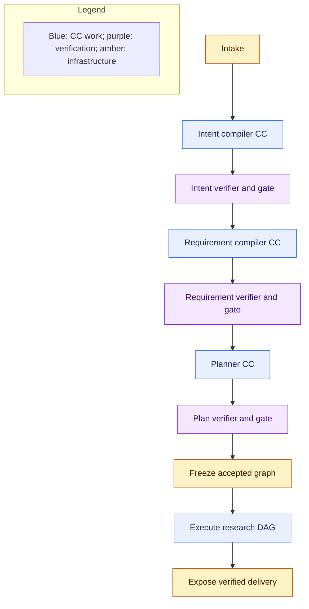
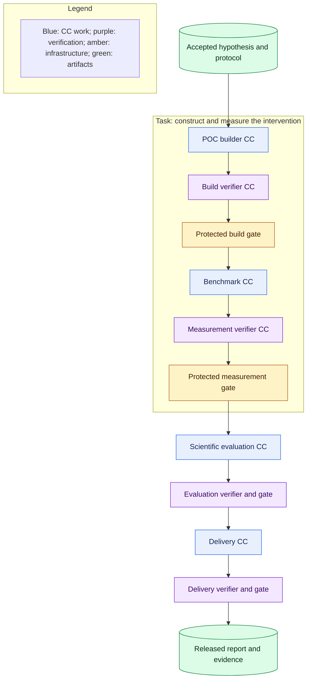

# Workflow: planning and execution

## Establish intent before planning

**Required now.** Ordinary intake binds the original request and permitted documents, project assets, and validation data to a run. Reject empty or unreadable required input. Do not fetch undeclared datasets, clone arbitrary repositories, or turn missing evidence into observed facts.

Run the Intent compiler and its verifier, then the Requirement compiler and its verifier. The accepted Research Brief states objectives, scope, constraints, deliverables, and evidence obligations. Preserve ambiguity; a material unresolved requirement blocks readiness. Detailed fields and conservative defaults belong to the owning Spec Kit task. These fixed verification assignments cannot be removed by the planner.

Verification boxes include deterministic checks, a separate verifier invocation, and protected gate application, as specified in [capsules](capsules.md). A clarification or blocking result is recorded through the control plane; headless evaluation returns a blocking status without waiting for interactive input.

## Planner choice and limits

**Required now.** Use direct typed CC selection and graph construction. Inputs are accepted requirements, an admitted library snapshot, permitted resources, effective policy, and limits. Output is a captured candidate graph with objective-to-result coverage, input bindings, dependencies, and checking assignments. The planner cannot execute generated plan code, grant access, change active library versions, or waive required verification.

Generate a bounded set of candidates. Deterministic validation rejects missing or ineligible capabilities, incompatible port meanings, cycles, unbound inputs, denied effects, conflicting shared writes, absent verification, and exceeded limits. Semantic plan verification checks that the chosen work addresses the accepted objective; graph shape alone cannot prove coverage. No available capability means infeasible planning, not an invitation to invent one.

Rank feasible candidates first by comparable evidence of successful outcomes, then execution time and available cost. Keep sample counts and uncertainty visible. Unknown reliability remains unmeasured, and unknown cost is not zero. Spec Kit defines the bounded search, comparison rule, conservative defaults, and ties. Preserve a fixed reference graph for regression and matched comparisons. A single feasible candidate provides no evidence of optimization.

This is the best candidate found within a declared search budget, not globally optimal planning. A separate logical-operator layer would add binding flexibility but also another representation to reconcile; direct CC graphs give M1 one inspectable execution boundary. Retain objective mappings so later logical planning can lower into that same boundary. [LLMCompiler](https://arxiv.org/abs/2312.04511) supports the feasibility of separating graph proposal, dependency dispatch, and execution; it does not establish optimality or safety for this system.

## Freeze and unknown future values

**Required now.** Freeze the accepted topology, exact CC and dependency versions, verification profiles, policy, limits, and input references before planned execution. Future producer outputs are typed references, not already-known values. Freeze does not claim that a hypothesis or measurement exists before its producer runs.

Choose capabilities whose declared input range covers the supported M1 research domain. Use one opportunity and one hypothesis path. The Hypothesis CC establishes and freezes the baseline, validation resource, measurement definitions, success/falsification boundaries, and protocol before POC generation or empirical execution. Downstream work may apply that protocol but cannot edit it after seeing results.

Evaluate preconditions with the same semantics at planning and dispatch. Known false conditions reject a plan; value-dependent conditions remain explicit dispatch obligations. An unsupported hypothesis, missing resource, or false dispatch precondition blocks the run. Do not silently choose another capsule, alter the graph, or create a new protocol. Multiple planning epochs remain a future possibility, not M1 behavior.

## Tasks, nodes, and verification

**Required now.** A task groups an objective; each node invokes one CC. This example shows part of one frozen graph, with verification after each work invocation.

Deterministic checks preceding each verifier are omitted here for readability. Dependency arrows mean runner-mediated handoffs of accepted artifacts, not direct calls that bypass gates. A verifier may be a scheduled node or a recorded runner assignment; both require the same release boundary. Verifiers do not recursively require semantic verifiers.

## Scheduling and failure

**Required now.** Dispatch dependency-ready nodes only after their required predecessor gates have durably advanced. Reuse an equivalent native topological scheduler. Begin with one active research run; independent nodes may execute only where effects, resources, and policy permit.

A blocking execution, verification, security, budget, or persistence failure stops new work dispatch for the whole run. Preserve in-flight outcomes and attempt evidence; cancellation does not undo effects already performed. Default to zero automatic repair or replay. A human correction creates attributable new work and must pass verification; a changed graph or objective needs a new plan and freeze. Never overwrite a failed attempt.

Browser disconnection does not cancel execution. Restart preserves accepted results and marks interrupted attempts paused for inspection. No native cache entry can replace an authoritative gate decision or justify repeating an uncertain effect. The first build starts a fresh run rather than resuming in place.

Scientific rejection or inconclusive measurement is different from infrastructure failure. Valid evidence and correctly applied criteria can advance to Delivery, which discloses the result and its limitations. All report preparation happens inside the application; the control plane transfers the accepted artifacts.
