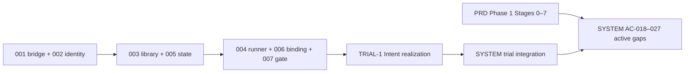

# TASKS: M0 — joint Phase 1 / TRIAL-1 program

## 1. Identity and source baselines

| Field | Value |
| --- | --- |
| Program / objective | M0 / governed PRD Delivery Phase 1 research baseline through Delivery, with the corresponding TRIAL-1 Intent realization and its reusable infrastructure. |
| Revision/date | r3 / 2026-10-06 |
| Product authority | [PRD - AI4Research.txt](source/PRD%20-%20AI4Research.txt), Phase 1 §1.3 and applicable §1–§6 clauses; SHA256 897af8427e2cf4e2427a2097b9b9e8a5a427a7de53b89f4e541d2cc437594036 |
| Architecture authority | [immediate-plan.md](source/build-package/immediate-plan.md), TRIAL-1; SHA256 0a7c21c2933c0be3b07e67cedaa91d2bd1706ca4382c364eb474ae616b919ec3 |
| Scope confirmation | USR-05: the product and architecture are two views of one objective. This supersedes the r2 sole-authority interpretation. |
| Source identities/allocation | [source-manifest.json](source-manifest.json), [source-coverage.json](source-coverage.json), [alignment decisions](alignment.md). All 68 original source files are preserved. |
| Implemented authored CCs | Two in implemented TRIAL-1: Intent compiler and separate intent verifier. This is not a Phase 1 capsule ceiling. |
| Business / integration TASK | [M0-TRIAL-1](M0-TRIAL-1/TASK.md) / [M0-SYSTEM](M0-SYSTEM/TASK.md). SYSTEM is a development integration/acceptance task, not a runtime module. |
| Evidence truth | [LOCAL-3](M0-SYSTEM/evidence/RUN-20261006-RUNTIME-LOCAL-3.md) covers the retained trial candidate. Real trial acceptance is BLOCKED; new Phase 1 work is NOT_RUN/BLOCKED. Registration does not establish stage completion. |
| Authorization | Current coding and required validation are authorized; this alignment updates governed records. Artifacts/comments English. No commit/push/deployment authorization. |
| Historical design | [Archive](context/README.md) may inform new design but is not automatically restored as active work or interface authority. Phase 2 RSI and Phase 3 dynamic integration remain outside the selected Phase 1 target. |

## 2. Task register and dependency graph

| TASK / entry | Owned contribution | Status / Phase 1 relationship | Definition dependencies | Feature directory | Sole work/evidence |
| --- | --- | --- | --- | --- | --- |
| [M0-001](M0-001/TASK.md) | Audited secured static Codex model bridge and measured invocation boundary | Implemented trial contribution; required real acceptance BLOCKED; no whole-stage claim | None | docs/code/Missions/M0/M0-001 | [tasks.md](M0-001/tasks.md) |
| [M0-002](M0-002/TASK.md) | Stable local user/session authority and frozen trial configuration | Implemented trial contribution; required real acceptance BLOCKED; no whole-stage claim | M0-001 | docs/code/Missions/M0/M0-002 | [tasks.md](M0-002/tasks.md) |
| [M0-003](M0-003/TASK.md) | Two admitted immutable Intent capsule definitions and scoped declaration reader | Implemented trial contribution; required real acceptance BLOCKED; no whole-stage claim | M0-002 | docs/code/Missions/M0/M0-003 | [tasks.md](M0-003/tasks.md) |
| [M0-004](M0-004/TASK.md) | Bounded shared Intent compiler/verifier runner | Implemented trial contribution; required real acceptance BLOCKED; no whole-stage claim | M0-001, M0-002, M0-003 | docs/code/Missions/M0/M0-004 | [tasks.md](M0-004/tasks.md) |
| [M0-005](M0-005/TASK.md) | Exact trial state, artifact/evidence custody and observations | Implemented trial contribution; required real acceptance BLOCKED; no whole-stage claim | M0-002 | docs/code/Missions/M0/M0-005 | [tasks.md](M0-005/tasks.md) |
| [M0-006](M0-006/TASK.md) | Fixed Intent binding, contract and once-only lifecycle | Implemented trial contribution; required real acceptance BLOCKED; no whole-stage claim | M0-003, M0-005 | docs/code/Missions/M0/M0-006 | [tasks.md](M0-006/tasks.md) |
| [M0-007](M0-007/TASK.md) | Deterministic and independent read-only semantic verification with protected durable gating | Implemented trial contribution; required real acceptance BLOCKED; no whole-stage claim | M0-001, M0-003, M0-005 | docs/code/Missions/M0/M0-007 | [tasks.md](M0-007/tasks.md) |
| [M0-SYSTEM](M0-SYSTEM/TASK.md) | Trial integration plus active Phase 1 Stages 0–7, report and global obligations under AC-018–027 | Active product gaps; real prerequisites BLOCKED, new work NOT_RUN | M0-001, M0-002, M0-003, M0-004, M0-005, M0-006, M0-007, M0-TRIAL-1 | docs/code/Missions/M0/M0-SYSTEM | [tasks.md](M0-SYSTEM/tasks.md) |
| [M0-TRIAL-1](M0-TRIAL-1/TASK.md) | Native web and sequential headless intermediate Intent acceptance or halt | Implemented trial contribution; required real acceptance BLOCKED; no whole-stage claim | M0-001, M0-002, M0-003, M0-004, M0-005, M0-006, M0-007 | docs/code/Missions/M0/M0-TRIAL-1 | [tasks.md](M0-TRIAL-1/tasks.md) |

All registered tasks use Codex as executor with disjoint collaborator ownership. The existing dependencies and r2 interfaces describe the implemented trial. New research/operational duties are owned by SYSTEM, with T085 responsible for contract design, dependencies, source cases and subsequent component decomposition before execution. Archived component IDs are design references only.

## 3. Source coverage allocation

The PRD Phase 1 obligations are active alongside the architecture realization. Immediate-plan exclusions bound the implemented Intent path; they do not delete Phase 1 research, operational or completion requirements. Exact normalized locators, source-segment hashes, selected bullets and reciprocal TASK/AC owners are in source-coverage.json. All 184 PRD headings remain indexed with active/mixed/separate-context dispositions.

| Product obligation | Owner / block / checks | Required work and current gap |
| --- | --- | --- |
| Stage 0 — runtime/config/security; 3 exact units | [M0-SYSTEM/AC-018](M0-SYSTEM/spec.md); B18; V35 / V36 | T055–T057 plus contract design T085; BLOCKED. Existing trial evidence supplies partial contributions only. |
| Stage 1 — governed work backbone and actual Node B; 28 exact units | [M0-SYSTEM/AC-019](M0-SYSTEM/spec.md); B19; V37 / V38 | T058–T060 plus contract design T085; NOT_RUN. Existing trial evidence supplies partial contributions only. |
| Stage 2 — resource intake, full Brief and fixed native SwarmFlow; 21 exact units | [M0-SYSTEM/AC-020](M0-SYSTEM/spec.md); B20; V39 / V40 | T061–T063 plus contract design T085; NOT_RUN. Existing trial evidence supplies partial contributions only. |
| Stage 3 — evidence-to-hypothesis research; 19 exact units | [M0-SYSTEM/AC-021](M0-SYSTEM/spec.md); B21; V41 / V42 | T064–T066 plus contract design T085; NOT_RUN. Existing trial evidence supplies partial contributions only. |
| Stage 4 — bounded builder/POC; 11 exact units | [M0-SYSTEM/AC-022](M0-SYSTEM/spec.md); B22; V43 / V44 | T067–T069 plus contract design T085; NOT_RUN. Existing trial evidence supplies partial contributions only. |
| Stage 5 — benchmark and scientific evaluation; 11 exact units | [M0-SYSTEM/AC-023](M0-SYSTEM/spec.md); B23; V45 / V46 | T070–T072 plus contract design T085; NOT_RUN. Existing trial evidence supplies partial contributions only. |
| Stage 6 — Delivery and complete research journey; 5 exact units | [M0-SYSTEM/AC-024](M0-SYSTEM/spec.md); B24; V47 / V48 | T073–T075 plus contract design T085; NOT_RUN. Existing trial evidence supplies partial contributions only. |
| Stage 7 — operational/native interfaces; 23 exact units | [M0-SYSTEM/AC-025](M0-SYSTEM/spec.md); B25; V49 / V50 | T076–T078 plus contract design T085; NOT_RUN. Existing trial evidence supplies partial contributions only. |
| Phase 1 completion/report; 5 exact units | [M0-SYSTEM/AC-026](M0-SYSTEM/spec.md); B26; V51 / V52 | T079–T081 plus contract design T085; NOT_RUN. Existing trial evidence supplies partial contributions only. |
| Global/domain/invariants and cross-cutting constraints; 22 exact units | [M0-SYSTEM/AC-027](M0-SYSTEM/spec.md); B27; V53 / V54 | T082–T084 plus contract design T085; NOT_RUN. Existing trial evidence supplies partial contributions only. |

| Architecture unit | Exact locator | Current owner allocation |
| --- | --- | --- |
| IP-01 — TRIAL-1: the intent compiler and Verifier | immediate-plan.md:L1-L4 | M0-SYSTEM/AC-001 |
| IP-02 — Intended result | immediate-plan.md:L5-L14 | M0-007/AC-001, M0-007/AC-005, M0-007/AC-006, M0-007/AC-009, M0-007/AC-010, M0-SYSTEM/AC-001, M0-SYSTEM/AC-013, M0-SYSTEM/AC-014, M0-TRIAL-1/AC-001, M0-TRIAL-1/AC-002, M0-TRIAL-1/AC-003, M0-TRIAL-1/AC-004, M0-TRIAL-1/AC-005, M0-TRIAL-1/AC-006, M0-TRIAL-1/AC-007, M0-TRIAL-1/AC-008, M0-TRIAL-1/AC-009, M0-TRIAL-1/AC-010, M0-TRIAL-1/AC-011, M0-TRIAL-1/AC-012 |
| IP-03 — Connected boundary | immediate-plan.md:L15-L52 | M0-002/AC-005, M0-003/AC-002, M0-003/AC-003, M0-004/AC-001, M0-005/AC-002, M0-006/AC-007, M0-007/AC-001, M0-007/AC-002, M0-007/AC-005, M0-007/AC-006, M0-007/AC-009, M0-SYSTEM/AC-013, M0-SYSTEM/AC-016 |
| IP-04 — Minimum supporting system | immediate-plan.md:L53-L67 | M0-001/AC-001, M0-001/AC-002, M0-001/AC-003, M0-001/AC-004, M0-001/AC-005, M0-001/AC-006, M0-002/AC-001, M0-002/AC-002, M0-002/AC-004, M0-003/AC-001, M0-003/AC-002, M0-003/AC-003, M0-003/AC-004, M0-004/AC-001, M0-004/AC-002, M0-004/AC-004, M0-004/AC-005, M0-004/AC-006, M0-005/AC-001, M0-005/AC-003, M0-005/AC-007, M0-006/AC-004, M0-006/AC-005, M0-006/AC-006, M0-006/AC-007, M0-007/AC-003, M0-007/AC-004, M0-SYSTEM/AC-002, M0-SYSTEM/AC-013, M0-SYSTEM/AC-015, M0-SYSTEM/AC-017 |
| IP-05 — Actors, context and lifecycle | immediate-plan.md:L68-L86 | M0-001/AC-001, M0-001/AC-002, M0-001/AC-003, M0-001/AC-004, M0-001/AC-005, M0-001/AC-006, M0-002/AC-001, M0-002/AC-002, M0-002/AC-004, M0-002/AC-005, M0-002/AC-006, M0-003/AC-001, M0-003/AC-002, M0-003/AC-004, M0-004/AC-001, M0-004/AC-002, M0-004/AC-004, M0-004/AC-005, M0-004/AC-006, M0-005/AC-001, M0-005/AC-002, M0-005/AC-003, M0-005/AC-007, M0-006/AC-002, M0-006/AC-003, M0-006/AC-004, M0-006/AC-005, M0-006/AC-006, M0-006/AC-007, M0-007/AC-001, M0-007/AC-002, M0-007/AC-003, M0-007/AC-004, M0-007/AC-005, M0-007/AC-006, M0-007/AC-009, M0-007/AC-010, M0-SYSTEM/AC-002, M0-SYSTEM/AC-013, M0-SYSTEM/AC-014, M0-SYSTEM/AC-015, M0-SYSTEM/AC-016, M0-SYSTEM/AC-017, M0-TRIAL-1/AC-001, M0-TRIAL-1/AC-002, M0-TRIAL-1/AC-003, M0-TRIAL-1/AC-004, M0-TRIAL-1/AC-005, M0-TRIAL-1/AC-006, M0-TRIAL-1/AC-007, M0-TRIAL-1/AC-008, M0-TRIAL-1/AC-009, M0-TRIAL-1/AC-010, M0-TRIAL-1/AC-011, M0-TRIAL-1/AC-012 |
| IP-06 — Runnable development boundary | immediate-plan.md:L87-L92 | M0-001/AC-001, M0-001/AC-002, M0-001/AC-003, M0-001/AC-004, M0-001/AC-005, M0-001/AC-006, M0-002/AC-002, M0-002/AC-004, M0-002/AC-005, M0-002/AC-006, M0-003/AC-002, M0-003/AC-003, M0-003/AC-004, M0-004/AC-002, M0-004/AC-004, M0-004/AC-006, M0-005/AC-003, M0-006/AC-003, M0-007/AC-004, M0-SYSTEM/AC-002, M0-SYSTEM/AC-015, M0-SYSTEM/AC-017, M0-TRIAL-1/AC-001, M0-TRIAL-1/AC-002, M0-TRIAL-1/AC-003, M0-TRIAL-1/AC-004, M0-TRIAL-1/AC-005, M0-TRIAL-1/AC-006, M0-TRIAL-1/AC-007, M0-TRIAL-1/AC-008, M0-TRIAL-1/AC-009, M0-TRIAL-1/AC-010, M0-TRIAL-1/AC-011, M0-TRIAL-1/AC-012 |
| IP-07 — Sources and exclusions | immediate-plan.md:L93-L107 | M0-001/AC-001, M0-001/AC-002, M0-001/AC-003, M0-001/AC-004, M0-001/AC-005, M0-001/AC-006, M0-002/AC-006, M0-003/AC-001, M0-005/AC-007, M0-006/AC-007, M0-007/AC-002, M0-007/AC-003, M0-007/AC-010, M0-007/AC-011, M0-SYSTEM/AC-001, M0-SYSTEM/AC-016, M0-SYSTEM/AC-017 |
| IP-08 — Coding-agent responsibility | immediate-plan.md:L108-L126 | M0-003/AC-003, M0-006/AC-004, M0-006/AC-006, M0-007/AC-002, M0-007/AC-005, M0-007/AC-009, M0-007/AC-010, M0-007/AC-011, M0-SYSTEM/AC-001, M0-SYSTEM/AC-002, M0-SYSTEM/AC-013, M0-SYSTEM/AC-014, M0-SYSTEM/AC-015, M0-SYSTEM/AC-016, M0-SYSTEM/AC-018, M0-SYSTEM/AC-019, M0-SYSTEM/AC-020, M0-SYSTEM/AC-021, M0-SYSTEM/AC-022, M0-SYSTEM/AC-023, M0-SYSTEM/AC-024, M0-SYSTEM/AC-025, M0-SYSTEM/AC-026, M0-SYSTEM/AC-027, M0-TRIAL-1/AC-001, M0-TRIAL-1/AC-002, M0-TRIAL-1/AC-003, M0-TRIAL-1/AC-004, M0-TRIAL-1/AC-005, M0-TRIAL-1/AC-006, M0-TRIAL-1/AC-007, M0-TRIAL-1/AC-008, M0-TRIAL-1/AC-009, M0-TRIAL-1/AC-010, M0-TRIAL-1/AC-011, M0-TRIAL-1/AC-012 |

Exactly two capsules, the text-only boundary and intermediate Intent are properties of current TRIAL-1. The full Brief and actual work Node B have their own product acceptance. Valid scientific-negative outcomes must reach Delivery. Stage 3.8 owns the scientific conclusion; infrastructure gate cannot substitute for it. Future node verifier profiles must implement applicable pinned upstream adaptation rather than reuse Intent-specific inapplicability as a universal waiver.

## 4. Interface index

| IF/revision | Single owning TASK section | Provider | Current consumers | Boundary verification |
| --- | --- | --- | --- | --- |
| M0-IF-001@r2 | [M0-001](M0-001/TASK.md#m0-if-001-at-r2) | M0-001 | M0-002, M0-004, M0-007, M0-SYSTEM, M0-TRIAL-1 | [M0-001 plan even V IDs](M0-001/plan.md) |
| M0-IF-002@r2 | [M0-002](M0-002/TASK.md#m0-if-002-at-r2) | M0-002 | M0-003, M0-004, M0-005, M0-SYSTEM, M0-TRIAL-1 | [M0-002 plan even V IDs](M0-002/plan.md) |
| M0-IF-003@r2 | [M0-003](M0-003/TASK.md#m0-if-003-at-r2) | M0-003 | M0-004, M0-006, M0-007, M0-SYSTEM, M0-TRIAL-1 | [M0-003 plan even V IDs](M0-003/plan.md) |
| M0-IF-004@r2 | [M0-004](M0-004/TASK.md#m0-if-004-at-r2) | M0-004 | M0-006, M0-007, M0-SYSTEM, M0-TRIAL-1 | [M0-004 plan even V IDs](M0-004/plan.md) |
| M0-IF-005@r2 | [M0-005](M0-005/TASK.md#m0-if-005-at-r2) | M0-005 | M0-001, M0-002, M0-003, M0-004, M0-006, M0-007, M0-SYSTEM, M0-TRIAL-1 | [M0-005 plan even V IDs](M0-005/plan.md) |
| M0-IF-006@r2 | [M0-006](M0-006/TASK.md#m0-if-006-at-r2) | M0-006 | M0-001, M0-002, M0-003, M0-004, M0-005, M0-007, M0-SYSTEM, M0-TRIAL-1 | [M0-006 plan even V IDs](M0-006/plan.md) |
| M0-IF-007@r2 | [M0-007](M0-007/TASK.md#m0-if-007-at-r2) | M0-007 | M0-001, M0-002, M0-003, M0-004, M0-005, M0-006, M0-SYSTEM, M0-TRIAL-1 | [M0-007 plan even V IDs](M0-007/plan.md) |
| M0-IF-020@r2 | [M0-TRIAL-1](M0-TRIAL-1/TASK.md#m0-if-020-at-r2) | M0-TRIAL-1 | M0-SYSTEM | [M0-TRIAL-1 plan even V IDs](M0-TRIAL-1/plan.md) |

Existing IF IDs are retained. r2 narrows the current realization before any r1 production API was implemented; old definitions remain historical. These eight r2 interfaces describe implemented Intent capabilities only. SYSTEM T085 owns the new Phase 1 contract/graph/profile design; required additional interfaces are not implicitly supplied by r2.

## 5. System verification entry

[M0-SYSTEM](M0-SYSTEM/TASK.md) owns the exact-candidate connected trial checks and the active Phase 1 stage/global/completion acceptance. New B18–B27 each have both BLOCK and BOUNDARY checks, normal/refusal/recovery cases and open implementation/verification work. T085 owns required new full-Brief/research/operational contracts and source fixtures before coding. Current r2 APIs do not acquire these responsibilities merely because they are referenced.

Existing 329 local trial assertions and nine browser journeys are retained observations of the unchanged execution candidate, not Phase 1 acceptance. The source/interface/criteria and execution-input reuse review is explicit in native tasks.md. SYSTEM documentary AC-001 requires renewed joint-scope evidence. No Phase_1_Completion_Report.md claiming completion is generated before its exit conditions actually pass.

## 6. Source changes and unresolved inputs

| ID | Change/input | Owning work / effect |
| --- | --- | --- |
| USR-05 | Joint product/architecture scope confirmation supersedes r2 sole authority | SYSTEM AC-018–027 active; component r3 records retain implemented r2 IF identities and scoped progress. Documentary AC-001 renewed; runtime evidence reused only for unchanged assertions. |
| JOINT-COMPILER-ONE-SHOT | PRD original full Brief one-shot vs recorded authorized D5 split amendment | SYSTEM AC-020/T085 carries the recorded D5 amendment into the full-Brief contracts and verifies both bounded invocations under frozen combined budgets. The original one-shot wording remains a documented deviation; intermediate Intent alone is not Stage 2 completion. |
| SOURCE-VARIANTS | Packaged/master PRDs differ from the user-named source | Preserve independent provenance; user PRD selected product authority. Material differences and exact hashes are recorded in alignment.md. |
| USR-01/02 | Verification/gating distinction and required upstream profile adaptation | M0-007 current Intent implementation retained; SYSTEM AC-019/027 owns applicable additional node profiles and Stage 3.8 boundary. |
| LIVE-01 | Actual authenticated model and protected supported execution environment unavailable | Affected real trial/Stage 0 observations BLOCKED; independent design work remains available. |
| PHASE-ACCOUNTING | Phase 2 RSI / Stage 8 and Phase 3 dynamic integration | Separately indexed context outside selected Phase 1 acceptance; Phase 1 data/export/frozen-referee scaffolding remains active where expressly required. |
