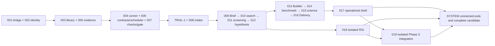

# TASKS: M0 — Spec Kit program for the PRD-defined M1 product

## 1. Identity and source baselines

| Field | Value |
| --- | --- |
| Program ID and objective | M0; prepare complete registered specification/design/work system for all PRD-defined M1 delivery phases at the user-requested location. Current request is documentation preparation, not product implementation. |
| Register revision/date | r1 / 2026-10-06 |
| Program coordinator | Codex for current preparation; future implementation coordinator UNASSIGNED, not an approval gate |
| Full PRD path / revision / SHA256 / bytes | [user-selected PRD](<source/PRD - AI4Research.txt>) / received October 6, 2026 / 897af8427e2cf4e2427a2097b9b9e8a5a427a7de53b89f4e541d2cc437594036 / 232081 bytes / 2879 lines |
| Architecture source and rendered views / revision / SHA256 | [source architecture](source/build-package/README.md), clarified USR-01/02; all file hashes and sizes in [source-manifest.json](source-manifest.json); diagrams are views of those responsibilities. |
| Scope inclusions and exclusions | All M1 Phase 1 stages 0–7 and mandatory Phase 2 Stage 8; all six expected Phase 3 efforts/accounting; source Future State exclusions preserved; TRIAL-1 is narrower. No product build, live calls, publication or deployment performed by preparation. |
| System-verification TASK | [M0-SYSTEM](M0-SYSTEM/TASK.md) |
| Integrated candidate | NOT_BUILT; document-authoring base 2cc0b8695d4000cc72af64eb781356697f7fd861 on ai4r_xiaoyang, source build-package was user-supplied untracked input. Runtime candidate must include dirty-tree identity. |

## 2. Task register and dependency graph

| TASK ID / entry link | Bounded outcome | Executor | Required for program? | Prerequisite TASK/block/IF IDs | Native feature directory | Progress/evidence source |
| --- | --- | --- | --- | --- | --- | --- |
| [M0-001](M0-001/TASK.md) | Verify and adapt the existing subscription bridge for bounded synchronous governed model invocations, with protected local IPC, owned context and attributable outcomes. | UNASSIGNED (implementation); Codex prepared records | Required Phase 1/2 foundation or behavior | None | docs/code/Missions/M0/M0-001/ | [sole work/evidence](M0-001/tasks.md) |
| [M0-002](M0-002/TASK.md) | Separate stable product identity/profile storage from local research workspace lifetime; resolve reproducible configuration and enforce local session/disclosure/privacy controls. | UNASSIGNED (implementation); Codex prepared records | Required Phase 1/2 foundation or behavior | None | docs/code/Missions/M0/M0-002/ | [sole work/evidence](M0-002/tasks.md) |
| [M0-003](M0-003/TASK.md) | Define the current versioned capsule serialization/profile, implementation closure, admission, immutable lineage and human standing controls, preserving every architecture declaration field meaning. | UNASSIGNED (implementation); Codex prepared records | Required Phase 1/2 foundation or behavior | M0-002 | docs/code/Missions/M0/M0-003/ | [sole work/evidence](M0-003/tasks.md) |
| [M0-004](M0-004/TASK.md) | Execute admitted pinned capabilities under the intersection of per-CC, node and run authority, capture per-invocation observations and enforce resource/effect limits. | UNASSIGNED (implementation); Codex prepared records | Required Phase 1/2 foundation or behavior | M0-001, M0-002, M0-003 | docs/code/Missions/M0/M0-004/ | [sole work/evidence](M0-004/tasks.md) |
| [M0-005](M0-005/TASK.md) | Provide one transactional run-state/release authority with immutable artifacts, protected raw evidence, run bundles, records, scorecards, context memory and scoped reproducible exports. | UNASSIGNED (implementation); Codex prepared records | Required Phase 1/2 foundation or behavior | M0-002 | docs/code/Missions/M0/M0-005/ | [sole work/evidence](M0-005/tasks.md) |
| [M0-006](M0-006/TASK.md) | Assemble preparation and planned Node Execution Contracts; freeze the operational sequential Phase 1 graph, bind accepted artifacts and exact library/check pins, and dispatch only after durable gate acceptance. | UNASSIGNED (implementation); Codex prepared records | Required Phase 1/2 foundation or behavior | M0-003, M0-005 | docs/code/Missions/M0/M0-006/ | [sole work/evidence](M0-006/tasks.md) |
| [M0-007](M0-007/TASK.md) | Own mandatory check profiles and immutable full-context assignments, minimize verifier disclosure, enforce deterministic then semantic assessment, validate exact subject and durably decide release. | UNASSIGNED (implementation); Codex prepared records | Required Phase 1/2 foundation or behavior | M0-001, M0-003, M0-005 | docs/code/Missions/M0/M0-007/ | [sole work/evidence](M0-007/tasks.md) |
| [M0-008](M0-008/TASK.md) | Capture the original scientific request through supported local CLI/Web surfaces, import permitted documents, bind supplied code/data separately and produce a verified qualified intake for fixed Intent preparation. | UNASSIGNED (implementation); Codex prepared records | Required Phase 1/2 foundation or behavior | M0-002, M0-004, M0-005, M0-006, M0-007 | docs/code/Missions/M0/M0-008/ | [sole work/evidence](M0-008/tasks.md) |
| [M0-009](M0-009/TASK.md) | Produce the standard Research_Brief.json from accepted TRIAL-1 Intent plus original permitted context, explicit requirements and marked conservative defaults within one bounded non-interactive product entry. | UNASSIGNED (implementation); Codex prepared records | Required Phase 1/2 foundation or behavior | M0-TRIAL-1, M0-008, M0-002, M0-003, M0-004, M0-005, M0-006, M0-007 | docs/code/Missions/M0/M0-009/ | [sole work/evidence](M0-009/tasks.md) |
| [M0-010](M0-010/TASK.md) | Search permitted local context and designated academic connectors under a fixed query plan, retain exact source excerpts and produce one to three evidence-linked candidates for Screening. | UNASSIGNED (implementation); Codex prepared records | Required Phase 1/2 foundation or behavior | M0-009, M0-008, M0-003, M0-004, M0-005, M0-006, M0-007 | docs/code/Missions/M0/M0-010/ | [sole work/evidence](M0-010/tasks.md) |
| [M0-011](M0-011/TASK.md) | Consolidate admitted candidates once, form evidence-linked opportunity cards, score fixed dimensions, filter unavailable dependencies and select the deterministic highest-scoring opportunity with rejection reasons and a pure rank_opportunities seam for isolated RSI. | UNASSIGNED (implementation); Codex prepared records | Required Phase 1/2 foundation or behavior | M0-010, M0-009, M0-003, M0-004, M0-005, M0-006, M0-007 | docs/code/Missions/M0/M0-011/ | [sole work/evidence](M0-011/tasks.md) |
| [M0-012](M0-012/TASK.md) | Convert the single accepted opportunity into one falsifiable claim with exact baseline/data/variables/measurements/mechanism, predeclared classification rules and a frozen verification-ready Hypothesis_Blueprint.json. | UNASSIGNED (implementation); Codex prepared records | Required Phase 1/2 foundation or behavior | M0-011, M0-009, M0-008, M0-003, M0-004, M0-005, M0-006, M0-007 | docs/code/Missions/M0/M0-012/ | [sole work/evidence](M0-012/tasks.md) |
| [M0-013](M0-013/TASK.md) | Translate a gate-accepted immutable Hypothesis Blueprint into bounded workspace assets, frozen requirements, a standalone poc_patch.py, sequential run_benchmark.py, mechanical readiness evidence and POC_Artifact_Bundle.zip. | UNASSIGNED (implementation); Codex prepared records | Required Phase 1/2 foundation or behavior | M0-012, M0-009, M0-008, M0-003, M0-004, M0-005, M0-006, M0-007 | docs/code/Missions/M0/M0-013/ | [sole work/evidence](M0-013/tasks.md) |
| [M0-014](M0-014/TASK.md) | Provision accepted POC assets/dependencies under verified restricted execution, run unmodified baseline then treatment under the immutable protocol, capture raw evidence and release typed Benchmark_Payload.json for scientific interpretation. | UNASSIGNED (implementation); Codex prepared records | Required Phase 1/2 foundation or behavior | M0-013, M0-012, M0-008, M0-002, M0-003, M0-004, M0-005, M0-006, M0-007 | docs/code/Missions/M0/M0-014/ | [sole work/evidence](M0-014/tasks.md) |
| [M0-015](M0-015/TASK.md) | Evaluate admitted benchmark observations against immutable Hypothesis Blueprint and original Research Brief, audit empirical provenance and completeness, apply predeclared classification, and record scientific verdict/risks/follow-ups without code changes or experiments. | UNASSIGNED (implementation); Codex prepared records | Required Phase 1/2 foundation or behavior | M0-014, M0-012, M0-009, M0-003, M0-004, M0-005, M0-006, M0-007 | docs/code/Missions/M0/M0-015/ | [sole work/evidence](M0-015/tasks.md) |
| [M0-016](M0-016/TASK.md) | Synthesize gate-admitted scientific verdict, protocol, original Brief, citations, POC assets and empirical evidence into the fixed Markdown research report and user package; transfer accepted artifacts through the control plane and close the run. | UNASSIGNED (implementation); Codex prepared records | Required Phase 1/2 foundation or behavior | M0-015, M0-014, M0-013, M0-012, M0-009, M0-003, M0-004, M0-005, M0-006, M0-007 | docs/code/Missions/M0/M0-016/ | [sole work/evidence](M0-016/tasks.md) |
| [M0-017](M0-017/TASK.md) | Deliver the complete local operational shell for the in-scope product: Python installation, single-command bootstrap and doctor, native CLI and structured headless operations, native web intake/status/artifact views, native TUI failure triage, POSIX tmux ownership and inspection, static telemetry/export presentation, and an optional Compose benchmarker using the same ordinary authenticated client boundary. Consume the identity, configuration, security, library, runtime, evidence, scheduler and gate agreements from their owning tasks. Use architecture D6, D10, D11 and D12 explicitly where they amend packaging, persistent-state and local identity assumptions. | UNASSIGNED (implementation); Codex prepared records | Required Phase 1/2 foundation or behavior | M0-001, M0-002, M0-003, M0-004, M0-005, M0-006, M0-007, M0-008, M0-016 | docs/code/Missions/M0/M0-017/ | [sole work/evidence](M0-017/tasks.md) |
| [M0-018](M0-018/TASK.md) | Deliver the required offline Target 1 experiment for a sandbox copy of Screening's pure rank_opportunities helper, a target-independent bounded loop, protected referee/oracle custody, attributable paired evaluation, the adversarial violation suite, and inactive child lineage. Account for conditional Target 2 explicitly. Prepare interfaces independently; accepted Stage 8 integration follows a meaningful stable baseline. | UNASSIGNED (implementation); Codex prepared records | Required Phase 1/2 foundation or behavior | M0-001, M0-002, M0-003, M0-004, M0-005, M0-006, M0-007, M0-011 | docs/code/Missions/M0/M0-018/ | [sole work/evidence](M0-018/tasks.md) |
| [M0-019](M0-019/TASK.md) | Attempt and account for advanced intention compilation, Agent Team/Cluster planning, dynamic admitted CC discovery/binding, heterogeneous model routing, alternate Verifier provisioning, and applicable OpenJiuwen Code Mode. Use isolated configurations over the same protected runner/contracts/checks/gate/evidence authority as Phase 1. Retain operational deterministic fallback and report every effort honestly. | UNASSIGNED (implementation); Codex prepared records | Expected Phase 3 effort/accounting; individual blocked/incomplete not automatically core blocker | M0-001, M0-002, M0-003, M0-004, M0-005, M0-006, M0-007, M0-009, M0-013, M0-017, M0-018 | docs/code/Missions/M0/M0-019/ | [sole work/evidence](M0-019/tasks.md) |
| [M0-SYSTEM](M0-SYSTEM/TASK.md) | Complete PRD-defined M1 source coverage, incremental stage exits 0–8, phase exits, real positive/negative research journeys, failure injections, RSI security and Phase 3 implementation accounting; also verify this documentation framework. | UNASSIGNED (implementation); Codex prepared records | Required Phase 1/2 foundation or behavior | M0-001, M0-002, M0-003, M0-004, M0-005, M0-006, M0-007, M0-008, M0-009, M0-010, M0-011, M0-012, M0-013, M0-014, M0-015, M0-016, M0-017, M0-018, M0-019, M0-TRIAL-1 | docs/code/Missions/M0/M0-SYSTEM/ | [sole work/evidence](M0-SYSTEM/tasks.md) |
| [M0-TRIAL-1](M0-TRIAL-1/TASK.md) | Own the first connected intermediate Intent compiler CC -> intent Verifier (Evaluator Gate) slice, with original-text qualification, source-faithful extraction, immutable candidate/evidence binding, two admitted pinned CC definitions, separate semantic verification, protected durable acceptance or halt, native web presentation and a minimal sequential headless driver. Consume M0-001 through M0-007 agreements. Explicitly cite D5: this trial introduces a checked intermediate Intent boundary and does not implement the later full Research Brief compiler; full Phase 1 will use two bounded compiler invocations in one non-interactive entry with combined frozen budgets. Capture real connected acceptance/refusal and verifier characterization when authorized prerequisites become available. | UNASSIGNED (implementation); Codex prepared records | Required first bounded build contribution, not complete Stage 2 or M1 | M0-001, M0-002, M0-003, M0-004, M0-005, M0-006, M0-007 | docs/code/Missions/M0/M0-TRIAL-1/ | [sole work/evidence](M0-TRIAL-1/tasks.md) |

Definition order: bridge and identity → library/evidence → contracts/runner/guard → TRIAL-1 and intake → Brief → search → screening → hypothesis → Builder → benchmark → scientific evaluation → Delivery → operational acceptance; RSI follows eligible Screening and frozen referee readiness. Phase 3 isolated preparation may proceed once each relevant baseline boundary exists; promotion follows its source entry conditions. System checks run incrementally after each connected exit, then on the same complete candidate.

There is no definition-time cycle: contracts, library and guard interfaces are specified before implementations consume one another. Runner/verifier/scheduler/store have a runtime interaction loop, not a DAG of definitions; integration requires their joint boundary evidence. Keep shared files serialized; [P] work needs disjoint paths and satisfied definitions.

## 3. Source coverage allocation

The complete 184 numbered headings, including parent descriptions, global requirements, exclusions and stage exits, are enumerated below. Exact segment identity and all AC owners are also machine-readable in [source-coverage.json](source-coverage.json). Each referenced owner must read the full original bullets, not a summary. Cross-cutting consumers retain constraints without taking over the canonical IF. Every AC is owned by one spec; shared source clauses may intentionally have several constituent ACs.

| Source clause ID / exact locator | Architecture node/edge IDs | Owning TASK / AC references | Allocation decision and completeness |
| --- | --- | --- | --- |
| PRD 1.1: Product Overview; L42–L67 | README.md, authority-index.md, coverage-allocation.md, coverage.md, delivery-phases.md, principles.md, usage-scenarios.md | [M0-SYSTEM/AC-001](M0-SYSTEM/spec.md) | Allocated; read full exact segment including whitelist, conditional, blacklist and global constraints. Parent descriptions include linked child allocations. |
| PRD 1.2: M1 Product Goal; L68–L86 | README.md, authority-index.md, coverage-allocation.md, coverage.md, delivery-phases.md, principles.md, usage-scenarios.md | [M0-SYSTEM/AC-001](M0-SYSTEM/spec.md) | Allocated; read full exact segment including whitelist, conditional, blacklist and global constraints. Parent descriptions include linked child allocations. |
| PRD 1.3: M1 Delivery Phase Model; L87–L210 | README.md, authority-index.md, automation.md, contracts-and-native-reuse.md#evidence-limits-and-next-handoff, contracts-and-native-reuse.md#what-symphony-already-offers, coverage-allocation.md, coverage.md, delivery-phases.md, delivery-phases.md#completion-reports-and-evidence, delivery-phases.md#phase-3-is-accounted-m1-work, failure-and-human.md#phase-3-clarification-before-acceptance, m1-design.md#extension-boundaries-beyond-the-first-build, placement.md, principles.md, principles.md#decisions-and-source-amendments, usage-scenarios.md, workflow.md#planner-choice-and-limits | [M0-019/AC-001](M0-019/spec.md), [M0-019/AC-008](M0-019/spec.md), [M0-019/AC-009](M0-019/spec.md), [M0-SYSTEM/AC-002](M0-SYSTEM/spec.md), [M0-SYSTEM/AC-004](M0-SYSTEM/spec.md), [M0-SYSTEM/AC-005](M0-SYSTEM/spec.md), [M0-SYSTEM/AC-006](M0-SYSTEM/spec.md), [M0-SYSTEM/AC-007](M0-SYSTEM/spec.md), [M0-SYSTEM/AC-009](M0-SYSTEM/spec.md), [M0-SYSTEM/AC-010](M0-SYSTEM/spec.md), [M0-SYSTEM/AC-011](M0-SYSTEM/spec.md), [M0-SYSTEM/AC-012](M0-SYSTEM/spec.md) | Allocated; read full exact segment including whitelist, conditional, blacklist and global constraints. Parent descriptions include linked child allocations. |
| PRD 1.4: Core Product Invariants; L211–L261 | README.md, authority-index.md, capsules.md, coverage-allocation.md, coverage.md, delivery-phases.md, guard-design.md, m1-design.md, principles.md, usage-scenarios.md, workflow.md | [M0-006/AC-002](M0-006/spec.md), [M0-006/AC-003](M0-006/spec.md), [M0-SYSTEM/AC-003](M0-SYSTEM/spec.md), [M0-SYSTEM/AC-007](M0-SYSTEM/spec.md) | Allocated; read full exact segment including whitelist, conditional, blacklist and global constraints. Parent descriptions include linked child allocations. |
| PRD 1.5: M1 Definition of Done; L262–L286 | README.md, authority-index.md, coverage-allocation.md, coverage.md, delivery-phases.md, principles.md, usage-scenarios.md | [M0-SYSTEM/AC-008](M0-SYSTEM/spec.md), [M0-SYSTEM/AC-010](M0-SYSTEM/spec.md), [M0-SYSTEM/AC-012](M0-SYSTEM/spec.md) | Allocated; read full exact segment including whitelist, conditional, blacklist and global constraints. Parent descriptions include linked child allocations. |
| PRD 1.6: PRD and Architecture Ownership Boundary; L287–L311 | README.md, authority-index.md, coverage-allocation.md, coverage.md, delivery-phases.md, principles.md, usage-scenarios.md | [M0-SYSTEM/AC-001](M0-SYSTEM/spec.md) | Allocated; read full exact segment including whitelist, conditional, blacklist and global constraints. Parent descriptions include linked child allocations. |
| PRD 1.7: Requirement Authority & Conflict Resolution; L312–L355 | README.md, authority-index.md, coverage-allocation.md, coverage.md, delivery-phases.md, principles.md, usage-scenarios.md | [M0-SYSTEM/AC-001](M0-SYSTEM/spec.md) | Allocated; read full exact segment including whitelist, conditional, blacklist and global constraints. Parent descriptions include linked child allocations. |
| PRD 1.8: M1 Scope Label Convention; L356–L391 | README.md, authority-index.md, coverage-allocation.md, coverage.md, delivery-phases.md, principles.md, usage-scenarios.md | [M0-SYSTEM/AC-001](M0-SYSTEM/spec.md) | Allocated; read full exact segment including whitelist, conditional, blacklist and global constraints. Parent descriptions include linked child allocations. |
| PRD 1.9: M1 Feature Freeze & Delivery Target; L392–L415 | README.md, authority-index.md, coverage-allocation.md, coverage.md, delivery-phases.md, principles.md, usage-scenarios.md | [M0-SYSTEM/AC-001](M0-SYSTEM/spec.md), [M0-SYSTEM/AC-012](M0-SYSTEM/spec.md) | Allocated; read full exact segment including whitelist, conditional, blacklist and global constraints. Parent descriptions include linked child allocations. |
| PRD 2.1: Purpose; L416–L422 | README.md, authority-index.md, coverage-allocation.md, coverage.md, delivery-phases.md, principles.md, usage-scenarios.md | [M0-SYSTEM/AC-001](M0-SYSTEM/spec.md) | Allocated; read full exact segment including whitelist, conditional, blacklist and global constraints. Parent descriptions include linked child allocations. |
| PRD 2.2: M1 Domain Boundary; L423–L441 | README.md, authority-index.md, coverage-allocation.md, coverage.md, delivery-phases.md, principles.md, usage-scenarios.md | [M0-SYSTEM/AC-008](M0-SYSTEM/spec.md) | Allocated; read full exact segment including whitelist, conditional, blacklist and global constraints. Parent descriptions include linked child allocations. |
| PRD 2.3: User and Deployment Boundary; L442–L466 | README.md, authority-index.md, automation.md, contracts-and-native-reuse.md, coverage-allocation.md, coverage.md, delivery-phases.md, failure-and-human.md, guard-design.md, m1-design.md, placement.md, principles.md, usage-scenarios.md, workflow.md | [M0-002/AC-001](M0-002/spec.md), [M0-002/AC-006](M0-002/spec.md), [M0-008/AC-003](M0-008/spec.md), [M0-SYSTEM/AC-009](M0-SYSTEM/spec.md) | Allocated; read full exact segment including whitelist, conditional, blacklist and global constraints. Parent descriptions include linked child allocations. |
| PRD 2.4: Input and External Evidence Policy; L467–L485 | README.md, authority-index.md, capsules.md, contracts-and-native-reuse.md, coverage-allocation.md, coverage.md, delivery-phases.md, failure-and-human.md, guard-design.md, m1-design.md, placement.md, principles.md, usage-scenarios.md, workflow.md | [M0-008/AC-002](M0-008/spec.md), [M0-010/AC-002](M0-010/spec.md), [M0-SYSTEM/AC-004](M0-SYSTEM/spec.md) | Allocated; read full exact segment including whitelist, conditional, blacklist and global constraints. Parent descriptions include linked child allocations. |
| PRD 2.5: Scientific Integrity Policy; L486–L515 | README.md, authority-index.md, contracts-and-native-reuse.md, coverage-allocation.md, coverage.md, delivery-phases.md, failure-and-human.md, guard-design.md, m1-design.md, placement.md, principles.md, usage-scenarios.md, workflow.md | [M0-012/AC-002](M0-012/spec.md), [M0-012/AC-004](M0-012/spec.md), [M0-014/AC-002](M0-014/spec.md), [M0-015/AC-004](M0-015/spec.md), [M0-SYSTEM/AC-005](M0-SYSTEM/spec.md), [M0-SYSTEM/AC-007](M0-SYSTEM/spec.md) | Allocated; read full exact segment including whitelist, conditional, blacklist and global constraints. Parent descriptions include linked child allocations. |
| PRD 2.6: Capability and Agent Boundary; L516–L533 | README.md, authority-index.md, capsules.md, coverage-allocation.md, coverage.md, delivery-phases.md, guard-design.md, placement.md, principles.md, usage-scenarios.md, workflow.md | [M0-004/AC-001](M0-004/spec.md), [M0-004/AC-002](M0-004/spec.md), [M0-004/AC-006](M0-004/spec.md), [M0-SYSTEM/AC-006](M0-SYSTEM/spec.md) | Allocated; read full exact segment including whitelist, conditional, blacklist and global constraints. Parent descriptions include linked child allocations. |
| PRD 2.7: Workflow Autonomy Boundary; L534–L550 | README.md, authority-index.md, automation.md, capsules.md, contracts-and-native-reuse.md#evidence-limits-and-next-handoff, contracts-and-native-reuse.md#what-symphony-already-offers, coverage-allocation.md, coverage.md, delivery-phases.md, delivery-phases.md#completion-reports-and-evidence, delivery-phases.md#phase-3-is-accounted-m1-work, failure-and-human.md#phase-3-clarification-before-acceptance, guard-design.md, m1-design.md, m1-design.md#extension-boundaries-beyond-the-first-build, placement.md, principles.md, principles.md#decisions-and-source-amendments, usage-scenarios.md, workflow.md, workflow.md#planner-choice-and-limits | [M0-006/AC-005](M0-006/spec.md), [M0-019/AC-001](M0-019/spec.md), [M0-019/AC-008](M0-019/spec.md), [M0-SYSTEM/AC-011](M0-SYSTEM/spec.md) | Allocated; read full exact segment including whitelist, conditional, blacklist and global constraints. Parent descriptions include linked child allocations. |
| PRD 2.8: Evaluation and Evidence Policy; L551–L566 | README.md, authority-index.md, coverage-allocation.md, coverage.md, delivery-phases.md, principles.md, usage-scenarios.md | [M0-SYSTEM/AC-003](M0-SYSTEM/spec.md) | Allocated; read full exact segment including whitelist, conditional, blacklist and global constraints. Parent descriptions include linked child allocations. |
| PRD 2.9: Execution and Security Boundary; L567–L582 | README.md, authority-index.md, capsules.md, contracts-and-native-reuse.md, coverage-allocation.md, coverage.md, delivery-phases.md, failure-and-human.md, guard-design.md, m1-design.md, placement.md, principles.md, usage-scenarios.md, workflow.md | [M0-004/AC-003](M0-004/spec.md), [M0-014/AC-001](M0-014/spec.md), [M0-SYSTEM/AC-006](M0-SYSTEM/spec.md) | Allocated; read full exact segment including whitelist, conditional, blacklist and global constraints. Parent descriptions include linked child allocations. |
| PRD 2.10: Data and Traceability Boundary; L583–L593 | README.md, authority-index.md, automation.md, coverage-allocation.md, coverage.md, delivery-phases.md, guard-design.md, m1-design.md, placement.md, principles.md, usage-scenarios.md | [M0-005/AC-001](M0-005/spec.md), [M0-005/AC-004](M0-005/spec.md), [M0-SYSTEM/AC-009](M0-SYSTEM/spec.md) | Allocated; read full exact segment including whitelist, conditional, blacklist and global constraints. Parent descriptions include linked child allocations. |
| PRD 2.11: RSI Boundary; L594–L619 | README.md, authority-index.md, capsule/declaration.md, capsules.md#verifier-internals-and-referee-protection, coverage-allocation.md, coverage.md, delivery-phases.md, delivery-phases.md#every-implementation-stage, failure-and-human.md#offline-rsi-is-a-separate-callback-policy, offline-rsi.md, placement.md#offline-rsi, principles.md, principles.md#decisions-and-source-amendments, usage-scenarios.md | [M0-018/AC-003](M0-018/spec.md), [M0-018/AC-013](M0-018/spec.md), [M0-SYSTEM/AC-010](M0-SYSTEM/spec.md) | Allocated; read full exact segment including whitelist, conditional, blacklist and global constraints. Parent descriptions include linked child allocations. |
| PRD 2.12: M1 Global Non-Goals; L620–L640 | README.md, authority-index.md, coverage-allocation.md, coverage.md, delivery-phases.md, principles.md, usage-scenarios.md | [M0-SYSTEM/AC-012](M0-SYSTEM/spec.md) | Allocated; read full exact segment including whitelist, conditional, blacklist and global constraints. Parent descriptions include linked child allocations. |
| PRD 3.0: Codex CLI Integration (Priority Unblocker); L641–L644 | contracts-and-native-reuse.md, immediate-plan.md, placement.md, principles.md | [M0-001/AC-006](M0-001/spec.md) | Allocated; read full exact segment including whitelist, conditional, blacklist and global constraints. Parent descriptions include linked child allocations. |
| PRD 3.0.1: Existing Implementation Verification & Refactor; L645–L658 | contracts-and-native-reuse.md, immediate-plan.md, placement.md, principles.md | [M0-001/AC-001](M0-001/spec.md), [M0-001/AC-002](M0-001/spec.md), [M0-001/AC-005](M0-001/spec.md), [M0-001/AC-006](M0-001/spec.md) | Allocated; read full exact segment including whitelist, conditional, blacklist and global constraints. Parent descriptions include linked child allocations. |
| PRD 3.0.2: Abstraction for "Endpoint of Last Resort"; L659–L670 | contracts-and-native-reuse.md, immediate-plan.md, placement.md, principles.md | [M0-001/AC-003](M0-001/spec.md), [M0-001/AC-004](M0-001/spec.md), [M0-001/AC-006](M0-001/spec.md) | Allocated; read full exact segment including whitelist, conditional, blacklist and global constraints. Parent descriptions include linked child allocations. |
| PRD 3.1: Ingestion; L671–L674 | automation.md, capsule/authoring.md, capsule/declaration.md, capsules.md, contracts-and-native-reuse.md, delivery-phases.md, failure-and-human.md, guard-design.md, immediate-plan.md, m1-design.md, placement.md, principles.md, usage-scenarios.md, workflow.md | [M0-008/AC-001](M0-008/spec.md), [M0-017/AC-004](M0-017/spec.md), [M0-TRIAL-1/AC-001](M0-TRIAL-1/spec.md), [M0-008/AC-002](M0-008/spec.md), [M0-008/AC-003](M0-008/spec.md), [M0-008/AC-004](M0-008/spec.md), [M0-008/AC-005](M0-008/spec.md), [M0-008/AC-006](M0-008/spec.md) | Allocated; read full exact segment including whitelist, conditional, blacklist and global constraints. Parent descriptions include linked child allocations. |
| PRD 3.1.1: Request Capture & Channel Signal Intake; L675–L686 | automation.md, capsule/authoring.md, capsule/declaration.md, capsules.md, contracts-and-native-reuse.md, delivery-phases.md, failure-and-human.md, guard-design.md, immediate-plan.md, m1-design.md, placement.md, principles.md, usage-scenarios.md, workflow.md | [M0-008/AC-001](M0-008/spec.md), [M0-017/AC-004](M0-017/spec.md), [M0-TRIAL-1/AC-001](M0-TRIAL-1/spec.md) | Allocated; read full exact segment including whitelist, conditional, blacklist and global constraints. Parent descriptions include linked child allocations. |
| PRD 3.1.2: User-Supplied Material & Execution Asset Import; L687–L709 | contracts-and-native-reuse.md, failure-and-human.md, guard-design.md, m1-design.md, placement.md, workflow.md | [M0-008/AC-002](M0-008/spec.md) | Allocated; read full exact segment including whitelist, conditional, blacklist and global constraints. Parent descriptions include linked child allocations. |
| PRD 3.1.3: Intake Context Binding; L710–L720 | automation.md, capsule/authoring.md, capsule/declaration.md, capsules.md, contracts-and-native-reuse.md, delivery-phases.md, failure-and-human.md, guard-design.md, immediate-plan.md, m1-design.md, placement.md, principles.md, workflow.md | [M0-008/AC-003](M0-008/spec.md), [M0-TRIAL-1/AC-001](M0-TRIAL-1/spec.md) | Allocated; read full exact segment including whitelist, conditional, blacklist and global constraints. Parent descriptions include linked child allocations. |
| PRD 3.1.4: Real-Time Deduplication & Provenance Registration; L721–L731 | contracts-and-native-reuse.md, failure-and-human.md, guard-design.md, m1-design.md, placement.md, workflow.md | [M0-008/AC-004](M0-008/spec.md) | Allocated; read full exact segment including whitelist, conditional, blacklist and global constraints. Parent descriptions include linked child allocations. |
| PRD 3.1.5: Intake Qualification; L732–L745 | automation.md, capsule/authoring.md, capsule/declaration.md, capsules.md, contracts-and-native-reuse.md, delivery-phases.md, failure-and-human.md, guard-design.md, immediate-plan.md, m1-design.md, placement.md, principles.md, workflow.md | [M0-008/AC-005](M0-008/spec.md), [M0-008/AC-006](M0-008/spec.md), [M0-TRIAL-1/AC-001](M0-TRIAL-1/spec.md) | Allocated; read full exact segment including whitelist, conditional, blacklist and global constraints. Parent descriptions include linked child allocations. |
| PRD 3.2: Requirement Compilation; L746–L751 | automation.md, capsule/authoring.md, capsule/declaration.md, capsules.md, contracts-and-native-reuse.md, contracts-and-native-reuse.md#evidence-limits-and-next-handoff, contracts-and-native-reuse.md#what-symphony-already-offers, delivery-phases.md, delivery-phases.md#completion-reports-and-evidence, delivery-phases.md#phase-3-is-accounted-m1-work, failure-and-human.md, failure-and-human.md#phase-3-clarification-before-acceptance, guard-design.md, immediate-plan.md, m1-design.md, m1-design.md#extension-boundaries-beyond-the-first-build, placement.md, principles.md, principles.md#decisions-and-source-amendments, workflow.md, workflow.md#planner-choice-and-limits | [M0-009/AC-001](M0-009/spec.md), [M0-009/AC-008](M0-009/spec.md), [M0-TRIAL-1/AC-003](M0-TRIAL-1/spec.md), [M0-TRIAL-1/AC-012](M0-TRIAL-1/spec.md), [M0-009/AC-002](M0-009/spec.md), [M0-009/AC-003](M0-009/spec.md), [M0-009/AC-004](M0-009/spec.md), [M0-009/AC-005](M0-009/spec.md), [M0-009/AC-006](M0-009/spec.md), [M0-009/AC-007](M0-009/spec.md), [M0-009/AC-009](M0-009/spec.md), [M0-019/AC-002](M0-019/spec.md) | Allocated; read full exact segment including whitelist, conditional, blacklist and global constraints. Parent descriptions include linked child allocations. |
| PRD 3.2.1: Intent Interpretation; L752–L760 | automation.md, capsule/authoring.md, capsule/declaration.md, capsules.md, contracts-and-native-reuse.md, delivery-phases.md, failure-and-human.md, guard-design.md, immediate-plan.md, m1-design.md, placement.md, principles.md, workflow.md | [M0-009/AC-001](M0-009/spec.md), [M0-009/AC-008](M0-009/spec.md), [M0-TRIAL-1/AC-003](M0-TRIAL-1/spec.md), [M0-TRIAL-1/AC-012](M0-TRIAL-1/spec.md) | Allocated; read full exact segment including whitelist, conditional, blacklist and global constraints. Parent descriptions include linked child allocations. |
| PRD 3.2.2: Context Scoping; L761–L769 | automation.md, capsule/authoring.md, capsule/declaration.md, capsules.md, contracts-and-native-reuse.md, delivery-phases.md, failure-and-human.md, guard-design.md, immediate-plan.md, m1-design.md, placement.md, principles.md, workflow.md | [M0-009/AC-002](M0-009/spec.md), [M0-TRIAL-1/AC-003](M0-TRIAL-1/spec.md) | Allocated; read full exact segment including whitelist, conditional, blacklist and global constraints. Parent descriptions include linked child allocations. |
| PRD 3.2.3: Ambiguity Resolution; L770–L776 | automation.md, capsule/authoring.md, capsule/declaration.md, capsules.md, contracts-and-native-reuse.md, delivery-phases.md, failure-and-human.md, guard-design.md, immediate-plan.md, m1-design.md, placement.md, principles.md, workflow.md | [M0-009/AC-003](M0-009/spec.md), [M0-TRIAL-1/AC-003](M0-TRIAL-1/spec.md) | Allocated; read full exact segment including whitelist, conditional, blacklist and global constraints. Parent descriptions include linked child allocations. |
| PRD 3.2.4: Constraint Resolution; L777–L783 | automation.md, capsule/authoring.md, capsule/declaration.md, capsules.md, contracts-and-native-reuse.md, delivery-phases.md, failure-and-human.md, guard-design.md, immediate-plan.md, m1-design.md, placement.md, principles.md, workflow.md | [M0-009/AC-004](M0-009/spec.md), [M0-TRIAL-1/AC-003](M0-TRIAL-1/spec.md) | Allocated; read full exact segment including whitelist, conditional, blacklist and global constraints. Parent descriptions include linked child allocations. |
| PRD 3.2.5: Requirement Prioritization; L784–L788 | contracts-and-native-reuse.md, failure-and-human.md, guard-design.md, m1-design.md, placement.md, principles.md, workflow.md | [M0-009/AC-005](M0-009/spec.md) | Allocated; read full exact segment including whitelist, conditional, blacklist and global constraints. Parent descriptions include linked child allocations. |
| PRD 3.2.6: Acceptance Definition; L789–L796 | contracts-and-native-reuse.md, failure-and-human.md, guard-design.md, m1-design.md, placement.md, principles.md, workflow.md | [M0-009/AC-006](M0-009/spec.md) | Allocated; read full exact segment including whitelist, conditional, blacklist and global constraints. Parent descriptions include linked child allocations. |
| PRD 3.2.7: Requirement Contract Confirmation; L797–L809 | automation.md, contracts-and-native-reuse.md, contracts-and-native-reuse.md#evidence-limits-and-next-handoff, contracts-and-native-reuse.md#what-symphony-already-offers, delivery-phases.md#completion-reports-and-evidence, delivery-phases.md#phase-3-is-accounted-m1-work, failure-and-human.md, failure-and-human.md#phase-3-clarification-before-acceptance, guard-design.md, m1-design.md, m1-design.md#extension-boundaries-beyond-the-first-build, placement.md, principles.md, principles.md#decisions-and-source-amendments, workflow.md, workflow.md#planner-choice-and-limits | [M0-009/AC-007](M0-009/spec.md), [M0-009/AC-008](M0-009/spec.md), [M0-009/AC-009](M0-009/spec.md), [M0-019/AC-002](M0-019/spec.md) | Allocated; read full exact segment including whitelist, conditional, blacklist and global constraints. Parent descriptions include linked child allocations. |
| PRD 3.3: Search & Ideation; L810–L813 | capsules.md, contracts-and-native-reuse.md, failure-and-human.md, guard-design.md, m1-design.md, placement.md, workflow.md | [M0-010/AC-001](M0-010/spec.md) | Allocated; read full exact segment including whitelist, conditional, blacklist and global constraints. Parent descriptions include linked child allocations. |
| PRD 3.3.1: Search Strategy Formation; L814–L822 | capsules.md, contracts-and-native-reuse.md, failure-and-human.md, guard-design.md, m1-design.md, placement.md, workflow.md | [M0-010/AC-001](M0-010/spec.md), [M0-010/AC-007](M0-010/spec.md) | Allocated; read full exact segment including whitelist, conditional, blacklist and global constraints. Parent descriptions include linked child allocations. |
| PRD 3.3.2: Multi-Source Signal Discovery (Hybrid Retrieval); L823–L834 | capsules.md, contracts-and-native-reuse.md, failure-and-human.md, guard-design.md, m1-design.md, placement.md, workflow.md | [M0-010/AC-002](M0-010/spec.md), [M0-010/AC-007](M0-010/spec.md) | Allocated; read full exact segment including whitelist, conditional, blacklist and global constraints. Parent descriptions include linked child allocations. |
| PRD 3.3.3: Source Qualification & Technical Signal Extraction; L835–L841 | capsules.md, contracts-and-native-reuse.md, failure-and-human.md, guard-design.md, m1-design.md, placement.md, workflow.md | [M0-010/AC-003](M0-010/spec.md), [M0-010/AC-007](M0-010/spec.md) | Allocated; read full exact segment including whitelist, conditional, blacklist and global constraints. Parent descriptions include linked child allocations. |
| PRD 3.3.4: Signal Organization & Trend Analysis; L842–L848 | capsules.md, contracts-and-native-reuse.md, failure-and-human.md, guard-design.md, m1-design.md, placement.md, workflow.md | [M0-010/AC-003](M0-010/spec.md), [M0-010/AC-007](M0-010/spec.md) | Allocated; read full exact segment including whitelist, conditional, blacklist and global constraints. Parent descriptions include linked child allocations. |
| PRD 3.3.5: Idea Generation; L849–L856 | capsules.md, contracts-and-native-reuse.md, failure-and-human.md, guard-design.md, m1-design.md, placement.md, workflow.md | [M0-010/AC-004](M0-010/spec.md), [M0-010/AC-007](M0-010/spec.md) | Allocated; read full exact segment including whitelist, conditional, blacklist and global constraints. Parent descriptions include linked child allocations. |
| PRD 3.3.6: Search Coverage Review & Result Compilation; L857–L867 | capsules.md, contracts-and-native-reuse.md, failure-and-human.md, guard-design.md, m1-design.md, placement.md, workflow.md | [M0-010/AC-005](M0-010/spec.md), [M0-010/AC-006](M0-010/spec.md), [M0-010/AC-007](M0-010/spec.md) | Allocated; read full exact segment including whitelist, conditional, blacklist and global constraints. Parent descriptions include linked child allocations. |
| PRD 3.4: Idea Identification / Screening / Opportunity Selection; L868–L873 | contracts-and-native-reuse.md, failure-and-human.md, guard-design.md, m1-design.md, offline-rsi.md, placement.md, workflow.md | [M0-011/AC-001](M0-011/spec.md) | Allocated; read full exact segment including whitelist, conditional, blacklist and global constraints. Parent descriptions include linked child allocations. |
| PRD 3.4.1: Candidate Consolidation; L874–L883 | contracts-and-native-reuse.md, failure-and-human.md, guard-design.md, m1-design.md, offline-rsi.md, placement.md, workflow.md | [M0-011/AC-001](M0-011/spec.md), [M0-011/AC-009](M0-011/spec.md) | Allocated; read full exact segment including whitelist, conditional, blacklist and global constraints. Parent descriptions include linked child allocations. |
| PRD 3.4.2: Idea Identification; L884–L890 | contracts-and-native-reuse.md, failure-and-human.md, guard-design.md, m1-design.md, offline-rsi.md, placement.md, workflow.md | [M0-011/AC-002](M0-011/spec.md), [M0-011/AC-009](M0-011/spec.md) | Allocated; read full exact segment including whitelist, conditional, blacklist and global constraints. Parent descriptions include linked child allocations. |
| PRD 3.4.3: Idea Card Formation; L891–L897 | contracts-and-native-reuse.md, failure-and-human.md, guard-design.md, m1-design.md, offline-rsi.md, placement.md, workflow.md | [M0-011/AC-002](M0-011/spec.md) | Allocated; read full exact segment including whitelist, conditional, blacklist and global constraints. Parent descriptions include linked child allocations. |
| PRD 3.4.4: Opportunity Definition; L898–L904 | contracts-and-native-reuse.md, failure-and-human.md, guard-design.md, m1-design.md, offline-rsi.md, placement.md, workflow.md | [M0-011/AC-003](M0-011/spec.md), [M0-011/AC-009](M0-011/spec.md) | Allocated; read full exact segment including whitelist, conditional, blacklist and global constraints. Parent descriptions include linked child allocations. |
| PRD 3.4.5: Technical Opportunity Screening (Fixed-Rubric LLM Evaluation); L905–L916 | contracts-and-native-reuse.md, failure-and-human.md, guard-design.md, m1-design.md, offline-rsi.md, placement.md, workflow.md | [M0-011/AC-004](M0-011/spec.md), [M0-011/AC-008](M0-011/spec.md), [M0-011/AC-009](M0-011/spec.md) | Allocated; read full exact segment including whitelist, conditional, blacklist and global constraints. Parent descriptions include linked child allocations. |
| PRD 3.4.6: Strategic Opportunity Screening; L917–L923 | contracts-and-native-reuse.md, failure-and-human.md, guard-design.md, m1-design.md, offline-rsi.md, placement.md, workflow.md | [M0-011/AC-005](M0-011/spec.md), [M0-011/AC-009](M0-011/spec.md) | Allocated; read full exact segment including whitelist, conditional, blacklist and global constraints. Parent descriptions include linked child allocations. |
| PRD 3.4.7: Opportunity Portfolio Prioritization; L924–L937 | capsule/declaration.md, capsules.md#verifier-internals-and-referee-protection, contracts-and-native-reuse.md, delivery-phases.md#every-implementation-stage, failure-and-human.md, failure-and-human.md#offline-rsi-is-a-separate-callback-policy, guard-design.md, m1-design.md, offline-rsi.md, placement.md, placement.md#offline-rsi, principles.md#decisions-and-source-amendments, workflow.md | [M0-011/AC-006](M0-011/spec.md), [M0-011/AC-007](M0-011/spec.md), [M0-011/AC-008](M0-011/spec.md), [M0-011/AC-009](M0-011/spec.md), [M0-018/AC-001](M0-018/spec.md) | Allocated; read full exact segment including whitelist, conditional, blacklist and global constraints. Parent descriptions include linked child allocations. |
| PRD 3.5: Generate Technical Claims & Hypothesis; L938–L941 | contracts-and-native-reuse.md, failure-and-human.md, guard-design.md, m1-design.md, placement.md, workflow.md | [M0-012/AC-001](M0-012/spec.md) | Allocated; read full exact segment including whitelist, conditional, blacklist and global constraints. Parent descriptions include linked child allocations. |
| PRD 3.5.1: Research Question & Technical Claim Formation; L942–L950 | contracts-and-native-reuse.md, failure-and-human.md, guard-design.md, m1-design.md, placement.md, workflow.md | [M0-012/AC-001](M0-012/spec.md) | Allocated; read full exact segment including whitelist, conditional, blacklist and global constraints. Parent descriptions include linked child allocations. |
| PRD 3.5.2: Claim, Evidence, Data & Method Modeling (Benchmark Definition); L951–L959 | contracts-and-native-reuse.md, failure-and-human.md, guard-design.md, m1-design.md, placement.md, workflow.md | [M0-012/AC-002](M0-012/spec.md) | Allocated; read full exact segment including whitelist, conditional, blacklist and global constraints. Parent descriptions include linked child allocations. |
| PRD 3.5.3: Hypothesis Pool & Mechanism Formation; L960–L966 | contracts-and-native-reuse.md, failure-and-human.md, guard-design.md, m1-design.md, placement.md, workflow.md | [M0-012/AC-003](M0-012/spec.md) | Allocated; read full exact segment including whitelist, conditional, blacklist and global constraints. Parent descriptions include linked child allocations. |
| PRD 3.5.4: Falsifiability Screening & Hypothesis Contracting (Anti-Overfitting Contract); L967–L974 | contracts-and-native-reuse.md, failure-and-human.md, guard-design.md, m1-design.md, placement.md, workflow.md | [M0-012/AC-004](M0-012/spec.md), [M0-012/AC-006](M0-012/spec.md) | Allocated; read full exact segment including whitelist, conditional, blacklist and global constraints. Parent descriptions include linked child allocations. |
| PRD 3.5.5: Verification-Ready POC Design; L975–L985 | contracts-and-native-reuse.md, failure-and-human.md, guard-design.md, m1-design.md, placement.md, workflow.md | [M0-012/AC-005](M0-012/spec.md), [M0-012/AC-006](M0-012/spec.md) | Allocated; read full exact segment including whitelist, conditional, blacklist and global constraints. Parent descriptions include linked child allocations. |
| PRD 3.6: POC Implementation; L986–L991 | capsules.md, contracts-and-native-reuse.md, failure-and-human.md, guard-design.md, m1-design.md, placement.md, workflow.md | [M0-013/AC-001](M0-013/spec.md) | Allocated; read full exact segment including whitelist, conditional, blacklist and global constraints. Parent descriptions include linked child allocations. |
| PRD 3.6.1: POC Implementation Environment Preparation; L992–L1001 | capsules.md, contracts-and-native-reuse.md, failure-and-human.md, guard-design.md, m1-design.md, placement.md, workflow.md | [M0-013/AC-001](M0-013/spec.md) | Allocated; read full exact segment including whitelist, conditional, blacklist and global constraints. Parent descriptions include linked child allocations. |
| PRD 3.6.2: POC Construction (Code Generation); L1002–L1010 | automation.md, capsules.md, contracts-and-native-reuse.md, contracts-and-native-reuse.md#evidence-limits-and-next-handoff, contracts-and-native-reuse.md#what-symphony-already-offers, delivery-phases.md#completion-reports-and-evidence, delivery-phases.md#phase-3-is-accounted-m1-work, failure-and-human.md, failure-and-human.md#phase-3-clarification-before-acceptance, guard-design.md, m1-design.md, m1-design.md#extension-boundaries-beyond-the-first-build, placement.md, principles.md#decisions-and-source-amendments, workflow.md, workflow.md#planner-choice-and-limits | [M0-013/AC-002](M0-013/spec.md), [M0-019/AC-007](M0-019/spec.md) | Allocated; read full exact segment including whitelist, conditional, blacklist and global constraints. Parent descriptions include linked child allocations. |
| PRD 3.6.3: POC Component Integration & Configuration; L1011–L1017 | capsules.md, contracts-and-native-reuse.md, failure-and-human.md, guard-design.md, m1-design.md, placement.md, workflow.md | [M0-013/AC-003](M0-013/spec.md) | Allocated; read full exact segment including whitelist, conditional, blacklist and global constraints. Parent descriptions include linked child allocations. |
| PRD 3.6.4: POC Functional Readiness Validation; L1018–L1025 | capsules.md, contracts-and-native-reuse.md, failure-and-human.md, guard-design.md, m1-design.md, placement.md, workflow.md | [M0-013/AC-004](M0-013/spec.md), [M0-013/AC-007](M0-013/spec.md) | Allocated; read full exact segment including whitelist, conditional, blacklist and global constraints. Parent descriptions include linked child allocations. |
| PRD 3.6.5: Testable POC Artifact Consolidation & Benchmark Handoff; L1026–L1037 | capsules.md, contracts-and-native-reuse.md, failure-and-human.md, guard-design.md, m1-design.md, placement.md, workflow.md | [M0-013/AC-005](M0-013/spec.md), [M0-013/AC-007](M0-013/spec.md) | Allocated; read full exact segment including whitelist, conditional, blacklist and global constraints. Parent descriptions include linked child allocations. |
| PRD 3.7: Scientific Benchmarking (POC Execution); L1038–L1043 | contracts-and-native-reuse.md, failure-and-human.md, guard-design.md, m1-design.md, placement.md, workflow.md | [M0-014/AC-001](M0-014/spec.md) | Allocated; read full exact segment including whitelist, conditional, blacklist and global constraints. Parent descriptions include linked child allocations. |
| PRD 3.7.1: Runtime Provisioning & Artifact Unpacking; L1044–L1054 | contracts-and-native-reuse.md, failure-and-human.md, guard-design.md, m1-design.md, placement.md, workflow.md | [M0-014/AC-001](M0-014/spec.md), [M0-014/AC-005](M0-014/spec.md) | Allocated; read full exact segment including whitelist, conditional, blacklist and global constraints. Parent descriptions include linked child allocations. |
| PRD 3.7.2: Delta Execution (Baseline vs. Treatment); L1055–L1063 | contracts-and-native-reuse.md, failure-and-human.md, guard-design.md, m1-design.md, placement.md, workflow.md | [M0-014/AC-002](M0-014/spec.md), [M0-014/AC-005](M0-014/spec.md) | Allocated; read full exact segment including whitelist, conditional, blacklist and global constraints. Parent descriptions include linked child allocations. |
| PRD 3.7.3: Empirical Data Collection; L1064–L1072 | contracts-and-native-reuse.md, failure-and-human.md, guard-design.md, m1-design.md, placement.md, workflow.md | [M0-014/AC-003](M0-014/spec.md), [M0-014/AC-005](M0-014/spec.md) | Allocated; read full exact segment including whitelist, conditional, blacklist and global constraints. Parent descriptions include linked child allocations. |
| PRD 3.7.4: Results Consolidation & Handoff; L1073–L1084 | contracts-and-native-reuse.md, failure-and-human.md, guard-design.md, m1-design.md, placement.md, workflow.md | [M0-014/AC-004](M0-014/spec.md), [M0-014/AC-005](M0-014/spec.md), [M0-014/AC-006](M0-014/spec.md) | Allocated; read full exact segment including whitelist, conditional, blacklist and global constraints. Parent descriptions include linked child allocations. |
| PRD 3.8: Scientific Evaluation; L1085–L1090 | contracts-and-native-reuse.md, failure-and-human.md, guard-design.md, m1-design.md, placement.md, workflow.md | [M0-015/AC-001](M0-015/spec.md) | Allocated; read full exact segment including whitelist, conditional, blacklist and global constraints. Parent descriptions include linked child allocations. |
| PRD 3.8.1: Evaluation Scope & Evidence Assembly; L1091–L1099 | contracts-and-native-reuse.md, failure-and-human.md, guard-design.md, m1-design.md, placement.md, workflow.md | [M0-015/AC-001](M0-015/spec.md) | Allocated; read full exact segment including whitelist, conditional, blacklist and global constraints. Parent descriptions include linked child allocations. |
| PRD 3.8.2: Evidence Completeness & Provenance Review; L1100–L1107 | contracts-and-native-reuse.md, failure-and-human.md, guard-design.md, m1-design.md, placement.md, workflow.md | [M0-015/AC-002](M0-015/spec.md) | Allocated; read full exact segment including whitelist, conditional, blacklist and global constraints. Parent descriptions include linked child allocations. |
| PRD 3.8.3: Experimental, Reasoning & External Validity Review; L1108–L1114 | contracts-and-native-reuse.md, failure-and-human.md, guard-design.md, m1-design.md, placement.md, workflow.md | [M0-015/AC-003](M0-015/spec.md) | Allocated; read full exact segment including whitelist, conditional, blacklist and global constraints. Parent descriptions include linked child allocations. |
| PRD 3.8.4: Claim & Acceptance-Criteria Comparison; L1115–L1121 | contracts-and-native-reuse.md, failure-and-human.md, guard-design.md, m1-design.md, placement.md, workflow.md | [M0-015/AC-004](M0-015/spec.md) | Allocated; read full exact segment including whitelist, conditional, blacklist and global constraints. Parent descriptions include linked child allocations. |
| PRD 3.8.5: Verdict, Blocker & Residual-Risk Classification; L1122–L1135 | contracts-and-native-reuse.md, failure-and-human.md, guard-design.md, m1-design.md, placement.md, workflow.md | [M0-015/AC-005](M0-015/spec.md), [M0-015/AC-007](M0-015/spec.md) | Allocated; read full exact segment including whitelist, conditional, blacklist and global constraints. Parent descriptions include linked child allocations. |
| PRD 3.8.6: Refinement & Follow-Up Recording; L1136–L1145 | contracts-and-native-reuse.md, failure-and-human.md, guard-design.md, m1-design.md, placement.md, workflow.md | [M0-015/AC-006](M0-015/spec.md) | Allocated; read full exact segment including whitelist, conditional, blacklist and global constraints. Parent descriptions include linked child allocations. |
| PRD 3.9: Delivery (Report Generation); L1146–L1151 | contracts-and-native-reuse.md, failure-and-human.md, guard-design.md, m1-design.md, placement.md, workflow.md | [M0-016/AC-001](M0-016/spec.md) | Allocated; read full exact segment including whitelist, conditional, blacklist and global constraints. Parent descriptions include linked child allocations. |
| PRD 3.9.1: Delivery Planning & Evidence Handoff; L1152–L1159 | contracts-and-native-reuse.md, failure-and-human.md, guard-design.md, m1-design.md, placement.md, workflow.md | [M0-016/AC-001](M0-016/spec.md), [M0-016/AC-005](M0-016/spec.md) | Allocated; read full exact segment including whitelist, conditional, blacklist and global constraints. Parent descriptions include linked child allocations. |
| PRD 3.9.2: User-Facing Deliverable Generation; L1160–L1167 | automation.md, contracts-and-native-reuse.md, delivery-phases.md, failure-and-human.md, guard-design.md, m1-design.md, placement.md, principles.md, usage-scenarios.md, workflow.md | [M0-016/AC-002](M0-016/spec.md), [M0-016/AC-005](M0-016/spec.md), [M0-016/AC-006](M0-016/spec.md), [M0-017/AC-009](M0-017/spec.md) | Allocated; read full exact segment including whitelist, conditional, blacklist and global constraints. Parent descriptions include linked child allocations. |
| PRD 3.9.3: Deliverable, Reusable Asset & Knowledge Packaging; L1168–L1174 | contracts-and-native-reuse.md, failure-and-human.md, guard-design.md, m1-design.md, placement.md, workflow.md | [M0-016/AC-003](M0-016/spec.md), [M0-016/AC-005](M0-016/spec.md) | Allocated; read full exact segment including whitelist, conditional, blacklist and global constraints. Parent descriptions include linked child allocations. |
| PRD 3.9.4: Authorized Distribution, Knowledge Transfer & Lifecycle Closure; L1175–L1189 | contracts-and-native-reuse.md, failure-and-human.md, guard-design.md, m1-design.md, placement.md, workflow.md | [M0-016/AC-004](M0-016/spec.md), [M0-016/AC-005](M0-016/spec.md), [M0-016/AC-006](M0-016/spec.md) | Allocated; read full exact segment including whitelist, conditional, blacklist and global constraints. Parent descriptions include linked child allocations. |
| PRD 4.1: Capability Capsules; L1190–L1206 | capsule/authoring.md, capsule/declaration.md, capsules.md, principles.md, sources/capsule-semantic-v2.10b.md, sources/capsule.schema.json, sources/policy-m1.json | [M0-003/AC-001](M0-003/spec.md) | Allocated; read full exact segment including whitelist, conditional, blacklist and global constraints. Parent descriptions include linked child allocations. |
| PRD 4.1.1: Capability Declaration & Assembly; L1207–L1224 | automation.md, capsule/authoring.md, capsule/declaration.md, capsules.md, contracts-and-native-reuse.md, delivery-phases.md, failure-and-human.md, guard-design.md, immediate-plan.md, placement.md, principles.md, sources/capsule-semantic-v2.10b.md, sources/capsule.schema.json, sources/policy-m1.json | [M0-003/AC-001](M0-003/spec.md), [M0-003/AC-002](M0-003/spec.md), [M0-003/AC-005](M0-003/spec.md), [M0-003/AC-006](M0-003/spec.md), [M0-TRIAL-1/AC-002](M0-TRIAL-1/spec.md) | Allocated; read full exact segment including whitelist, conditional, blacklist and global constraints. Parent descriptions include linked child allocations. |
| PRD 4.1.2: Governance, Admission, Versioning & Registry Management; L1225–L1243 | automation.md, capsule/authoring.md, capsule/declaration.md, capsules.md, contracts-and-native-reuse.md, delivery-phases.md, failure-and-human.md, guard-design.md, immediate-plan.md, placement.md, principles.md, sources/capsule-semantic-v2.10b.md, sources/capsule.schema.json, sources/policy-m1.json | [M0-003/AC-003](M0-003/spec.md), [M0-003/AC-004](M0-003/spec.md), [M0-003/AC-006](M0-003/spec.md), [M0-TRIAL-1/AC-002](M0-TRIAL-1/spec.md) | Allocated; read full exact segment including whitelist, conditional, blacklist and global constraints. Parent descriptions include linked child allocations. |
| PRD 4.1.3: Node Capability Binding & Runtime Contract Assembly; L1244–L1265 | automation.md, capsule/authoring.md, capsule/declaration.md, capsules.md, contracts-and-native-reuse.md, delivery-phases.md, failure-and-human.md, guard-design.md, immediate-plan.md, m1-design.md, placement.md, principles.md, workflow.md | [M0-006/AC-001](M0-006/spec.md), [M0-006/AC-002](M0-006/spec.md), [M0-006/AC-003](M0-006/spec.md), [M0-TRIAL-1/AC-002](M0-TRIAL-1/spec.md) | Allocated; read full exact segment including whitelist, conditional, blacklist and global constraints. Parent descriptions include linked child allocations. |
| PRD 4.1.4: Invocation & Composition; L1266–L1283 | automation.md, capsule/authoring.md, capsule/declaration.md, capsules.md, contracts-and-native-reuse.md, delivery-phases.md, failure-and-human.md, guard-design.md, immediate-plan.md, placement.md, principles.md, workflow.md | [M0-004/AC-001](M0-004/spec.md), [M0-004/AC-002](M0-004/spec.md), [M0-004/AC-004](M0-004/spec.md), [M0-004/AC-005](M0-004/spec.md), [M0-004/AC-006](M0-004/spec.md), [M0-TRIAL-1/AC-004](M0-TRIAL-1/spec.md) | Allocated; read full exact segment including whitelist, conditional, blacklist and global constraints. Parent descriptions include linked child allocations. |
| PRD 4.1.5: Capability Evolution (RSI Boundaries); L1284–L1304 | capsule/authoring.md, capsule/declaration.md, capsules.md, principles.md, sources/capsule-semantic-v2.10b.md, sources/capsule.schema.json, sources/policy-m1.json | [M0-003/AC-005](M0-003/spec.md) | Allocated; read full exact segment including whitelist, conditional, blacklist and global constraints. Parent descriptions include linked child allocations. |
| PRD 4.2: Evaluator Gate & Verifier; L1305–L1313 | capsule/declaration.md, capsules.md, failure-and-human.md, guard-design.md, principles.md | [M0-007/AC-001](M0-007/spec.md) | Allocated; read full exact segment including whitelist, conditional, blacklist and global constraints. Parent descriptions include linked child allocations. |
| PRD 4.2.1: Evaluation Evidence Envelope & Two-Tier Gate Execution; L1314–L1354 | automation.md, capsule/authoring.md, capsule/declaration.md, capsules.md, contracts-and-native-reuse.md, contracts-and-native-reuse.md#evidence-limits-and-next-handoff, contracts-and-native-reuse.md#what-symphony-already-offers, delivery-phases.md, delivery-phases.md#completion-reports-and-evidence, delivery-phases.md#phase-3-is-accounted-m1-work, failure-and-human.md, failure-and-human.md#phase-3-clarification-before-acceptance, guard-design.md, immediate-plan.md, m1-design.md, m1-design.md#extension-boundaries-beyond-the-first-build, offline-rsi.md, placement.md, principles.md, principles.md#decisions-and-source-amendments, workflow.md, workflow.md#planner-choice-and-limits | [M0-007/AC-001](M0-007/spec.md), [M0-007/AC-002](M0-007/spec.md), [M0-007/AC-005](M0-007/spec.md), [M0-007/AC-009](M0-007/spec.md), [M0-008/AC-006](M0-008/spec.md), [M0-009/AC-009](M0-009/spec.md), [M0-010/AC-006](M0-010/spec.md), [M0-011/AC-008](M0-011/spec.md), [M0-012/AC-006](M0-012/spec.md), [M0-013/AC-007](M0-013/spec.md), [M0-014/AC-006](M0-014/spec.md), [M0-015/AC-007](M0-015/spec.md), [M0-016/AC-006](M0-016/spec.md), [M0-019/AC-006](M0-019/spec.md), [M0-TRIAL-1/AC-005](M0-TRIAL-1/spec.md), [M0-TRIAL-1/AC-006](M0-TRIAL-1/spec.md) | Allocated; read full exact segment including whitelist, conditional, blacklist and global constraints. Parent descriptions include linked child allocations. |
| PRD 4.2.2: Contract, Schema & Artifact Conformance Evaluator; L1355–L1383 | automation.md, capsule/authoring.md, capsule/declaration.md, capsules.md, contracts-and-native-reuse.md, delivery-phases.md, failure-and-human.md, guard-design.md, immediate-plan.md, placement.md, principles.md | [M0-007/AC-001](M0-007/spec.md), [M0-007/AC-002](M0-007/spec.md), [M0-TRIAL-1/AC-005](M0-TRIAL-1/spec.md) | Allocated; read full exact segment including whitelist, conditional, blacklist and global constraints. Parent descriptions include linked child allocations. |
| PRD 4.2.3: Engineering Correctness & Code Quality Evaluator; L1384–L1414 | capsule/declaration.md, capsules.md, failure-and-human.md, guard-design.md, principles.md | [M0-007/AC-003](M0-007/spec.md) | Allocated; read full exact segment including whitelist, conditional, blacklist and global constraints. Parent descriptions include linked child allocations. |
| PRD 4.2.4: Performance, Cost & Benchmark Evaluator; L1415–L1447 | capsule/declaration.md, capsules.md, failure-and-human.md, guard-design.md, principles.md | [M0-007/AC-003](M0-007/spec.md) | Allocated; read full exact segment including whitelist, conditional, blacklist and global constraints. Parent descriptions include linked child allocations. |
| PRD 4.2.5: Security, Privacy, Compliance & IP Evaluator; L1448–L1482 | capsule/declaration.md, capsules.md, failure-and-human.md, guard-design.md, principles.md | [M0-007/AC-004](M0-007/spec.md) | Allocated; read full exact segment including whitelist, conditional, blacklist and global constraints. Parent descriptions include linked child allocations. |
| PRD 4.2.6: Evidence, Factuality & Scientific Validity Evaluator; L1483–L1513 | automation.md, capsule/authoring.md, capsule/declaration.md, capsules.md, contracts-and-native-reuse.md, delivery-phases.md, failure-and-human.md, guard-design.md, immediate-plan.md, m1-design.md, offline-rsi.md, placement.md, principles.md, workflow.md | [M0-007/AC-005](M0-007/spec.md), [M0-007/AC-010](M0-007/spec.md), [M0-008/AC-006](M0-008/spec.md), [M0-009/AC-009](M0-009/spec.md), [M0-010/AC-006](M0-010/spec.md), [M0-011/AC-008](M0-011/spec.md), [M0-012/AC-006](M0-012/spec.md), [M0-013/AC-007](M0-013/spec.md), [M0-014/AC-006](M0-014/spec.md), [M0-015/AC-007](M0-015/spec.md), [M0-016/AC-006](M0-016/spec.md), [M0-TRIAL-1/AC-006](M0-TRIAL-1/spec.md), [M0-TRIAL-1/AC-011](M0-TRIAL-1/spec.md) | Allocated; read full exact segment including whitelist, conditional, blacklist and global constraints. Parent descriptions include linked child allocations. |
| PRD 4.2.7: Lifecycle, Parity & Human Review Evaluator; L1514–L1541 | automation.md, capsule/authoring.md, capsule/declaration.md, capsules.md, contracts-and-native-reuse.md, delivery-phases.md, failure-and-human.md, guard-design.md, immediate-plan.md, placement.md, principles.md | [M0-007/AC-006](M0-007/spec.md), [M0-TRIAL-1/AC-006](M0-TRIAL-1/spec.md) | Allocated; read full exact segment including whitelist, conditional, blacklist and global constraints. Parent descriptions include linked child allocations. |
| PRD 4.2.8: Verdict Aggregation & Orchestration Gate Policy; L1542–L1627 | automation.md, capsule/authoring.md, capsule/declaration.md, capsules.md, contracts-and-native-reuse.md, contracts-and-native-reuse.md#evidence-limits-and-next-handoff, contracts-and-native-reuse.md#what-symphony-already-offers, delivery-phases.md, delivery-phases.md#completion-reports-and-evidence, delivery-phases.md#phase-3-is-accounted-m1-work, failure-and-human.md, failure-and-human.md#phase-3-clarification-before-acceptance, guard-design.md, immediate-plan.md, m1-design.md, m1-design.md#extension-boundaries-beyond-the-first-build, placement.md, principles.md, principles.md#decisions-and-source-amendments, workflow.md, workflow.md#planner-choice-and-limits | [M0-007/AC-006](M0-007/spec.md), [M0-007/AC-007](M0-007/spec.md), [M0-015/AC-005](M0-015/spec.md), [M0-015/AC-007](M0-015/spec.md), [M0-019/AC-006](M0-019/spec.md), [M0-TRIAL-1/AC-007](M0-TRIAL-1/spec.md) | Allocated; read full exact segment including whitelist, conditional, blacklist and global constraints. Parent descriptions include linked child allocations. |
| PRD 4.2.9: M1 Evaluator Acceptance & Failure-Injection Tests; L1628–L1698 | README.md, authority-index.md, automation.md, capsule/authoring.md, capsule/declaration.md, capsules.md, contracts-and-native-reuse.md, coverage-allocation.md, coverage.md, delivery-phases.md, failure-and-human.md, guard-design.md, immediate-plan.md, placement.md, principles.md, usage-scenarios.md | [M0-007/AC-008](M0-007/spec.md), [M0-SYSTEM/AC-003](M0-SYSTEM/spec.md), [M0-TRIAL-1/AC-005](M0-TRIAL-1/spec.md), [M0-TRIAL-1/AC-007](M0-TRIAL-1/spec.md), [M0-TRIAL-1/AC-008](M0-TRIAL-1/spec.md), [M0-TRIAL-1/AC-011](M0-TRIAL-1/spec.md) | Allocated; read full exact segment including whitelist, conditional, blacklist and global constraints. Parent descriptions include linked child allocations. |
| PRD 4.2.10: Future State — Autonomous Multi-Faceted Evaluation via Auto Harness; L1699–L1722 | capsule/declaration.md, capsules.md, failure-and-human.md, guard-design.md, principles.md | [M0-007/AC-009](M0-007/spec.md) | Excluded runtime scope; owning AC enforces documented exclusion/compatibility. |
| PRD 4.3: Foundational Models & Routing; L1723–L1728 | automation.md, capsule/authoring.md, capsule/declaration.md, capsules.md, contracts-and-native-reuse.md, contracts-and-native-reuse.md#evidence-limits-and-next-handoff, contracts-and-native-reuse.md#what-symphony-already-offers, delivery-phases.md, delivery-phases.md#completion-reports-and-evidence, delivery-phases.md#phase-3-is-accounted-m1-work, failure-and-human.md, failure-and-human.md#phase-3-clarification-before-acceptance, guard-design.md, immediate-plan.md, m1-design.md#extension-boundaries-beyond-the-first-build, placement.md, principles.md, principles.md#decisions-and-source-amendments, workflow.md#planner-choice-and-limits | [M0-019/AC-005](M0-019/spec.md), [M0-001/AC-003](M0-001/spec.md), [M0-001/AC-004](M0-001/spec.md), [M0-001/AC-005](M0-001/spec.md), [M0-TRIAL-1/AC-002](M0-TRIAL-1/spec.md), [M0-TRIAL-1/AC-004](M0-TRIAL-1/spec.md), [M0-019/AC-006](M0-019/spec.md), [M0-TRIAL-1/AC-006](M0-TRIAL-1/spec.md) | Allocated; read full exact segment including whitelist, conditional, blacklist and global constraints. Parent descriptions include linked child allocations. |
| PRD 4.3.1: Model Capability Registry; L1729–L1741 | automation.md, contracts-and-native-reuse.md#evidence-limits-and-next-handoff, contracts-and-native-reuse.md#what-symphony-already-offers, delivery-phases.md#completion-reports-and-evidence, delivery-phases.md#phase-3-is-accounted-m1-work, failure-and-human.md#phase-3-clarification-before-acceptance, m1-design.md#extension-boundaries-beyond-the-first-build, placement.md, principles.md#decisions-and-source-amendments, workflow.md#planner-choice-and-limits | [M0-019/AC-005](M0-019/spec.md) | Allocated; read full exact segment including whitelist, conditional, blacklist and global constraints. Parent descriptions include linked child allocations. |
| PRD 4.3.2: Model Routing & Selection; L1742–L1755 | automation.md, contracts-and-native-reuse.md, contracts-and-native-reuse.md#evidence-limits-and-next-handoff, contracts-and-native-reuse.md#what-symphony-already-offers, delivery-phases.md#completion-reports-and-evidence, delivery-phases.md#phase-3-is-accounted-m1-work, failure-and-human.md#phase-3-clarification-before-acceptance, immediate-plan.md, m1-design.md#extension-boundaries-beyond-the-first-build, placement.md, principles.md, principles.md#decisions-and-source-amendments, workflow.md#planner-choice-and-limits | [M0-001/AC-003](M0-001/spec.md), [M0-019/AC-005](M0-019/spec.md) | Allocated; read full exact segment including whitelist, conditional, blacklist and global constraints. Parent descriptions include linked child allocations. |
| PRD 4.3.3: Model Usage Auditing; L1756–L1778 | automation.md, capsule/authoring.md, capsule/declaration.md, capsules.md, contracts-and-native-reuse.md, contracts-and-native-reuse.md#evidence-limits-and-next-handoff, contracts-and-native-reuse.md#what-symphony-already-offers, delivery-phases.md, delivery-phases.md#completion-reports-and-evidence, delivery-phases.md#phase-3-is-accounted-m1-work, failure-and-human.md, failure-and-human.md#phase-3-clarification-before-acceptance, guard-design.md, immediate-plan.md, m1-design.md#extension-boundaries-beyond-the-first-build, placement.md, principles.md, principles.md#decisions-and-source-amendments, workflow.md#planner-choice-and-limits | [M0-001/AC-004](M0-001/spec.md), [M0-001/AC-005](M0-001/spec.md), [M0-019/AC-005](M0-019/spec.md), [M0-TRIAL-1/AC-002](M0-TRIAL-1/spec.md), [M0-TRIAL-1/AC-004](M0-TRIAL-1/spec.md) | Allocated; read full exact segment including whitelist, conditional, blacklist and global constraints. Parent descriptions include linked child allocations. |
| PRD 4.3.4: AI Reviewer Agent (Routing Integration); L1779–L1796 | automation.md, capsule/authoring.md, capsule/declaration.md, capsules.md, contracts-and-native-reuse.md, contracts-and-native-reuse.md#evidence-limits-and-next-handoff, contracts-and-native-reuse.md#what-symphony-already-offers, delivery-phases.md, delivery-phases.md#completion-reports-and-evidence, delivery-phases.md#phase-3-is-accounted-m1-work, failure-and-human.md, failure-and-human.md#phase-3-clarification-before-acceptance, guard-design.md, immediate-plan.md, m1-design.md#extension-boundaries-beyond-the-first-build, placement.md, principles.md, principles.md#decisions-and-source-amendments, workflow.md#planner-choice-and-limits | [M0-001/AC-003](M0-001/spec.md), [M0-019/AC-006](M0-019/spec.md), [M0-TRIAL-1/AC-002](M0-TRIAL-1/spec.md), [M0-TRIAL-1/AC-006](M0-TRIAL-1/spec.md) | Allocated; read full exact segment including whitelist, conditional, blacklist and global constraints. Parent descriptions include linked child allocations. |
| PRD 4.4: RSI (Recursive Self-Improvement) Integration; L1797–L1807 | capsule/declaration.md, capsules.md#verifier-internals-and-referee-protection, delivery-phases.md#every-implementation-stage, failure-and-human.md#offline-rsi-is-a-separate-callback-policy, offline-rsi.md, placement.md#offline-rsi, principles.md#decisions-and-source-amendments | [M0-018/AC-001](M0-018/spec.md), [M0-018/AC-007](M0-018/spec.md) | Allocated; read full exact segment including whitelist, conditional, blacklist and global constraints. Parent descriptions include linked child allocations. |
| PRD 4.4.1: Text-Based Artifacts (GEPA / MIProV2 / TextGrad); L1808–L1828 | capsule/declaration.md, capsules.md#verifier-internals-and-referee-protection, delivery-phases.md#every-implementation-stage, failure-and-human.md#offline-rsi-is-a-separate-callback-policy, offline-rsi.md, placement.md#offline-rsi, principles.md#decisions-and-source-amendments | [M0-018/AC-002](M0-018/spec.md), [M0-018/AC-006](M0-018/spec.md), [M0-018/AC-012](M0-018/spec.md) | Allocated; read full exact segment including whitelist, conditional, blacklist and global constraints. Parent descriptions include linked child allocations. |
| PRD 4.4.2: Runtime and Resource Routing (Bayesian Optimization / Bandits / Cost-Aware RL); L1829–L1836 | capsule/declaration.md, capsules.md#verifier-internals-and-referee-protection, delivery-phases.md#every-implementation-stage, failure-and-human.md#offline-rsi-is-a-separate-callback-policy, offline-rsi.md, placement.md#offline-rsi, principles.md#decisions-and-source-amendments | [M0-018/AC-006](M0-018/spec.md), [M0-018/AC-007](M0-018/spec.md), [M0-018/AC-008](M0-018/spec.md), [M0-018/AC-014](M0-018/spec.md) | Allocated; read full exact segment including whitelist, conditional, blacklist and global constraints. Parent descriptions include linked child allocations. |
| PRD 4.4.3: Capability Capsules and Physical Operators (Trajectory Mining / Code Evolution / CEGIS); L1837–L1858 | capsule/declaration.md, capsules.md#verifier-internals-and-referee-protection, contracts-and-native-reuse.md, delivery-phases.md#every-implementation-stage, failure-and-human.md, failure-and-human.md#offline-rsi-is-a-separate-callback-policy, guard-design.md, m1-design.md, offline-rsi.md, placement.md, placement.md#offline-rsi, principles.md#decisions-and-source-amendments, workflow.md | [M0-011/AC-006](M0-011/spec.md), [M0-018/AC-001](M0-018/spec.md), [M0-018/AC-002](M0-018/spec.md), [M0-018/AC-006](M0-018/spec.md), [M0-018/AC-009](M0-018/spec.md), [M0-018/AC-011](M0-018/spec.md) | Allocated; read full exact segment including whitelist, conditional, blacklist and global constraints. Parent descriptions include linked child allocations. |
| PRD 4.4.4: DAG and Agent Organization (AFlow / MCTS / ADAS); L1859–L1866 | capsule/declaration.md, capsules.md#verifier-internals-and-referee-protection, delivery-phases.md#every-implementation-stage, failure-and-human.md#offline-rsi-is-a-separate-callback-policy, offline-rsi.md, placement.md#offline-rsi, principles.md#decisions-and-source-amendments | [M0-018/AC-009](M0-018/spec.md) | Allocated; read full exact segment including whitelist, conditional, blacklist and global constraints. Parent descriptions include linked child allocations. |
| PRD 4.4.5: Evaluator, Reward, Contract, and Governance; L1867–L1886 | capsule/declaration.md, capsules.md#verifier-internals-and-referee-protection, delivery-phases.md#every-implementation-stage, failure-and-human.md#offline-rsi-is-a-separate-callback-policy, offline-rsi.md, placement.md#offline-rsi, principles.md#decisions-and-source-amendments | [M0-018/AC-002](M0-018/spec.md), [M0-018/AC-003](M0-018/spec.md), [M0-018/AC-004](M0-018/spec.md), [M0-018/AC-005](M0-018/spec.md), [M0-018/AC-006](M0-018/spec.md), [M0-018/AC-009](M0-018/spec.md), [M0-018/AC-010](M0-018/spec.md), [M0-018/AC-012](M0-018/spec.md) | Allocated; read full exact segment including whitelist, conditional, blacklist and global constraints. Parent descriptions include linked child allocations. |
| PRD 4.4.6: Memory, Retrieval, and Evidence (Memory Learning / Self-RAG / Reranker Training); L1887–L1894 | capsule/declaration.md, capsules.md#verifier-internals-and-referee-protection, delivery-phases.md#every-implementation-stage, failure-and-human.md#offline-rsi-is-a-separate-callback-policy, offline-rsi.md, placement.md#offline-rsi, principles.md#decisions-and-source-amendments | [M0-018/AC-008](M0-018/spec.md) | Allocated; read full exact segment including whitelist, conditional, blacklist and global constraints. Parent descriptions include linked child allocations. |
| PRD 4.4.7: Model Policies and Weights (SFT / LoRA / DPO / GRPO / Agent RL); L1895–L1912 | capsule/declaration.md, capsules.md#verifier-internals-and-referee-protection, delivery-phases.md#every-implementation-stage, failure-and-human.md#offline-rsi-is-a-separate-callback-policy, offline-rsi.md, placement.md#offline-rsi, principles.md#decisions-and-source-amendments | [M0-018/AC-006](M0-018/spec.md), [M0-018/AC-007](M0-018/spec.md), [M0-018/AC-012](M0-018/spec.md) | Allocated; read full exact segment including whitelist, conditional, blacklist and global constraints. Parent descriptions include linked child allocations. |
| PRD 4.4.8: Data, Benchmarks, Curriculum, and Observability (Active Learning / Hard-Case Mining / Credit Assignment); L1913–L1934 | capsule/declaration.md, capsules.md#verifier-internals-and-referee-protection, delivery-phases.md#every-implementation-stage, failure-and-human.md#offline-rsi-is-a-separate-callback-policy, offline-rsi.md, placement.md#offline-rsi, principles.md#decisions-and-source-amendments | [M0-018/AC-004](M0-018/spec.md), [M0-018/AC-005](M0-018/spec.md), [M0-018/AC-006](M0-018/spec.md), [M0-018/AC-008](M0-018/spec.md), [M0-018/AC-013](M0-018/spec.md), [M0-018/AC-014](M0-018/spec.md) | Allocated; read full exact segment including whitelist, conditional, blacklist and global constraints. Parent descriptions include linked child allocations. |
| PRD 4.4.9: Local-Isolated RSI Sandbox & Hidden-Evaluation Isolation; L1935–L1964 | capsule/declaration.md, capsules.md#verifier-internals-and-referee-protection, delivery-phases.md#every-implementation-stage, failure-and-human.md#offline-rsi-is-a-separate-callback-policy, offline-rsi.md, placement.md#offline-rsi, principles.md#decisions-and-source-amendments | [M0-018/AC-002](M0-018/spec.md), [M0-018/AC-003](M0-018/spec.md), [M0-018/AC-004](M0-018/spec.md), [M0-018/AC-005](M0-018/spec.md), [M0-018/AC-007](M0-018/spec.md), [M0-018/AC-008](M0-018/spec.md), [M0-018/AC-010](M0-018/spec.md), [M0-018/AC-011](M0-018/spec.md), [M0-018/AC-013](M0-018/spec.md), [M0-018/AC-014](M0-018/spec.md) | Allocated; read full exact segment including whitelist, conditional, blacklist and global constraints. Parent descriptions include linked child allocations. |
| PRD 4.4.10: RSI Security Guardrails & Adversarial Validation; L1965–L1997 | capsule/declaration.md, capsules.md#verifier-internals-and-referee-protection, delivery-phases.md#every-implementation-stage, failure-and-human.md#offline-rsi-is-a-separate-callback-policy, offline-rsi.md, placement.md#offline-rsi, principles.md#decisions-and-source-amendments | [M0-018/AC-003](M0-018/spec.md), [M0-018/AC-008](M0-018/spec.md), [M0-018/AC-010](M0-018/spec.md), [M0-018/AC-014](M0-018/spec.md) | Allocated; read full exact segment including whitelist, conditional, blacklist and global constraints. Parent descriptions include linked child allocations. |
| PRD 4.5: Data Foundations; L1998–L2001 | automation.md, capsule/authoring.md, capsule/declaration.md, capsules.md, contracts-and-native-reuse.md, delivery-phases.md, failure-and-human.md, guard-design.md, immediate-plan.md, m1-design.md, placement.md, principles.md | [M0-005/AC-004](M0-005/spec.md), [M0-005/AC-001](M0-005/spec.md), [M0-005/AC-002](M0-005/spec.md), [M0-005/AC-003](M0-005/spec.md), [M0-TRIAL-1/AC-004](M0-TRIAL-1/spec.md), [M0-TRIAL-1/AC-007](M0-TRIAL-1/spec.md), [M0-TRIAL-1/AC-011](M0-TRIAL-1/spec.md), [M0-005/AC-005](M0-005/spec.md), [M0-005/AC-006](M0-005/spec.md) | Allocated; read full exact segment including whitelist, conditional, blacklist and global constraints. Parent descriptions include linked child allocations. |
| PRD 4.5.1: Persistent Memory & Context Retrieval (Agent Memory); L2002–L2008 | automation.md, guard-design.md, m1-design.md, placement.md, principles.md | [M0-005/AC-004](M0-005/spec.md) | Allocated; read full exact segment including whitelist, conditional, blacklist and global constraints. Parent descriptions include linked child allocations. |
| PRD 4.5.2: TaskGraph Persistence & Run Bundles (System Memory); L2009–L2018 | automation.md, capsule/authoring.md, capsule/declaration.md, capsules.md, contracts-and-native-reuse.md, delivery-phases.md, failure-and-human.md, guard-design.md, immediate-plan.md, m1-design.md, placement.md, principles.md | [M0-005/AC-001](M0-005/spec.md), [M0-005/AC-002](M0-005/spec.md), [M0-005/AC-003](M0-005/spec.md), [M0-TRIAL-1/AC-004](M0-TRIAL-1/spec.md), [M0-TRIAL-1/AC-007](M0-TRIAL-1/spec.md), [M0-TRIAL-1/AC-011](M0-TRIAL-1/spec.md) | Allocated; read full exact segment including whitelist, conditional, blacklist and global constraints. Parent descriptions include linked child allocations. |
| PRD 4.5.3: Contract & Capability Conformance Observability; L2019–L2026 | automation.md, capsule/authoring.md, capsule/declaration.md, capsules.md, contracts-and-native-reuse.md, delivery-phases.md, failure-and-human.md, guard-design.md, immediate-plan.md, m1-design.md, placement.md, principles.md | [M0-005/AC-005](M0-005/spec.md), [M0-TRIAL-1/AC-004](M0-TRIAL-1/spec.md), [M0-TRIAL-1/AC-011](M0-TRIAL-1/spec.md) | Allocated; read full exact segment including whitelist, conditional, blacklist and global constraints. Parent descriptions include linked child allocations. |
| PRD 4.5.4: Sample Run Exports (Scaffolding for RSI Handoff); L2027–L2034 | automation.md, guard-design.md, m1-design.md, placement.md, principles.md | [M0-005/AC-006](M0-005/spec.md) | Allocated; read full exact segment including whitelist, conditional, blacklist and global constraints. Parent descriptions include linked child allocations. |
| PRD 4.5.5: Extended Graph Management (Future State Only); L2035–L2047 | automation.md, guard-design.md, m1-design.md, placement.md, principles.md | [M0-005/AC-006](M0-005/spec.md) | Excluded runtime scope; owning AC enforces documented exclusion/compatibility. |
| PRD 4.6: Harness Core; L2048–L2051 | automation.md, capsule/authoring.md, capsule/declaration.md, capsules.md, contracts-and-native-reuse.md, contracts-and-native-reuse.md#evidence-limits-and-next-handoff, contracts-and-native-reuse.md#what-symphony-already-offers, delivery-phases.md, delivery-phases.md#completion-reports-and-evidence, delivery-phases.md#phase-3-is-accounted-m1-work, failure-and-human.md, failure-and-human.md#phase-3-clarification-before-acceptance, guard-design.md, immediate-plan.md, m1-design.md, m1-design.md#extension-boundaries-beyond-the-first-build, placement.md, principles.md, principles.md#decisions-and-source-amendments, usage-scenarios.md, workflow.md, workflow.md#planner-choice-and-limits | [M0-006/AC-004](M0-006/spec.md), [M0-TRIAL-1/AC-007](M0-TRIAL-1/spec.md), [M0-TRIAL-1/AC-010](M0-TRIAL-1/spec.md), [M0-006/AC-001](M0-006/spec.md), [M0-019/AC-003](M0-019/spec.md), [M0-019/AC-008](M0-019/spec.md), [M0-004/AC-004](M0-004/spec.md), [M0-004/AC-005](M0-004/spec.md), [M0-TRIAL-1/AC-004](M0-TRIAL-1/spec.md), [M0-TRIAL-1/AC-008](M0-TRIAL-1/spec.md), [M0-006/AC-005](M0-006/spec.md), [M0-006/AC-006](M0-006/spec.md), [M0-017/AC-007](M0-017/spec.md), [M0-TRIAL-1/AC-009](M0-TRIAL-1/spec.md) | Allocated; read full exact segment including whitelist, conditional, blacklist and global constraints. Parent descriptions include linked child allocations. |
| PRD 4.6.1: Runtime Control Loop & Run Lifecycle Management; L2052–L2059 | automation.md, capsule/authoring.md, capsule/declaration.md, capsules.md, contracts-and-native-reuse.md, delivery-phases.md, failure-and-human.md, guard-design.md, immediate-plan.md, m1-design.md, placement.md, principles.md, workflow.md | [M0-006/AC-004](M0-006/spec.md), [M0-TRIAL-1/AC-007](M0-TRIAL-1/spec.md), [M0-TRIAL-1/AC-010](M0-TRIAL-1/spec.md) | Allocated; read full exact segment including whitelist, conditional, blacklist and global constraints. Parent descriptions include linked child allocations. |
| PRD 4.6.2: DAG Scheduler & Operator Binding; L2060–L2069 | automation.md, capsule/authoring.md, capsule/declaration.md, capsules.md, contracts-and-native-reuse.md, contracts-and-native-reuse.md#evidence-limits-and-next-handoff, contracts-and-native-reuse.md#what-symphony-already-offers, delivery-phases.md, delivery-phases.md#completion-reports-and-evidence, delivery-phases.md#phase-3-is-accounted-m1-work, failure-and-human.md, failure-and-human.md#phase-3-clarification-before-acceptance, guard-design.md, immediate-plan.md, m1-design.md, m1-design.md#extension-boundaries-beyond-the-first-build, placement.md, principles.md, principles.md#decisions-and-source-amendments, workflow.md, workflow.md#planner-choice-and-limits | [M0-006/AC-001](M0-006/spec.md), [M0-006/AC-004](M0-006/spec.md), [M0-019/AC-003](M0-019/spec.md), [M0-019/AC-008](M0-019/spec.md), [M0-TRIAL-1/AC-007](M0-TRIAL-1/spec.md) | Allocated; read full exact segment including whitelist, conditional, blacklist and global constraints. Parent descriptions include linked child allocations. |
| PRD 4.6.3: Main Loop Dispatch & Runtime Supervision; L2070–L2078 | automation.md, capsule/authoring.md, capsule/declaration.md, capsules.md, contracts-and-native-reuse.md, delivery-phases.md, failure-and-human.md, guard-design.md, immediate-plan.md, placement.md, principles.md, workflow.md | [M0-004/AC-004](M0-004/spec.md), [M0-004/AC-005](M0-004/spec.md), [M0-TRIAL-1/AC-004](M0-TRIAL-1/spec.md), [M0-TRIAL-1/AC-008](M0-TRIAL-1/spec.md) | Allocated; read full exact segment including whitelist, conditional, blacklist and global constraints. Parent descriptions include linked child allocations. |
| PRD 4.6.4: Failure Recovery & Resumability; L2079–L2087 | automation.md, capsule/authoring.md, capsule/declaration.md, capsules.md, contracts-and-native-reuse.md, delivery-phases.md, failure-and-human.md, guard-design.md, immediate-plan.md, m1-design.md, placement.md, principles.md, usage-scenarios.md, workflow.md | [M0-006/AC-005](M0-006/spec.md), [M0-006/AC-006](M0-006/spec.md), [M0-017/AC-007](M0-017/spec.md), [M0-TRIAL-1/AC-008](M0-TRIAL-1/spec.md), [M0-TRIAL-1/AC-009](M0-TRIAL-1/spec.md), [M0-TRIAL-1/AC-010](M0-TRIAL-1/spec.md) | Allocated; read full exact segment including whitelist, conditional, blacklist and global constraints. Parent descriptions include linked child allocations. |
| PRD 4.6.5: Distributed Infrastructure & Concurrency (Future State Only); L2088–L2097 | capsules.md, delivery-phases.md, guard-design.md, m1-design.md, principles.md, workflow.md | [M0-006/AC-006](M0-006/spec.md) | Excluded runtime scope; owning AC enforces documented exclusion/compatibility. |
| PRD 4.7: Intention Compilers; L2098–L2107 | automation.md, capsule/authoring.md, capsule/declaration.md, capsules.md, contracts-and-native-reuse.md, contracts-and-native-reuse.md#evidence-limits-and-next-handoff, contracts-and-native-reuse.md#what-symphony-already-offers, delivery-phases.md, delivery-phases.md#completion-reports-and-evidence, delivery-phases.md#phase-3-is-accounted-m1-work, failure-and-human.md, failure-and-human.md#phase-3-clarification-before-acceptance, guard-design.md, immediate-plan.md, m1-design.md, m1-design.md#extension-boundaries-beyond-the-first-build, placement.md, principles.md, principles.md#decisions-and-source-amendments, workflow.md, workflow.md#planner-choice-and-limits | [M0-009/AC-001](M0-009/spec.md), [M0-009/AC-008](M0-009/spec.md), [M0-019/AC-002](M0-019/spec.md), [M0-009/AC-002](M0-009/spec.md), [M0-TRIAL-1/AC-003](M0-TRIAL-1/spec.md), [M0-TRIAL-1/AC-012](M0-TRIAL-1/spec.md), [M0-009/AC-003](M0-009/spec.md), [M0-009/AC-004](M0-009/spec.md), [M0-009/AC-005](M0-009/spec.md), [M0-009/AC-006](M0-009/spec.md), [M0-009/AC-007](M0-009/spec.md) | Allocated; read full exact segment including whitelist, conditional, blacklist and global constraints. Parent descriptions include linked child allocations. |
| PRD 4.7.1: Intent Classification & Compilation Variant Selection; L2108–L2117 | automation.md, contracts-and-native-reuse.md, contracts-and-native-reuse.md#evidence-limits-and-next-handoff, contracts-and-native-reuse.md#what-symphony-already-offers, delivery-phases.md#completion-reports-and-evidence, delivery-phases.md#phase-3-is-accounted-m1-work, failure-and-human.md, failure-and-human.md#phase-3-clarification-before-acceptance, guard-design.md, m1-design.md, m1-design.md#extension-boundaries-beyond-the-first-build, placement.md, principles.md, principles.md#decisions-and-source-amendments, workflow.md, workflow.md#planner-choice-and-limits | [M0-009/AC-001](M0-009/spec.md), [M0-009/AC-008](M0-009/spec.md), [M0-019/AC-002](M0-019/spec.md) | Allocated; read full exact segment including whitelist, conditional, blacklist and global constraints. Parent descriptions include linked child allocations. |
| PRD 4.7.2: Goal, Scope and Context Normalization; L2118–L2127 | automation.md, capsule/authoring.md, capsule/declaration.md, capsules.md, contracts-and-native-reuse.md, contracts-and-native-reuse.md#evidence-limits-and-next-handoff, contracts-and-native-reuse.md#what-symphony-already-offers, delivery-phases.md, delivery-phases.md#completion-reports-and-evidence, delivery-phases.md#phase-3-is-accounted-m1-work, failure-and-human.md, failure-and-human.md#phase-3-clarification-before-acceptance, guard-design.md, immediate-plan.md, m1-design.md, m1-design.md#extension-boundaries-beyond-the-first-build, placement.md, principles.md, principles.md#decisions-and-source-amendments, workflow.md, workflow.md#planner-choice-and-limits | [M0-009/AC-002](M0-009/spec.md), [M0-019/AC-002](M0-019/spec.md), [M0-TRIAL-1/AC-003](M0-TRIAL-1/spec.md), [M0-TRIAL-1/AC-012](M0-TRIAL-1/spec.md) | Allocated; read full exact segment including whitelist, conditional, blacklist and global constraints. Parent descriptions include linked child allocations. |
| PRD 4.7.3: Ambiguity Resolution & Readiness; L2128–L2137 | automation.md, capsule/authoring.md, capsule/declaration.md, capsules.md, contracts-and-native-reuse.md, contracts-and-native-reuse.md#evidence-limits-and-next-handoff, contracts-and-native-reuse.md#what-symphony-already-offers, delivery-phases.md, delivery-phases.md#completion-reports-and-evidence, delivery-phases.md#phase-3-is-accounted-m1-work, failure-and-human.md, failure-and-human.md#phase-3-clarification-before-acceptance, guard-design.md, immediate-plan.md, m1-design.md, m1-design.md#extension-boundaries-beyond-the-first-build, placement.md, principles.md, principles.md#decisions-and-source-amendments, workflow.md, workflow.md#planner-choice-and-limits | [M0-009/AC-003](M0-009/spec.md), [M0-009/AC-008](M0-009/spec.md), [M0-019/AC-002](M0-019/spec.md), [M0-TRIAL-1/AC-003](M0-TRIAL-1/spec.md), [M0-TRIAL-1/AC-012](M0-TRIAL-1/spec.md) | Allocated; read full exact segment including whitelist, conditional, blacklist and global constraints. Parent descriptions include linked child allocations. |
| PRD 4.7.4: Constraint Compilation; L2138–L2147 | automation.md, capsule/authoring.md, capsule/declaration.md, capsules.md, contracts-and-native-reuse.md, contracts-and-native-reuse.md#evidence-limits-and-next-handoff, contracts-and-native-reuse.md#what-symphony-already-offers, delivery-phases.md, delivery-phases.md#completion-reports-and-evidence, delivery-phases.md#phase-3-is-accounted-m1-work, failure-and-human.md, failure-and-human.md#phase-3-clarification-before-acceptance, guard-design.md, immediate-plan.md, m1-design.md, m1-design.md#extension-boundaries-beyond-the-first-build, placement.md, principles.md, principles.md#decisions-and-source-amendments, workflow.md, workflow.md#planner-choice-and-limits | [M0-009/AC-004](M0-009/spec.md), [M0-019/AC-002](M0-019/spec.md), [M0-TRIAL-1/AC-003](M0-TRIAL-1/spec.md) | Allocated; read full exact segment including whitelist, conditional, blacklist and global constraints. Parent descriptions include linked child allocations. |
| PRD 4.7.5: Task Contract & Acceptance Compilation; L2148–L2160 | automation.md, contracts-and-native-reuse.md, contracts-and-native-reuse.md#evidence-limits-and-next-handoff, contracts-and-native-reuse.md#what-symphony-already-offers, delivery-phases.md#completion-reports-and-evidence, delivery-phases.md#phase-3-is-accounted-m1-work, failure-and-human.md, failure-and-human.md#phase-3-clarification-before-acceptance, guard-design.md, m1-design.md, m1-design.md#extension-boundaries-beyond-the-first-build, placement.md, principles.md, principles.md#decisions-and-source-amendments, workflow.md, workflow.md#planner-choice-and-limits | [M0-009/AC-005](M0-009/spec.md), [M0-009/AC-006](M0-009/spec.md), [M0-009/AC-007](M0-009/spec.md), [M0-019/AC-002](M0-019/spec.md) | Allocated; read full exact segment including whitelist, conditional, blacklist and global constraints. Parent descriptions include linked child allocations. |
| PRD 4.8: Planner; L2161–L2164 | automation.md, contracts-and-native-reuse.md#evidence-limits-and-next-handoff, contracts-and-native-reuse.md#what-symphony-already-offers, delivery-phases.md#completion-reports-and-evidence, delivery-phases.md#phase-3-is-accounted-m1-work, failure-and-human.md#phase-3-clarification-before-acceptance, m1-design.md#extension-boundaries-beyond-the-first-build, placement.md, principles.md#decisions-and-source-amendments, workflow.md#planner-choice-and-limits | [M0-019/AC-003](M0-019/spec.md), [M0-019/AC-004](M0-019/spec.md), [M0-019/AC-010](M0-019/spec.md) | Allocated; read full exact segment including whitelist, conditional, blacklist and global constraints. Parent descriptions include linked child allocations. |
| PRD 4.8.1: Task Contract Decomposition; L2165–L2173 | automation.md, contracts-and-native-reuse.md#evidence-limits-and-next-handoff, contracts-and-native-reuse.md#what-symphony-already-offers, delivery-phases.md#completion-reports-and-evidence, delivery-phases.md#phase-3-is-accounted-m1-work, failure-and-human.md#phase-3-clarification-before-acceptance, m1-design.md#extension-boundaries-beyond-the-first-build, placement.md, principles.md#decisions-and-source-amendments, workflow.md#planner-choice-and-limits | [M0-019/AC-003](M0-019/spec.md), [M0-019/AC-004](M0-019/spec.md) | Allocated; read full exact segment including whitelist, conditional, blacklist and global constraints. Parent descriptions include linked child allocations. |
| PRD 4.8.2: TaskGraph Construction; L2174–L2183 | automation.md, contracts-and-native-reuse.md#evidence-limits-and-next-handoff, contracts-and-native-reuse.md#what-symphony-already-offers, delivery-phases.md#completion-reports-and-evidence, delivery-phases.md#phase-3-is-accounted-m1-work, failure-and-human.md#phase-3-clarification-before-acceptance, m1-design.md#extension-boundaries-beyond-the-first-build, placement.md, principles.md#decisions-and-source-amendments, workflow.md#planner-choice-and-limits | [M0-019/AC-003](M0-019/spec.md), [M0-019/AC-004](M0-019/spec.md) | Allocated; read full exact segment including whitelist, conditional, blacklist and global constraints. Parent descriptions include linked child allocations. |
| PRD 4.8.3: TaskGraph Validation & Feasibility Analysis; L2184–L2194 | automation.md, contracts-and-native-reuse.md#evidence-limits-and-next-handoff, contracts-and-native-reuse.md#what-symphony-already-offers, delivery-phases.md#completion-reports-and-evidence, delivery-phases.md#phase-3-is-accounted-m1-work, failure-and-human.md#phase-3-clarification-before-acceptance, m1-design.md#extension-boundaries-beyond-the-first-build, placement.md, principles.md#decisions-and-source-amendments, workflow.md#planner-choice-and-limits | [M0-019/AC-003](M0-019/spec.md), [M0-019/AC-004](M0-019/spec.md), [M0-019/AC-010](M0-019/spec.md) | Allocated; read full exact segment including whitelist, conditional, blacklist and global constraints. Parent descriptions include linked child allocations. |
| PRD 4.9: Builder; L2195–L2201 | automation.md, contracts-and-native-reuse.md#evidence-limits-and-next-handoff, contracts-and-native-reuse.md#what-symphony-already-offers, delivery-phases.md#completion-reports-and-evidence, delivery-phases.md#phase-3-is-accounted-m1-work, failure-and-human.md#phase-3-clarification-before-acceptance, m1-design.md#extension-boundaries-beyond-the-first-build, placement.md, principles.md#decisions-and-source-amendments, workflow.md#planner-choice-and-limits | [M0-019/AC-007](M0-019/spec.md) | Allocated; read full exact segment including whitelist, conditional, blacklist and global constraints. Parent descriptions include linked child allocations. |
| PRD 4.9.1: Build Contract Interpretation & Preparation (Sub-features 1 & 2); L2202–L2211 | capsules.md, contracts-and-native-reuse.md, failure-and-human.md, guard-design.md, m1-design.md, placement.md, workflow.md | [M0-013/AC-001](M0-013/spec.md) | Allocated; read full exact segment including whitelist, conditional, blacklist and global constraints. Parent descriptions include linked child allocations. |
| PRD 4.9.2: Code & Experimental Asset Construction (Sub-features 3, 5, 6, & 7); L2212–L2222 | capsules.md, contracts-and-native-reuse.md, failure-and-human.md, guard-design.md, m1-design.md, placement.md, workflow.md | [M0-013/AC-002](M0-013/spec.md), [M0-013/AC-003](M0-013/spec.md) | Allocated; read full exact segment including whitelist, conditional, blacklist and global constraints. Parent descriptions include linked child allocations. |
| PRD 4.9.3: Analytical Deliverable Boundary; L2223–L2236 | capsules.md, contracts-and-native-reuse.md, failure-and-human.md, guard-design.md, m1-design.md, placement.md, workflow.md | [M0-013/AC-006](M0-013/spec.md), [M0-016/AC-005](M0-016/spec.md) | Allocated; read full exact segment including whitelist, conditional, blacklist and global constraints. Parent descriptions include linked child allocations. |
| PRD 4.9.4: Prototype Assembly & Build Evidence Generation (Sub-features 9 & 12); L2237–L2244 | capsules.md, contracts-and-native-reuse.md, failure-and-human.md, guard-design.md, m1-design.md, placement.md, workflow.md | [M0-013/AC-004](M0-013/spec.md), [M0-013/AC-005](M0-013/spec.md) | Allocated; read full exact segment including whitelist, conditional, blacklist and global constraints. Parent descriptions include linked child allocations. |
| PRD 4.9.5: Excluded Capabilities & Advanced Lifecycle Features (Sub-features 4, 10, 11, & 14); L2245–L2265 | capsules.md, contracts-and-native-reuse.md, failure-and-human.md, guard-design.md, m1-design.md, placement.md, workflow.md | [M0-013/AC-006](M0-013/spec.md) | Allocated; read full exact segment including whitelist, conditional, blacklist and global constraints. Parent descriptions include linked child allocations. |
| PRD 5.1: Visibility & Statistics (Telemetry); L2266–L2269 | automation.md, delivery-phases.md, failure-and-human.md, guard-design.md, m1-design.md, placement.md, principles.md, usage-scenarios.md | [M0-005/AC-005](M0-005/spec.md), [M0-017/AC-006](M0-017/spec.md), [M0-017/AC-009](M0-017/spec.md) | Allocated; read full exact segment including whitelist, conditional, blacklist and global constraints. Parent descriptions include linked child allocations. |
| PRD 5.1.1: Workflow & Platform Status Visibility; L2270–L2277 | automation.md, delivery-phases.md, failure-and-human.md, guard-design.md, m1-design.md, placement.md, principles.md, usage-scenarios.md | [M0-005/AC-005](M0-005/spec.md), [M0-017/AC-006](M0-017/spec.md) | Allocated; read full exact segment including whitelist, conditional, blacklist and global constraints. Parent descriptions include linked child allocations. |
| PRD 5.1.2: Execution Trace Search & Inspection; L2278–L2285 | automation.md, delivery-phases.md, failure-and-human.md, guard-design.md, m1-design.md, placement.md, principles.md, usage-scenarios.md | [M0-005/AC-005](M0-005/spec.md), [M0-017/AC-006](M0-017/spec.md), [M0-017/AC-009](M0-017/spec.md) | Allocated; read full exact segment including whitelist, conditional, blacklist and global constraints. Parent descriptions include linked child allocations. |
| PRD 5.1.3: Resource Usage, Cost & Capacity Management; L2286–L2294 | automation.md, delivery-phases.md, failure-and-human.md, guard-design.md, m1-design.md, placement.md, principles.md, usage-scenarios.md | [M0-005/AC-005](M0-005/spec.md), [M0-017/AC-006](M0-017/spec.md) | Allocated; read full exact segment including whitelist, conditional, blacklist and global constraints. Parent descriptions include linked child allocations. |
| PRD 5.1.4: Runtime Status Visibility; L2295–L2305 | automation.md, delivery-phases.md, failure-and-human.md, guard-design.md, m1-design.md, placement.md, principles.md, usage-scenarios.md | [M0-005/AC-005](M0-005/spec.md), [M0-017/AC-006](M0-017/spec.md) | Allocated; read full exact segment including whitelist, conditional, blacklist and global constraints. Parent descriptions include linked child allocations. |
| PRD 5.2: Installer & CLI & Webapp; L2306–L2309 | automation.md, capsule/authoring.md, capsule/declaration.md, capsules.md, contracts-and-native-reuse.md, delivery-phases.md, failure-and-human.md, guard-design.md, immediate-plan.md, m1-design.md, offline-rsi.md, placement.md, principles.md, sources/capsule-semantic-v2.10b.md, sources/capsule.schema.json, sources/policy-m1.json, usage-scenarios.md, workflow.md | [M0-003/AC-002](M0-003/spec.md), [M0-007/AC-001](M0-007/spec.md), [M0-010/AC-001](M0-010/spec.md), [M0-011/AC-001](M0-011/spec.md), [M0-012/AC-001](M0-012/spec.md), [M0-013/AC-001](M0-013/spec.md), [M0-014/AC-001](M0-014/spec.md), [M0-015/AC-001](M0-015/spec.md), [M0-016/AC-001](M0-016/spec.md), [M0-017/AC-001](M0-017/spec.md), [M0-017/AC-002](M0-017/spec.md), [M0-017/AC-003](M0-017/spec.md), [M0-017/AC-011](M0-017/spec.md), [M0-017/AC-012](M0-017/spec.md), [M0-017/AC-005](M0-017/spec.md), [M0-017/AC-009](M0-017/spec.md), [M0-TRIAL-1/AC-009](M0-TRIAL-1/spec.md) | Allocated; read full exact segment including whitelist, conditional, blacklist and global constraints. Parent descriptions include linked child allocations. |
| PRD 5.2.1: CLI Installation & Workstation Initialization (MacOS & Linux - Sub-features 3 & 4); L2310–L2327 | automation.md, capsule/authoring.md, capsule/declaration.md, capsules.md, contracts-and-native-reuse.md, delivery-phases.md, failure-and-human.md, guard-design.md, m1-design.md, offline-rsi.md, placement.md, principles.md, sources/capsule-semantic-v2.10b.md, sources/capsule.schema.json, sources/policy-m1.json, usage-scenarios.md, workflow.md | [M0-003/AC-002](M0-003/spec.md), [M0-007/AC-001](M0-007/spec.md), [M0-010/AC-001](M0-010/spec.md), [M0-011/AC-001](M0-011/spec.md), [M0-012/AC-001](M0-012/spec.md), [M0-013/AC-001](M0-013/spec.md), [M0-014/AC-001](M0-014/spec.md), [M0-015/AC-001](M0-015/spec.md), [M0-016/AC-001](M0-016/spec.md), [M0-017/AC-001](M0-017/spec.md), [M0-017/AC-002](M0-017/spec.md), [M0-017/AC-003](M0-017/spec.md), [M0-017/AC-011](M0-017/spec.md), [M0-017/AC-012](M0-017/spec.md) | Allocated; read full exact segment including whitelist, conditional, blacklist and global constraints. Parent descriptions include linked child allocations. |
| PRD 5.2.2: Web Application & Status Service (Sub-feature 5); L2328–L2336 | automation.md, capsule/authoring.md, capsule/declaration.md, capsules.md, contracts-and-native-reuse.md, delivery-phases.md, failure-and-human.md, guard-design.md, immediate-plan.md, m1-design.md, placement.md, principles.md, usage-scenarios.md | [M0-017/AC-003](M0-017/spec.md), [M0-017/AC-005](M0-017/spec.md), [M0-017/AC-009](M0-017/spec.md), [M0-017/AC-012](M0-017/spec.md), [M0-TRIAL-1/AC-009](M0-TRIAL-1/spec.md) | Allocated; read full exact segment including whitelist, conditional, blacklist and global constraints. Parent descriptions include linked child allocations. |
| PRD 5.2.3: Native Desktop Applications (Windows & MacOS - Sub-features 1 & 2); L2337–L2345 | automation.md, delivery-phases.md, failure-and-human.md, m1-design.md, placement.md, principles.md, usage-scenarios.md | [M0-017/AC-001](M0-017/spec.md), [M0-017/AC-011](M0-017/spec.md) | Excluded runtime scope; owning AC enforces documented exclusion/compatibility. |
| PRD 5.3: UI; L2346–L2349 | automation.md, capsule/authoring.md, capsule/declaration.md, capsules.md, contracts-and-native-reuse.md, delivery-phases.md, failure-and-human.md, guard-design.md, immediate-plan.md, m1-design.md, placement.md, principles.md, usage-scenarios.md | [M0-017/AC-004](M0-017/spec.md), [M0-017/AC-007](M0-017/spec.md), [M0-017/AC-010](M0-017/spec.md), [M0-017/AC-012](M0-017/spec.md), [M0-TRIAL-1/AC-009](M0-TRIAL-1/spec.md), [M0-TRIAL-1/AC-010](M0-TRIAL-1/spec.md), [M0-TRIAL-1/AC-011](M0-TRIAL-1/spec.md), [M0-017/AC-006](M0-017/spec.md), [M0-017/AC-009](M0-017/spec.md), [M0-017/AC-011](M0-017/spec.md) | Allocated; read full exact segment including whitelist, conditional, blacklist and global constraints. Parent descriptions include linked child allocations. |
| PRD 5.3.1: Command-Line Interface (CLI); L2350–L2359 | automation.md, capsule/authoring.md, capsule/declaration.md, capsules.md, contracts-and-native-reuse.md, delivery-phases.md, failure-and-human.md, guard-design.md, immediate-plan.md, m1-design.md, placement.md, principles.md, usage-scenarios.md | [M0-017/AC-004](M0-017/spec.md), [M0-017/AC-007](M0-017/spec.md), [M0-017/AC-010](M0-017/spec.md), [M0-017/AC-012](M0-017/spec.md), [M0-TRIAL-1/AC-009](M0-TRIAL-1/spec.md), [M0-TRIAL-1/AC-010](M0-TRIAL-1/spec.md), [M0-TRIAL-1/AC-011](M0-TRIAL-1/spec.md) | Allocated; read full exact segment including whitelist, conditional, blacklist and global constraints. Parent descriptions include linked child allocations. |
| PRD 5.3.2: Web Graphical User Interface (GUI); L2360–L2370 | automation.md, capsule/authoring.md, capsule/declaration.md, capsules.md, contracts-and-native-reuse.md, delivery-phases.md, failure-and-human.md, guard-design.md, immediate-plan.md, m1-design.md, placement.md, principles.md, usage-scenarios.md | [M0-017/AC-006](M0-017/spec.md), [M0-017/AC-009](M0-017/spec.md), [M0-017/AC-011](M0-017/spec.md), [M0-017/AC-012](M0-017/spec.md), [M0-TRIAL-1/AC-009](M0-TRIAL-1/spec.md) | Allocated; read full exact segment including whitelist, conditional, blacklist and global constraints. Parent descriptions include linked child allocations. |
| PRD 5.3.3: Terminal User Interface (TUI); L2371–L2380 | automation.md, delivery-phases.md, failure-and-human.md, m1-design.md, placement.md, principles.md, usage-scenarios.md | [M0-017/AC-007](M0-017/spec.md), [M0-017/AC-012](M0-017/spec.md) | Allocated; read full exact segment including whitelist, conditional, blacklist and global constraints. Parent descriptions include linked child allocations. |
| PRD 5.4: Account Management & Local Security Controls; L2381–L2387 | automation.md, capsule/authoring.md, capsule/declaration.md, capsules.md, capsules.md#verifier-internals-and-referee-protection, contracts-and-native-reuse.md, contracts-and-native-reuse.md#evidence-limits-and-next-handoff, contracts-and-native-reuse.md#what-symphony-already-offers, delivery-phases.md, delivery-phases.md#completion-reports-and-evidence, delivery-phases.md#every-implementation-stage, delivery-phases.md#phase-3-is-accounted-m1-work, failure-and-human.md, failure-and-human.md#offline-rsi-is-a-separate-callback-policy, failure-and-human.md#phase-3-clarification-before-acceptance, guard-design.md, immediate-plan.md, m1-design.md, m1-design.md#extension-boundaries-beyond-the-first-build, offline-rsi.md, placement.md, placement.md#offline-rsi, principles.md, principles.md#decisions-and-source-amendments, usage-scenarios.md, workflow.md, workflow.md#planner-choice-and-limits | [M0-002/AC-001](M0-002/spec.md), [M0-017/AC-002](M0-017/spec.md), [M0-TRIAL-1/AC-001](M0-TRIAL-1/spec.md), [M0-002/AC-002](M0-002/spec.md), [M0-017/AC-005](M0-017/spec.md), [M0-TRIAL-1/AC-009](M0-TRIAL-1/spec.md), [M0-004/AC-003](M0-004/spec.md), [M0-018/AC-005](M0-018/spec.md), [M0-018/AC-010](M0-018/spec.md), [M0-019/AC-007](M0-019/spec.md), [M0-TRIAL-1/AC-006](M0-TRIAL-1/spec.md), [M0-002/AC-003](M0-002/spec.md) | Allocated; read full exact segment including whitelist, conditional, blacklist and global constraints. Parent descriptions include linked child allocations. |
| PRD 5.4.1: Account Registration & User Profile Management (Sub-features 1 & 3); L2388–L2401 | automation.md, capsule/authoring.md, capsule/declaration.md, capsules.md, contracts-and-native-reuse.md, delivery-phases.md, failure-and-human.md, guard-design.md, immediate-plan.md, m1-design.md, placement.md, principles.md, usage-scenarios.md | [M0-002/AC-001](M0-002/spec.md), [M0-017/AC-002](M0-017/spec.md), [M0-TRIAL-1/AC-001](M0-TRIAL-1/spec.md) | Allocated; read full exact segment including whitelist, conditional, blacklist and global constraints. Parent descriptions include linked child allocations. |
| PRD 5.4.2: Authentication & Local Web Security (Sub-feature 2); L2402–L2409 | automation.md, capsule/authoring.md, capsule/declaration.md, capsules.md, contracts-and-native-reuse.md, delivery-phases.md, failure-and-human.md, guard-design.md, immediate-plan.md, m1-design.md, placement.md, principles.md, usage-scenarios.md | [M0-002/AC-002](M0-002/spec.md), [M0-017/AC-005](M0-017/spec.md), [M0-TRIAL-1/AC-009](M0-TRIAL-1/spec.md) | Allocated; read full exact segment including whitelist, conditional, blacklist and global constraints. Parent descriptions include linked child allocations. |
| PRD 5.4.3: Runtime Sandboxing & Process Isolation (Security Boundary); L2410–L2418 | automation.md, capsule/authoring.md, capsule/declaration.md, capsules.md, capsules.md#verifier-internals-and-referee-protection, contracts-and-native-reuse.md, contracts-and-native-reuse.md#evidence-limits-and-next-handoff, contracts-and-native-reuse.md#what-symphony-already-offers, delivery-phases.md, delivery-phases.md#completion-reports-and-evidence, delivery-phases.md#every-implementation-stage, delivery-phases.md#phase-3-is-accounted-m1-work, failure-and-human.md, failure-and-human.md#offline-rsi-is-a-separate-callback-policy, failure-and-human.md#phase-3-clarification-before-acceptance, guard-design.md, immediate-plan.md, m1-design.md, m1-design.md#extension-boundaries-beyond-the-first-build, offline-rsi.md, placement.md, placement.md#offline-rsi, principles.md, principles.md#decisions-and-source-amendments, usage-scenarios.md, workflow.md, workflow.md#planner-choice-and-limits | [M0-004/AC-003](M0-004/spec.md), [M0-017/AC-002](M0-017/spec.md), [M0-017/AC-005](M0-017/spec.md), [M0-018/AC-005](M0-018/spec.md), [M0-018/AC-010](M0-018/spec.md), [M0-019/AC-007](M0-019/spec.md), [M0-TRIAL-1/AC-006](M0-TRIAL-1/spec.md) | Allocated; read full exact segment including whitelist, conditional, blacklist and global constraints. Parent descriptions include linked child allocations. |
| PRD 5.4.4: Privacy & Personal Data Controls (Sub-feature 4); L2419–L2432 | automation.md, guard-design.md, m1-design.md, placement.md, principles.md | [M0-002/AC-003](M0-002/spec.md) | Allocated; read full exact segment including whitelist, conditional, blacklist and global constraints. Parent descriptions include linked child allocations. |
| PRD 5.5: Message Channels; L2433–L2439 | automation.md, delivery-phases.md, failure-and-human.md, m1-design.md, placement.md, principles.md, usage-scenarios.md | [M0-017/AC-008](M0-017/spec.md), [M0-017/AC-012](M0-017/spec.md), [M0-017/AC-011](M0-017/spec.md) | Allocated; read full exact segment including whitelist, conditional, blacklist and global constraints. Parent descriptions include linked child allocations. |
| PRD 5.5.1: TMUX Session & Terminal Surface Management (Sub-feature 3); L2440–L2447 | automation.md, delivery-phases.md, failure-and-human.md, m1-design.md, placement.md, principles.md, usage-scenarios.md | [M0-017/AC-008](M0-017/spec.md), [M0-017/AC-012](M0-017/spec.md) | Allocated; read full exact segment including whitelist, conditional, blacklist and global constraints. Parent descriptions include linked child allocations. |
| PRD 5.5.2: External Messaging Integrations: WeChat & Discord (Sub-features 1 & 2); L2448–L2457 | automation.md, delivery-phases.md, failure-and-human.md, m1-design.md, placement.md, principles.md, usage-scenarios.md | [M0-017/AC-011](M0-017/spec.md) | Excluded runtime scope; owning AC enforces documented exclusion/compatibility. |
| PRD 5.6: System Configurations (`config.yaml`); L2458–L2464 | automation.md, capsule/authoring.md, capsule/declaration.md, capsules.md, contracts-and-native-reuse.md, contracts-and-native-reuse.md#evidence-limits-and-next-handoff, contracts-and-native-reuse.md#what-symphony-already-offers, delivery-phases.md, delivery-phases.md#completion-reports-and-evidence, delivery-phases.md#phase-3-is-accounted-m1-work, failure-and-human.md, failure-and-human.md#phase-3-clarification-before-acceptance, guard-design.md, immediate-plan.md, m1-design.md, m1-design.md#extension-boundaries-beyond-the-first-build, placement.md, principles.md, principles.md#decisions-and-source-amendments, usage-scenarios.md, workflow.md#planner-choice-and-limits | [M0-002/AC-004](M0-002/spec.md), [M0-002/AC-005](M0-002/spec.md), [M0-017/AC-003](M0-017/spec.md), [M0-TRIAL-1/AC-002](M0-TRIAL-1/spec.md), [M0-TRIAL-1/AC-008](M0-TRIAL-1/spec.md), [M0-002/AC-006](M0-002/spec.md), [M0-017/AC-001](M0-017/spec.md), [M0-017/AC-008](M0-017/spec.md), [M0-017/AC-010](M0-017/spec.md), [M0-017/AC-011](M0-017/spec.md), [M0-017/AC-004](M0-017/spec.md), [M0-019/AC-005](M0-019/spec.md), [M0-019/AC-006](M0-019/spec.md), [M0-019/AC-008](M0-019/spec.md), [M0-019/AC-010](M0-019/spec.md), [M0-TRIAL-1/AC-010](M0-TRIAL-1/spec.md), [M0-TRIAL-1/AC-011](M0-TRIAL-1/spec.md) | Allocated; read full exact segment including whitelist, conditional, blacklist and global constraints. Parent descriptions include linked child allocations. |
| PRD 5.6.1: LLM Configuration (Sub-feature 1); L2465–L2473 | automation.md, delivery-phases.md, failure-and-human.md, guard-design.md, m1-design.md, placement.md, principles.md, usage-scenarios.md | [M0-002/AC-004](M0-002/spec.md), [M0-002/AC-005](M0-002/spec.md), [M0-017/AC-003](M0-017/spec.md) | Allocated; read full exact segment including whitelist, conditional, blacklist and global constraints. Parent descriptions include linked child allocations. |
| PRD 5.6.2: User Settings (Sub-feature 2); L2474–L2481 | automation.md, delivery-phases.md, failure-and-human.md, guard-design.md, m1-design.md, placement.md, principles.md, usage-scenarios.md | [M0-002/AC-004](M0-002/spec.md), [M0-017/AC-003](M0-017/spec.md) | Allocated; read full exact segment including whitelist, conditional, blacklist and global constraints. Parent descriptions include linked child allocations. |
| PRD 5.6.3: Cost & Budget Settings (Sub-feature 3); L2482–L2489 | automation.md, capsule/authoring.md, capsule/declaration.md, capsules.md, contracts-and-native-reuse.md, delivery-phases.md, failure-and-human.md, guard-design.md, immediate-plan.md, m1-design.md, placement.md, principles.md, usage-scenarios.md | [M0-002/AC-005](M0-002/spec.md), [M0-017/AC-003](M0-017/spec.md), [M0-TRIAL-1/AC-002](M0-TRIAL-1/spec.md), [M0-TRIAL-1/AC-008](M0-TRIAL-1/spec.md) | Allocated; read full exact segment including whitelist, conditional, blacklist and global constraints. Parent descriptions include linked child allocations. |
| PRD 5.6.4: Cluster Settings (Sub-feature 4); L2490–L2497 | automation.md, delivery-phases.md, failure-and-human.md, guard-design.md, m1-design.md, placement.md, principles.md, usage-scenarios.md | [M0-002/AC-006](M0-002/spec.md), [M0-017/AC-001](M0-017/spec.md), [M0-017/AC-008](M0-017/spec.md), [M0-017/AC-010](M0-017/spec.md), [M0-017/AC-011](M0-017/spec.md) | Allocated; read full exact segment including whitelist, conditional, blacklist and global constraints. Parent descriptions include linked child allocations. |
| PRD 5.6.5: Development & Evaluation Run Configuration; L2498–L2518 | automation.md, capsule/authoring.md, capsule/declaration.md, capsules.md, contracts-and-native-reuse.md, contracts-and-native-reuse.md#evidence-limits-and-next-handoff, contracts-and-native-reuse.md#what-symphony-already-offers, delivery-phases.md, delivery-phases.md#completion-reports-and-evidence, delivery-phases.md#phase-3-is-accounted-m1-work, failure-and-human.md, failure-and-human.md#phase-3-clarification-before-acceptance, guard-design.md, immediate-plan.md, m1-design.md, m1-design.md#extension-boundaries-beyond-the-first-build, placement.md, principles.md, principles.md#decisions-and-source-amendments, usage-scenarios.md, workflow.md#planner-choice-and-limits | [M0-002/AC-004](M0-002/spec.md), [M0-017/AC-004](M0-017/spec.md), [M0-017/AC-010](M0-017/spec.md), [M0-017/AC-011](M0-017/spec.md), [M0-019/AC-005](M0-019/spec.md), [M0-019/AC-006](M0-019/spec.md), [M0-019/AC-008](M0-019/spec.md), [M0-019/AC-010](M0-019/spec.md), [M0-TRIAL-1/AC-002](M0-TRIAL-1/spec.md), [M0-TRIAL-1/AC-010](M0-TRIAL-1/spec.md), [M0-TRIAL-1/AC-011](M0-TRIAL-1/spec.md) | Allocated; read full exact segment including whitelist, conditional, blacklist and global constraints. Parent descriptions include linked child allocations. |
| PRD 6.1: Purpose; L2519–L2533 | README.md, authority-index.md, coverage-allocation.md, coverage.md, delivery-phases.md, principles.md, usage-scenarios.md | [M0-SYSTEM/AC-001](M0-SYSTEM/spec.md) | Allocated; read full exact segment including whitelist, conditional, blacklist and global constraints. Parent descriptions include linked child allocations. |
| PRD 6.2: Implementation Principle; L2534–L2552 | README.md, authority-index.md, coverage-allocation.md, coverage.md, delivery-phases.md, principles.md, usage-scenarios.md | [M0-SYSTEM/AC-001](M0-SYSTEM/spec.md) | Allocated; read full exact segment including whitelist, conditional, blacklist and global constraints. Parent descriptions include linked child allocations. |
| PRD 6.3: Implementation Stage 0 — Runtime Unblocker & Local Configuration; L2553–L2571 | README.md, authority-index.md, automation.md, capsule/authoring.md, capsule/declaration.md, capsules.md, contracts-and-native-reuse.md, coverage-allocation.md, coverage.md, delivery-phases.md, failure-and-human.md, guard-design.md, immediate-plan.md, placement.md, principles.md, usage-scenarios.md | [M0-001/AC-001](M0-001/spec.md), [M0-001/AC-006](M0-001/spec.md), [M0-SYSTEM/AC-002](M0-SYSTEM/spec.md), [M0-TRIAL-1/AC-012](M0-TRIAL-1/spec.md) | Allocated; read full exact segment including whitelist, conditional, blacklist and global constraints. Parent descriptions include linked child allocations. |
| PRD 6.4: Implementation Stage 1 — Core Governed Execution Backbone; L2572–L2606 | README.md, authority-index.md, automation.md, capsule/authoring.md, capsule/declaration.md, capsules.md, contracts-and-native-reuse.md, coverage-allocation.md, coverage.md, delivery-phases.md, failure-and-human.md, guard-design.md, immediate-plan.md, m1-design.md, placement.md, principles.md, usage-scenarios.md, workflow.md | [M0-006/AC-004](M0-006/spec.md), [M0-017/AC-004](M0-017/spec.md), [M0-SYSTEM/AC-003](M0-SYSTEM/spec.md), [M0-TRIAL-1/AC-012](M0-TRIAL-1/spec.md) | Allocated; read full exact segment including whitelist, conditional, blacklist and global constraints. Parent descriptions include linked child allocations. |
| PRD 6.5: Implementation Stage 2 — Intake, Requirement Contract & Static DAG; L2607–L2626 | README.md, authority-index.md, automation.md, capsule/authoring.md, capsule/declaration.md, capsules.md, contracts-and-native-reuse.md, coverage-allocation.md, coverage.md, delivery-phases.md, failure-and-human.md, guard-design.md, immediate-plan.md, m1-design.md, placement.md, principles.md, usage-scenarios.md, workflow.md | [M0-006/AC-001](M0-006/spec.md), [M0-009/AC-007](M0-009/spec.md), [M0-SYSTEM/AC-004](M0-SYSTEM/spec.md), [M0-TRIAL-1/AC-012](M0-TRIAL-1/spec.md) | Allocated; read full exact segment including whitelist, conditional, blacklist and global constraints. Parent descriptions include linked child allocations. |
| PRD 6.6: Implementation Stage 3 — Evidence-to-Hypothesis Research Path; L2627–L2648 | README.md, authority-index.md, coverage-allocation.md, coverage.md, delivery-phases.md, principles.md, usage-scenarios.md | [M0-SYSTEM/AC-005](M0-SYSTEM/spec.md) | Allocated; read full exact segment including whitelist, conditional, blacklist and global constraints. Parent descriptions include linked child allocations. |
| PRD 6.7: Implementation Stage 4 — Builder & POC Assembly; L2649–L2670 | README.md, authority-index.md, coverage-allocation.md, coverage.md, delivery-phases.md, principles.md, usage-scenarios.md | [M0-SYSTEM/AC-006](M0-SYSTEM/spec.md) | Allocated; read full exact segment including whitelist, conditional, blacklist and global constraints. Parent descriptions include linked child allocations. |
| PRD 6.8: Implementation Stage 5 — Benchmarking & Scientific Evaluation; L2671–L2699 | README.md, authority-index.md, coverage-allocation.md, coverage.md, delivery-phases.md, principles.md, usage-scenarios.md | [M0-SYSTEM/AC-007](M0-SYSTEM/spec.md) | Allocated; read full exact segment including whitelist, conditional, blacklist and global constraints. Parent descriptions include linked child allocations. |
| PRD 6.9: Implementation Stage 6 — Delivery & End-to-End Research Run; L2700–L2717 | README.md, authority-index.md, contracts-and-native-reuse.md, coverage-allocation.md, coverage.md, delivery-phases.md, failure-and-human.md, guard-design.md, m1-design.md, placement.md, principles.md, usage-scenarios.md, workflow.md | [M0-016/AC-004](M0-016/spec.md), [M0-SYSTEM/AC-008](M0-SYSTEM/spec.md) | Allocated; read full exact segment including whitelist, conditional, blacklist and global constraints. Parent descriptions include linked child allocations. |
| PRD 6.10: Implementation Stage 7 — Operational Shell & Workstation Integration; L2718–L2738 | README.md, authority-index.md, automation.md, coverage-allocation.md, coverage.md, delivery-phases.md, failure-and-human.md, m1-design.md, placement.md, principles.md, usage-scenarios.md | [M0-017/AC-012](M0-017/spec.md), [M0-SYSTEM/AC-009](M0-SYSTEM/spec.md) | Allocated; read full exact segment including whitelist, conditional, blacklist and global constraints. Parent descriptions include linked child allocations. |
| PRD 6.11: Implementation Stage 8 — Local-Isolated RSI Integration; L2739–L2762 | README.md, authority-index.md, capsule/declaration.md, capsules.md#verifier-internals-and-referee-protection, coverage-allocation.md, coverage.md, delivery-phases.md, delivery-phases.md#every-implementation-stage, failure-and-human.md#offline-rsi-is-a-separate-callback-policy, offline-rsi.md, placement.md#offline-rsi, principles.md, principles.md#decisions-and-source-amendments, usage-scenarios.md | [M0-018/AC-001](M0-018/spec.md), [M0-018/AC-009](M0-018/spec.md), [M0-018/AC-010](M0-018/spec.md), [M0-018/AC-011](M0-018/spec.md), [M0-018/AC-012](M0-018/spec.md), [M0-018/AC-014](M0-018/spec.md), [M0-SYSTEM/AC-010](M0-SYSTEM/spec.md) | Allocated; read full exact segment including whitelist, conditional, blacklist and global constraints. Parent descriptions include linked child allocations. |
| PRD 6.12: M1 Delivery Phase 3 — Dynamic System Integration; L2763–L2829 | README.md, authority-index.md, automation.md, contracts-and-native-reuse.md#evidence-limits-and-next-handoff, contracts-and-native-reuse.md#what-symphony-already-offers, coverage-allocation.md, coverage.md, delivery-phases.md, delivery-phases.md#completion-reports-and-evidence, delivery-phases.md#phase-3-is-accounted-m1-work, failure-and-human.md#phase-3-clarification-before-acceptance, m1-design.md#extension-boundaries-beyond-the-first-build, placement.md, principles.md, principles.md#decisions-and-source-amendments, usage-scenarios.md, workflow.md#planner-choice-and-limits | [M0-019/AC-001](M0-019/spec.md), [M0-019/AC-002](M0-019/spec.md), [M0-019/AC-003](M0-019/spec.md), [M0-019/AC-004](M0-019/spec.md), [M0-019/AC-005](M0-019/spec.md), [M0-019/AC-006](M0-019/spec.md), [M0-019/AC-007](M0-019/spec.md), [M0-019/AC-008](M0-019/spec.md), [M0-019/AC-009](M0-019/spec.md), [M0-019/AC-010](M0-019/spec.md), [M0-SYSTEM/AC-011](M0-SYSTEM/spec.md) | Allocated; read full exact segment including whitelist, conditional, blacklist and global constraints. Parent descriptions include linked child allocations. |
| PRD 6.13: Architecture Handoff Boundary; L2830–L2852 | README.md, authority-index.md, coverage-allocation.md, coverage.md, delivery-phases.md, principles.md, usage-scenarios.md | [M0-SYSTEM/AC-001](M0-SYSTEM/spec.md) | Allocated; read full exact segment including whitelist, conditional, blacklist and global constraints. Parent descriptions include linked child allocations. |
| PRD 6.14: M1 Implementation Completion & Core Demo Rule; L2853–L2879 | README.md, authority-index.md, automation.md, contracts-and-native-reuse.md#evidence-limits-and-next-handoff, contracts-and-native-reuse.md#what-symphony-already-offers, coverage-allocation.md, coverage.md, delivery-phases.md, delivery-phases.md#completion-reports-and-evidence, delivery-phases.md#phase-3-is-accounted-m1-work, failure-and-human.md, failure-and-human.md#phase-3-clarification-before-acceptance, m1-design.md, m1-design.md#extension-boundaries-beyond-the-first-build, placement.md, principles.md, principles.md#decisions-and-source-amendments, usage-scenarios.md, workflow.md#planner-choice-and-limits | [M0-017/AC-012](M0-017/spec.md), [M0-019/AC-001](M0-019/spec.md), [M0-019/AC-009](M0-019/spec.md), [M0-019/AC-010](M0-019/spec.md), [M0-SYSTEM/AC-012](M0-SYSTEM/spec.md) | Allocated; read full exact segment including whitelist, conditional, blacklist and global constraints. Parent descriptions include linked child allocations. |

Architecture file/responsibility allocation:

| Architecture source | Responsibility owners | Disposition |
| --- | --- | --- |
| [source/build-package/authority-index.md](source/build-package/authority-index.md) | M0-SYSTEM | Normative design input |
| [source/build-package/automation.md](source/build-package/automation.md) | M0-002, M0-005, M0-017, M0-019, M0-TRIAL-1 | Normative design input |
| [source/build-package/capsule/authoring.md](source/build-package/capsule/authoring.md) | M0-003, M0-TRIAL-1 | Normative design input |
| [source/build-package/capsule/declaration.md](source/build-package/capsule/declaration.md) | M0-003, M0-007, M0-018, M0-TRIAL-1 | Normative design input |
| [source/build-package/capsules.md](source/build-package/capsules.md) | M0-003, M0-004, M0-006, M0-007, M0-010, M0-013, M0-018, M0-TRIAL-1 | Normative design input |
| [source/build-package/contracts-and-native-reuse.md](source/build-package/contracts-and-native-reuse.md) | M0-001, M0-008, M0-009, M0-010, M0-011, M0-012, M0-013, M0-014, M0-015, M0-016, M0-019, M0-TRIAL-1 | Normative design input |
| [source/build-package/coverage-allocation.md](source/build-package/coverage-allocation.md) | M0-SYSTEM | Normative design input |
| [source/build-package/coverage.md](source/build-package/coverage.md) | M0-SYSTEM | Normative design input |
| [source/build-package/delivery-phases.md](source/build-package/delivery-phases.md) | M0-006, M0-017, M0-018, M0-019, M0-SYSTEM, M0-TRIAL-1 | Normative design input |
| [source/build-package/diagrams/README.md](source/build-package/diagrams/README.md) | M0-SYSTEM | Supporting view/source/history; no independent runtime authority |
| [source/build-package/failure-and-human.md](source/build-package/failure-and-human.md) | M0-007, M0-008, M0-009, M0-010, M0-011, M0-012, M0-013, M0-014, M0-015, M0-016, M0-017, M0-018, M0-019, M0-TRIAL-1 | Normative design input |
| [source/build-package/glossary.md](source/build-package/glossary.md) | M0-001, M0-002, M0-003, M0-004, M0-005, M0-006, M0-007, M0-008, M0-009, M0-010, M0-011, M0-012, M0-013, M0-014, M0-015, M0-016, M0-017, M0-018, M0-019, M0-SYSTEM, M0-TRIAL-1 | Normative design input |
| [source/build-package/guard-design.md](source/build-package/guard-design.md) | M0-002, M0-004, M0-005, M0-006, M0-007, M0-008, M0-009, M0-010, M0-011, M0-012, M0-013, M0-014, M0-015, M0-016, M0-TRIAL-1 | Normative design input |
| [source/build-package/handoff.md](source/build-package/handoff.md) | M0-SYSTEM, M0-TRIAL-1 | Normative design input |
| [source/build-package/history.md](source/build-package/history.md) | M0-SYSTEM | Supporting view/source/history; no independent runtime authority |
| [source/build-package/immediate-plan.md](source/build-package/immediate-plan.md) | M0-001, M0-TRIAL-1 | Normative design input |
| [source/build-package/m1-design.md](source/build-package/m1-design.md) | M0-002, M0-005, M0-006, M0-008, M0-009, M0-010, M0-011, M0-012, M0-013, M0-014, M0-015, M0-016, M0-017, M0-019 | Normative design input |
| [source/build-package/offline-rsi.md](source/build-package/offline-rsi.md) | M0-011, M0-018 | Normative design input |
| [source/build-package/placement.md](source/build-package/placement.md) | M0-001, M0-002, M0-004, M0-005, M0-008, M0-009, M0-010, M0-011, M0-012, M0-013, M0-014, M0-015, M0-016, M0-017, M0-018, M0-019, M0-TRIAL-1 | Normative design input |
| [source/build-package/principles.md](source/build-package/principles.md) | M0-001, M0-002, M0-003, M0-005, M0-006, M0-007, M0-009, M0-017, M0-018, M0-019, M0-SYSTEM, M0-TRIAL-1 | Normative design input |
| [source/build-package/README.md](source/build-package/README.md) | M0-SYSTEM | Normative design input |
| [source/build-package/sources/capsule-semantic-v2.10b.md](source/build-package/sources/capsule-semantic-v2.10b.md) | M0-003 | Normative design input |
| [source/build-package/sources/capsule.schema.json](source/build-package/sources/capsule.schema.json) | M0-003 | Normative design input |
| [source/build-package/sources/native-reuse-evidence.json](source/build-package/sources/native-reuse-evidence.json) | M0-003, M0-SYSTEM | Normative design input |
| [source/build-package/sources/policy-m1.json](source/build-package/sources/policy-m1.json) | M0-003 | Normative design input |
| [source/build-package/sources/product/prd-m1-current-2026-10-06.txt](source/build-package/sources/product/prd-m1-current-2026-10-06.txt) | M0-003, M0-SYSTEM | Supporting view/source/history; no independent runtime authority |
| [source/build-package/sources/product/README.md](source/build-package/sources/product/README.md) | M0-003, M0-SYSTEM | Supporting view/source/history; no independent runtime authority |
| [source/build-package/usage-scenarios.md](source/build-package/usage-scenarios.md) | M0-017, M0-SYSTEM | Normative design input |
| [source/build-package/workflow.md](source/build-package/workflow.md) | M0-004, M0-006, M0-008, M0-009, M0-010, M0-011, M0-012, M0-013, M0-014, M0-015, M0-016, M0-019 | Normative design input |

## 4. Interface index

| IF ID / revision | Canonical owning TASK section | Provider TASK | Consumer TASKs | Boundary verification location |
| --- | --- | --- | --- | --- |
| M0-IF-001@r1 | [M0-001 §4](M0-001/TASK.md#m0-if-001-at-r1) | M0-001 | M0-004, M0-007, M0-017, M0-018, M0-019, M0-SYSTEM, M0-TRIAL-1 | [M0-001 even V IDs: connected boundary](M0-001/plan.md) |
| M0-IF-002@r1 | [M0-002 §4](M0-002/TASK.md#m0-if-002-at-r1) | M0-002 | M0-003, M0-004, M0-005, M0-008, M0-009, M0-014, M0-017, M0-018, M0-019, M0-SYSTEM, M0-TRIAL-1 | [M0-002 even V IDs: connected boundary](M0-002/plan.md) |
| M0-IF-003@r1 | [M0-003 §4](M0-003/TASK.md#m0-if-003-at-r1) | M0-003 | M0-004, M0-006, M0-007, M0-009, M0-010, M0-011, M0-012, M0-013, M0-014, M0-015, M0-016, M0-017, M0-018, M0-019, M0-SYSTEM, M0-TRIAL-1 | [M0-003 even V IDs: connected boundary](M0-003/plan.md) |
| M0-IF-004@r1 | [M0-004 §4](M0-004/TASK.md#m0-if-004-at-r1) | M0-004 | M0-006, M0-007, M0-008, M0-009, M0-010, M0-011, M0-012, M0-013, M0-014, M0-015, M0-016, M0-017, M0-018, M0-019, M0-SYSTEM, M0-TRIAL-1 | [M0-004 even V IDs: connected boundary](M0-004/plan.md) |
| M0-IF-005@r1 | [M0-005 §4](M0-005/TASK.md#m0-if-005-at-r1) | M0-005 | M0-001, M0-002, M0-003, M0-004, M0-006, M0-007, M0-008, M0-009, M0-010, M0-011, M0-012, M0-013, M0-014, M0-015, M0-016, M0-017, M0-018, M0-019, M0-SYSTEM, M0-TRIAL-1 | [M0-005 even V IDs: connected boundary](M0-005/plan.md) |
| M0-IF-006@r1 | [M0-006 §4](M0-006/TASK.md#m0-if-006-at-r1) | M0-006 | M0-001, M0-002, M0-003, M0-004, M0-005, M0-007, M0-008, M0-009, M0-010, M0-011, M0-012, M0-013, M0-014, M0-015, M0-016, M0-017, M0-018, M0-019, M0-SYSTEM, M0-TRIAL-1 | [M0-006 even V IDs: connected boundary](M0-006/plan.md) |
| M0-IF-007@r1 | [M0-007 §4](M0-007/TASK.md#m0-if-007-at-r1) | M0-007 | M0-001, M0-002, M0-003, M0-004, M0-005, M0-006, M0-008, M0-009, M0-010, M0-011, M0-012, M0-013, M0-014, M0-015, M0-016, M0-017, M0-018, M0-019, M0-SYSTEM, M0-TRIAL-1 | [M0-007 even V IDs: connected boundary](M0-007/plan.md) |
| M0-IF-008@r1 | [M0-008 §4](M0-008/TASK.md#m0-if-008-at-r1) | M0-008 | M0-009, M0-010, M0-012, M0-013, M0-014, M0-017, M0-SYSTEM | [M0-008 even V IDs: connected boundary](M0-008/plan.md) |
| M0-IF-009@r1 | [M0-009 §4](M0-009/TASK.md#m0-if-009-at-r1) | M0-009 | M0-006, M0-010, M0-011, M0-012, M0-013, M0-015, M0-016, M0-019, M0-SYSTEM | [M0-009 even V IDs: connected boundary](M0-009/plan.md) |
| M0-IF-010@r1 | [M0-010 §4](M0-010/TASK.md#m0-if-010-at-r1) | M0-010 | M0-011, M0-SYSTEM | [M0-010 even V IDs: connected boundary](M0-010/plan.md) |
| M0-IF-011@r1 | [M0-011 §4](M0-011/TASK.md#m0-if-011-at-r1) | M0-011 | M0-012, M0-018, M0-SYSTEM | [M0-011 even V IDs: connected boundary](M0-011/plan.md) |
| M0-IF-012@r1 | [M0-012 §4](M0-012/TASK.md#m0-if-012-at-r1) | M0-012 | M0-013, M0-014, M0-015, M0-016, M0-SYSTEM | [M0-012 even V IDs: connected boundary](M0-012/plan.md) |
| M0-IF-013@r1 | [M0-013 §4](M0-013/TASK.md#m0-if-013-at-r1) | M0-013 | M0-014, M0-016, M0-019, M0-SYSTEM | [M0-013 even V IDs: connected boundary](M0-013/plan.md) |
| M0-IF-014@r1 | [M0-014 §4](M0-014/TASK.md#m0-if-014-at-r1) | M0-014 | M0-015, M0-016, M0-SYSTEM | [M0-014 even V IDs: connected boundary](M0-014/plan.md) |
| M0-IF-015@r1 | [M0-015 §4](M0-015/TASK.md#m0-if-015-at-r1) | M0-015 | M0-016, M0-SYSTEM | [M0-015 even V IDs: connected boundary](M0-015/plan.md) |
| M0-IF-016@r1 | [M0-016 §4](M0-016/TASK.md#m0-if-016-at-r1) | M0-016 | M0-017, M0-SYSTEM | [M0-016 even V IDs: connected boundary](M0-016/plan.md) |
| M0-IF-017@r1 | [M0-017 §4](M0-017/TASK.md#m0-if-017-at-r1) | M0-017 | M0-019, M0-SYSTEM | [M0-017 even V IDs: connected boundary](M0-017/plan.md) |
| M0-IF-018@r1 | [M0-018 §4](M0-018/TASK.md#m0-if-018-at-r1) | M0-018 | M0-019, M0-SYSTEM | [M0-018 even V IDs: connected boundary](M0-018/plan.md) |
| M0-IF-019@r1 | [M0-019 §4](M0-019/TASK.md#m0-if-019-at-r1) | M0-019 | M0-SYSTEM | [M0-019 even V IDs: connected boundary](M0-019/plan.md) |
| M0-IF-020@r1 | [M0-TRIAL-1 §4](M0-TRIAL-1/TASK.md#m0-if-020-at-r1) | M0-TRIAL-1 | M0-006, M0-009, M0-SYSTEM | [M0-TRIAL-1 even V IDs: connected boundary](M0-TRIAL-1/plan.md) |

This index does not redefine schemas. Domain outputs are candidates until exact subject-bound acceptance under M0-IF-007 and durable custody under M0-IF-005. Runtime verification generates findings; gating applies advancement policy. M1 composes mandatory verification and protected gating, without asserting general equivalence.

## 5. System verification entry

- System [TASK](M0-SYSTEM/TASK.md), [spec](M0-SYSTEM/spec.md), [plan](M0-SYSTEM/plan.md), [sole work/evidence](M0-SYSTEM/tasks.md).
- Complete stage/phase journeys and cross-cutting requirements: M0-SYSTEM/AC-002 through AC-012; framework-document checks: AC-001 only.
- Candidate component/version manifest: M0-SYSTEM/evidence/candidate-manifest.json, to be frozen during implementation; current runtime candidate NOT_BUILT.
- Final system run evidence: NOT_RUN. Child-task results are NOT_RUN until actual required checks execute on the candidate; source-only inspection is not runtime acceptance.
- Program conclusion: framework AC-001/V01/V02 PASS; [retained documentary run](M0-SYSTEM/evidence/RUN-20261006-FRAMEWORK-01.md). NOT_READY for runtime acceptance; product required checks remain NOT_RUN.
- Phase reports are PRD-required integrated evidence summaries owned by M0-SYSTEM, not extra coding-review/test cards. They are not fabricated before runtime observations.

## 6. Source changes and unresolved inputs

| Change/question ID | Source or IF revision / question | Affected TASK/AC/block/check IDs | Action and evidence invalidation | Executor / resolution condition |
| --- | --- | --- | --- | --- |
| SRC-01 | M0 is the requested coding-program location; source product is M1. | All TASKs | Preserve product M1 delivery phases and stages; new M0 TASK IDs do not revive deleted M1 records. Material change invalidates affected source/AC/block/check evidence. | Owning executor; update native records and rerun required checks. |
| SRC-02 | Top-level and architecture-packaged PRD have different hashes/content. | M0-002/008/003/006/018/019 | User-named top-level PRD is primary. Packaged edits are secondary context: account binding, declaration wording, SwarmFlow ownership and stale phase-label correction. Preserve both files. Material change invalidates affected source/AC/block/check evidence. | Owning executor; update native records and rerun required checks. |
| SRC-03 | PRD 3.1.3 cross-session wording versus durable account/profile requirements. | M0-002/008 | Apply higher authority PRD 1.7 and D12: stable product account/profile; no implicit prior-run intake/context reuse. Material change invalidates affected source/AC/block/check evidence. | Owning executor; update native records and rerun required checks. |
| SRC-04 | PRD 4.8 labels dynamic path Phase 2 / Dynamic Test Track. | M0-019/SYSTEM | Apply PRD 1.3/6.12 and D14: Phase 2 is RSI, dynamic integration is Phase 3. Material change invalidates affected source/AC/block/check evidence. | Owning executor; update native records and rerun required checks. |
| SRC-05 | D5 splits literal one-generation fallback into intent then Brief. | M0-TRIAL-1/009 | Retain adopted explicit architecture amendment: two bounded compiler invocations in one non-interactive entry with frozen combined budget; no claim of unchanged one-call compliance. Material change invalidates affected source/AC/block/check evidence. | Owning executor; update native records and rerun required checks. |
| SRC-06 | D6 realizes persistence as SQLite + files and packages one Docker application. | M0-002/004/005/017 | Explicit architecture realization/amendment; app container does not prove POC confinement; no cloud vendor or remote worker requirement. Material change invalidates affected source/AC/block/check evidence. | Owning executor; update native records and rerun required checks. |
| SRC-07 | Machine capsule 2.9, semantic 2.10b and historical policy differ. | M0-003/004/018 | Current versioned profile preserves inventory, rejects unsafe unknown authority, activates required budgets/checks/lineage; legacy schema epochs are not product phases. Material change invalidates affected source/AC/block/check evidence. | Owning executor; update native records and rerun required checks. |
| SRC-08 | Legacy semantic retries/fallback/parallelism/quality-only refusal versus current product gates. | M0-003/004/006/007 | PRD 1.4/4.2 and D2/D4/D15 prevail: all mandatory obligations, zero repair/replay, sequential baseline, no live substitution. Material change invalidates affected source/AC/block/check evidence. | Owning executor; update native records and rerun required checks. |
| SRC-09 | Relocated package process links and M1 owner IDs refer to deleted/history locations. | All TASKs | Treat these as optional historical identity leads; current canonical M0 register and repository constitution/SOP govern. Preserve source bytes instead of changing task identities. Material change invalidates affected source/AC/block/check evidence. | Owning executor; update native records and rerun required checks. |
| SRC-10 | Windows authoring workspace versus required macOS/Linux/tmux runtime proof. | M0-001/004/017/SYSTEM | Generate documents here; run platform-specific acceptance on actual supported host. Missing security/IPC/native surface is BLOCKED or NOT_RUN, never Windows-inferred PASS. Material change invalidates affected source/AC/block/check evidence. | Owning executor; update native records and rerun required checks. |
| SRC-11 | Examples for intake size/search Top-K/scientific thresholds are not prescribed defaults. | M0-002/008/010/012/018 | Freeze bounded approved configuration and supplied scientific protocol before testing; no invented product requirement. Material change invalidates affected source/AC/block/check evidence. | Owning executor; update native records and rerun required checks. |
| SRC-12 | RSI numeric policies exist in architecture but not exact PRD text. | M0-018/SYSTEM | offline-rsi.md Data needed from day one: 30 queries/session, 90/loop lifetime, final once, >=20 cases/hidden split, 10 bad + 3 good children. Headroom/gain/repetition still need frozen definition. Material change invalidates affected source/AC/block/check evidence. | Owning executor; update native records and rerun required checks. |
| USR-01 | User clarification: verification versus gating. | M0-007/006/004/003/019/TRIAL-1/SYSTEM | Verification produces findings/verdict; gating applies advancement policy. M1 mandatory composition includes protected final aggregation/durable verdict and release; no general equivalence. Material change invalidates affected source/AC/block/check evidence. | Owning executor; update native records and rerun required checks. |
| USR-02 | User clarification: required PRD 4.2.6 rubric adaptation. | M0-007 and all semantic-profile consumers | Pin upstream result-evaluator/citation-reviewer revision/hash, map adopted checks to node profiles/obligations, justify inapplicable portions and test adaptation; no upstream gate authority. Exact upstream bodies absent: PENDING_SOURCE. Material change invalidates affected source/AC/block/check evidence. | Owning executor; update native records and rerun required checks. |

Missing upstream verifier sources/revision, scientific protocol parameters, some numeric RSI headroom/gain/repetition policies, real approved endpoints and supported runtime environments constrain only their dependent work. Relevant native questions identify resolution conditions. No implementation executor or universal reliability/latency/quality threshold is invented.
